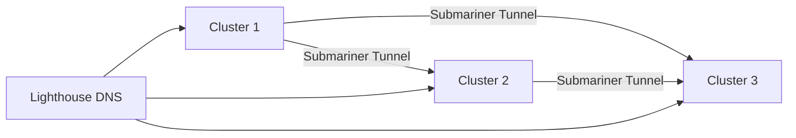

# How to Set Up Cross-Cluster Service Discovery with Flux CD

Author: [nawazdhandala](https://github.com/nawazdhandala)

Tags: flux cd, service discovery, multi-cluster, kubernetes, service mesh, gitops

Description: A step-by-step guide to enabling cross-cluster service discovery using Flux CD with tools like Submariner and Istio multi-cluster.

---

## Introduction

In a multi-cluster Kubernetes environment, services running in one cluster often need to communicate with services in another. By default, Kubernetes service discovery is limited to a single cluster. Cross-cluster service discovery bridges this gap, allowing pods in one cluster to resolve and reach services in other clusters seamlessly.

This guide shows you how to use Flux CD to deploy and manage cross-cluster service discovery solutions, covering both Submariner and Istio multi-cluster approaches.

## Prerequisites

- Three Kubernetes clusters with non-overlapping Pod and Service CIDRs
- Flux CD installed on a management cluster (or each cluster)
- Network connectivity between clusters (direct or via gateway)
- kubectl configured with contexts for all clusters
- A Git repository for fleet configuration

## Approach 1: Submariner for Cross-Cluster Service Discovery

Submariner creates encrypted tunnels between clusters and provides cross-cluster DNS resolution through its Lighthouse component.



### Step 1: Deploy the Submariner Broker

The broker cluster coordinates the exchange of metadata between connected clusters.

```yaml
# infrastructure/submariner/broker/namespace.yaml
apiVersion: v1
kind: Namespace
metadata:
  name: submariner-k8s-broker
---
# infrastructure/submariner/broker/helm-repo.yaml
# HelmRepository for Submariner charts
apiVersion: source.toolkit.fluxcd.io/v1
kind: HelmRepository
metadata:
  name: submariner
  namespace: submariner-k8s-broker
spec:
  interval: 1h
  url: https://submariner-io.github.io/submariner-charts/charts
---
# infrastructure/submariner/broker/helm-release.yaml
# Install the Submariner broker component
apiVersion: helm.toolkit.fluxcd.io/v2
kind: HelmRelease
metadata:
  name: submariner-broker
  namespace: submariner-k8s-broker
spec:
  interval: 30m
  chart:
    spec:
      chart: submariner-k8s-broker
      version: "0.17.x"
      sourceRef:
        kind: HelmRepository
        name: submariner
  values:
    # Enable service discovery via Lighthouse
    serviceDiscovery: true
    # Enable GlobalNet if CIDRs overlap (not recommended)
    globalnet: false
```

### Step 2: Deploy Submariner on Each Member Cluster

Create a Flux Kustomization for each cluster that installs the Submariner operator and joins the broker.

```yaml
# infrastructure/submariner/member/helm-release.yaml
# Install the Submariner operator on a member cluster
apiVersion: helm.toolkit.fluxcd.io/v2
kind: HelmRelease
metadata:
  name: submariner-operator
  namespace: submariner-operator
spec:
  interval: 30m
  chart:
    spec:
      chart: submariner-operator
      version: "0.17.x"
      sourceRef:
        kind: HelmRepository
        name: submariner
        namespace: submariner-operator
  values:
    # Broker configuration
    broker:
      server: "broker-api.example.com:6443"
      token: "${BROKER_TOKEN}"
      ca: "${BROKER_CA}"
      namespace: submariner-k8s-broker
    # Submariner configuration
    submariner:
      clusterId: "cluster-1"
      clusterCidr: "10.244.0.0/16"
      serviceCidr: "10.96.0.0/12"
      # Enable Lighthouse for service discovery
      serviceDiscovery: true
      # Number of gateway nodes
      natEnabled: true
      cableDriver: libreswan
```

### Step 3: Export Services for Cross-Cluster Discovery

With Submariner installed, export services that should be discoverable from other clusters.

```yaml
# apps/shared-services/service-export.yaml
# Export a service so other clusters can discover it
apiVersion: multicluster.x-k8s.io/v1alpha1
kind: ServiceExport
metadata:
  name: backend-api
  namespace: production
---
# The actual service to export
apiVersion: v1
kind: Service
metadata:
  name: backend-api
  namespace: production
spec:
  selector:
    app: backend-api
  ports:
    - port: 8080
      targetPort: 8080
  type: ClusterIP
```

Once exported, the service becomes accessible from other clusters using the DNS name:

```
backend-api.production.svc.clusterset.local
```

### Step 4: Create Flux Kustomization for Service Exports

```yaml
# clusters/cluster-1/service-exports.yaml
# Flux Kustomization to manage service exports for cluster-1
apiVersion: kustomize.toolkit.fluxcd.io/v1
kind: Kustomization
metadata:
  name: service-exports
  namespace: flux-system
spec:
  interval: 10m
  path: ./clusters/cluster-1/exports
  prune: true
  sourceRef:
    kind: GitRepository
    name: flux-system
  dependsOn:
    # Wait for Submariner to be installed
    - name: submariner
```

## Approach 2: Istio Multi-Cluster Service Mesh

Istio provides a service mesh that can span multiple clusters, enabling transparent cross-cluster communication.

### Step 5: Install Istio Multi-Primary on Each Cluster

```yaml
# infrastructure/istio/base/namespace.yaml
apiVersion: v1
kind: Namespace
metadata:
  name: istio-system
  labels:
    # Required topology label for Istio multi-cluster
    topology.istio.io/network: network1
---
# infrastructure/istio/base/helm-repo.yaml
apiVersion: source.toolkit.fluxcd.io/v1
kind: HelmRepository
metadata:
  name: istio
  namespace: istio-system
spec:
  interval: 1h
  url: https://istio-release.storage.googleapis.com/charts
---
# infrastructure/istio/base/istiod.yaml
# Install Istio control plane via Helm
apiVersion: helm.toolkit.fluxcd.io/v2
kind: HelmRelease
metadata:
  name: istiod
  namespace: istio-system
spec:
  interval: 30m
  chart:
    spec:
      chart: istiod
      version: "1.21.x"
      sourceRef:
        kind: HelmRepository
        name: istio
  values:
    global:
      # Mesh ID must be the same across all clusters
      meshID: production-mesh
      # Each cluster needs a unique cluster name
      multiCluster:
        clusterName: cluster-1
        enabled: true
      # Network configuration for multi-cluster
      network: network1
    pilot:
      env:
        # Enable cross-cluster endpoint discovery
        PILOT_ENABLE_CROSS_CLUSTER_WORKLOAD_ENTRY: "true"
```

### Step 6: Create Remote Secrets for Cross-Cluster Access

Each cluster needs a remote secret to access the API server of other clusters.

```yaml
# infrastructure/istio/remote-secrets/cluster-2-secret.yaml
# Remote secret allowing cluster-1 to discover services in cluster-2
apiVersion: v1
kind: Secret
metadata:
  name: istio-remote-secret-cluster-2
  namespace: istio-system
  annotations:
    # Tells Istio this is a remote cluster configuration
    networking.istio.io/cluster: cluster-2
  labels:
    istio/multiCluster: "true"
type: Opaque
stringData:
  # Kubeconfig for accessing cluster-2's API server
  cluster-2: |
    apiVersion: v1
    kind: Config
    clusters:
      - cluster:
          server: https://cluster-2-api.example.com:6443
          certificate-authority-data: <BASE64_CA>
        name: cluster-2
    contexts:
      - context:
          cluster: cluster-2
          user: istio-reader
        name: cluster-2
    current-context: cluster-2
    users:
      - name: istio-reader
        user:
          token: <SERVICE_ACCOUNT_TOKEN>
```

### Step 7: Deploy Cross-Cluster Services with Istio

```yaml
# apps/frontend/deployment.yaml
# Frontend deployment with Istio sidecar injection
apiVersion: apps/v1
kind: Deployment
metadata:
  name: frontend
  namespace: production
spec:
  replicas: 3
  selector:
    matchLabels:
      app: frontend
  template:
    metadata:
      labels:
        app: frontend
        # Istio sidecar injection label
        sidecar.istio.io/inject: "true"
    spec:
      containers:
        - name: frontend
          image: your-org/frontend:v2.0.0
          ports:
            - containerPort: 3000
          env:
            # Backend service is in another cluster
            # Istio resolves this transparently across clusters
            - name: BACKEND_URL
              value: "http://backend-api.production.svc.cluster.local:8080"
---
# Service definition
apiVersion: v1
kind: Service
metadata:
  name: frontend
  namespace: production
spec:
  selector:
    app: frontend
  ports:
    - port: 3000
      targetPort: 3000
```

### Step 8: Configure Traffic Policies Across Clusters

```yaml
# infrastructure/istio/traffic/destination-rule.yaml
# DestinationRule for cross-cluster load balancing
apiVersion: networking.istio.io/v1beta1
kind: DestinationRule
metadata:
  name: backend-api-dr
  namespace: production
spec:
  host: backend-api.production.svc.cluster.local
  trafficPolicy:
    connectionPool:
      tcp:
        maxConnections: 100
      http:
        h2UpgradePolicy: DEFAULT
        maxRequestsPerConnection: 10
    # Outlier detection for cross-cluster failover
    outlierDetection:
      consecutive5xxErrors: 5
      interval: 30s
      baseEjectionTime: 60s
      maxEjectionPercent: 50
    loadBalancer:
      # Prefer local cluster endpoints, fail over to remote
      localityLbSetting:
        enabled: true
        failover:
          - from: us-east-1
            to: us-west-2
      simple: ROUND_ROBIN
```

## Step 9: Manage Everything with Flux Kustomizations

Tie it all together with a layered Flux Kustomization approach.

```yaml
# clusters/cluster-1/kustomization.yaml
# Top-level Flux Kustomization for cluster-1
apiVersion: kustomize.toolkit.fluxcd.io/v1
kind: Kustomization
metadata:
  name: infrastructure
  namespace: flux-system
spec:
  interval: 10m
  path: ./infrastructure
  prune: true
  sourceRef:
    kind: GitRepository
    name: flux-system
---
apiVersion: kustomize.toolkit.fluxcd.io/v1
kind: Kustomization
metadata:
  name: service-mesh
  namespace: flux-system
spec:
  interval: 10m
  path: ./infrastructure/istio
  prune: true
  sourceRef:
    kind: GitRepository
    name: flux-system
  dependsOn:
    - name: infrastructure
---
apiVersion: kustomize.toolkit.fluxcd.io/v1
kind: Kustomization
metadata:
  name: apps
  namespace: flux-system
spec:
  interval: 10m
  path: ./apps
  prune: true
  sourceRef:
    kind: GitRepository
    name: flux-system
  dependsOn:
    # Wait for the service mesh before deploying apps
    - name: service-mesh
```

## Verifying Cross-Cluster Discovery

Test that services are discoverable across clusters:

```bash
# For Submariner: test DNS resolution
kubectl exec -it test-pod -- nslookup backend-api.production.svc.clusterset.local

# For Istio: check endpoints across clusters
istioctl proxy-config endpoints <pod-name> -n production | grep backend-api

# Verify Flux reconciliation status
flux get kustomizations --all-namespaces
```

## Troubleshooting

**DNS resolution fails**: Ensure CoreDNS is configured to forward `.clusterset.local` queries to the Lighthouse DNS server (Submariner) or that Istio's DNS proxy is enabled.

**Network connectivity issues**: Verify that gateway nodes can reach each other. Check firewall rules for the required ports (4500/UDP for Submariner, 15443/TCP for Istio).

**Service not exported**: Confirm that the ServiceExport resource exists in the same namespace as the Service.

## Conclusion

Cross-cluster service discovery is essential for building resilient, distributed applications. Whether you choose Submariner for its simplicity or Istio for its full-featured service mesh capabilities, Flux CD ensures that your cross-cluster networking configuration is managed through GitOps. This means every change to service exports, traffic policies, and mesh configuration is version-controlled, auditable, and automatically reconciled.
