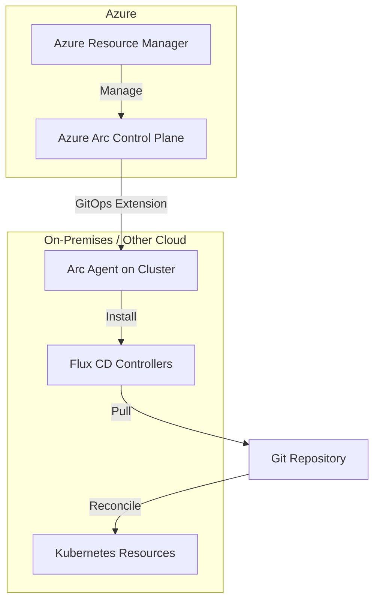

# How to Set Up Flux CD on Azure Arc-Enabled Kubernetes

Author: [nawazdhandala](https://github.com/nawazdhandala)

Tags: flux-cd, Azure, azure-arc, Kubernetes, GitOps, Hybrid-cloud, Multi-Cluster

Description: A step-by-step guide to setting up Flux CD on Azure Arc-enabled Kubernetes clusters for hybrid and multi-cloud GitOps management.

---

## Introduction

Azure Arc extends Azure management capabilities to Kubernetes clusters running anywhere -- on-premises, in other clouds, or at the edge. By connecting a Kubernetes cluster to Azure Arc, you can use Azure services like GitOps with Flux CD, Azure Policy, and Azure Monitor on clusters outside of Azure.

The Azure Arc GitOps extension installs Flux CD as a managed component and allows you to configure GitOps through the Azure control plane. This provides a single pane of glass for managing deployments across AKS, on-premises, AWS EKS, Google GKE, and other Kubernetes distributions.

## Prerequisites

- A Kubernetes cluster (any distribution: k3s, Rancher, EKS, GKE, on-premises, etc.)
- kubectl configured to access the cluster
- Azure CLI (v2.50 or later)
- An Azure subscription
- Outbound connectivity from the cluster to Azure endpoints

## Architecture



## Step 1: Register Azure Arc Providers

```bash
# Register required resource providers
az provider register --namespace Microsoft.Kubernetes
az provider register --namespace Microsoft.KubernetesConfiguration
az provider register --namespace Microsoft.ExtendedLocation

# Verify registration (wait for "Registered" status)
az provider show --namespace Microsoft.Kubernetes \
  --query "registrationState" --output tsv
az provider show --namespace Microsoft.KubernetesConfiguration \
  --query "registrationState" --output tsv
```

## Step 2: Install Required Azure CLI Extensions

```bash
# Install the connectedk8s extension for Arc
az extension add --name connectedk8s

# Install extensions for GitOps configuration
az extension add --name k8s-extension
az extension add --name k8s-configuration

# Update if already installed
az extension update --name connectedk8s
az extension update --name k8s-extension
az extension update --name k8s-configuration
```

## Step 3: Connect Your Kubernetes Cluster to Azure Arc

```bash
# Set variables
export RESOURCE_GROUP="rg-arc-clusters"
export LOCATION="eastus"
export CLUSTER_NAME="arc-onprem-cluster"

# Create a resource group for Arc-connected clusters
az group create \
  --name $RESOURCE_GROUP \
  --location $LOCATION

# Connect the current kubeconfig cluster to Azure Arc
az connectedk8s connect \
  --resource-group $RESOURCE_GROUP \
  --name $CLUSTER_NAME \
  --location $LOCATION \
  --tags "environment=production" "location=datacenter-1"
```

### Verify Arc Connection

```bash
# Check the Arc connection status
az connectedk8s show \
  --resource-group $RESOURCE_GROUP \
  --name $CLUSTER_NAME \
  --query "{Name:name, State:connectivityStatus, Distribution:distribution}" \
  --output table

# Verify Arc agents are running on the cluster
kubectl get pods -n azure-arc

# Check all Arc agent deployments
kubectl get deployments -n azure-arc
```

## Step 4: Install the Flux GitOps Extension

```bash
# Install the Flux extension on the Arc-enabled cluster
az k8s-extension create \
  --resource-group $RESOURCE_GROUP \
  --cluster-name $CLUSTER_NAME \
  --cluster-type connectedClusters \
  --name flux \
  --extension-type microsoft.flux \
  --configuration-settings \
    helm-controller.enabled=true \
    source-controller.enabled=true \
    kustomize-controller.enabled=true \
    notification-controller.enabled=true \
    image-automation-controller.enabled=false \
    image-reflector-controller.enabled=false
```

### Verify the Extension

```bash
# Check extension status
az k8s-extension show \
  --resource-group $RESOURCE_GROUP \
  --cluster-name $CLUSTER_NAME \
  --cluster-type connectedClusters \
  --name flux \
  --query "{Name:name, State:provisioningState, Version:version}" \
  --output table

# Verify Flux pods are running
kubectl get pods -n flux-system
```

## Step 5: Create a GitOps Configuration

Configure Flux CD to pull from a Git repository through the Azure Arc control plane.

### Public Repository

```bash
# Create a Flux configuration for a public repository
az k8s-configuration flux create \
  --resource-group $RESOURCE_GROUP \
  --cluster-name $CLUSTER_NAME \
  --cluster-type connectedClusters \
  --name cluster-baseline \
  --namespace flux-baseline \
  --scope cluster \
  --url "https://github.com/my-org/arc-fleet-infra" \
  --branch main \
  --kustomization \
    name=infrastructure \
    path=./infrastructure/base \
    prune=true \
    sync_interval=10m \
  --kustomization \
    name=applications \
    path=./apps/production \
    prune=true \
    dependsOn=["infrastructure"] \
    sync_interval=5m
```

### Private Repository with SSH

```bash
# Create a Flux configuration with SSH authentication
az k8s-configuration flux create \
  --resource-group $RESOURCE_GROUP \
  --cluster-name $CLUSTER_NAME \
  --cluster-type connectedClusters \
  --name app-config \
  --namespace flux-apps \
  --scope cluster \
  --url "ssh://git@github.com/my-org/app-config.git" \
  --branch main \
  --ssh-private-key-file ~/.ssh/arc-flux-deploy-key \
  --kustomization \
    name=apps \
    path=./clusters/arc-onprem \
    prune=true
```

### Private Repository with HTTPS and Token

```bash
# Create a Flux configuration with HTTPS authentication
az k8s-configuration flux create \
  --resource-group $RESOURCE_GROUP \
  --cluster-name $CLUSTER_NAME \
  --cluster-type connectedClusters \
  --name devops-config \
  --namespace flux-devops \
  --scope cluster \
  --url "https://dev.azure.com/my-org/my-project/_git/fleet-infra" \
  --branch main \
  --https-user git \
  --https-key "${AZURE_DEVOPS_PAT}" \
  --kustomization \
    name=baseline \
    path=./clusters/arc-onprem/base \
    prune=true
```

## Step 6: Multi-Cluster GitOps with Azure Arc

Manage multiple clusters from a single Git repository using cluster-specific paths.

### Repository Structure

```text
fleet-infra/
  infrastructure/
    base/                    # Shared across all clusters
      namespaces.yaml
      network-policies.yaml
    overlays/
      onprem-dc1/           # On-premises datacenter 1
        kustomization.yaml
      onprem-dc2/           # On-premises datacenter 2
        kustomization.yaml
      aws-cluster/          # AWS EKS cluster
        kustomization.yaml
  apps/
    base/                   # Shared application definitions
      app-a/
      app-b/
    overlays/
      onprem-dc1/
        kustomization.yaml
      onprem-dc2/
        kustomization.yaml
```

### Apply Configuration to Multiple Clusters

```bash
# Configure the on-premises datacenter 1 cluster
az k8s-configuration flux create \
  --resource-group $RESOURCE_GROUP \
  --cluster-name "arc-onprem-dc1" \
  --cluster-type connectedClusters \
  --name cluster-config \
  --namespace flux-system \
  --scope cluster \
  --url "https://github.com/my-org/fleet-infra" \
  --branch main \
  --kustomization \
    name=infra \
    path=./infrastructure/overlays/onprem-dc1 \
    prune=true \
  --kustomization \
    name=apps \
    path=./apps/overlays/onprem-dc1 \
    prune=true \
    dependsOn=["infra"]

# Configure the on-premises datacenter 2 cluster
az k8s-configuration flux create \
  --resource-group $RESOURCE_GROUP \
  --cluster-name "arc-onprem-dc2" \
  --cluster-type connectedClusters \
  --name cluster-config \
  --namespace flux-system \
  --scope cluster \
  --url "https://github.com/my-org/fleet-infra" \
  --branch main \
  --kustomization \
    name=infra \
    path=./infrastructure/overlays/onprem-dc2 \
    prune=true \
  --kustomization \
    name=apps \
    path=./apps/overlays/onprem-dc2 \
    prune=true \
    dependsOn=["infra"]
```

## Step 7: Use Azure Policy for Arc GitOps Compliance

Enforce that all Arc-connected clusters have a GitOps configuration applied.

```bash
# Assign policy: Configure Kubernetes clusters with Flux v2 configuration
az policy assignment create \
  --name "enforce-gitops-config" \
  --display-name "All Arc clusters must have GitOps configured" \
  --policy "171dd5ba-a076-4db9-be0a-8d23b46fbc93" \
  --scope "/subscriptions/${SUBSCRIPTION_ID}/resourceGroups/${RESOURCE_GROUP}" \
  --params '{
    "configurationName": "cluster-baseline",
    "sourceKind": "GitRepository",
    "url": "https://github.com/my-org/fleet-infra",
    "branch": "main",
    "kustomizationName": "infrastructure",
    "kustomizationPath": "./infrastructure/base",
    "effect": "deployIfNotExists"
  }'
```

## Step 8: Monitor Arc-Enabled Cluster GitOps Status

```bash
# List all Flux configurations across a cluster
az k8s-configuration flux list \
  --resource-group $RESOURCE_GROUP \
  --cluster-name $CLUSTER_NAME \
  --cluster-type connectedClusters \
  --output table

# Show detailed status of a specific configuration
az k8s-configuration flux show \
  --resource-group $RESOURCE_GROUP \
  --cluster-name $CLUSTER_NAME \
  --cluster-type connectedClusters \
  --name cluster-baseline

# Check compliance state of kustomizations
az k8s-configuration flux show \
  --resource-group $RESOURCE_GROUP \
  --cluster-name $CLUSTER_NAME \
  --cluster-type connectedClusters \
  --name cluster-baseline \
  --query "kustomizations" \
  --output table

# View Flux resources on the cluster
kubectl get gitrepositories -A
kubectl get kustomizations -A
flux get all
```

## Step 9: Enable Azure Monitor for Arc Clusters

```bash
# Create a Log Analytics workspace (if not already created)
export WORKSPACE_NAME="law-arc-monitoring"

az monitor log-analytics workspace create \
  --resource-group $RESOURCE_GROUP \
  --workspace-name $WORKSPACE_NAME \
  --location $LOCATION

export WORKSPACE_ID=$(az monitor log-analytics workspace show \
  --resource-group $RESOURCE_GROUP \
  --workspace-name $WORKSPACE_NAME \
  --query "id" \
  --output tsv)

# Install the Azure Monitor extension on the Arc cluster
az k8s-extension create \
  --resource-group $RESOURCE_GROUP \
  --cluster-name $CLUSTER_NAME \
  --cluster-type connectedClusters \
  --name azuremonitor-containers \
  --extension-type Microsoft.AzureMonitor.Containers \
  --configuration-settings \
    logAnalyticsWorkspaceResourceID=$WORKSPACE_ID
```

## Step 10: Update and Delete Configurations

### Update a Configuration

```bash
# Update the branch being tracked
az k8s-configuration flux update \
  --resource-group $RESOURCE_GROUP \
  --cluster-name $CLUSTER_NAME \
  --cluster-type connectedClusters \
  --name cluster-baseline \
  --branch release/v2.0

# Add a new kustomization to an existing configuration
az k8s-configuration flux kustomization create \
  --resource-group $RESOURCE_GROUP \
  --cluster-name $CLUSTER_NAME \
  --cluster-type connectedClusters \
  --name cluster-baseline \
  --kustomization-name monitoring \
  --path ./monitoring \
  --prune true \
  --depends-on infrastructure
```

### Delete a Configuration

```bash
# Delete a Flux configuration
az k8s-configuration flux delete \
  --resource-group $RESOURCE_GROUP \
  --cluster-name $CLUSTER_NAME \
  --cluster-type connectedClusters \
  --name cluster-baseline \
  --yes
```

### Disconnect a Cluster from Arc

```bash
# Disconnect the cluster from Azure Arc
az connectedk8s delete \
  --resource-group $RESOURCE_GROUP \
  --name $CLUSTER_NAME \
  --yes
```

## Troubleshooting

### Arc Agent Not Connecting

```bash
# Check Arc agent pod status
kubectl get pods -n azure-arc

# View Arc agent logs
kubectl logs -n azure-arc deployment/clusterconnect-agent --tail=50
kubectl logs -n azure-arc deployment/resource-sync-agent --tail=50

# Verify outbound connectivity to Azure endpoints
kubectl run test-connectivity --rm -it --image=busybox -- \
  wget -q --spider https://management.azure.com
```

### Flux Extension Not Installing

```bash
# Check extension installation status
az k8s-extension show \
  --resource-group $RESOURCE_GROUP \
  --cluster-name $CLUSTER_NAME \
  --cluster-type connectedClusters \
  --name flux \
  --query "{State:provisioningState, Error:errorInfo}"

# Check for Helm release issues
kubectl get helmreleases -n flux-system
```

### GitOps Configuration Not Compliant

```bash
# Get detailed status with error messages
az k8s-configuration flux show \
  --resource-group $RESOURCE_GROUP \
  --cluster-name $CLUSTER_NAME \
  --cluster-type connectedClusters \
  --name cluster-baseline \
  --query "statuses"

# Check Flux controller logs
kubectl logs -n flux-system deployment/source-controller --tail=100
kubectl logs -n flux-system deployment/kustomize-controller --tail=100
```

### Network Requirements

Ensure your cluster can reach these Azure endpoints:

```yaml
# Required outbound endpoints for Azure Arc
https://management.azure.com
https://<region>.dp.kubernetesconfiguration.azure.com
https://login.microsoftonline.com
https://mcr.microsoft.com
https://gbl.his.arc.azure.com
https://<region>.his.arc.azure.com
```

## Conclusion

Azure Arc-enabled Kubernetes with Flux CD provides a unified GitOps management plane for hybrid and multi-cloud environments. By connecting clusters from any infrastructure to Azure Arc, you gain centralized configuration management, policy enforcement, and monitoring -- all powered by Flux CD under the hood. This approach enables consistent deployments across on-premises datacenters, edge locations, and multiple cloud providers, all managed through a single Git repository and the Azure control plane.
