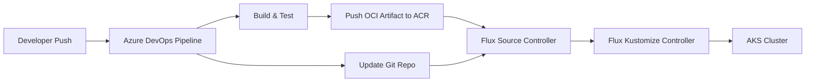

# How to Set Up Flux CD with Azure DevOps Pipelines

Author: [nawazdhandala](https://github.com/nawazdhandala)

Tags: flux cd, azure devops, pipelines, oci, gitops, kubernetes, ci/cd, automation

Description: A step-by-step guide to integrating Flux CD with Azure DevOps Pipelines for automated OCI artifact publishing and GitOps-driven deployments.

---

## Introduction

Azure DevOps Pipelines is a powerful CI/CD platform that can work alongside Flux CD to create a complete GitOps workflow. While Flux CD handles the continuous delivery side by reconciling cluster state with your Git repository, Azure DevOps Pipelines handles the continuous integration side -- building images, running tests, and pushing OCI artifacts.

This guide covers how to integrate Azure DevOps Pipelines with Flux CD, including pipeline triggers, OCI artifact publishing, and various integration patterns.

## Prerequisites

- An Azure DevOps organization and project
- An AKS cluster with Flux CD installed
- Azure Container Registry (ACR) instance
- Azure CLI and Flux CLI installed
- kubectl configured to access your cluster

## Architecture Overview



## Step 1: Configure Azure Container Registry

Set up ACR for storing OCI artifacts that Flux will consume.

```bash
# Create an Azure Container Registry
az acr create \
  --resource-group rg-flux-demo \
  --name fluxacrregistry \
  --sku Standard

# Enable admin access (for pipeline authentication)
az acr update \
  --name fluxacrregistry \
  --admin-enabled true

# Get ACR credentials for pipeline use
ACR_USERNAME=$(az acr credential show \
  --name fluxacrregistry \
  --query username -o tsv)
ACR_PASSWORD=$(az acr credential show \
  --name fluxacrregistry \
  --query "passwords[0].value" -o tsv)
```

## Step 2: Create the Azure DevOps Pipeline for OCI Artifact Push

Create a pipeline that builds your application and pushes an OCI artifact to ACR.

```yaml
# azure-pipelines.yaml
# Pipeline that builds, tests, and pushes OCI artifacts for Flux CD consumption
trigger:
  branches:
    include:
      - main
      - release/*
  paths:
    include:
      - src/**
      - kubernetes/**

pool:
  vmImage: "ubuntu-latest"

variables:
  # ACR connection details
  acrName: "fluxacrregistry"
  acrLoginServer: "fluxacrregistry.azurecr.io"
  # OCI artifact repository name
  ociRepository: "manifests/my-app"
  # Tag based on build number and commit SHA
  imageTag: "$(Build.BuildNumber)-$(Build.SourceVersion)"

stages:
  - stage: Build
    displayName: "Build and Test"
    jobs:
      - job: BuildApp
        displayName: "Build Application"
        steps:
          # Checkout the source code
          - checkout: self
            fetchDepth: 0

          # Run unit tests
          - task: Bash@3
            displayName: "Run Tests"
            inputs:
              targetType: "inline"
              script: |
                echo "Running tests..."
                # Add your test commands here
                # npm test / go test / pytest etc.

          # Install Flux CLI for OCI operations
          - task: Bash@3
            displayName: "Install Flux CLI"
            inputs:
              targetType: "inline"
              script: |
                curl -s https://fluxcd.io/install.sh | sudo bash

          # Login to ACR
          - task: AzureCLI@2
            displayName: "Login to ACR"
            inputs:
              azureSubscription: "AzureServiceConnection"
              scriptType: "bash"
              scriptLocation: "inlineScript"
              inlineScript: |
                az acr login --name $(acrName)

          # Push Kubernetes manifests as OCI artifact
          - task: Bash@3
            displayName: "Push OCI Artifact"
            inputs:
              targetType: "inline"
              script: |
                # Push the Kubernetes manifests as an OCI artifact to ACR
                flux push artifact \
                  oci://$(acrLoginServer)/$(ociRepository):$(imageTag) \
                  --path="./kubernetes/manifests" \
                  --source="$(Build.Repository.Uri)" \
                  --revision="$(Build.SourceBranchName)/$(Build.SourceVersion)"

                # Tag the artifact as latest for the branch
                flux tag artifact \
                  oci://$(acrLoginServer)/$(ociRepository):$(imageTag) \
                  --tag latest
```

## Step 3: Create a Pipeline for Image Automation Updates

Create a second pipeline that updates image tags in your Git repository when new container images are built.

```yaml
# azure-pipelines-image-update.yaml
# Pipeline that builds container images and updates Flux image policies
trigger:
  branches:
    include:
      - main
  paths:
    include:
      - src/**

pool:
  vmImage: "ubuntu-latest"

variables:
  dockerfilePath: "src/Dockerfile"
  acrLoginServer: "fluxacrregistry.azurecr.io"
  imageName: "my-app"

stages:
  - stage: BuildImage
    displayName: "Build and Push Container Image"
    jobs:
      - job: BuildAndPush
        steps:
          # Build and push Docker image to ACR
          - task: Docker@2
            displayName: "Build and Push Image"
            inputs:
              containerRegistry: "ACRServiceConnection"
              repository: "$(imageName)"
              command: "buildAndPush"
              Dockerfile: "$(dockerfilePath)"
              tags: |
                $(Build.BuildId)
                latest

  - stage: UpdateManifests
    displayName: "Update GitOps Manifests"
    dependsOn: BuildImage
    jobs:
      - job: UpdateGit
        steps:
          # Clone the fleet-infra repository
          - task: Bash@3
            displayName: "Update Image Tag in Git"
            inputs:
              targetType: "inline"
              script: |
                # Clone the GitOps repo
                git clone https://$(GITOPS_PAT)@dev.azure.com/org/project/_git/fleet-infra
                cd fleet-infra

                # Update the image tag in the kustomization
                cd clusters/production/my-app
                kustomize edit set image \
                  $(acrLoginServer)/$(imageName):$(Build.BuildId)

                # Commit and push the change
                git config user.email "pipeline@azuredevops.com"
                git config user.name "Azure DevOps Pipeline"
                git add .
                git commit -m "Update $(imageName) to build $(Build.BuildId)"
                git push origin main
```

## Step 4: Configure Flux to Consume OCI Artifacts from ACR

Set up Flux resources to pull OCI artifacts from ACR.

```yaml
# oci-repository.yaml
# Configures Flux to watch an OCI repository in ACR for new artifacts
apiVersion: source.toolkit.fluxcd.io/v1
kind: OCIRepository
metadata:
  name: my-app-manifests
  namespace: flux-system
spec:
  # Poll ACR every 5 minutes for new artifacts
  interval: 5m
  url: oci://fluxacrregistry.azurecr.io/manifests/my-app
  ref:
    tag: latest
  provider: azure
---
# kustomization.yaml
# Applies the manifests from the OCI artifact to the cluster
apiVersion: kustomize.toolkit.fluxcd.io/v1
kind: Kustomization
metadata:
  name: my-app
  namespace: flux-system
spec:
  interval: 10m
  targetNamespace: production
  sourceRef:
    kind: OCIRepository
    name: my-app-manifests
  path: ./
  prune: true
  wait: true
  timeout: 5m
```

## Step 5: Set Up Pipeline Triggers with Flux Webhooks

Configure Azure DevOps to notify Flux when new artifacts are available, reducing polling delay.

```yaml
# flux-receiver.yaml
# Creates a webhook endpoint that Azure DevOps can call to trigger reconciliation
apiVersion: notification.toolkit.fluxcd.io/v1
kind: Receiver
metadata:
  name: azure-devops-receiver
  namespace: flux-system
spec:
  type: generic
  secretRef:
    name: receiver-token
  resources:
    - kind: OCIRepository
      name: my-app-manifests
      apiVersion: source.toolkit.fluxcd.io/v1
```

Create the webhook secret:

```bash
# Generate a random token for webhook authentication
WEBHOOK_TOKEN=$(openssl rand -hex 32)

# Create the secret in the cluster
kubectl create secret generic receiver-token \
  --namespace flux-system \
  --from-literal=token="$WEBHOOK_TOKEN"

# Get the receiver webhook URL
flux get receivers azure-devops-receiver
```

Add a step to the pipeline to trigger the Flux receiver:

```yaml
# Add this step at the end of the Build stage
- task: Bash@3
  displayName: "Trigger Flux Reconciliation"
  inputs:
    targetType: "inline"
    script: |
      # Notify Flux that new artifacts are available
      # Replace with your actual receiver URL
      RECEIVER_URL="https://flux-webhook.example.com/hook/abc123"
      curl -s -X POST "$RECEIVER_URL" \
        -H "Content-Type: application/json" \
        -d '{"source": "azure-devops", "build": "$(Build.BuildId)"}'
```

## Step 6: Configure Branch-Based Deployment Strategy

Set up different Flux sources for different environments based on branches.

```yaml
# staging-source.yaml
# Watches the staging tag for pre-production deployments
apiVersion: source.toolkit.fluxcd.io/v1
kind: OCIRepository
metadata:
  name: my-app-staging
  namespace: flux-system
spec:
  interval: 2m
  url: oci://fluxacrregistry.azurecr.io/manifests/my-app
  ref:
    tag: staging
  provider: azure
---
# production-source.yaml
# Watches semver tags for production deployments
apiVersion: source.toolkit.fluxcd.io/v1
kind: OCIRepository
metadata:
  name: my-app-production
  namespace: flux-system
spec:
  interval: 5m
  url: oci://fluxacrregistry.azurecr.io/manifests/my-app
  ref:
    # Only deploy semver-tagged releases to production
    semver: ">=1.0.0"
  provider: azure
```

## Step 7: Add Pipeline Gates with Flux Health Checks

Add a pipeline stage that verifies the Flux deployment was successful.

```yaml
# Add this stage after the OCI push stage
- stage: VerifyDeployment
  displayName: "Verify Flux Deployment"
  dependsOn: Build
  jobs:
    - job: CheckFluxStatus
      steps:
        - task: AzureCLI@2
          displayName: "Verify Flux Reconciliation"
          inputs:
            azureSubscription: "AzureServiceConnection"
            scriptType: "bash"
            scriptLocation: "inlineScript"
            inlineScript: |
              # Get AKS credentials
              az aks get-credentials \
                --resource-group rg-flux-demo \
                --name aks-flux-cluster

              # Install Flux CLI
              curl -s https://fluxcd.io/install.sh | sudo bash

              # Wait for reconciliation to complete (timeout 5 min)
              flux reconcile ocirepository my-app-manifests \
                --timeout=5m

              # Check the kustomization status
              flux get kustomization my-app

              # Verify pods are running
              kubectl rollout status deployment/my-app \
                -n production --timeout=300s
```

## Step 8: Set Up Azure DevOps Service Connection for ACR

Configure the service connection in Azure DevOps for ACR access.

```bash
# Create a service principal for Azure DevOps
SP_CREDENTIALS=$(az ad sp create-for-rbac \
  --name "azure-devops-flux-sp" \
  --role "AcrPush" \
  --scopes "/subscriptions/<sub-id>/resourceGroups/rg-flux-demo/providers/Microsoft.ContainerRegistry/registries/fluxacrregistry" \
  --query "{clientId: appId, clientSecret: password, tenantId: tenant}" \
  -o json)

echo "$SP_CREDENTIALS"
# Use these values to create a Service Connection in Azure DevOps
# Project Settings > Service connections > New > Azure Resource Manager
```

## Troubleshooting

### Pipeline Fails to Push OCI Artifacts

```bash
# Verify ACR access from the pipeline
az acr login --name fluxacrregistry
flux push artifact oci://fluxacrregistry.azurecr.io/test:v1 \
  --path="./manifests" \
  --source="local" \
  --revision="test/abc123"
```

### Flux Not Picking Up New Artifacts

```bash
# Check the OCI repository status
flux get sources oci -A

# Force reconciliation
flux reconcile source oci my-app-manifests

# Check source-controller logs for errors
kubectl logs -n flux-system deploy/source-controller | grep -i error
```

### Webhook Receiver Not Triggering

```bash
# Verify the receiver is ready
flux get receivers

# Check the receiver URL
kubectl get receiver azure-devops-receiver -n flux-system -o jsonpath='{.status.webhookPath}'

# Test the webhook manually
curl -X POST http://<receiver-url> -H "Content-Type: application/json" -d '{}'
```

## Summary

In this guide, you integrated Azure DevOps Pipelines with Flux CD to create a complete CI/CD and GitOps workflow. You configured pipelines to build and push OCI artifacts to ACR, set up Flux to consume those artifacts, configured webhook triggers for immediate reconciliation, and added deployment verification gates. This pattern separates the CI concerns (handled by Azure DevOps) from the CD concerns (handled by Flux CD), providing a clean and auditable deployment pipeline.
