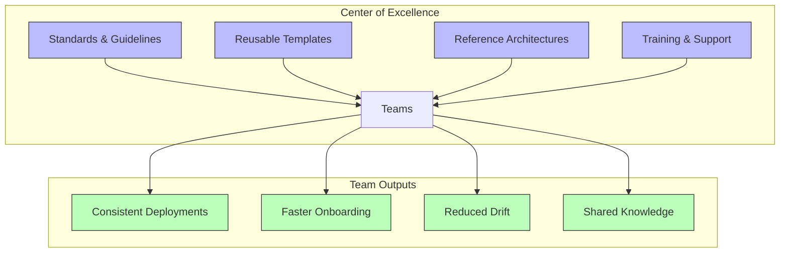

# How to Set Up a Flux CD Center of Excellence

Author: [nawazdhandala](https://github.com/nawazdhandala)

Tags: Flux CD, GitOps, Kubernetes, Best Practices, Platform Engineering, Center of Excellence

Description: Learn how to establish a Flux CD Center of Excellence in your organization to standardize GitOps practices, create reusable templates, and drive adoption across teams.

---

## Introduction

A Center of Excellence (CoE) is an organizational structure that defines best practices, creates reusable assets, and provides guidance to teams adopting a technology. A Flux CD Center of Excellence standardizes how your organization implements GitOps, ensuring consistency across clusters, teams, and environments while reducing duplicated effort and configuration drift.

This guide walks through establishing a Flux CD CoE, from governance structures and repository patterns to reusable templates and training programs.

## What a Flux CD CoE Provides



## Step 1: Define the CoE Structure

Establish roles and responsibilities.

| Role | Responsibility |
|------|---------------|
| **CoE Lead** | Sets strategy, owns the roadmap, resolves escalations |
| **Platform Engineers** | Build and maintain shared Flux templates and tooling |
| **Champions** | Embedded in product teams, provide feedback and advocacy |
| **Documentation Lead** | Maintains runbooks, guides, and training materials |

## Step 2: Create a Shared Template Repository

Build a central repository of vetted Flux configurations that teams can reference.

```bash
# CoE template repository structure
# flux-coe-templates/
# ├── sources/
# │   ├── git-repository.yaml       # Standard GitRepository template
# │   ├── oci-repository.yaml       # Standard OCIRepository template
# │   └── helm-repository.yaml      # Standard HelmRepository template
# ├── kustomizations/
# │   ├── app-deploy.yaml           # Standard app deployment pattern
# │   ├── infra-deploy.yaml         # Infrastructure deployment pattern
# │   └── multi-env.yaml            # Multi-environment promotion pattern
# ├── helm-releases/
# │   ├── standard-app.yaml         # Standard Helm app release
# │   └── monitoring-stack.yaml     # Monitoring stack release
# ├── notifications/
# │   ├── slack-alert.yaml          # Slack notification template
# │   └── pagerduty-alert.yaml      # PagerDuty notification template
# ├── policies/
# │   ├── required-labels.yaml      # Required label enforcement
# │   └── image-policy.yaml         # Image source restriction
# └── examples/
#     ├── simple-app/               # Complete simple app example
#     ├── helm-app/                 # Complete Helm app example
#     └── multi-cluster/            # Multi-cluster setup example
```

## Step 3: Standardize GitRepository Configuration

```yaml
# sources/git-repository.yaml -- Standard GitRepository template
# All teams should use this as the base for their Git sources
apiVersion: source.toolkit.fluxcd.io/v1
kind: GitRepository
metadata:
  name: REPLACE_APP_NAME
  namespace: flux-system
  labels:
    # CoE-mandated labels for tracking and governance
    coe.example.com/managed: "true"
    coe.example.com/team: REPLACE_TEAM_NAME
    coe.example.com/tier: REPLACE_TIER
spec:
  interval: 1m
  url: REPLACE_REPO_URL
  ref:
    branch: main
  secretRef:
    name: REPLACE_SECRET_NAME
  # Ignore non-deployment files to reduce reconciliation noise
  ignore: |
    # Exclude CI/CD files
    /.github/
    /.gitlab-ci.yml
    # Exclude documentation
    /docs/
    /README.md
    # Exclude tests
    /tests/
```

## Step 4: Create Standard Deployment Patterns

### Pattern 1: Simple Application Deployment

```yaml
# kustomizations/app-deploy.yaml -- Standard app deployment kustomization
apiVersion: kustomize.toolkit.fluxcd.io/v1
kind: Kustomization
metadata:
  name: REPLACE_APP_NAME
  namespace: flux-system
  labels:
    coe.example.com/managed: "true"
    coe.example.com/team: REPLACE_TEAM_NAME
    coe.example.com/pattern: simple-app
spec:
  interval: 5m
  retryInterval: 2m
  sourceRef:
    kind: GitRepository
    name: REPLACE_APP_NAME
  path: REPLACE_DEPLOY_PATH
  prune: true
  wait: true
  timeout: 10m
  # CoE standard: always use health checks
  healthChecks:
    - apiVersion: apps/v1
      kind: Deployment
      name: REPLACE_APP_NAME
      namespace: REPLACE_NAMESPACE
  # CoE standard: post-build substitution for environment values
  postBuild:
    substituteFrom:
      - kind: ConfigMap
        name: cluster-vars
      - kind: Secret
        name: cluster-secrets
```

### Pattern 2: Multi-Environment Promotion

```yaml
# kustomizations/multi-env.yaml -- Promotion pipeline across environments
apiVersion: kustomize.toolkit.fluxcd.io/v1
kind: Kustomization
metadata:
  name: REPLACE_APP_NAME-dev
  namespace: flux-system
  labels:
    coe.example.com/pattern: multi-env
    coe.example.com/environment: dev
spec:
  interval: 5m
  sourceRef:
    kind: GitRepository
    name: REPLACE_APP_NAME
  path: ./deploy/overlays/dev
  prune: true
  wait: true
  timeout: 10m
---
apiVersion: kustomize.toolkit.fluxcd.io/v1
kind: Kustomization
metadata:
  name: REPLACE_APP_NAME-staging
  namespace: flux-system
  labels:
    coe.example.com/pattern: multi-env
    coe.example.com/environment: staging
spec:
  interval: 5m
  # Staging deploys only after dev is healthy
  dependsOn:
    - name: REPLACE_APP_NAME-dev
  sourceRef:
    kind: GitRepository
    name: REPLACE_APP_NAME
  path: ./deploy/overlays/staging
  prune: true
  wait: true
  timeout: 10m
---
apiVersion: kustomize.toolkit.fluxcd.io/v1
kind: Kustomization
metadata:
  name: REPLACE_APP_NAME-production
  namespace: flux-system
  labels:
    coe.example.com/pattern: multi-env
    coe.example.com/environment: production
spec:
  interval: 10m
  # Production deploys only after staging is healthy
  dependsOn:
    - name: REPLACE_APP_NAME-staging
  sourceRef:
    kind: GitRepository
    name: REPLACE_APP_NAME
  path: ./deploy/overlays/production
  prune: true
  wait: true
  timeout: 15m
```

## Step 5: Standardize Notifications

```yaml
# notifications/slack-alert.yaml -- Standard Slack alert for Flux events
apiVersion: notification.toolkit.fluxcd.io/v1
kind: Provider
metadata:
  name: slack-coe
  namespace: flux-system
spec:
  type: slack
  channel: REPLACE_CHANNEL
  secretRef:
    name: slack-webhook-url
---
apiVersion: notification.toolkit.fluxcd.io/v1
kind: Alert
metadata:
  name: REPLACE_APP_NAME-alerts
  namespace: flux-system
  labels:
    coe.example.com/managed: "true"
spec:
  providerRef:
    name: slack-coe
  eventSeverity: info
  # CoE standard: alert on all state changes
  eventSources:
    - kind: Kustomization
      name: REPLACE_APP_NAME
    - kind: GitRepository
      name: REPLACE_APP_NAME
  # Include metadata in notifications for quick triage
  summary: "Flux event for REPLACE_APP_NAME in REPLACE_ENVIRONMENT"
```

## Step 6: Build Governance and Compliance

### Required Labels Policy

```yaml
# policies/required-labels.yaml -- Kyverno policy enforcing CoE labels
apiVersion: kyverno.io/v1
kind: ClusterPolicy
metadata:
  name: require-coe-labels
  annotations:
    policies.kyverno.io/title: Require CoE Labels on Flux Resources
    policies.kyverno.io/description: >-
      All Flux resources must include CoE-mandated labels for
      tracking, governance, and team ownership.
spec:
  validationFailureAction: Enforce
  rules:
    - name: check-flux-labels
      match:
        any:
          # Apply to all Flux resource types
          - resources:
              kinds:
                - Kustomization
                - HelmRelease
                - GitRepository
                - OCIRepository
      validate:
        message: >-
          Flux resources must include coe.example.com/managed,
          coe.example.com/team, and coe.example.com/pattern labels.
        pattern:
          metadata:
            labels:
              coe.example.com/managed: "true"
              coe.example.com/team: "?*"
```

## Step 7: Create an Onboarding Checklist


Create a standardized onboarding process.

```bash
#!/bin/bash
# onboard-team.sh -- CoE team onboarding script
# Usage: ./onboard-team.sh <team-name> <app-name> <repo-url>

TEAM=$1
APP=$2
REPO=$3

echo "Starting CoE onboarding for team: ${TEAM}, app: ${APP}"

# Clone the CoE template repository
WORK_DIR=$(mktemp -d)
git clone https://github.com/your-org/flux-coe-templates.git "${WORK_DIR}/templates"

# Create the team's Flux configuration directory
TARGET_DIR="teams/${TEAM}/${APP}"
mkdir -p "${TARGET_DIR}"

# Generate GitRepository from template
sed -e "s/REPLACE_APP_NAME/${APP}/g" \
    -e "s/REPLACE_TEAM_NAME/${TEAM}/g" \
    -e "s|REPLACE_REPO_URL|${REPO}|g" \
    -e "s/REPLACE_SECRET_NAME/${TEAM}-git-auth/g" \
    -e "s/REPLACE_TIER/standard/g" \
    "${WORK_DIR}/templates/sources/git-repository.yaml" > "${TARGET_DIR}/source.yaml"

# Generate Kustomization from template
sed -e "s/REPLACE_APP_NAME/${APP}/g" \
    -e "s/REPLACE_TEAM_NAME/${TEAM}/g" \
    -e "s|REPLACE_DEPLOY_PATH|./deploy|g" \
    -e "s/REPLACE_NAMESPACE/${TEAM}-${APP}/g" \
    "${WORK_DIR}/templates/kustomizations/app-deploy.yaml" > "${TARGET_DIR}/kustomization.yaml"

# Generate notification alert from template
sed -e "s/REPLACE_APP_NAME/${APP}/g" \
    -e "s/REPLACE_CHANNEL/${TEAM}-deployments/g" \
    -e "s/REPLACE_ENVIRONMENT/dev/g" \
    "${WORK_DIR}/templates/notifications/slack-alert.yaml" > "${TARGET_DIR}/alerts.yaml"

echo "Configuration generated in ${TARGET_DIR}"
echo "Next steps:"
echo "  1. Review generated files"
echo "  2. Create a PR to the platform repository"
echo "  3. Request CoE review"

# Cleanup
rm -rf "${WORK_DIR}"
```

## Step 8: Establish Metrics and Reporting

Track CoE adoption and effectiveness.

```yaml
# Prometheus rules for CoE metrics tracking
apiVersion: monitoring.coreos.com/v1
kind: PrometheusRule
metadata:
  name: flux-coe-metrics
  namespace: monitoring
spec:
  groups:
    - name: flux-coe
      rules:
        # Track how many Flux resources follow CoE standards
        - record: coe:flux_resources:total
          expr: count(gotk_reconcile_condition{type="Ready"})
        - record: coe:flux_resources:compliant
          expr: count(gotk_reconcile_condition{type="Ready"} * on(name, namespace) group_left kube_customresource_labels{label_coe_example_com_managed="true"})
        # Alert when reconciliation failure rate exceeds threshold
        - alert: FluxReconciliationFailureRate
          expr: |
            sum(gotk_reconcile_condition{type="Ready", status="False"}) /
            sum(gotk_reconcile_condition{type="Ready"}) > 0.1
          for: 15m
          labels:
            severity: warning
            team: platform
          annotations:
            summary: "More than 10% of Flux resources are failing reconciliation"
```

## Step 9: Document Decision Records

Maintain architecture decision records (ADRs) for key CoE decisions.

```markdown
# Example ADR format for the CoE

## ADR-001: Use Kustomize Over Helm for Application Deployments

### Status: Accepted

### Context
Teams need a standard way to manage environment-specific configuration.

### Decision
The CoE recommends Kustomize overlays as the primary method for
application deployment configuration. Helm is recommended for
third-party software installation only.

### Rationale
- Kustomize is built into kubectl and Flux
- Overlays are easier to review in PRs than Helm values files
- Reduces the learning curve for new teams

### Consequences
- Teams must structure deployments as base + overlays
- Helm charts are only used for vendor software (ingress, monitoring)
```

## Measuring CoE Success

Track these metrics to evaluate the CoE's impact:

- **Adoption rate**: Percentage of teams using CoE templates
- **Time to onboard**: Days from team request to first production deployment
- **Configuration drift**: Number of clusters with diverged state
- **Reconciliation health**: Percentage of Flux resources in Ready state
- **Incident reduction**: Deployment-related incidents before and after CoE adoption

## Conclusion

A Flux CD Center of Excellence accelerates GitOps adoption by providing teams with standardized templates, clear governance, and a supported onboarding path. By investing in reusable patterns and shared knowledge, the CoE reduces duplicated effort, prevents configuration drift, and ensures every team benefits from collective experience. Start small with templates and documentation, measure adoption, and expand based on what teams actually need.
