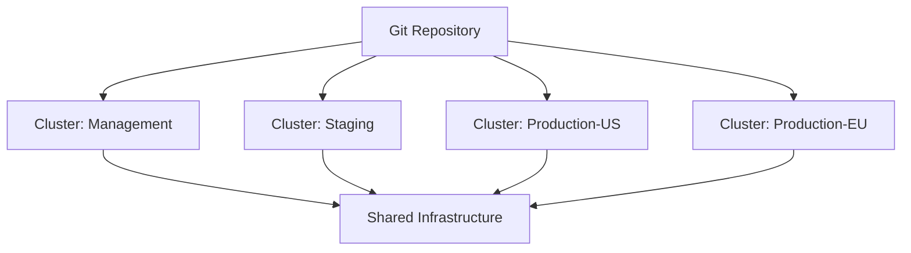

# How to Set Up Flux CD for Multi-Cluster GitOps

Author: [nawazdhandala](https://github.com/nawazdhandala)

Tags: Flux CD, Multi-Cluster, GitOps, Kubernetes, Cluster Management

Description: A comprehensive guide to setting up Flux CD for managing multiple Kubernetes clusters from a single Git repository using GitOps principles.

---

## Introduction

Managing multiple Kubernetes clusters with GitOps requires a well-planned setup. Flux CD supports multi-cluster management from a single Git repository, allowing you to define shared infrastructure, cluster-specific configurations, and application deployments in one place. This guide walks you through the complete setup process for multi-cluster GitOps with Flux CD.

## Architecture Overview

In a multi-cluster Flux CD setup, a management cluster runs Flux controllers that reconcile configurations for itself and potentially other clusters. Alternatively, each cluster runs its own Flux instance pointing to the same Git repository but different paths.



## Prerequisites

- Two or more Kubernetes clusters with `kubectl` access
- A Git repository hosted on GitHub, GitLab, or another supported provider
- `flux` CLI version 2.0 or later
- `kubectl` configured with contexts for all clusters

## Repository Structure for Multi-Cluster

Organize the repository to clearly separate shared resources from cluster-specific ones.

```text
fleet-repo/
  infrastructure/
    controllers/
      cert-manager.yaml
      ingress-nginx.yaml
    configs/
      cluster-issuer.yaml
  apps/
    base/
      app-a/
        deployment.yaml
        service.yaml
        kustomization.yaml
      app-b/
        deployment.yaml
        service.yaml
        kustomization.yaml
  clusters/
    management/
      flux-system/
        gotk-components.yaml
        gotk-sync.yaml
        kustomization.yaml
      infrastructure.yaml
      apps.yaml
    staging/
      flux-system/
        gotk-components.yaml
        gotk-sync.yaml
        kustomization.yaml
      infrastructure.yaml
      apps.yaml
    production-us/
      flux-system/
        gotk-components.yaml
        gotk-sync.yaml
        kustomization.yaml
      infrastructure.yaml
      apps.yaml
    production-eu/
      flux-system/
        gotk-components.yaml
        gotk-sync.yaml
        kustomization.yaml
      infrastructure.yaml
      apps.yaml
```

## Bootstrapping the First Cluster

Start by bootstrapping Flux on your management cluster.

```bash
# Set the kubectl context to the management cluster
kubectl config use-context management-cluster

# Bootstrap Flux CD on the management cluster
# This creates the flux-system namespace and installs Flux controllers
flux bootstrap github \
  --owner=your-org \
  --repository=fleet-repo \
  --branch=main \
  --path=clusters/management \
  --personal=false \
  --token-auth
```

This command does the following:
- Creates the `fleet-repo` repository if it does not exist
- Installs Flux components in the `flux-system` namespace
- Creates a `GitRepository` and `Kustomization` pointing to `clusters/management`
- Commits the Flux manifests to the repository

## Bootstrapping Additional Clusters

Repeat the bootstrap for each additional cluster, pointing to its respective path.

```bash
# Bootstrap the staging cluster
kubectl config use-context staging-cluster

flux bootstrap github \
  --owner=your-org \
  --repository=fleet-repo \
  --branch=main \
  --path=clusters/staging \
  --personal=false \
  --token-auth
```

```bash
# Bootstrap the production-us cluster
kubectl config use-context production-us-cluster

flux bootstrap github \
  --owner=your-org \
  --repository=fleet-repo \
  --branch=main \
  --path=clusters/production-us \
  --personal=false \
  --token-auth
```

```bash
# Bootstrap the production-eu cluster
kubectl config use-context production-eu-cluster

flux bootstrap github \
  --owner=your-org \
  --repository=fleet-repo \
  --branch=main \
  --path=clusters/production-eu \
  --personal=false \
  --token-auth
```

## Defining Shared Infrastructure

Create infrastructure resources that all clusters share.

```yaml
# infrastructure/controllers/cert-manager.yaml
# HelmRelease for cert-manager deployed on all clusters
apiVersion: helm.toolkit.fluxcd.io/v2
kind: HelmRelease
metadata:
  name: cert-manager
  namespace: cert-manager
spec:
  interval: 15m
  chart:
    spec:
      chart: cert-manager
      version: "v1.14.x"
      sourceRef:
        kind: HelmRepository
        name: jetstack
        namespace: flux-system
  install:
    # Create namespace if it does not exist
    createNamespace: true
    crds: CreateReplace
  upgrade:
    crds: CreateReplace
  values:
    installCRDs: true
    prometheus:
      enabled: true
      servicemonitor:
        enabled: true
```

```yaml
# infrastructure/controllers/ingress-nginx.yaml
# Ingress controller deployed on all clusters
apiVersion: helm.toolkit.fluxcd.io/v2
kind: HelmRelease
metadata:
  name: ingress-nginx
  namespace: ingress-system
spec:
  interval: 15m
  chart:
    spec:
      chart: ingress-nginx
      version: "4.9.x"
      sourceRef:
        kind: HelmRepository
        name: ingress-nginx
        namespace: flux-system
  install:
    createNamespace: true
  values:
    controller:
      metrics:
        enabled: true
```

```yaml
# infrastructure/configs/cluster-issuer.yaml
# ClusterIssuer for Let's Encrypt certificates
apiVersion: cert-manager.io/v1
kind: ClusterIssuer
metadata:
  name: letsencrypt-prod
spec:
  acme:
    server: https://acme-v02.api.letsencrypt.org/directory
    email: platform@your-org.com
    privateKeySecretRef:
      name: letsencrypt-prod-key
    solvers:
      - http01:
          ingress:
            class: nginx
```

## Referencing Shared Infrastructure from Each Cluster

Each cluster directory contains Flux Kustomization resources that reference the shared infrastructure.

```yaml
# clusters/staging/infrastructure.yaml
# Flux Kustomization that deploys shared infrastructure on the staging cluster
apiVersion: kustomize.toolkit.fluxcd.io/v1
kind: Kustomization
metadata:
  name: infrastructure-controllers
  namespace: flux-system
spec:
  interval: 10m
  retryInterval: 1m
  # Path to shared infrastructure controllers
  path: ./infrastructure/controllers
  prune: true
  sourceRef:
    kind: GitRepository
    name: flux-system
  wait: true
  timeout: 5m
---
# Infrastructure configs depend on controllers being ready
apiVersion: kustomize.toolkit.fluxcd.io/v1
kind: Kustomization
metadata:
  name: infrastructure-configs
  namespace: flux-system
spec:
  interval: 10m
  dependsOn:
    - name: infrastructure-controllers
  path: ./infrastructure/configs
  prune: true
  sourceRef:
    kind: GitRepository
    name: flux-system
```

```yaml
# clusters/staging/apps.yaml
# Flux Kustomization that deploys applications on the staging cluster
apiVersion: kustomize.toolkit.fluxcd.io/v1
kind: Kustomization
metadata:
  name: apps
  namespace: flux-system
spec:
  interval: 10m
  dependsOn:
    # Applications depend on infrastructure being ready
    - name: infrastructure-configs
  path: ./apps/staging
  prune: true
  sourceRef:
    kind: GitRepository
    name: flux-system
```

## Creating Cluster-Specific Application Overlays

Use Kustomize overlays to customize applications per cluster.

```yaml
# apps/base/app-a/deployment.yaml
# Base deployment for app-a
apiVersion: apps/v1
kind: Deployment
metadata:
  name: app-a
  namespace: apps
spec:
  replicas: 1
  selector:
    matchLabels:
      app: app-a
  template:
    metadata:
      labels:
        app: app-a
    spec:
      containers:
        - name: app-a
          image: your-org/app-a:v1.0.0
          ports:
            - containerPort: 8080
          env:
            - name: LOG_LEVEL
              value: info
          resources:
            requests:
              cpu: 100m
              memory: 128Mi
            limits:
              cpu: 250m
              memory: 256Mi
```

```yaml
# apps/base/app-a/kustomization.yaml
# Base Kustomize file for app-a
apiVersion: kustomize.config.k8s.io/v1beta1
kind: Kustomization
resources:
  - deployment.yaml
  - service.yaml
```

```yaml
# apps/staging/kustomization.yaml
# Staging overlay for all applications
apiVersion: kustomize.config.k8s.io/v1beta1
kind: Kustomization
resources:
  - ../base/app-a
  - ../base/app-b
patches:
  # Staging uses debug logging
  - target:
      kind: Deployment
      name: app-a
    patch: |
      - op: replace
        path: /spec/template/spec/containers/0/env/0/value
        value: debug
```

```yaml
# apps/production-us/kustomization.yaml
# Production US overlay with higher replicas and resources
apiVersion: kustomize.config.k8s.io/v1beta1
kind: Kustomization
resources:
  - ../base/app-a
  - ../base/app-b
patches:
  # Production uses more replicas for HA
  - target:
      kind: Deployment
      name: app-a
    patch: |
      - op: replace
        path: /spec/replicas
        value: 5
      - op: replace
        path: /spec/template/spec/containers/0/resources/requests/cpu
        value: 500m
      - op: replace
        path: /spec/template/spec/containers/0/resources/requests/memory
        value: 512Mi
```

## Setting Up Cross-Cluster Monitoring

Configure Flux notifications to monitor all clusters from a central location.

```yaml
# clusters/management/notification.yaml
# Centralized notification provider for all cluster events
apiVersion: notification.toolkit.fluxcd.io/v1
kind: Provider
metadata:
  name: central-slack
  namespace: flux-system
spec:
  type: slack
  channel: flux-all-clusters
  secretRef:
    name: slack-webhook
---
apiVersion: notification.toolkit.fluxcd.io/v1
kind: Alert
metadata:
  name: all-resources
  namespace: flux-system
spec:
  providerRef:
    name: central-slack
  eventSeverity: error
  eventSources:
    - kind: Kustomization
      name: "*"
    - kind: HelmRelease
      name: "*"
```

## Verifying Multi-Cluster Setup

After bootstrapping all clusters, verify the setup.

```bash
# Check Flux status on each cluster
for ctx in management-cluster staging-cluster production-us-cluster production-eu-cluster; do
  echo "=== Checking $ctx ==="
  kubectl config use-context $ctx
  flux check
  flux get all
  echo ""
done
```

```bash
# Verify all Kustomizations are reconciled
flux get kustomizations --all-namespaces

# Verify all HelmReleases are healthy
flux get helmreleases --all-namespaces

# Check for any failed reconciliations
flux get all --status-selector ready=false
```

## Handling Secrets Across Clusters

Use SOPS or Sealed Secrets to manage secrets consistently across clusters.

```yaml
# clusters/staging/sops-config.yaml
# Flux Kustomization configured to decrypt SOPS-encrypted secrets
apiVersion: kustomize.toolkit.fluxcd.io/v1
kind: Kustomization
metadata:
  name: staging-secrets
  namespace: flux-system
spec:
  interval: 10m
  path: ./secrets/staging
  prune: true
  sourceRef:
    kind: GitRepository
    name: flux-system
  # Enable SOPS decryption for this Kustomization
  decryption:
    provider: sops
    secretRef:
      name: sops-age-key
```

## Best Practices

1. **One repository, multiple paths**: Use a single repository with per-cluster paths rather than separate repositories.
2. **Bootstrap each cluster independently**: Each cluster should run its own Flux instance.
3. **Use dependency ordering**: Ensure infrastructure is deployed before applications using `dependsOn`.
4. **Keep cluster directories thin**: Cluster directories should mostly reference shared resources, not duplicate them.
5. **Standardize across clusters**: Use the same chart versions and base configurations, only varying environment-specific values.
6. **Monitor all clusters centrally**: Set up notifications that aggregate events from all clusters.

## Conclusion

Setting up Flux CD for multi-cluster GitOps involves bootstrapping each cluster with its own Flux instance pointing to a dedicated path in the same Git repository. By organizing shared infrastructure and application bases in common directories and using cluster-specific overlays, you maintain a single source of truth while allowing each cluster to have its own customizations. This approach scales well from two clusters to hundreds.
