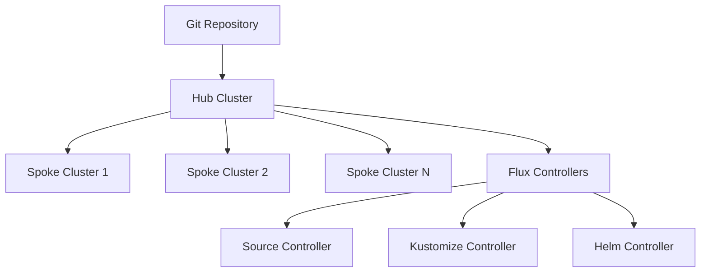

# How to Set Up Hub-and-Spoke Multi-Cluster with Flux CD

Author: [nawazdhandala](https://github.com/nawazdhandala)

Tags: Flux CD, Multi-Cluster, Hub-and-Spoke, GitOps, Kubernetes

Description: A practical guide to setting up a hub-and-spoke multi-cluster architecture using Flux CD for centralized GitOps management.

---

## Introduction

Managing multiple Kubernetes clusters becomes increasingly complex as your infrastructure grows. The hub-and-spoke model provides a centralized approach where a single hub cluster manages and orchestrates workloads across multiple spoke (leaf) clusters. Flux CD is an excellent fit for this pattern because it can reconcile resources across cluster boundaries using its built-in multi-tenancy and Kustomization features.

In this guide, you will learn how to set up a hub cluster that controls the GitOps lifecycle of multiple spoke clusters, enabling consistent deployments, centralized policy enforcement, and simplified operations.

## Prerequisites

Before getting started, ensure you have the following:

- Three or more Kubernetes clusters (one hub, two or more spokes)
- kubectl configured with contexts for all clusters
- Flux CLI installed (v2.0 or later)
- A Git repository for your fleet configuration
- kubeconfig files or service accounts for spoke clusters accessible from the hub

## Architecture Overview



The hub cluster runs all Flux controllers and holds the Kustomization and HelmRelease resources that target spoke clusters via kubeconfig secrets.

## Step 1: Bootstrap Flux on the Hub Cluster

Start by bootstrapping Flux on your hub cluster. This cluster will serve as the central management plane.

```bash
# Switch to the hub cluster context
kubectl config use-context hub-cluster

# Bootstrap Flux on the hub cluster
flux bootstrap github \
  --owner=your-org \
  --repository=fleet-config \
  --branch=main \
  --path=clusters/hub \
  --personal
```

This creates the Flux system namespace and installs all controllers on the hub cluster.

## Step 2: Register Spoke Clusters

Each spoke cluster needs a kubeconfig secret stored in the hub cluster so Flux can communicate with it. Create a service account on each spoke cluster with the necessary permissions.

```yaml
# spoke-cluster-rbac.yaml
# Service account for Flux to use when managing spoke cluster resources
apiVersion: v1
kind: ServiceAccount
metadata:
  name: flux-reconciler
  namespace: flux-system
---
# Cluster-wide admin role binding for the Flux reconciler
apiVersion: rbac.authorization.k8s.io/v1
kind: ClusterRoleBinding
metadata:
  name: flux-reconciler
roleRef:
  apiGroup: rbac.authorization.k8s.io
  kind: ClusterRole
  name: cluster-admin
subjects:
  - kind: ServiceAccount
    name: flux-reconciler
    namespace: flux-system
```

Apply this on each spoke cluster:

```bash
# Switch to spoke cluster and apply RBAC
kubectl config use-context spoke-cluster-1
kubectl create namespace flux-system
kubectl apply -f spoke-cluster-rbac.yaml
```

## Step 3: Create Kubeconfig Secrets on the Hub

Extract the service account token from each spoke cluster and create a kubeconfig secret on the hub.

```bash
# Get the service account token from the spoke cluster
SPOKE_TOKEN=$(kubectl --context=spoke-cluster-1 \
  create token flux-reconciler \
  -n flux-system \
  --duration=8760h)

# Get the spoke cluster API server endpoint
SPOKE_SERVER=$(kubectl --context=spoke-cluster-1 \
  config view --minify -o jsonpath='{.clusters[0].cluster.server}')

# Get the CA certificate
SPOKE_CA=$(kubectl --context=spoke-cluster-1 \
  config view --minify --raw -o jsonpath='{.clusters[0].cluster.certificate-authority-data}')
```

Now create the kubeconfig secret on the hub cluster:

```yaml
# spoke-1-kubeconfig.yaml
# Kubeconfig secret that allows Flux on the hub to reach spoke-cluster-1
apiVersion: v1
kind: Secret
metadata:
  name: spoke-cluster-1-kubeconfig
  namespace: flux-system
type: Opaque
stringData:
  value: |
    apiVersion: v1
    kind: Config
    clusters:
      - cluster:
          server: https://spoke-1-api.example.com:6443
          certificate-authority-data: <BASE64_CA_DATA>
        name: spoke-cluster-1
    contexts:
      - context:
          cluster: spoke-cluster-1
          user: flux-reconciler
        name: spoke-cluster-1
    current-context: spoke-cluster-1
    users:
      - name: flux-reconciler
        user:
          token: <SPOKE_TOKEN>
```

```bash
# Apply the kubeconfig secret on the hub cluster
kubectl --context=hub-cluster apply -f spoke-1-kubeconfig.yaml
```

## Step 4: Set Up the Git Repository Structure

Organize your Git repository to clearly separate hub and spoke configurations:

```text
fleet-config/
  clusters/
    hub/
      flux-system/          # Flux bootstrap files
      spoke-cluster-1.yaml  # Kustomization targeting spoke-1
      spoke-cluster-2.yaml  # Kustomization targeting spoke-2
    spoke-cluster-1/
      apps/                 # Apps deployed to spoke-1
      infrastructure/       # Infra components for spoke-1
    spoke-cluster-2/
      apps/
      infrastructure/
  base/
    apps/
      nginx/               # Shared app definitions
      monitoring/
    infrastructure/
      cert-manager/
      ingress-nginx/
```

## Step 5: Create Kustomizations Targeting Spoke Clusters

On the hub cluster, create Kustomization resources that reference the spoke kubeconfig secrets.

```yaml
# clusters/hub/spoke-cluster-1.yaml
# Kustomization that deploys infrastructure to spoke-cluster-1
apiVersion: kustomize.toolkit.fluxcd.io/v1
kind: Kustomization
metadata:
  name: spoke-cluster-1-infra
  namespace: flux-system
spec:
  interval: 10m
  # Path in the Git repo containing spoke-1 infrastructure manifests
  path: ./clusters/spoke-cluster-1/infrastructure
  prune: true
  sourceRef:
    kind: GitRepository
    name: flux-system
  # This tells Flux to apply resources to the spoke cluster
  kubeConfig:
    secretRef:
      name: spoke-cluster-1-kubeconfig
  timeout: 5m
  # Wait for resources to become ready on the spoke cluster
  wait: true
  healthChecks:
    - apiVersion: apps/v1
      kind: Deployment
      name: ingress-nginx-controller
      namespace: ingress-nginx
---
# Kustomization that deploys applications to spoke-cluster-1
apiVersion: kustomize.toolkit.fluxcd.io/v1
kind: Kustomization
metadata:
  name: spoke-cluster-1-apps
  namespace: flux-system
spec:
  interval: 10m
  # Ensure infrastructure is ready before deploying apps
  dependsOn:
    - name: spoke-cluster-1-infra
  path: ./clusters/spoke-cluster-1/apps
  prune: true
  sourceRef:
    kind: GitRepository
    name: flux-system
  kubeConfig:
    secretRef:
      name: spoke-cluster-1-kubeconfig
  timeout: 5m
```

## Step 6: Deploy Shared Base Applications

Use Kustomize overlays to share common configurations across spokes while allowing per-cluster customization.

```yaml
# base/apps/nginx/deployment.yaml
# Base nginx deployment shared across all spoke clusters
apiVersion: apps/v1
kind: Deployment
metadata:
  name: nginx
  namespace: default
spec:
  replicas: 2
  selector:
    matchLabels:
      app: nginx
  template:
    metadata:
      labels:
        app: nginx
    spec:
      containers:
        - name: nginx
          image: nginx:1.25
          ports:
            - containerPort: 80
          resources:
            requests:
              cpu: 100m
              memory: 128Mi
            limits:
              cpu: 200m
              memory: 256Mi
```

```yaml
# clusters/spoke-cluster-1/apps/kustomization.yaml
# Spoke-1 overlay: increases replicas for higher traffic
apiVersion: kustomize.config.k8s.io/v1beta1
kind: Kustomization
resources:
  - ../../../base/apps/nginx
patches:
  - target:
      kind: Deployment
      name: nginx
    patch: |
      - op: replace
        path: /spec/replicas
        value: 5
```

## Step 7: Monitor Spoke Cluster Reconciliation

From the hub cluster, you can monitor the status of all spoke reconciliations:

```bash
# Check the status of all Kustomizations targeting spoke clusters
flux get kustomizations --context=hub-cluster

# View detailed status for a specific spoke
flux get kustomization spoke-cluster-1-infra --context=hub-cluster

# Check events related to spoke reconciliation
kubectl --context=hub-cluster get events \
  -n flux-system \
  --field-selector reason=ReconciliationSucceeded
```

## Step 8: Set Up Notifications

Configure Flux notifications on the hub to alert when spoke reconciliation fails.

```yaml
# clusters/hub/notifications.yaml
# Provider for sending alerts to Slack
apiVersion: notification.toolkit.fluxcd.io/v1beta3
kind: Provider
metadata:
  name: slack
  namespace: flux-system
spec:
  type: slack
  channel: fleet-alerts
  secretRef:
    name: slack-webhook-url
---
# Alert that fires when any spoke Kustomization fails
apiVersion: notification.toolkit.fluxcd.io/v1beta3
kind: Alert
metadata:
  name: spoke-reconciliation-alert
  namespace: flux-system
spec:
  providerRef:
    name: slack
  eventSeverity: error
  eventSources:
    # Watch all Kustomizations in flux-system namespace
    - kind: Kustomization
      namespace: flux-system
      name: "*"
  summary: "Spoke cluster reconciliation failure detected"
```

## Step 9: Handle Spoke Cluster Rotation

When you need to add or remove spoke clusters, follow this process:

```bash
# Adding a new spoke cluster
# 1. Create RBAC on the new spoke
kubectl --context=spoke-cluster-3 apply -f spoke-cluster-rbac.yaml

# 2. Create kubeconfig secret on the hub
kubectl --context=hub-cluster apply -f spoke-3-kubeconfig.yaml

# 3. Add the Kustomization files in Git
git add clusters/hub/spoke-cluster-3.yaml
git add clusters/spoke-cluster-3/
git commit -m "Add spoke-cluster-3 to fleet"
git push

# Flux will automatically pick up the changes and begin reconciling
```

To remove a spoke cluster:

```bash
# Remove the Kustomization from Git (Flux will clean up resources)
git rm clusters/hub/spoke-cluster-3.yaml
git rm -r clusters/spoke-cluster-3/
git commit -m "Remove spoke-cluster-3 from fleet"
git push

# After Flux reconciles, remove the kubeconfig secret
kubectl --context=hub-cluster delete secret spoke-cluster-3-kubeconfig -n flux-system
```

## Troubleshooting

Common issues and their solutions:

**Spoke cluster unreachable**: Verify the kubeconfig secret contains valid credentials and the API server endpoint is accessible from the hub cluster network.

```bash
# Test connectivity from the hub to a spoke
kubectl --context=hub-cluster run test-conn --rm -it --image=curlimages/curl \
  -- curl -k https://spoke-1-api.example.com:6443/healthz
```

**Reconciliation timeout**: If resources take too long to become healthy on the spoke, increase the timeout in the Kustomization spec.

**Drift detection**: Enable drift detection to catch out-of-band changes on spoke clusters.

```yaml
# Add drift detection to spoke Kustomizations
spec:
  force: false
  prune: true
  # Detect and correct drift every 10 minutes
  interval: 10m
```

## Conclusion

The hub-and-spoke model with Flux CD provides a scalable and maintainable approach to multi-cluster management. By centralizing all GitOps controllers on a single hub cluster, you reduce operational overhead while maintaining full control over what gets deployed to each spoke. The Git repository serves as the single source of truth, and Flux ensures that all clusters converge to the desired state defined in your repository.
