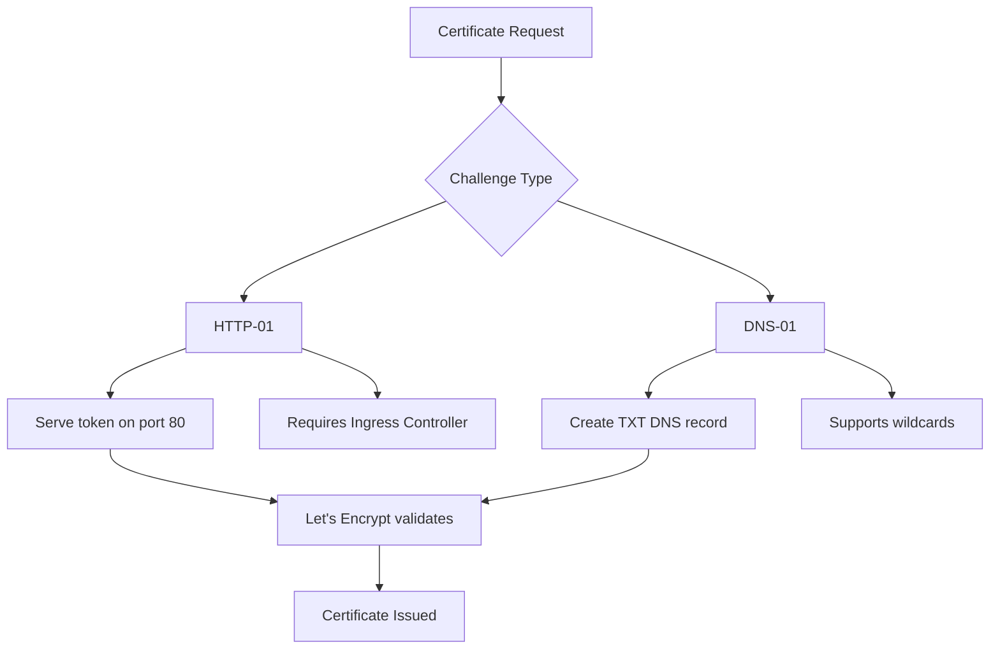

# How to Set Up Let's Encrypt Certificates with Flux CD

Author: [nawazdhandala](https://github.com/nawazdhandala)

Tags: Flux CD, lets encrypt, Kubernetes, GitOps, TLS, Certificates, ACME, cert-manager

Description: A step-by-step guide to setting up automatic Let's Encrypt certificate issuance and renewal in Kubernetes using Flux CD.

---

## Introduction

Let's Encrypt is a free, automated, and open certificate authority that provides TLS certificates trusted by all major browsers. By integrating Let's Encrypt with cert-manager and Flux CD, you can fully automate the issuance and renewal of TLS certificates for your Kubernetes workloads. Every certificate configuration lives in Git, and Flux CD ensures they are continuously reconciled.

This guide focuses specifically on Let's Encrypt integration, covering both HTTP-01 and DNS-01 challenge types, staging vs. production environments, and handling common scenarios like wildcard certificates and multi-domain certificates.

## Prerequisites

- A Kubernetes cluster (v1.24 or later)
- Flux CD installed and bootstrapped
- cert-manager installed (see our cert-manager guide)
- A registered domain name with DNS management access
- An ingress controller deployed (for HTTP-01 challenges)

## Understanding ACME Challenges

Let's Encrypt uses the ACME protocol to verify domain ownership. There are two primary challenge types.



**HTTP-01** challenges prove ownership by serving a token at a well-known URL on port 80. This is the simplest method but does not support wildcard certificates.

**DNS-01** challenges prove ownership by creating a specific TXT record in your DNS zone. This method supports wildcard certificates and does not require port 80 access.

## Setting Up Let's Encrypt Staging Issuer

Always start with the staging environment to avoid hitting production rate limits during testing.

```yaml
# clusters/my-cluster/cert-manager-config/letsencrypt-staging-issuer.yaml
apiVersion: cert-manager.io/v1
kind: ClusterIssuer
metadata:
  name: letsencrypt-staging
spec:
  acme:
    # Let's Encrypt staging server
    server: https://acme-staging-v02.api.letsencrypt.org/directory
    # Email for certificate expiration notifications
    email: platform-team@example.com
    # Secret to store the ACME account private key
    privateKeySecretRef:
      name: letsencrypt-staging-account-key
    solvers:
      # HTTP-01 solver using nginx ingress
      - http01:
          ingress:
            ingressClassName: nginx
            # Pod template for the solver pods
            podTemplate:
              spec:
                resources:
                  requests:
                    cpu: 10m
                    memory: 16Mi
                  limits:
                    cpu: 100m
                    memory: 64Mi
```

## Setting Up Let's Encrypt Production Issuer

Once staging is verified, configure the production issuer.

```yaml
# clusters/my-cluster/cert-manager-config/letsencrypt-production-issuer.yaml
apiVersion: cert-manager.io/v1
kind: ClusterIssuer
metadata:
  name: letsencrypt-production
spec:
  acme:
    # Let's Encrypt production server
    server: https://acme-v02.api.letsencrypt.org/directory
    email: platform-team@example.com
    privateKeySecretRef:
      name: letsencrypt-production-account-key
    solvers:
      - http01:
          ingress:
            ingressClassName: nginx
```

## Requesting a Certificate with HTTP-01

### Using a Certificate Resource

```yaml
# apps/my-app/certificates/app-cert.yaml
apiVersion: cert-manager.io/v1
kind: Certificate
metadata:
  name: app-certificate
  namespace: default
spec:
  # Name of the Secret that will hold the certificate
  secretName: app-tls-secret
  # Reference the production issuer
  issuerRef:
    name: letsencrypt-production
    kind: ClusterIssuer
  # Certificate validity and renewal timing
  duration: 2160h     # 90 days (Let's Encrypt default)
  renewBefore: 720h   # Renew 30 days before expiry
  # Domain names to include in the certificate
  dnsNames:
    - app.example.com
  # Private key settings
  privateKey:
    algorithm: RSA
    size: 2048
    rotationPolicy: Always
```

### Using Ingress Annotations (Automatic)

The simplest way to get Let's Encrypt certificates is through Ingress annotations.

```yaml
# apps/my-app/ingress.yaml
apiVersion: networking.k8s.io/v1
kind: Ingress
metadata:
  name: my-app-ingress
  namespace: default
  annotations:
    # Automatically request a certificate from this issuer
    cert-manager.io/cluster-issuer: letsencrypt-production
spec:
  ingressClassName: nginx
  tls:
    - hosts:
        - app.example.com
      # cert-manager creates and manages this secret
      secretName: app-tls-auto
  rules:
    - host: app.example.com
      http:
        paths:
          - path: /
            pathType: Prefix
            backend:
              service:
                name: my-app-service
                port:
                  number: 80
```

## DNS-01 Challenge Setup

DNS-01 challenges require credentials to manage DNS records. Here are configurations for common providers.

### AWS Route 53

```yaml
# clusters/my-cluster/cert-manager-config/letsencrypt-dns01-route53.yaml
apiVersion: cert-manager.io/v1
kind: ClusterIssuer
metadata:
  name: letsencrypt-dns01-route53
spec:
  acme:
    server: https://acme-v02.api.letsencrypt.org/directory
    email: platform-team@example.com
    privateKeySecretRef:
      name: letsencrypt-dns01-route53-key
    solvers:
      - dns01:
          route53:
            region: us-east-1
            hostedZoneID: Z0123456789ABCDEF
        selector:
          dnsZones:
            - "example.com"
```

For AWS, the recommended approach is to use IRSA. Add this annotation to the cert-manager ServiceAccount.

```yaml
# Patch for cert-manager service account
apiVersion: helm.toolkit.fluxcd.io/v2
kind: HelmRelease
metadata:
  name: cert-manager
  namespace: cert-manager
spec:
  values:
    serviceAccount:
      annotations:
        eks.amazonaws.com/role-arn: "arn:aws:iam::123456789012:role/cert-manager"
```

### Cloudflare

```yaml
# clusters/my-cluster/cert-manager-config/cloudflare-secret.yaml
apiVersion: v1
kind: Secret
metadata:
  name: cloudflare-api-token
  namespace: cert-manager
type: Opaque
stringData:
  api-token: "your-cloudflare-api-token-here"
---
# clusters/my-cluster/cert-manager-config/letsencrypt-dns01-cloudflare.yaml
apiVersion: cert-manager.io/v1
kind: ClusterIssuer
metadata:
  name: letsencrypt-dns01-cloudflare
spec:
  acme:
    server: https://acme-v02.api.letsencrypt.org/directory
    email: platform-team@example.com
    privateKeySecretRef:
      name: letsencrypt-dns01-cloudflare-key
    solvers:
      - dns01:
          cloudflare:
            apiTokenSecretRef:
              name: cloudflare-api-token
              key: api-token
        selector:
          dnsZones:
            - "example.com"
```

### Google Cloud DNS

```yaml
# clusters/my-cluster/cert-manager-config/letsencrypt-dns01-gcp.yaml
apiVersion: cert-manager.io/v1
kind: ClusterIssuer
metadata:
  name: letsencrypt-dns01-gcp
spec:
  acme:
    server: https://acme-v02.api.letsencrypt.org/directory
    email: platform-team@example.com
    privateKeySecretRef:
      name: letsencrypt-dns01-gcp-key
    solvers:
      - dns01:
          cloudDNS:
            project: my-gcp-project-id
            serviceAccountSecretRef:
              name: gcp-dns-sa
              key: key.json
```

## Wildcard Certificates with DNS-01

Wildcard certificates require DNS-01 challenges.

```yaml
# clusters/my-cluster/cert-manager-config/wildcard-certificate.yaml
apiVersion: cert-manager.io/v1
kind: Certificate
metadata:
  name: wildcard-example-com
  namespace: default
spec:
  secretName: wildcard-example-com-tls
  issuerRef:
    name: letsencrypt-dns01-cloudflare
    kind: ClusterIssuer
  duration: 2160h
  renewBefore: 720h
  dnsNames:
    # Wildcard for all subdomains
    - "*.example.com"
    # Include the apex domain as well
    - "example.com"
  privateKey:
    algorithm: ECDSA
    size: 256
```

## Multi-Domain Certificates (SAN)

```yaml
# apps/my-app/certificates/multi-domain-cert.yaml
apiVersion: cert-manager.io/v1
kind: Certificate
metadata:
  name: multi-domain-cert
  namespace: default
spec:
  secretName: multi-domain-tls
  issuerRef:
    name: letsencrypt-production
    kind: ClusterIssuer
  dnsNames:
    - app.example.com
    - api.example.com
    - admin.example.com
    - docs.example.com
  privateKey:
    algorithm: RSA
    size: 2048
```

## Flux Kustomization

```yaml
# clusters/my-cluster/letsencrypt-kustomization.yaml
apiVersion: kustomize.toolkit.fluxcd.io/v1
kind: Kustomization
metadata:
  name: letsencrypt-config
  namespace: flux-system
spec:
  interval: 10m
  sourceRef:
    kind: GitRepository
    name: flux-system
  path: ./clusters/my-cluster/cert-manager-config
  prune: true
  dependsOn:
    - name: cert-manager-helm
  # Decrypt secrets encrypted with SOPS
  decryption:
    provider: sops
    secretRef:
      name: sops-age
  timeout: 5m
```

## Monitoring Certificate Status

```bash
# List all certificates and their status
kubectl get certificates -A

# Check if a certificate is ready
kubectl get certificate app-certificate -n default -o wide

# View detailed certificate status
kubectl describe certificate app-certificate -n default

# Check the ACME order progress
kubectl get orders -A

# Check challenges (should complete quickly for HTTP-01)
kubectl get challenges -A

# View the issued certificate details
kubectl get secret app-tls-secret -n default -o jsonpath='{.data.tls\.crt}' | base64 -d | openssl x509 -text -noout | head -20

# Check certificate expiration dates
kubectl get certificates -A -o jsonpath='{range .items[*]}{.metadata.name}{"\t"}{.status.notAfter}{"\n"}{end}'
```

## Troubleshooting

Common issues and how to resolve them.

```bash
# Certificate stuck in "not ready" state
kubectl describe certificate <name> -n <namespace>

# Check the certificate request
kubectl get certificaterequest -n <namespace>
kubectl describe certificaterequest <name> -n <namespace>

# HTTP-01 challenge failing - check solver pod
kubectl get pods -A | grep cm-acme
kubectl logs <solver-pod-name> -n <namespace>

# DNS-01 challenge failing - check DNS propagation
dig -t TXT _acme-challenge.app.example.com

# cert-manager controller logs
kubectl logs -n cert-manager deploy/cert-manager -f

# Rate limit issues - check Let's Encrypt status
# Production rate limits: 50 certificates per registered domain per week
# Use staging for testing to avoid rate limits
```

## Conclusion

Setting up Let's Encrypt with Flux CD automates the entire lifecycle of TLS certificates for your Kubernetes services. Certificates are requested, validated, issued, and renewed automatically without any manual intervention. By managing all issuer configurations and certificate resources in Git, you get a fully auditable and reproducible certificate management system. Start with the staging environment for testing, then switch to production once everything works correctly.
