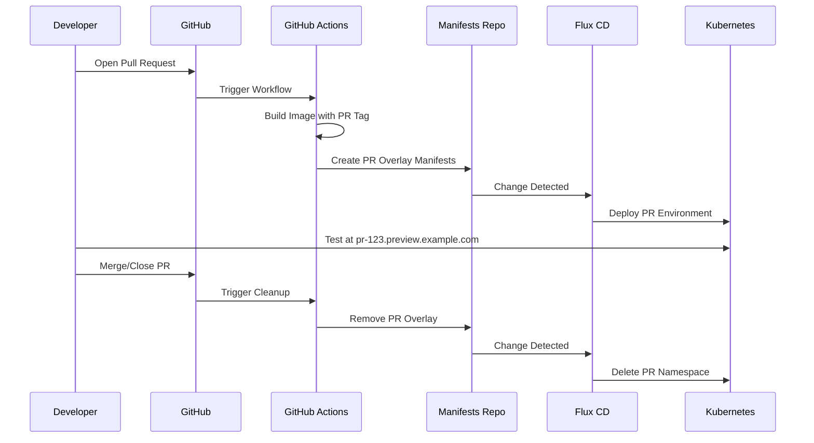

# How to Set Up PR Preview Environments with Flux CD

Author: [nawazdhandala](https://github.com/nawazdhandala)

Tags: Flux CD, Preview Environments, Pull Requests, GitOps, Kubernetes, CI/CD, Development Workflow

Description: Learn how to create ephemeral preview environments for every pull request using Flux CD and GitOps principles.

---

## Introduction

PR preview environments let developers and reviewers test changes in an isolated Kubernetes environment before merging. Each pull request gets its own namespace with a fully deployed version of the application. When the PR is merged or closed, the environment is automatically cleaned up.

This guide shows you how to set up PR preview environments using Flux CD, GitHub Actions, and dynamic Kustomize overlays.

## Prerequisites

- A running Kubernetes cluster (v1.26 or later)
- Flux CD installed and bootstrapped
- GitHub repository with GitHub Actions enabled
- kubectl configured to access your cluster
- A wildcard DNS entry or an ingress controller that supports dynamic hostnames
- A container registry accessible from your cluster

## Architecture Overview



## Step 1: Create the Base Application Manifests

Set up the base manifests that all PR environments will inherit from.

```yaml
# apps/myapp/base/deployment.yaml
# Base deployment template - PR overlays will customize this
apiVersion: apps/v1
kind: Deployment
metadata:
  name: myapp
  labels:
    app: myapp
spec:
  replicas: 1
  selector:
    matchLabels:
      app: myapp
  template:
    metadata:
      labels:
        app: myapp
    spec:
      containers:
        - name: myapp
          image: registry.example.com/myapp:latest
          ports:
            - containerPort: 8080
          resources:
            # Use minimal resources for preview environments
            requests:
              cpu: 50m
              memory: 64Mi
            limits:
              cpu: 200m
              memory: 256Mi
          env:
            - name: APP_ENV
              value: preview
```

```yaml
# apps/myapp/base/service.yaml
# Base service for the application
apiVersion: v1
kind: Service
metadata:
  name: myapp
spec:
  selector:
    app: myapp
  ports:
    - port: 80
      targetPort: 8080
  type: ClusterIP
```

```yaml
# apps/myapp/base/ingress.yaml
# Base ingress - the host will be overridden per PR
apiVersion: networking.k8s.io/v1
kind: Ingress
metadata:
  name: myapp
  annotations:
    cert-manager.io/cluster-issuer: letsencrypt-prod
spec:
  ingressClassName: nginx
  rules:
    - host: myapp.example.com
      http:
        paths:
          - path: /
            pathType: Prefix
            backend:
              service:
                name: myapp
                port:
                  number: 80
```

```yaml
# apps/myapp/base/kustomization.yaml
# Base kustomization listing all resources
apiVersion: kustomize.config.k8s.io/v1beta1
kind: Kustomization
resources:
  - deployment.yaml
  - service.yaml
  - ingress.yaml
```

## Step 2: Create the GitHub Actions Workflow for PR Preview

This workflow builds the PR image, creates a Kustomize overlay for the PR, and pushes it to the manifests repository.

```yaml
# .github/workflows/pr-preview.yaml
name: PR Preview Environment

on:
  pull_request:
    types: [opened, synchronize, reopened, closed]

env:
  IMAGE_NAME: registry.example.com/myapp
  MANIFESTS_REPO: myorg/k8s-manifests

jobs:
  # Deploy a preview environment when a PR is opened or updated
  deploy-preview:
    if: github.event.action != 'closed'
    runs-on: ubuntu-latest
    steps:
      - name: Checkout application code
        uses: actions/checkout@v4

      - name: Set up Docker Buildx
        uses: docker/setup-buildx-action@v3

      - name: Login to container registry
        uses: docker/login-action@v3
        with:
          registry: registry.example.com
          username: ${{ secrets.REGISTRY_USERNAME }}
          password: ${{ secrets.REGISTRY_PASSWORD }}

      # Build and push with a PR-specific tag
      - name: Build and push image
        uses: docker/build-push-action@v5
        with:
          push: true
          tags: |
            ${{ env.IMAGE_NAME }}:pr-${{ github.event.number }}
            ${{ env.IMAGE_NAME }}:pr-${{ github.event.number }}-${{ github.sha }}

      # Create the PR overlay in the manifests repository
      - name: Create PR overlay
        env:
          GH_TOKEN: ${{ secrets.MANIFESTS_REPO_TOKEN }}
          PR_NUMBER: ${{ github.event.number }}
        run: |
          # Clone manifests repository
          git clone https://${GH_TOKEN}@github.com/${{ env.MANIFESTS_REPO }}.git manifests
          cd manifests

          # Create PR-specific overlay directory
          PR_DIR="apps/myapp/previews/pr-${PR_NUMBER}"
          mkdir -p "${PR_DIR}"

          # Create the namespace manifest
          cat > "${PR_DIR}/namespace.yaml" << EOF
          apiVersion: v1
          kind: Namespace
          metadata:
            name: preview-pr-${PR_NUMBER}
            labels:
              preview: "true"
              pr-number: "${PR_NUMBER}"
          EOF

          # Create the Kustomize overlay
          cat > "${PR_DIR}/kustomization.yaml" << EOF
          apiVersion: kustomize.config.k8s.io/v1beta1
          kind: Kustomization
          namespace: preview-pr-${PR_NUMBER}
          resources:
            - ../../base
            - namespace.yaml
          # Override the image tag with the PR-specific tag
          images:
            - name: registry.example.com/myapp
              newTag: pr-${PR_NUMBER}
          # Patch the ingress to use a PR-specific hostname
          patches:
            - target:
                kind: Ingress
                name: myapp
              patch: |
                - op: replace
                  path: /spec/rules/0/host
                  value: pr-${PR_NUMBER}.preview.example.com
          EOF

          # Commit and push
          git config user.email "github-actions@github.com"
          git config user.name "GitHub Actions"
          git add .
          git commit -m "Deploy preview for PR #${PR_NUMBER}"
          git push origin main

      # Post the preview URL as a PR comment
      - name: Comment preview URL
        uses: actions/github-script@v7
        with:
          script: |
            const prNumber = context.payload.pull_request.number;
            const previewUrl = `https://pr-${prNumber}.preview.example.com`;
            github.rest.issues.createComment({
              owner: context.repo.owner,
              repo: context.repo.repo,
              issue_number: prNumber,
              body: `Preview environment deployed at: ${previewUrl}\n\nThis environment will be updated with each push and cleaned up when the PR is closed.`
            });

  # Clean up the preview environment when the PR is closed
  cleanup-preview:
    if: github.event.action == 'closed'
    runs-on: ubuntu-latest
    steps:
      - name: Remove PR overlay
        env:
          GH_TOKEN: ${{ secrets.MANIFESTS_REPO_TOKEN }}
          PR_NUMBER: ${{ github.event.number }}
        run: |
          git clone https://${GH_TOKEN}@github.com/${{ env.MANIFESTS_REPO }}.git manifests
          cd manifests

          # Remove the PR overlay directory
          PR_DIR="apps/myapp/previews/pr-${PR_NUMBER}"
          if [ -d "${PR_DIR}" ]; then
            rm -rf "${PR_DIR}"
            git config user.email "github-actions@github.com"
            git config user.name "GitHub Actions"
            git add .
            git commit -m "Cleanup preview for PR #${PR_NUMBER}"
            git push origin main
          fi
```

## Step 3: Configure Flux to Watch Preview Directories

Set up Flux to reconcile all preview overlays dynamically.

```yaml
# clusters/my-cluster/previews-source.yaml
# Source for the manifests repository
apiVersion: source.toolkit.fluxcd.io/v1
kind: GitRepository
metadata:
  name: myapp-manifests
  namespace: flux-system
spec:
  interval: 1m
  url: https://github.com/myorg/k8s-manifests.git
  ref:
    branch: main
  secretRef:
    name: manifests-auth
```

```yaml
# clusters/my-cluster/previews-kustomization.yaml
# Kustomization that watches the previews directory
# Each subdirectory becomes a separate preview environment
apiVersion: kustomize.toolkit.fluxcd.io/v1
kind: Kustomization
metadata:
  name: myapp-previews
  namespace: flux-system
spec:
  interval: 2m
  sourceRef:
    kind: GitRepository
    name: myapp-manifests
  path: ./apps/myapp/previews
  prune: true
  wait: true
  timeout: 3m
```

To make the previews directory work as a Kustomization root, create a top-level kustomization file that includes all PR overlays.

```yaml
# apps/myapp/previews/kustomization.yaml
# This file is automatically managed by CI
# It includes all active PR preview overlays
apiVersion: kustomize.config.k8s.io/v1beta1
kind: Kustomization
resources: []
# PR directories are added and removed by the CI workflow
```

Update the GitHub Actions workflow to also maintain this file. Add this to the deploy-preview job after creating the overlay:

```bash
# Update the top-level kustomization to include the new PR overlay
cd manifests/apps/myapp/previews
# Rebuild the resources list from all PR directories
RESOURCES="resources:"
for dir in pr-*/; do
  if [ -d "$dir" ]; then
    RESOURCES="${RESOURCES}\n  - ${dir}"
  fi
done

cat > kustomization.yaml << EOF
apiVersion: kustomize.config.k8s.io/v1beta1
kind: Kustomization
$(echo -e "$RESOURCES")
EOF
```

## Step 4: Set Up Wildcard DNS and Ingress

Configure your ingress controller and DNS for preview environment routing.

```yaml
# infrastructure/ingress-nginx/wildcard-cert.yaml
# Wildcard TLS certificate for preview environments
apiVersion: cert-manager.io/v1
kind: Certificate
metadata:
  name: preview-wildcard
  namespace: ingress-nginx
spec:
  secretName: preview-wildcard-tls
  issuerRef:
    name: letsencrypt-prod
    kind: ClusterIssuer
  dnsNames:
    - "*.preview.example.com"
```

## Step 5: Add Resource Limits for Preview Environments

To prevent preview environments from consuming too many cluster resources, add a ResourceQuota and LimitRange. Update the namespace manifest in the CI workflow:

```yaml
# Added to the PR overlay namespace.yaml by CI
apiVersion: v1
kind: ResourceQuota
metadata:
  name: preview-quota
spec:
  hard:
    # Limit total resources per preview namespace
    requests.cpu: "500m"
    requests.memory: 512Mi
    limits.cpu: "1"
    limits.memory: 1Gi
    pods: "10"
---
apiVersion: v1
kind: LimitRange
metadata:
  name: preview-limits
spec:
  limits:
    - default:
        cpu: 200m
        memory: 256Mi
      defaultRequest:
        cpu: 50m
        memory: 64Mi
      type: Container
```

## Step 6: Add Automatic Cleanup with TTL

For extra safety, add a CronJob that cleans up stale preview environments.

```yaml
# infrastructure/preview-cleanup/cronjob.yaml
# Clean up preview namespaces older than 7 days
apiVersion: batch/v1
kind: CronJob
metadata:
  name: preview-cleanup
  namespace: flux-system
spec:
  schedule: "0 2 * * *"
  jobTemplate:
    spec:
      template:
        spec:
          serviceAccountName: preview-cleanup
          containers:
            - name: cleanup
              image: bitnami/kubectl:latest
              command: ["/bin/sh", "-c"]
              args:
                - |
                  # Find preview namespaces older than 7 days
                  CUTOFF=$(date -d '7 days ago' -u +%Y-%m-%dT%H:%M:%SZ)
                  kubectl get namespaces -l preview=true -o json | \
                    jq -r --arg cutoff "$CUTOFF" \
                    '.items[] | select(.metadata.creationTimestamp < $cutoff) | .metadata.name' | \
                    while read ns; do
                      echo "Deleting stale preview namespace: $ns"
                      kubectl delete namespace "$ns"
                    done
          restartPolicy: OnFailure
```

## Step 7: Verify the Setup

Test the entire flow by opening a pull request.

```bash
# Check that Flux is watching the previews directory
flux get kustomizations myapp-previews

# After opening a PR, verify the namespace was created
kubectl get namespaces -l preview=true

# Check the preview deployment
kubectl get all -n preview-pr-123

# Verify the ingress was created with the correct hostname
kubectl get ingress -n preview-pr-123

# Check the preview URL
curl -s https://pr-123.preview.example.com
```

## Troubleshooting

### Preview Not Deploying

Check the Flux Kustomization status:

```bash
flux get kustomizations myapp-previews
flux events --for Kustomization/myapp-previews
```

### Namespace Not Cleaned Up After PR Close

Manually trigger the cleanup if needed:

```bash
# Check if the overlay was removed from Git
ls apps/myapp/previews/

# Force Flux to reconcile and prune
flux reconcile kustomization myapp-previews

# Manually delete if needed
kubectl delete namespace preview-pr-123
```

### DNS Not Resolving

Verify the wildcard DNS and ingress:

```bash
# Check DNS resolution
dig pr-123.preview.example.com

# Check the ingress controller logs
kubectl logs -l app.kubernetes.io/name=ingress-nginx -n ingress-nginx
```

## Summary

You now have a fully automated PR preview environment system. Every pull request automatically gets its own isolated Kubernetes namespace with a unique URL. Reviewers can test changes in a production-like environment before merging. When the PR is merged or closed, the environment is automatically cleaned up. Flux CD's prune feature ensures that deleted overlay directories result in deleted Kubernetes resources, keeping your cluster clean.
