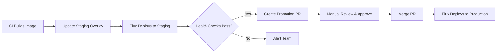

# How to Set Up Staging to Production Promotion with Flux CD

Author: [nawazdhandala](https://github.com/nawazdhandala)

Tags: Flux CD, Staging, Production, Promotion, GitOps, Kubernetes, Deployment Pipeline, Environment Management

Description: A comprehensive guide to setting up a staging-to-production promotion workflow using Flux CD with gated approvals and health checks.

---

## Introduction

A staging-to-production promotion workflow ensures that every change is validated in a staging environment before reaching production. With Flux CD, you can implement this using separate Kustomize overlays for each environment, health checks as promotion gates, and Git-based approval workflows.

This guide walks through a complete setup with automated staging deployment and controlled production promotion.

## Prerequisites

- A Kubernetes cluster with separate staging and production namespaces (or separate clusters)
- Flux CD installed and bootstrapped
- kubectl configured to access your cluster(s)
- A Git repository for Kubernetes manifests
- GitHub or GitLab for pull request-based approvals

## Architecture Overview



## Step 1: Set Up the Repository Structure

Organize your manifests repository with base, staging, and production overlays.

```text
k8s-manifests/
  apps/
    myapp/
      base/
        deployment.yaml
        service.yaml
        hpa.yaml
        kustomization.yaml
      overlays/
        staging/
          kustomization.yaml
          patches/
            deployment-patch.yaml
        production/
          kustomization.yaml
          patches/
            deployment-patch.yaml
  clusters/
    staging/
      myapp.yaml
    production/
      myapp.yaml
```

## Step 2: Create the Base Manifests

Define the shared base that both environments inherit from.

```yaml
# apps/myapp/base/deployment.yaml
apiVersion: apps/v1
kind: Deployment
metadata:
  name: myapp
  labels:
    app: myapp
spec:
  replicas: 1
  selector:
    matchLabels:
      app: myapp
  template:
    metadata:
      labels:
        app: myapp
    spec:
      containers:
        - name: myapp
          image: registry.example.com/myapp:latest
          ports:
            - containerPort: 8080
          # Readiness probe ensures traffic is only sent to healthy pods
          readinessProbe:
            httpGet:
              path: /healthz
              port: 8080
            initialDelaySeconds: 5
            periodSeconds: 10
          # Liveness probe restarts unhealthy pods
          livenessProbe:
            httpGet:
              path: /healthz
              port: 8080
            initialDelaySeconds: 15
            periodSeconds: 20
          resources:
            requests:
              cpu: 100m
              memory: 128Mi
            limits:
              cpu: 500m
              memory: 512Mi
```

```yaml
# apps/myapp/base/service.yaml
apiVersion: v1
kind: Service
metadata:
  name: myapp
spec:
  selector:
    app: myapp
  ports:
    - port: 80
      targetPort: 8080
  type: ClusterIP
```

```yaml
# apps/myapp/base/hpa.yaml
# Horizontal Pod Autoscaler for the application
apiVersion: autoscaling/v2
kind: HorizontalPodAutoscaler
metadata:
  name: myapp
spec:
  scaleTargetRef:
    apiVersion: apps/v1
    kind: Deployment
    name: myapp
  minReplicas: 1
  maxReplicas: 10
  metrics:
    - type: Resource
      resource:
        name: cpu
        target:
          type: Utilization
          averageUtilization: 70
```

```yaml
# apps/myapp/base/kustomization.yaml
apiVersion: kustomize.config.k8s.io/v1beta1
kind: Kustomization
resources:
  - deployment.yaml
  - service.yaml
  - hpa.yaml
```

## Step 3: Create the Staging Overlay

The staging overlay uses fewer replicas and a separate namespace.

```yaml
# apps/myapp/overlays/staging/kustomization.yaml
apiVersion: kustomize.config.k8s.io/v1beta1
kind: Kustomization
namespace: myapp-staging
resources:
  - ../../base
  - namespace.yaml
# Override the image tag for staging
images:
  - name: registry.example.com/myapp
    newTag: staging-latest
patches:
  - path: patches/deployment-patch.yaml
```

```yaml
# apps/myapp/overlays/staging/namespace.yaml
apiVersion: v1
kind: Namespace
metadata:
  name: myapp-staging
  labels:
    environment: staging
```

```yaml
# apps/myapp/overlays/staging/patches/deployment-patch.yaml
# Staging-specific deployment overrides
apiVersion: apps/v1
kind: Deployment
metadata:
  name: myapp
spec:
  replicas: 2
  template:
    spec:
      containers:
        - name: myapp
          env:
            - name: APP_ENV
              value: staging
            - name: LOG_LEVEL
              value: debug
```

## Step 4: Create the Production Overlay

The production overlay uses more replicas and stricter resource settings.

```yaml
# apps/myapp/overlays/production/kustomization.yaml
apiVersion: kustomize.config.k8s.io/v1beta1
kind: Kustomization
namespace: myapp-production
resources:
  - ../../base
  - namespace.yaml
# Production uses a specific pinned image tag
images:
  - name: registry.example.com/myapp
    newTag: v1.0.0
patches:
  - path: patches/deployment-patch.yaml
```

```yaml
# apps/myapp/overlays/production/namespace.yaml
apiVersion: v1
kind: Namespace
metadata:
  name: myapp-production
  labels:
    environment: production
```

```yaml
# apps/myapp/overlays/production/patches/deployment-patch.yaml
# Production-specific deployment overrides
apiVersion: apps/v1
kind: Deployment
metadata:
  name: myapp
spec:
  replicas: 5
  # Use a rolling update strategy for zero-downtime deployments
  strategy:
    type: RollingUpdate
    rollingUpdate:
      maxSurge: 1
      maxUnavailable: 0
  template:
    spec:
      containers:
        - name: myapp
          env:
            - name: APP_ENV
              value: production
            - name: LOG_LEVEL
              value: info
          resources:
            requests:
              cpu: 250m
              memory: 256Mi
            limits:
              cpu: "1"
              memory: 1Gi
```

## Step 5: Configure Flux for Staging (Auto-Deploy)

Staging deployments happen automatically when the staging overlay is updated.

```yaml
# clusters/staging/myapp.yaml
# Flux Kustomization for staging - auto-deploys on every change
apiVersion: kustomize.toolkit.fluxcd.io/v1
kind: Kustomization
metadata:
  name: myapp-staging
  namespace: flux-system
spec:
  interval: 5m
  sourceRef:
    kind: GitRepository
    name: k8s-manifests
  path: ./apps/myapp/overlays/staging
  prune: true
  wait: true
  timeout: 5m
  # Health checks gate the promotion process
  healthChecks:
    - apiVersion: apps/v1
      kind: Deployment
      name: myapp
      namespace: myapp-staging
```

## Step 6: Configure Flux for Production (Gated Deploy)

Production deployments happen only when the production overlay is updated, which requires a PR approval.

```yaml
# clusters/production/myapp.yaml
# Flux Kustomization for production - deploys from the production overlay
apiVersion: kustomize.toolkit.fluxcd.io/v1
kind: Kustomization
metadata:
  name: myapp-production
  namespace: flux-system
spec:
  interval: 5m
  sourceRef:
    kind: GitRepository
    name: k8s-manifests
  path: ./apps/myapp/overlays/production
  prune: true
  wait: true
  timeout: 10m
  # Strict health checks for production
  healthChecks:
    - apiVersion: apps/v1
      kind: Deployment
      name: myapp
      namespace: myapp-production
    - apiVersion: autoscaling/v2
      kind: HorizontalPodAutoscaler
      name: myapp
      namespace: myapp-production
```

## Step 7: Create the Promotion Automation

Use a GitHub Actions workflow to automate the promotion from staging to production by creating a pull request.

```yaml
# .github/workflows/promote.yaml
name: Promote Staging to Production

on:
  # Trigger manually or on successful staging deployment
  workflow_dispatch:
    inputs:
      image_tag:
        description: "Image tag to promote"
        required: true
  # Also trigger when staging overlay changes on main
  push:
    branches: [main]
    paths:
      - "apps/myapp/overlays/staging/kustomization.yaml"

jobs:
  check-staging-health:
    runs-on: ubuntu-latest
    steps:
      - name: Check staging deployment health
        uses: azure/k8s-set-context@v3
        with:
          kubeconfig: ${{ secrets.STAGING_KUBECONFIG }}

      - name: Verify staging is healthy
        run: |
          # Wait for the staging deployment to be fully available
          kubectl rollout status deployment/myapp -n myapp-staging --timeout=300s

          # Run smoke tests against staging
          STAGING_URL="https://staging.myapp.example.com"
          HTTP_STATUS=$(curl -s -o /dev/null -w "%{http_code}" "$STAGING_URL/healthz")
          if [ "$HTTP_STATUS" != "200" ]; then
            echo "Staging health check failed with status $HTTP_STATUS"
            exit 1
          fi
          echo "Staging health check passed"

  create-promotion-pr:
    needs: check-staging-health
    runs-on: ubuntu-latest
    steps:
      - name: Checkout manifests
        uses: actions/checkout@v4

      - name: Get staging image tag
        id: get-tag
        run: |
          # Extract the current image tag from the staging overlay
          TAG=$(grep "newTag:" apps/myapp/overlays/staging/kustomization.yaml | awk '{print $2}')
          echo "tag=${TAG}" >> "$GITHUB_OUTPUT"
          echo "Staging is running image tag: ${TAG}"

      - name: Update production overlay
        run: |
          TAG="${{ steps.get-tag.outputs.tag }}"
          # Update the production image tag to match staging
          sed -i "s/newTag: .*/newTag: ${TAG}/" apps/myapp/overlays/production/kustomization.yaml

      - name: Create promotion pull request
        uses: peter-evans/create-pull-request@v6
        with:
          token: ${{ secrets.GITHUB_TOKEN }}
          commit-message: "promote: update production to ${{ steps.get-tag.outputs.tag }}"
          branch: promote/production-${{ steps.get-tag.outputs.tag }}
          title: "Promote ${{ steps.get-tag.outputs.tag }} to Production"
          body: |
            ## Production Promotion

            This PR promotes image tag `${{ steps.get-tag.outputs.tag }}` from staging to production.

            **Staging verification:** Passed
            **Image:** `registry.example.com/myapp:${{ steps.get-tag.outputs.tag }}`

            ### Checklist
            - [ ] Staging deployment is healthy
            - [ ] Smoke tests passed
            - [ ] Reviewed by at least one team member
          labels: |
            promotion
            production
          reviewers: |
            team-leads
```

## Step 8: Protect the Production Overlay with Branch Rules

Configure GitHub branch protection to require reviews for changes to the production overlay.

```bash
# Use GitHub CLI to set up branch protection
# Require at least 2 reviewers for production changes
gh api repos/myorg/k8s-manifests/rulesets \
  --method POST \
  --field name="production-protection" \
  --field target="branch" \
  --field enforcement="active" \
  -f conditions='{"ref_name":{"include":["refs/heads/main"]}}' \
  -f rules='[
    {
      "type": "pull_request",
      "parameters": {
        "required_approving_review_count": 2,
        "dismiss_stale_reviews_on_push": true,
        "require_code_owner_reviews": true
      }
    }
  ]'
```

Add a CODEOWNERS file to require specific team members to approve production changes:

```text
# CODEOWNERS
# Require platform team review for production changes
apps/*/overlays/production/ @myorg/platform-team
clusters/production/ @myorg/platform-team
```

## Step 9: Set Up Notifications

Configure Flux notifications to alert the team on deployment status.

```yaml
# clusters/production/notifications.yaml
apiVersion: notification.toolkit.fluxcd.io/v1
kind: Provider
metadata:
  name: slack
  namespace: flux-system
spec:
  type: slack
  channel: deployments
  secretRef:
    name: slack-webhook
---
apiVersion: notification.toolkit.fluxcd.io/v1
kind: Alert
metadata:
  name: production-alerts
  namespace: flux-system
spec:
  providerRef:
    name: slack
  eventSeverity: info
  eventSources:
    - kind: Kustomization
      name: myapp-production
  # Include summary in the notification
  summary: "Production deployment status update"
```

## Step 10: Verify the Promotion Workflow

Test the end-to-end promotion flow.

```bash
# 1. Update staging image tag
cd k8s-manifests
sed -i 's/newTag: .*/newTag: v1.1.0/' apps/myapp/overlays/staging/kustomization.yaml
git add . && git commit -m "Deploy v1.1.0 to staging" && git push

# 2. Verify staging deployment
flux get kustomizations myapp-staging
kubectl get deployment myapp -n myapp-staging -o jsonpath='{.spec.template.spec.containers[0].image}'

# 3. Check that the promotion PR was created
gh pr list --label promotion

# 4. After approving and merging the PR, verify production
flux get kustomizations myapp-production
kubectl get deployment myapp -n myapp-production -o jsonpath='{.spec.template.spec.containers[0].image}'
```

## Rollback Procedure

If a production deployment has issues, roll back by reverting the promotion commit.

```bash
# Find the promotion commit
git log --oneline apps/myapp/overlays/production/

# Revert the promotion commit
git revert <commit-sha>
git push origin main

# Flux will automatically reconcile and roll back the production deployment
flux get kustomizations myapp-production --watch
```

## Summary

You now have a complete staging-to-production promotion workflow with Flux CD. Changes automatically deploy to staging, health checks validate the deployment, and a pull request with required reviews gates the promotion to production. This gives you confidence that every production deployment has been validated in staging first, while maintaining a clear audit trail in Git.
