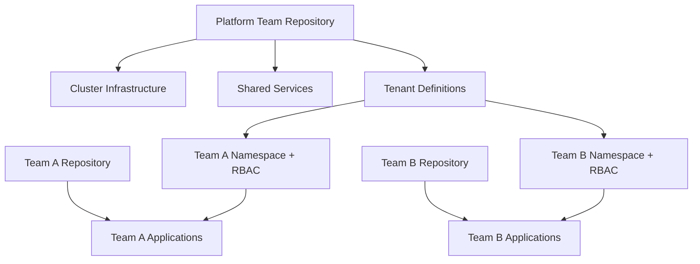

# How to Structure a Flux CD Repository for Platform Engineering Teams

Author: [nawazdhandala](https://github.com/nawazdhandala)

Tags: flux cd, gitops, kubernetes, platform engineering, team management, multi-tenancy

Description: Learn how to structure your Flux CD repository to support platform engineering teams managing shared infrastructure while enabling application teams to self-serve.

---

## Introduction

Platform engineering teams face a unique challenge: they need to manage shared infrastructure, enforce policies, and provide guardrails while also enabling application teams to deploy independently. Flux CD is well-suited for this because its multi-tenancy model allows clear separation between platform-owned and team-owned resources.

This guide shows how to structure a Flux CD repository that supports both platform engineering workflows and self-service application deployment.

## The Platform Engineering Model

In a platform engineering setup, responsibilities are split:

- **Platform team**: Manages cluster infrastructure, shared services, security policies, and deployment guardrails
- **Application teams**: Deploy their own applications within the boundaries set by the platform team



## Repository Structure

```
platform-repo/
├── clusters/
│   ├── production/
│   │   ├── flux-system/
│   │   ├── infrastructure.yaml
│   │   ├── tenants.yaml
│   │   └── platform-apps.yaml
│   └── staging/
│       ├── flux-system/
│       ├── infrastructure.yaml
│       ├── tenants.yaml
│       └── platform-apps.yaml
├── infrastructure/
│   ├── sources/
│   │   ├── kustomization.yaml
│   │   └── helm-repos.yaml
│   ├── controllers/
│   │   ├── kustomization.yaml
│   │   ├── cert-manager/
│   │   ├── ingress-nginx/
│   │   ├── external-secrets/
│   │   └── kyverno/
│   └── configs/
│       ├── kustomization.yaml
│       ├── cluster-issuers/
│       └── kyverno-policies/
├── tenants/
│   ├── kustomization.yaml
│   ├── team-frontend/
│   │   ├── kustomization.yaml
│   │   ├── namespace.yaml
│   │   ├── rbac.yaml
│   │   ├── resource-quota.yaml
│   │   ├── network-policy.yaml
│   │   └── git-repository.yaml
│   ├── team-backend/
│   │   ├── kustomization.yaml
│   │   ├── namespace.yaml
│   │   ├── rbac.yaml
│   │   ├── resource-quota.yaml
│   │   ├── network-policy.yaml
│   │   └── git-repository.yaml
│   └── team-data/
│       ├── kustomization.yaml
│       ├── namespace.yaml
│       ├── rbac.yaml
│       ├── resource-quota.yaml
│       ├── network-policy.yaml
│       └── git-repository.yaml
└── platform-apps/
    ├── kustomization.yaml
    ├── monitoring-dashboards/
    └── alerting-rules/
```

## Cluster-Level Flux Configuration

The cluster configuration ties everything together with proper dependency ordering.

```yaml
# clusters/production/infrastructure.yaml
# Platform infrastructure - managed by the platform team
apiVersion: kustomize.toolkit.fluxcd.io/v1
kind: Kustomization
metadata:
  name: infra-sources
  namespace: flux-system
spec:
  interval: 10m
  sourceRef:
    kind: GitRepository
    name: flux-system
  path: ./infrastructure/sources
  prune: true
---
apiVersion: kustomize.toolkit.fluxcd.io/v1
kind: Kustomization
metadata:
  name: infra-controllers
  namespace: flux-system
spec:
  dependsOn:
    - name: infra-sources
  interval: 10m
  sourceRef:
    kind: GitRepository
    name: flux-system
  path: ./infrastructure/controllers
  prune: true
  timeout: 5m
---
apiVersion: kustomize.toolkit.fluxcd.io/v1
kind: Kustomization
metadata:
  name: infra-configs
  namespace: flux-system
spec:
  dependsOn:
    - name: infra-controllers
  interval: 10m
  sourceRef:
    kind: GitRepository
    name: flux-system
  path: ./infrastructure/configs
  prune: true
```

```yaml
# clusters/production/tenants.yaml
# Tenant onboarding - creates namespaces, RBAC, and GitRepository sources
apiVersion: kustomize.toolkit.fluxcd.io/v1
kind: Kustomization
metadata:
  name: tenants
  namespace: flux-system
spec:
  dependsOn:
    - name: infra-configs
  interval: 10m
  sourceRef:
    kind: GitRepository
    name: flux-system
  path: ./tenants
  prune: true
  timeout: 3m
```

## Setting Up a Tenant

Each tenant gets a complete namespace setup with RBAC, quotas, network policies, and a GitRepository source for their application repo.

```yaml
# tenants/team-frontend/kustomization.yaml
# Complete tenant setup for the frontend team
apiVersion: kustomize.config.k8s.io/v1beta1
kind: Kustomization
resources:
  - namespace.yaml
  - rbac.yaml
  - resource-quota.yaml
  - network-policy.yaml
  - git-repository.yaml
```

```yaml
# tenants/team-frontend/namespace.yaml
# Dedicated namespace for the frontend team
apiVersion: v1
kind: Namespace
metadata:
  name: team-frontend
  labels:
    app.kubernetes.io/managed-by: flux
    tenant: team-frontend
    team: frontend
    pod-security.kubernetes.io/enforce: baseline
    pod-security.kubernetes.io/warn: restricted
```

```yaml
# tenants/team-frontend/rbac.yaml
# RBAC setup for the frontend team
# Service account for Flux to use when deploying team resources
apiVersion: v1
kind: ServiceAccount
metadata:
  name: flux-team-frontend
  namespace: team-frontend
  labels:
    tenant: team-frontend
---
# Role that limits what the team can deploy
apiVersion: rbac.authorization.k8s.io/v1
kind: Role
metadata:
  name: team-frontend-deployer
  namespace: team-frontend
rules:
  - apiGroups: [""]
    resources: ["configmaps", "secrets", "services", "serviceaccounts"]
    verbs: ["*"]
  - apiGroups: ["apps"]
    resources: ["deployments", "statefulsets"]
    verbs: ["*"]
  - apiGroups: ["autoscaling"]
    resources: ["horizontalpodautoscalers"]
    verbs: ["*"]
  - apiGroups: ["networking.k8s.io"]
    resources: ["ingresses"]
    verbs: ["*"]
  # Teams cannot create namespaces, cluster roles, or CRDs
---
apiVersion: rbac.authorization.k8s.io/v1
kind: RoleBinding
metadata:
  name: team-frontend-deployer
  namespace: team-frontend
subjects:
  - kind: ServiceAccount
    name: flux-team-frontend
    namespace: team-frontend
roleRef:
  kind: Role
  name: team-frontend-deployer
  apiGroup: rbac.authorization.k8s.io
```

```yaml
# tenants/team-frontend/resource-quota.yaml
# Resource limits for the frontend team namespace
apiVersion: v1
kind: ResourceQuota
metadata:
  name: team-frontend-quota
  namespace: team-frontend
spec:
  hard:
    requests.cpu: "8"
    requests.memory: 16Gi
    limits.cpu: "16"
    limits.memory: 32Gi
    pods: "100"
    services: "20"
    services.loadbalancers: "2"
    persistentvolumeclaims: "20"
```

```yaml
# tenants/team-frontend/network-policy.yaml
# Default network isolation for the frontend team
apiVersion: networking.k8s.io/v1
kind: NetworkPolicy
metadata:
  name: default-deny-ingress
  namespace: team-frontend
spec:
  podSelector: {}
  policyTypes:
    - Ingress
---
# Allow traffic from the ingress controller
apiVersion: networking.k8s.io/v1
kind: NetworkPolicy
metadata:
  name: allow-ingress-controller
  namespace: team-frontend
spec:
  podSelector: {}
  policyTypes:
    - Ingress
  ingress:
    - from:
        - namespaceSelector:
            matchLabels:
              app.kubernetes.io/name: ingress-nginx
```

```yaml
# tenants/team-frontend/git-repository.yaml
# GitRepository source pointing to the team's application repo
apiVersion: source.toolkit.fluxcd.io/v1
kind: GitRepository
metadata:
  name: team-frontend-apps
  namespace: team-frontend
spec:
  interval: 1m
  url: https://github.com/myorg/team-frontend-apps.git
  ref:
    branch: main
  secretRef:
    name: git-credentials
---
# Kustomization that deploys the team's applications
# Uses the team's service account for RBAC enforcement
apiVersion: kustomize.toolkit.fluxcd.io/v1
kind: Kustomization
metadata:
  name: team-frontend-apps
  namespace: team-frontend
spec:
  interval: 5m
  sourceRef:
    kind: GitRepository
    name: team-frontend-apps
  path: ./production
  prune: true
  targetNamespace: team-frontend
  serviceAccountName: flux-team-frontend
  # Enforce that the team can only deploy to their namespace
  timeout: 5m
```

## Enforcing Policies with Kyverno

The platform team can use Kyverno policies to enforce standards across all tenant namespaces.

```yaml
# infrastructure/configs/kyverno-policies/require-labels.yaml
# Require all deployments to have standard labels
apiVersion: kyverno.io/v1
kind: ClusterPolicy
metadata:
  name: require-labels
spec:
  validationFailureAction: Enforce
  rules:
    - name: require-team-label
      match:
        any:
          - resources:
              kinds:
                - Deployment
                - StatefulSet
      validate:
        message: "All workloads must have a 'team' label"
        pattern:
          metadata:
            labels:
              team: "?*"
```

```yaml
# infrastructure/configs/kyverno-policies/restrict-registries.yaml
# Only allow images from approved registries
apiVersion: kyverno.io/v1
kind: ClusterPolicy
metadata:
  name: restrict-registries
spec:
  validationFailureAction: Enforce
  rules:
    - name: validate-registry
      match:
        any:
          - resources:
              kinds:
                - Pod
      validate:
        message: "Images must come from approved registries"
        pattern:
          spec:
            containers:
              - image: "myorg.azurecr.io/* | ghcr.io/myorg/*"
```

## Team Application Repository Structure

Each team manages their own repository with a simple structure.

```
team-frontend-apps/
├── production/
│   ├── kustomization.yaml
│   ├── deployment.yaml
│   ├── service.yaml
│   ├── ingress.yaml
│   └── configmap.yaml
└── staging/
    ├── kustomization.yaml
    ├── deployment.yaml
    ├── service.yaml
    └── configmap.yaml
```

```yaml
# team-frontend-apps/production/deployment.yaml
# Team manages their own deployment manifests
apiVersion: apps/v1
kind: Deployment
metadata:
  name: frontend-web
  labels:
    app: frontend-web
    team: frontend
spec:
  replicas: 3
  selector:
    matchLabels:
      app: frontend-web
  template:
    metadata:
      labels:
        app: frontend-web
        team: frontend
    spec:
      containers:
        - name: frontend-web
          image: myorg.azurecr.io/frontend-web:v3.2.1
          ports:
            - containerPort: 3000
          resources:
            requests:
              cpu: 100m
              memory: 128Mi
            limits:
              cpu: 200m
              memory: 256Mi
```

## Onboarding a New Team

To onboard a new team, create a new tenant directory with the standard files.

```bash
# Create the tenant directory structure
mkdir -p tenants/team-mobile

# Copy template files and customize
cp tenants/team-frontend/*.yaml tenants/team-mobile/

# Update namespace, team name, and resource quotas
# Edit each file to reflect the new team's requirements

# Commit and push
git add tenants/team-mobile/
git commit -m "Onboard team-mobile as a new tenant"
git push origin main
```

## Monitoring Tenant Health

```bash
# Check all tenant Kustomizations
flux get kustomizations --all-namespaces | grep team-

# Check resource quota usage for a team
kubectl describe resourcequota -n team-frontend

# View all tenant GitRepository sources
flux get sources git --all-namespaces | grep team-

# Check if any tenant deployments are failing
kubectl get deployments --all-namespaces -l app.kubernetes.io/managed-by=flux
```

## Best Practices

### Use Service Accounts for Tenant Isolation

Always use `serviceAccountName` in tenant Kustomizations to enforce RBAC. This prevents teams from creating cluster-scoped resources or deploying to other namespaces.

### Standardize Tenant Templates

Create a template for new tenants that includes all required files. This ensures consistency and speeds up onboarding.

### Separate Platform and Team Repositories

Keep the platform repository separate from team application repositories. The platform repo controls what teams can do; team repos control what teams deploy.

### Review Tenant Changes via PRs

All changes to the tenants directory should go through pull request review by the platform team to ensure policies and quotas are appropriate.

### Provide Self-Service Documentation

Document the boundaries and capabilities available to each team so they can self-serve within the guardrails you have set up.

## Conclusion

Structuring a Flux CD repository for platform engineering requires clear separation between platform-owned infrastructure and team-owned applications. By using tenant definitions with RBAC, resource quotas, and network policies, you create secure boundaries that allow teams to deploy independently. Combined with policy enforcement via tools like Kyverno, this approach scales to support many teams while maintaining the security and consistency that platform engineering demands.
