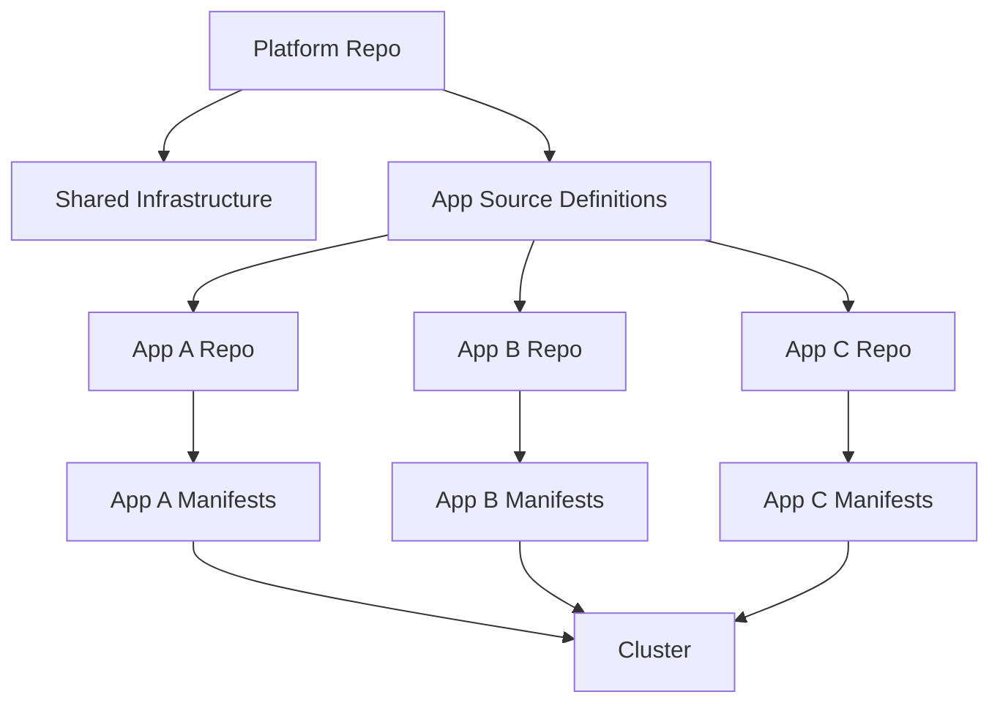

# How to Structure a Repo per Application for Flux CD

Author: [nawazdhandala](https://github.com/nawazdhandala)

Tags: Flux CD, Repository Structure, Application, GitOps, Kubernetes, Microservices, Ci-cd

Description: A practical guide to organizing a separate Git repository per application for Flux CD, ideal for microservices architectures with independent deployment lifecycles.

---

## Introduction

In microservices architectures, each application often has its own development team, release cycle, and deployment requirements. The repo-per-application pattern for Flux CD gives each application its own Git repository containing both the application source code and its Kubernetes deployment manifests. This approach tightly couples application code with its deployment configuration, making it natural for developers to manage both.

This guide covers how to set up and manage a repo-per-application structure with Flux CD, including patterns for consistency, promotion, and platform integration.

## When to Use Repo per Application

This pattern works best when:

- You run a microservices architecture with many independent services
- Application teams own their deployment manifests alongside source code
- Each service has an independent release cycle
- You use CI pipelines that build and update manifests in the same repo
- Developers prefer keeping deployment configs close to their code

## Architecture Overview



## Application Repository Structure

Each application repository contains both the source code and Kubernetes manifests:

```text
my-web-app/
├── src/                          # Application source code
│   ├── main.go
│   └── ...
├── Dockerfile
├── Makefile
├── deploy/                       # Kubernetes deployment manifests
│   ├── base/
│   │   ├── kustomization.yaml
│   │   ├── deployment.yaml
│   │   ├── service.yaml
│   │   ├── ingress.yaml
│   │   ├── hpa.yaml
│   │   └── configmap.yaml
│   ├── production/
│   │   ├── kustomization.yaml
│   │   └── patches/
│   │       ├── replicas.yaml
│   │       └── resources.yaml
│   ├── staging/
│   │   ├── kustomization.yaml
│   │   └── patches/
│   │       └── replicas.yaml
│   └── development/
│       ├── kustomization.yaml
│       └── patches/
│           └── debug-mode.yaml
└── .github/
    └── workflows/
        └── ci.yaml
```

## Base Deployment Manifests

### Kustomization

```yaml
# deploy/base/kustomization.yaml
apiVersion: kustomize.config.k8s.io/v1beta1
kind: Kustomization
resources:
  - deployment.yaml
  - service.yaml
  - ingress.yaml
  - hpa.yaml
  - configmap.yaml
commonLabels:
  app.kubernetes.io/name: my-web-app
  app.kubernetes.io/managed-by: flux
```

### Deployment

```yaml
# deploy/base/deployment.yaml
apiVersion: apps/v1
kind: Deployment
metadata:
  name: my-web-app
spec:
  replicas: 1
  selector:
    matchLabels:
      app.kubernetes.io/name: my-web-app
  template:
    metadata:
      labels:
        app.kubernetes.io/name: my-web-app
    spec:
      containers:
        - name: my-web-app
          # Image tag will be updated by CI pipeline
          image: registry.example.com/my-web-app:latest
          ports:
            - name: http
              containerPort: 8080
          envFrom:
            - configMapRef:
                name: my-web-app-config
          livenessProbe:
            httpGet:
              path: /healthz
              port: http
            initialDelaySeconds: 15
            periodSeconds: 10
          readinessProbe:
            httpGet:
              path: /readyz
              port: http
            initialDelaySeconds: 5
            periodSeconds: 5
          resources:
            requests:
              cpu: 100m
              memory: 128Mi
            limits:
              cpu: 500m
              memory: 256Mi
```

### Service and Ingress

```yaml
# deploy/base/service.yaml
apiVersion: v1
kind: Service
metadata:
  name: my-web-app
spec:
  selector:
    app.kubernetes.io/name: my-web-app
  ports:
    - name: http
      port: 80
      targetPort: http
```

```yaml
# deploy/base/ingress.yaml
apiVersion: networking.k8s.io/v1
kind: Ingress
metadata:
  name: my-web-app
  annotations:
    cert-manager.io/cluster-issuer: letsencrypt-prod
spec:
  ingressClassName: nginx
  tls:
    - hosts:
        - "${APP_HOSTNAME}"
      secretName: my-web-app-tls
  rules:
    - host: "${APP_HOSTNAME}"
      http:
        paths:
          - path: /
            pathType: Prefix
            backend:
              service:
                name: my-web-app
                port:
                  name: http
```

## Environment Overlays

### Production Overlay

```yaml
# deploy/production/kustomization.yaml
apiVersion: kustomize.config.k8s.io/v1beta1
kind: Kustomization
resources:
  - ../base
namespace: production
patches:
  - path: patches/replicas.yaml
  - path: patches/resources.yaml
```

```yaml
# deploy/production/patches/replicas.yaml
apiVersion: apps/v1
kind: Deployment
metadata:
  name: my-web-app
spec:
  replicas: 5
---
apiVersion: autoscaling/v2
kind: HorizontalPodAutoscaler
metadata:
  name: my-web-app
spec:
  minReplicas: 5
  maxReplicas: 20
```

```yaml
# deploy/production/patches/resources.yaml
apiVersion: apps/v1
kind: Deployment
metadata:
  name: my-web-app
spec:
  template:
    spec:
      containers:
        - name: my-web-app
          resources:
            requests:
              cpu: 250m
              memory: 256Mi
            limits:
              cpu: 1000m
              memory: 512Mi
```

### Staging Overlay

```yaml
# deploy/staging/kustomization.yaml
apiVersion: kustomize.config.k8s.io/v1beta1
kind: Kustomization
resources:
  - ../base
namespace: staging
patches:
  - path: patches/replicas.yaml
```

```yaml
# deploy/staging/patches/replicas.yaml
apiVersion: apps/v1
kind: Deployment
metadata:
  name: my-web-app
spec:
  replicas: 2
```

## Platform Repository Integration

The platform team references each application repository from the central platform repo:

```yaml
# platform-repo/apps/sources/my-web-app.yaml
apiVersion: source.toolkit.fluxcd.io/v1
kind: GitRepository
metadata:
  name: my-web-app
  namespace: flux-system
spec:
  interval: 1m
  url: https://github.com/my-org/my-web-app
  ref:
    branch: main
  secretRef:
    name: github-token
```

```yaml
# platform-repo/apps/production/my-web-app.yaml
apiVersion: kustomize.toolkit.fluxcd.io/v1
kind: Kustomization
metadata:
  name: my-web-app
  namespace: flux-system
spec:
  interval: 5m
  sourceRef:
    kind: GitRepository
    name: my-web-app
  path: ./deploy/production
  prune: true
  targetNamespace: production
  postBuild:
    substitute:
      APP_HOSTNAME: my-web-app.example.com
    substituteFrom:
      - kind: ConfigMap
        name: cluster-settings
```

## CI Pipeline Integration

The CI pipeline builds the application and updates the image tag in the deploy manifests:

```yaml
# .github/workflows/ci.yaml
name: CI/CD Pipeline
on:
  push:
    branches: [main]

jobs:
  build-and-deploy:
    runs-on: ubuntu-latest
    steps:
      - name: Checkout
        uses: actions/checkout@v4

      - name: Build and push Docker image
        env:
          REGISTRY: registry.example.com
          IMAGE_NAME: my-web-app
        run: |
          # Generate a unique tag from the commit SHA
          TAG="${GITHUB_SHA::8}"

          # Build the container image
          docker build -t ${REGISTRY}/${IMAGE_NAME}:${TAG} .

          # Push to registry
          docker push ${REGISTRY}/${IMAGE_NAME}:${TAG}

      - name: Update deployment manifest
        run: |
          TAG="${GITHUB_SHA::8}"

          # Update the image tag in the base deployment
          cd deploy/base
          kustomize edit set image \
            registry.example.com/my-web-app=registry.example.com/my-web-app:${TAG}

      - name: Commit and push manifest changes
        run: |
          git config user.name "CI Bot"
          git config user.email "ci-bot@example.com"
          git add deploy/
          git commit -m "Update image to ${GITHUB_SHA::8}"
          git push
```

## Using Flux Image Automation Instead

For a more GitOps-native approach, use Flux image automation to update tags:

```yaml
# platform-repo/apps/image-automation/my-web-app.yaml
apiVersion: image.toolkit.fluxcd.io/v1
kind: ImageRepository
metadata:
  name: my-web-app
  namespace: flux-system
spec:
  image: registry.example.com/my-web-app
  interval: 5m
---
apiVersion: image.toolkit.fluxcd.io/v1
kind: ImagePolicy
metadata:
  name: my-web-app
  namespace: flux-system
spec:
  imageRepositoryRef:
    name: my-web-app
  policy:
    semver:
      range: ">=1.0.0"
---
apiVersion: image.toolkit.fluxcd.io/v1
kind: ImageUpdateAutomation
metadata:
  name: my-web-app
  namespace: flux-system
spec:
  interval: 5m
  sourceRef:
    kind: GitRepository
    name: my-web-app
  git:
    checkout:
      ref:
        branch: main
    commit:
      author:
        name: flux-bot
        email: flux@example.com
      messageTemplate: "Update image to {{.NewTag}}"
    push:
      branch: main
  update:
    path: ./deploy
    strategy: Setters
```

Then add image policy markers in the deployment:

```yaml
# deploy/base/deployment.yaml (with image policy marker)
containers:
  - name: my-web-app
    image: registry.example.com/my-web-app:1.0.0 # {"$imagepolicy": "flux-system:my-web-app"}
```

## Scaling to Many Applications

When you have dozens of applications, automate the platform-side registration:

```bash
#!/bin/bash
# register-app.sh - Register a new application with the platform
# Usage: ./register-app.sh <app-name> <repo-url> <hostname>

set -euo pipefail

APP_NAME=$1
REPO_URL=$2
HOSTNAME=$3

PLATFORM_DIR="/path/to/platform-repo"

# Create the GitRepository source
cat > "${PLATFORM_DIR}/apps/sources/${APP_NAME}.yaml" << EOF
apiVersion: source.toolkit.fluxcd.io/v1
kind: GitRepository
metadata:
  name: ${APP_NAME}
  namespace: flux-system
spec:
  interval: 1m
  url: ${REPO_URL}
  ref:
    branch: main
  secretRef:
    name: github-token
EOF

# Create production Kustomization
cat > "${PLATFORM_DIR}/apps/production/${APP_NAME}.yaml" << EOF
apiVersion: kustomize.toolkit.fluxcd.io/v1
kind: Kustomization
metadata:
  name: ${APP_NAME}
  namespace: flux-system
spec:
  interval: 5m
  sourceRef:
    kind: GitRepository
    name: ${APP_NAME}
  path: ./deploy/production
  prune: true
  targetNamespace: production
  postBuild:
    substitute:
      APP_HOSTNAME: ${HOSTNAME}
EOF

echo "Application ${APP_NAME} registered."
echo "Add the new files to the kustomization.yaml and commit."
```

## Application Repository Template

Provide a template repository that teams can use to create new applications with the correct structure:

```bash
# Create a template repository structure
mkdir -p app-template/{src,deploy/{base,production/patches,staging/patches,development/patches},.github/workflows}

# Include a Makefile for common operations
cat > app-template/Makefile << 'EOF'
.PHONY: build test deploy-check

# Build the container image
build:
	docker build -t $(IMAGE):$(TAG) .

# Run tests
test:
	go test ./...

# Validate all kustomize overlays
deploy-check:
	@for env in production staging development; do \
		echo "Validating $$env overlay..."; \
		kustomize build deploy/$$env > /dev/null || exit 1; \
		echo "OK"; \
	done
EOF
```

## Best Practices

1. **Keep deploy manifests in the same repo as code** - This ensures deployment changes are reviewed with code changes.
2. **Use a consistent directory structure** - All application repos should follow the same `deploy/` layout.
3. **Provide a template repository** - Give teams a starting point with all the necessary boilerplate.
4. **Validate manifests in CI** - Run `kustomize build` for all overlays in the CI pipeline.
5. **Use image automation over CI-based updates** - Flux image automation is more GitOps-native than CI pushing manifest changes.
6. **Pin dependencies** - Use specific versions for base images and Helm chart references.
7. **Separate concerns** - Application repos manage app-level resources; platform repo manages infrastructure.

## Conclusion

The repo-per-application pattern for Flux CD aligns well with microservices architectures where each service has its own lifecycle. By keeping deployment manifests alongside application code, developers have full visibility and control over how their services are deployed. The platform team maintains governance through the central platform repository, which references each application's deployment manifests and applies cluster-wide policies. Success depends on providing consistent templates, automated registration, and clear guidelines for how deployment manifests should be structured.
