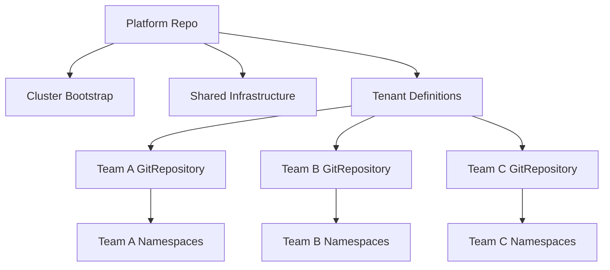

# How to Structure a Repo per Team for Flux CD

Author: [nawazdhandala](https://github.com/nawazdhandala)

Tags: flux cd, repository structure, teams, gitops, kubernetes, multi-tenant, rbac

Description: A practical guide to organizing Git repositories per team for Flux CD, enabling team autonomy while maintaining platform-level governance.

---

## Introduction

In larger organizations, different teams own different services and need autonomy over their deployments. The repo-per-team pattern gives each team its own Git repository for their Flux CD configurations, while a central platform team manages shared infrastructure and cluster-level resources. This pattern balances team independence with platform governance.

This guide walks through setting up and managing a repo-per-team structure with Flux CD, including RBAC, namespace isolation, and cross-team coordination.

## When to Use Repo per Team

This pattern is ideal when:

- Multiple teams deploy to shared Kubernetes clusters
- Teams need independent deployment workflows and review processes
- You want to enforce namespace-level isolation between teams
- Teams have different skill levels and should only manage their own resources
- You need clear ownership boundaries for auditing and incident response

## Architecture Overview



## Repository Structure

### Platform Repository (managed by platform team)

```
fleet-platform/
├── clusters/
│   ├── production/
│   │   ├── flux-system/
│   │   ├── infrastructure.yaml
│   │   └── tenants.yaml
│   └── staging/
│       ├── flux-system/
│       ├── infrastructure.yaml
│       └── tenants.yaml
├── infrastructure/
│   ├── base/
│   │   ├── sources/
│   │   ├── cert-manager/
│   │   ├── ingress-nginx/
│   │   └── monitoring/
│   ├── production/
│   └── staging/
└── tenants/
    ├── base/
    │   ├── team-frontend/
    │   ├── team-backend/
    │   └── team-data/
    ├── production/
    └── staging/
```

### Team Repository (managed by each team)

```
team-frontend/
├── apps/
│   ├── base/
│   │   ├── web-app/
│   │   │   ├── kustomization.yaml
│   │   │   ├── deployment.yaml
│   │   │   ├── service.yaml
│   │   │   └── ingress.yaml
│   │   └── admin-panel/
│   │       ├── kustomization.yaml
│   │       ├── deployment.yaml
│   │       └── service.yaml
│   ├── production/
│   │   ├── kustomization.yaml
│   │   └── patches/
│   └── staging/
│       ├── kustomization.yaml
│       └── patches/
└── config/
    ├── production/
    │   └── configmap.yaml
    └── staging/
        └── configmap.yaml
```

## Setting Up Tenant Definitions

The platform team defines each team's access and permissions in the platform repo.

### Namespace and RBAC

```yaml
# tenants/base/team-frontend/namespace.yaml
apiVersion: v1
kind: Namespace
metadata:
  name: team-frontend
  labels:
    toolkit.fluxcd.io/tenant: team-frontend
---
apiVersion: v1
kind: Namespace
metadata:
  name: team-frontend-staging
  labels:
    toolkit.fluxcd.io/tenant: team-frontend
```

```yaml
# tenants/base/team-frontend/rbac.yaml
# Service account for the team's Kustomization
apiVersion: v1
kind: ServiceAccount
metadata:
  name: team-frontend
  namespace: team-frontend
---
# Role granting permissions within the team namespace
apiVersion: rbac.authorization.k8s.io/v1
kind: Role
metadata:
  name: team-frontend-reconciler
  namespace: team-frontend
rules:
  - apiGroups: [""]
    resources: ["configmaps", "secrets", "services", "serviceaccounts"]
    verbs: ["*"]
  - apiGroups: ["apps"]
    resources: ["deployments", "statefulsets"]
    verbs: ["*"]
  - apiGroups: ["networking.k8s.io"]
    resources: ["ingresses"]
    verbs: ["*"]
  - apiGroups: ["autoscaling"]
    resources: ["horizontalpodautoscalers"]
    verbs: ["*"]
  # Explicitly deny cluster-scoped resources
  # Teams cannot create namespaces, clusterroles, etc.
---
apiVersion: rbac.authorization.k8s.io/v1
kind: RoleBinding
metadata:
  name: team-frontend-reconciler
  namespace: team-frontend
subjects:
  - kind: ServiceAccount
    name: team-frontend
    namespace: team-frontend
roleRef:
  kind: Role
  name: team-frontend-reconciler
  apiGroup: rbac.authorization.k8s.io
```

### GitRepository and Kustomization for the Team

```yaml
# tenants/base/team-frontend/sync.yaml
# Source pointing to the team's repository
apiVersion: source.toolkit.fluxcd.io/v1
kind: GitRepository
metadata:
  name: team-frontend
  namespace: team-frontend
spec:
  interval: 5m
  url: https://github.com/my-org/team-frontend
  ref:
    branch: main
  secretRef:
    name: team-frontend-git-auth
---
# Kustomization scoped to the team's namespace
apiVersion: kustomize.toolkit.fluxcd.io/v1
kind: Kustomization
metadata:
  name: team-frontend-apps
  namespace: team-frontend
spec:
  interval: 10m
  sourceRef:
    kind: GitRepository
    name: team-frontend
  path: ./apps/production
  prune: true
  # Use the team's service account for RBAC enforcement
  serviceAccountName: team-frontend
  # Only allow resources in the team's namespace
  targetNamespace: team-frontend
```

```yaml
# tenants/base/team-frontend/kustomization.yaml
apiVersion: kustomize.config.k8s.io/v1beta1
kind: Kustomization
resources:
  - namespace.yaml
  - rbac.yaml
  - sync.yaml
```

## Resource Quotas and Limits

The platform team can enforce resource boundaries per team:

```yaml
# tenants/base/team-frontend/resource-quota.yaml
apiVersion: v1
kind: ResourceQuota
metadata:
  name: team-frontend-quota
  namespace: team-frontend
spec:
  hard:
    # Limit the total resources the team can consume
    requests.cpu: "4"
    requests.memory: 8Gi
    limits.cpu: "8"
    limits.memory: 16Gi
    # Limit the number of objects
    pods: "50"
    services: "20"
    secrets: "30"
    configmaps: "30"
---
apiVersion: v1
kind: LimitRange
metadata:
  name: team-frontend-limits
  namespace: team-frontend
spec:
  limits:
    - default:
        cpu: 500m
        memory: 256Mi
      defaultRequest:
        cpu: 100m
        memory: 128Mi
      type: Container
```

## Network Policies

Isolate team namespaces with network policies:

```yaml
# tenants/base/team-frontend/network-policy.yaml
apiVersion: networking.k8s.io/v1
kind: NetworkPolicy
metadata:
  name: team-frontend-isolation
  namespace: team-frontend
spec:
  podSelector: {}
  policyTypes:
    - Ingress
    - Egress
  ingress:
    # Allow traffic within the namespace
    - from:
        - namespaceSelector:
            matchLabels:
              toolkit.fluxcd.io/tenant: team-frontend
    # Allow ingress controller traffic
    - from:
        - namespaceSelector:
            matchLabels:
              name: ingress-system
  egress:
    # Allow DNS
    - to:
        - namespaceSelector: {}
      ports:
        - protocol: UDP
          port: 53
    # Allow traffic within the namespace
    - to:
        - namespaceSelector:
            matchLabels:
              toolkit.fluxcd.io/tenant: team-frontend
    # Allow external traffic
    - to:
        - ipBlock:
            cidr: 0.0.0.0/0
            except:
              - 10.0.0.0/8
              - 172.16.0.0/12
              - 192.168.0.0/16
```

## Team Repository Configuration

### Base Application Definitions

```yaml
# team-frontend/apps/base/web-app/deployment.yaml
apiVersion: apps/v1
kind: Deployment
metadata:
  name: web-app
spec:
  replicas: 2
  selector:
    matchLabels:
      app: web-app
  template:
    metadata:
      labels:
        app: web-app
    spec:
      containers:
        - name: web-app
          image: registry.example.com/team-frontend/web-app:1.0.0
          ports:
            - containerPort: 3000
          resources:
            requests:
              cpu: 100m
              memory: 128Mi
            limits:
              cpu: 500m
              memory: 256Mi
          env:
            - name: NODE_ENV
              value: production
          livenessProbe:
            httpGet:
              path: /health
              port: 3000
            initialDelaySeconds: 10
          readinessProbe:
            httpGet:
              path: /ready
              port: 3000
            initialDelaySeconds: 5
```

### Environment-Specific Patches

```yaml
# team-frontend/apps/production/kustomization.yaml
apiVersion: kustomize.config.k8s.io/v1beta1
kind: Kustomization
resources:
  - ../base/web-app
  - ../base/admin-panel
patches:
  - path: patches/web-app-production.yaml
    target:
      kind: Deployment
      name: web-app
```

```yaml
# team-frontend/apps/production/patches/web-app-production.yaml
apiVersion: apps/v1
kind: Deployment
metadata:
  name: web-app
spec:
  replicas: 5
  template:
    spec:
      containers:
        - name: web-app
          resources:
            requests:
              cpu: 200m
              memory: 256Mi
            limits:
              cpu: 1000m
              memory: 512Mi
```

## Cross-Team Communication

When teams need to reference each other's services, use ExternalName services or platform-managed shared resources:

```yaml
# team-frontend/apps/base/web-app/external-api.yaml
# Reference to backend team's API service
apiVersion: v1
kind: Service
metadata:
  name: backend-api
spec:
  type: ExternalName
  externalName: api-gateway.team-backend.svc.cluster.local
```

## Onboarding a New Team

Create a script to automate team onboarding:

```bash
#!/bin/bash
# onboard-team.sh - Onboard a new team to the platform
# Usage: ./onboard-team.sh <team-name>

set -euo pipefail

TEAM_NAME=$1
PLATFORM_REPO="/path/to/fleet-platform"
TENANT_DIR="${PLATFORM_REPO}/tenants/base/${TEAM_NAME}"

echo "Onboarding team: ${TEAM_NAME}"

# Create tenant directory structure
mkdir -p "${TENANT_DIR}"

# Generate namespace manifest
cat > "${TENANT_DIR}/namespace.yaml" << EOF
apiVersion: v1
kind: Namespace
metadata:
  name: ${TEAM_NAME}
  labels:
    toolkit.fluxcd.io/tenant: ${TEAM_NAME}
EOF

# Generate RBAC
cat > "${TENANT_DIR}/rbac.yaml" << EOF
apiVersion: v1
kind: ServiceAccount
metadata:
  name: ${TEAM_NAME}
  namespace: ${TEAM_NAME}
---
apiVersion: rbac.authorization.k8s.io/v1
kind: Role
metadata:
  name: ${TEAM_NAME}-reconciler
  namespace: ${TEAM_NAME}
rules:
  - apiGroups: ["", "apps", "networking.k8s.io", "autoscaling"]
    resources: ["*"]
    verbs: ["*"]
---
apiVersion: rbac.authorization.k8s.io/v1
kind: RoleBinding
metadata:
  name: ${TEAM_NAME}-reconciler
  namespace: ${TEAM_NAME}
subjects:
  - kind: ServiceAccount
    name: ${TEAM_NAME}
    namespace: ${TEAM_NAME}
roleRef:
  kind: Role
  name: ${TEAM_NAME}-reconciler
  apiGroup: rbac.authorization.k8s.io
EOF

# Generate kustomization
cat > "${TENANT_DIR}/kustomization.yaml" << EOF
apiVersion: kustomize.config.k8s.io/v1beta1
kind: Kustomization
resources:
  - namespace.yaml
  - rbac.yaml
EOF

echo "Tenant definitions created at ${TENANT_DIR}"
echo "Next steps:"
echo "  1. Create the team repository: ${TEAM_NAME}"
echo "  2. Add sync.yaml to ${TENANT_DIR}/"
echo "  3. Add ${TEAM_NAME} to tenants/production/kustomization.yaml"
echo "  4. Commit and push changes to fleet-platform"
```

## Best Practices

1. **Platform team owns cluster-scoped resources** - Only the platform team should manage namespaces, CRDs, and cluster roles.
2. **Use service accounts for RBAC** - Scope each team's Kustomization to a service account with limited permissions.
3. **Enforce resource quotas** - Prevent any single team from consuming excessive cluster resources.
4. **Apply network policies** - Isolate team namespaces by default and explicitly allow cross-team communication.
5. **Standardize team repo structure** - Provide a template repository so all team repos follow the same conventions.
6. **Automate onboarding** - Use scripts to create consistent tenant definitions when adding new teams.
7. **Use CODEOWNERS in team repos** - Let teams manage their own review policies.

## Conclusion

The repo-per-team pattern enables team autonomy while maintaining platform-level governance in Flux CD. By combining namespace isolation, RBAC, resource quotas, and network policies, the platform team can provide a secure multi-tenant environment where each team independently manages their deployments. The key to success is clear documentation, automated onboarding, and consistent conventions across all team repositories.
