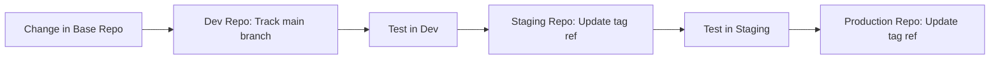

# How to Structure Separate Repos per Environment for Flux CD

Author: [nawazdhandala](https://github.com/nawazdhandala)

Tags: flux cd, repository structure, environments, gitops, kubernetes, multi-environment, best practices

Description: A practical guide to organizing separate Git repositories per environment for Flux CD, with strategies for promotion, consistency, and access control.

---

## Introduction

Using separate Git repositories per environment is a popular Flux CD pattern that provides strict isolation between environments like development, staging, and production. Each environment gets its own repository with its own access controls, review policies, and deployment cadence. This approach is especially valuable in regulated industries or organizations with strict change management requirements.

This guide covers how to set up, organize, and manage separate repositories per environment with Flux CD.

## When to Use Separate Repos per Environment

This pattern works well when:

- Different teams manage different environments
- You need strict access control boundaries between environments
- Regulatory requirements demand separate audit trails per environment
- You want independent deployment cadence for each environment
- Production changes require different approval workflows than development

## Repository Layout

You will create the following repositories:

```
fleet-infra-dev        # Development environment configurations
fleet-infra-staging    # Staging environment configurations
fleet-infra-production # Production environment configurations
fleet-infra-base       # Shared base configurations (optional)
```

### The Base Repository

The base repository contains shared templates and configurations:

```
fleet-infra-base/
├── infrastructure/
│   ├── cert-manager/
│   │   ├── kustomization.yaml
│   │   ├── namespace.yaml
│   │   └── helmrelease.yaml
│   ├── ingress-nginx/
│   │   ├── kustomization.yaml
│   │   ├── namespace.yaml
│   │   └── helmrelease.yaml
│   └── monitoring/
│       ├── kustomization.yaml
│       ├── namespace.yaml
│       └── helmrelease.yaml
├── apps/
│   ├── my-app/
│   │   ├── kustomization.yaml
│   │   ├── deployment.yaml
│   │   ├── service.yaml
│   │   └── ingress.yaml
│   └── api-service/
│       ├── kustomization.yaml
│       ├── deployment.yaml
│       └── service.yaml
└── sources/
    ├── helm-repositories.yaml
    └── oci-repositories.yaml
```

### Environment Repository Structure

Each environment repo follows a consistent structure:

```
fleet-infra-production/
├── clusters/
│   ├── prod-us-east-1/
│   │   ├── flux-system/
│   │   │   ├── gotk-components.yaml
│   │   │   ├── gotk-sync.yaml
│   │   │   └── kustomization.yaml
│   │   ├── infrastructure.yaml
│   │   └── apps.yaml
│   └── prod-eu-west-1/
│       ├── flux-system/
│       ├── infrastructure.yaml
│       └── apps.yaml
├── infrastructure/
│   ├── kustomization.yaml
│   ├── patches/
│   │   ├── cert-manager-values.yaml
│   │   └── ingress-values.yaml
│   └── secrets/
│       └── cluster-secrets.enc.yaml
├── apps/
│   ├── kustomization.yaml
│   └── patches/
│       ├── my-app-replicas.yaml
│       └── my-app-resources.yaml
└── config/
    └── cluster-settings.yaml
```

## Bootstrapping Each Environment

Bootstrap Flux for each environment pointing to its respective repository:

```bash
# Bootstrap development environment
flux bootstrap github \
  --owner=my-org \
  --repository=fleet-infra-dev \
  --branch=main \
  --path=clusters/dev-cluster \
  --personal=false

# Bootstrap staging environment
flux bootstrap github \
  --owner=my-org \
  --repository=fleet-infra-staging \
  --branch=main \
  --path=clusters/staging-cluster \
  --personal=false

# Bootstrap production environment
flux bootstrap github \
  --owner=my-org \
  --repository=fleet-infra-production \
  --branch=main \
  --path=clusters/prod-us-east-1 \
  --personal=false
```

## Referencing the Base Repository

Each environment repo references the base repository as a GitRepository source:

```yaml
# In fleet-infra-production: clusters/prod-us-east-1/base-source.yaml
apiVersion: source.toolkit.fluxcd.io/v1
kind: GitRepository
metadata:
  name: fleet-infra-base
  namespace: flux-system
spec:
  interval: 5m
  url: https://github.com/my-org/fleet-infra-base
  ref:
    # Pin to a specific tag for production stability
    tag: v1.5.0
  secretRef:
    name: github-token
```

```yaml
# In fleet-infra-production: clusters/prod-us-east-1/infrastructure.yaml
apiVersion: kustomize.toolkit.fluxcd.io/v1
kind: Kustomization
metadata:
  name: infrastructure-base
  namespace: flux-system
spec:
  interval: 10m
  sourceRef:
    kind: GitRepository
    name: fleet-infra-base
  path: ./infrastructure
  prune: true
  wait: true
```

```yaml
# In fleet-infra-production: clusters/prod-us-east-1/infrastructure-patches.yaml
apiVersion: kustomize.toolkit.fluxcd.io/v1
kind: Kustomization
metadata:
  name: infrastructure-patches
  namespace: flux-system
spec:
  interval: 10m
  sourceRef:
    kind: GitRepository
    name: flux-system
  path: ./infrastructure
  prune: true
  dependsOn:
    - name: infrastructure-base
```

## Environment-Specific Configurations

### Development Environment

```yaml
# fleet-infra-dev/infrastructure/kustomization.yaml
apiVersion: kustomize.config.k8s.io/v1beta1
kind: Kustomization
patches:
  # Use minimal resources in development
  - patch: |
      apiVersion: helm.toolkit.fluxcd.io/v1
      kind: HelmRelease
      metadata:
        name: ingress-nginx
      spec:
        values:
          controller:
            replicaCount: 1
            resources:
              requests:
                cpu: 50m
                memory: 64Mi
    target:
      kind: HelmRelease
      name: ingress-nginx
```

### Production Environment

```yaml
# fleet-infra-production/infrastructure/kustomization.yaml
apiVersion: kustomize.config.k8s.io/v1beta1
kind: Kustomization
patches:
  # High availability settings for production
  - patch: |
      apiVersion: helm.toolkit.fluxcd.io/v1
      kind: HelmRelease
      metadata:
        name: ingress-nginx
      spec:
        values:
          controller:
            replicaCount: 3
            resources:
              requests:
                cpu: 200m
                memory: 256Mi
              limits:
                cpu: 1000m
                memory: 512Mi
            autoscaling:
              enabled: true
              minReplicas: 3
              maxReplicas: 10
    target:
      kind: HelmRelease
      name: ingress-nginx
```

## Promotion Workflow

Promoting changes between environments is a key workflow with separate repos. Here is a practical approach:



### Automated Promotion Script

```bash
#!/bin/bash
# promote.sh - Promote base repo version between environments
# Usage: ./promote.sh <source-env> <target-env> <version>

set -euo pipefail

SOURCE_ENV=$1    # e.g., staging
TARGET_ENV=$2    # e.g., production
VERSION=$3       # e.g., v1.5.0

TARGET_REPO="fleet-infra-${TARGET_ENV}"

echo "Promoting version $VERSION from $SOURCE_ENV to $TARGET_ENV"

# Clone the target environment repo
git clone "git@github.com:my-org/${TARGET_REPO}.git" "/tmp/${TARGET_REPO}"
cd "/tmp/${TARGET_REPO}"

# Create a promotion branch
git checkout -b "promote-${VERSION}"

# Update the base repo reference to the new version
# Find and update all GitRepository resources pointing to fleet-infra-base
find . -name "*.yaml" -exec grep -l "fleet-infra-base" {} \; | while read -r file; do
  # Update the tag reference
  sed -i '' "s/tag: v[0-9]\+\.[0-9]\+\.[0-9]\+/tag: ${VERSION}/" "$file"
done

# Commit and push
git add -A
git commit -m "Promote base configuration to ${VERSION}"
git push origin "promote-${VERSION}"

# Create a pull request
gh pr create \
  --repo "my-org/${TARGET_REPO}" \
  --title "Promote ${VERSION} to ${TARGET_ENV}" \
  --body "Promoting base configuration version ${VERSION} from ${SOURCE_ENV} to ${TARGET_ENV}."

echo "Pull request created for promotion"
```

## Access Control Strategy

Set up different access controls for each repository:

```yaml
# Example GitHub CODEOWNERS for production repo
# fleet-infra-production/.github/CODEOWNERS

# All changes require SRE team review
* @my-org/sre-team

# Infrastructure changes require platform team review
/infrastructure/ @my-org/platform-team @my-org/sre-team

# Secret changes require security team review
**/secrets/ @my-org/security-team @my-org/sre-team
```

### Branch Protection Rules

| Setting | Development | Staging | Production |
|---------|------------|---------|------------|
| Required reviews | 0 | 1 | 2 |
| Required status checks | Lint | Lint + Test | Lint + Test + Security |
| Restrict push access | No | Team leads | SRE only |
| Require signed commits | No | No | Yes |

## Keeping Environments in Sync

Use CI to detect drift between environments:

```bash
#!/bin/bash
# check-drift.sh - Compare environment configurations
# Detects differences between staging and production

set -euo pipefail

# Clone both repos
git clone git@github.com:my-org/fleet-infra-staging.git /tmp/staging
git clone git@github.com:my-org/fleet-infra-production.git /tmp/production

# Compare the base repo version references
STAGING_VERSION=$(grep -r "tag:" /tmp/staging/clusters/ | grep fleet-infra-base | head -1 | awk '{print $NF}')
PROD_VERSION=$(grep -r "tag:" /tmp/production/clusters/ | grep fleet-infra-base | head -1 | awk '{print $NF}')

echo "Staging base version: $STAGING_VERSION"
echo "Production base version: $PROD_VERSION"

if [ "$STAGING_VERSION" != "$PROD_VERSION" ]; then
  echo "WARNING: Environments are running different base versions"
  echo "Consider promoting $STAGING_VERSION to production"
fi

# Compare patch structures
echo "Comparing patch files..."
diff <(find /tmp/staging/infrastructure/patches -name "*.yaml" | sort | xargs -I{} basename {}) \
     <(find /tmp/production/infrastructure/patches -name "*.yaml" | sort | xargs -I{} basename {}) || true

# Cleanup
rm -rf /tmp/staging /tmp/production
```

## Best Practices

1. **Pin base repo versions in production** - Use Git tags rather than branch references for production stability.
2. **Use a consistent structure** - Keep all environment repos following the same directory layout.
3. **Automate promotions** - Use scripts or CI pipelines to promote changes between environments.
4. **Document the promotion process** - Ensure the team knows how to promote changes safely.
5. **Monitor for drift** - Regularly compare environment configurations to detect unintended differences.
6. **Use semantic versioning for the base repo** - Tag releases with semver to communicate the scope of changes.
7. **Keep environment-specific configs minimal** - The more you can share through the base repo, the less drift you will have.

## Conclusion

Separating Flux CD repositories per environment provides strong isolation, independent access control, and clear audit trails. While it introduces more management overhead than a monorepo, the benefits in security, compliance, and operational independence make it the right choice for many organizations, especially those with strict regulatory requirements. The key to success is maintaining consistency across repos through a shared base repository and automated promotion workflows.
