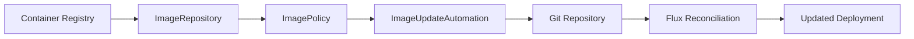

# How to Test Flux CD Image Automation Locally

Author: [nawazdhandala](https://github.com/nawazdhandala)

Tags: Flux CD, GitOps, Image Automation, Local Testing, Container Registry, CI/CD, DevOps

Description: A practical guide to testing Flux CD image automation workflows locally, including setting up a local registry, image policies, and verifying automatic Git updates.

---

## Introduction

Flux CD's image automation continuously scans container registries for new image tags and automatically updates your Git repository with the latest versions. Testing this workflow locally before deploying to production ensures your image policies, tag filters, and Git update patterns work correctly. This guide covers how to set up and test the complete image automation pipeline on your local machine.

## Understanding the Image Automation Pipeline

The image automation pipeline consists of three components:

- **ImageRepository** - Scans a container registry for available tags
- **ImagePolicy** - Selects the latest tag based on a policy (semver, alphabetical, numerical)
- **ImageUpdateAutomation** - Commits the selected tag back to the Git repository



## Step 1: Set Up a Local Container Registry

### Deploy a Registry in Kind

```yaml
# local-registry.yaml
# Deploy a local container registry accessible from Kind
apiVersion: v1
kind: Pod
metadata:
  name: local-registry
  namespace: registry
  labels:
    app: registry
spec:
  containers:
    - name: registry
      image: registry:2
      ports:
        - containerPort: 5000
      env:
        # Allow deletion of images for cleanup
        - name: REGISTRY_STORAGE_DELETE_ENABLED
          value: "true"
      volumeMounts:
        - name: registry-data
          mountPath: /var/lib/registry
  volumes:
    - name: registry-data
      emptyDir:
        sizeLimit: 2Gi
---
apiVersion: v1
kind: Service
metadata:
  name: local-registry
  namespace: registry
spec:
  selector:
    app: registry
  ports:
    - port: 5000
      targetPort: 5000
---
apiVersion: v1
kind: Namespace
metadata:
  name: registry
```

### Kind Configuration with Registry Access

```yaml
# kind-with-registry.yaml
kind: Cluster
apiVersion: kind.x-k8s.io/v1alpha4
name: flux-image-test
containerdConfigPatches:
  - |-
    [plugins."io.containerd.grpc.v1.cri".registry.mirrors."localhost:5001"]
      endpoint = ["http://kind-registry:5000"]
nodes:
  - role: control-plane
    extraPortMappings:
      - containerPort: 80
        hostPort: 8080
```

### Setup Script with Registry

```bash
#!/bin/bash
# setup-local-registry.sh
# Create a Kind cluster with a local registry

set -euo pipefail

CLUSTER_NAME="flux-image-test"
REG_NAME="kind-registry"
REG_PORT="5001"

# Start a local registry container
echo "Starting local registry..."
if ! docker inspect "$REG_NAME" > /dev/null 2>&1; then
  docker run -d --restart=always \
    -p "127.0.0.1:${REG_PORT}:5000" \
    --network bridge \
    --name "$REG_NAME" \
    registry:2
fi

# Create Kind cluster
echo "Creating Kind cluster..."
kind create cluster --name "$CLUSTER_NAME" --config kind-with-registry.yaml

# Connect the registry to the Kind network
if [ "$(docker inspect -f='{{json .NetworkSettings.Networks.kind}}' "$REG_NAME")" = 'null' ]; then
  docker network connect "kind" "$REG_NAME"
fi

# Document the local registry for Kind nodes
kubectl apply -f - <<EOF
apiVersion: v1
kind: ConfigMap
metadata:
  name: local-registry-hosting
  namespace: kube-public
data:
  localRegistryHosting.v1: |
    host: "localhost:${REG_PORT}"
    help: "https://kind.sigs.k8s.io/docs/user/local-registry/"
EOF

echo "Local registry available at localhost:${REG_PORT}"
echo "Push images with: docker tag myimage localhost:${REG_PORT}/myimage && docker push localhost:${REG_PORT}/myimage"
```

## Step 2: Push Test Images to the Local Registry

### Build and Push Test Images with Different Tags

```bash
#!/bin/bash
# push-test-images.sh
# Create and push test images with various tag patterns

REGISTRY="localhost:5001"
IMAGE_NAME="test-app"

# Create a simple Dockerfile
cat > /tmp/Dockerfile <<'EOF'
FROM alpine:3.19
RUN echo "Test application" > /app.txt
CMD ["cat", "/app.txt"]
EOF

# Build and push images with semver tags
for version in "1.0.0" "1.0.1" "1.1.0" "1.2.0" "2.0.0" "2.0.1" "2.1.0"; do
  echo "Building and pushing $REGISTRY/$IMAGE_NAME:$version"
  docker build -t "$REGISTRY/$IMAGE_NAME:$version" /tmp/
  docker push "$REGISTRY/$IMAGE_NAME:$version"
done

# Push images with date-based tags
for date in "20260301" "20260302" "20260303" "20260304" "20260305" "20260306"; do
  docker tag "$REGISTRY/$IMAGE_NAME:1.0.0" "$REGISTRY/$IMAGE_NAME:$date"
  docker push "$REGISTRY/$IMAGE_NAME:$date"
done

# Push images with SHA-based tags
for i in 1 2 3; do
  sha=$(echo "commit-$i" | sha256sum | head -c 7)
  docker tag "$REGISTRY/$IMAGE_NAME:1.0.0" "$REGISTRY/$IMAGE_NAME:sha-$sha"
  docker push "$REGISTRY/$IMAGE_NAME:sha-$sha"
done

echo "All test images pushed to $REGISTRY/$IMAGE_NAME"

# Verify images are available
echo ""
echo "Available tags:"
curl -s "http://$REGISTRY/v2/$IMAGE_NAME/tags/list" | python3 -m json.tool
```

## Step 3: Install Flux Image Automation Controllers

```bash
# Install Flux with image automation components
flux install \
  --components-extra=image-reflector-controller,image-automation-controller

# Verify all controllers are running
kubectl get deployments -n flux-system

# Expected output should include:
# image-automation-controller
# image-reflector-controller
# (plus the standard controllers)
```

## Step 4: Configure Image Scanning

### Create ImageRepository

```yaml
# image-repository.yaml
apiVersion: image.toolkit.fluxcd.io/v1
kind: ImageRepository
metadata:
  name: test-app
  namespace: flux-system
spec:
  # Point to the local registry
  # Use the Kind-internal registry address
  image: kind-registry:5000/test-app
  # Scan frequently for testing
  interval: 1m
  # No authentication needed for local registry
  # For insecure registries, you may need to configure TLS
  insecure: true
```

### Create ImagePolicy with Semver

```yaml
# image-policy-semver.yaml
apiVersion: image.toolkit.fluxcd.io/v1
kind: ImagePolicy
metadata:
  name: test-app-semver
  namespace: flux-system
spec:
  imageRepositoryRef:
    name: test-app
  policy:
    semver:
      # Select the latest 1.x.x version
      range: ">=1.0.0 <2.0.0"
```

### Create ImagePolicy with Numerical Ordering

```yaml
# image-policy-numerical.yaml
apiVersion: image.toolkit.fluxcd.io/v1
kind: ImagePolicy
metadata:
  name: test-app-date
  namespace: flux-system
spec:
  imageRepositoryRef:
    name: test-app
  filterTags:
    # Only consider date-based tags (YYYYMMDD format)
    pattern: "^(?P<date>[0-9]{8})$"
    extract: "$date"
  policy:
    numerical:
      # Select the highest date number
      order: asc
```

### Create ImagePolicy with Alphabetical Ordering

```yaml
# image-policy-alpha.yaml
apiVersion: image.toolkit.fluxcd.io/v1
kind: ImagePolicy
metadata:
  name: test-app-alpha
  namespace: flux-system
spec:
  imageRepositoryRef:
    name: test-app
  filterTags:
    # Only consider sha-prefixed tags
    pattern: "^sha-(?P<hash>[a-f0-9]+)$"
    extract: "$hash"
  policy:
    alphabetical:
      order: asc
```

## Step 5: Configure Image Update Automation

### Set Up a Git Source for Updates

```yaml
# git-source-for-updates.yaml
apiVersion: source.toolkit.fluxcd.io/v1
kind: GitRepository
metadata:
  name: fleet-repo
  namespace: flux-system
spec:
  interval: 1m
  url: http://gitea.gitea.svc.cluster.local:3000/test-user/fleet-repo.git
  ref:
    branch: main
  secretRef:
    name: git-credentials
---
apiVersion: v1
kind: Secret
metadata:
  name: git-credentials
  namespace: flux-system
type: Opaque
stringData:
  username: test-user
  password: test-password
```

### Create ImageUpdateAutomation

```yaml
# image-update-automation.yaml
apiVersion: image.toolkit.fluxcd.io/v1
kind: ImageUpdateAutomation
metadata:
  name: test-app-update
  namespace: flux-system
spec:
  interval: 1m
  sourceRef:
    kind: GitRepository
    name: fleet-repo
  git:
    checkout:
      ref:
        branch: main
    commit:
      # Author for automated commits
      author:
        name: flux-image-automation
        email: flux@example.com
      # Commit message template
      messageTemplate: |
        Automated image update

        Automation name: {{ .AutomationObject }}

        Files:
        {{ range $filename, $_ := .Changed.FileChanges -}}
        - {{ $filename }}
        {{ end -}}

        Objects:
        {{ range $resource, $changes := .Changed.Objects -}}
        - {{ $resource.Kind }}/{{ $resource.Name }} ({{ $resource.Namespace }})
          {{ range $_, $change := $changes -}}
            - {{ $change.OldValue }} -> {{ $change.NewValue }}
          {{ end -}}
        {{ end -}}
    push:
      branch: main
  update:
    path: ./apps
    strategy: Setters
```

## Step 6: Prepare Deployment Manifests with Markers

### Deployment with Image Policy Markers

```yaml
# apps/test-app/deployment.yaml
apiVersion: apps/v1
kind: Deployment
metadata:
  name: test-app
  namespace: default
spec:
  replicas: 1
  selector:
    matchLabels:
      app: test-app
  template:
    metadata:
      labels:
        app: test-app
    spec:
      containers:
        - name: test-app
          # The marker comment tells Flux which ImagePolicy to use
          # Format: {"$imagepolicy": "NAMESPACE:POLICY_NAME"}
          image: kind-registry:5000/test-app:1.0.0 # {"$imagepolicy": "flux-system:test-app-semver"}
          ports:
            - containerPort: 80
          resources:
            requests:
              cpu: 50m
              memory: 64Mi
```

### Using Separate Image and Tag Markers

```yaml
# apps/test-app/deployment-split-markers.yaml
apiVersion: apps/v1
kind: Deployment
metadata:
  name: test-app-split
  namespace: default
spec:
  replicas: 1
  selector:
    matchLabels:
      app: test-app-split
  template:
    metadata:
      labels:
        app: test-app-split
    spec:
      containers:
        - name: test-app
          # Split markers for image name and tag
          image: kind-registry:5000/test-app # {"$imagepolicy": "flux-system:test-app-semver:name"}
          # You can also use the tag marker separately in env vars
          env:
            - name: APP_VERSION
              value: "1.0.0" # {"$imagepolicy": "flux-system:test-app-semver:tag"}
```

## Step 7: Verify the Automation

### Apply All Resources

```bash
# Apply ImageRepository and ImagePolicy resources
kubectl apply -f image-repository.yaml
kubectl apply -f image-policy-semver.yaml
kubectl apply -f image-policy-numerical.yaml
kubectl apply -f image-update-automation.yaml

# Wait for image scanning to complete
echo "Waiting for image scan..."
sleep 30

# Check ImageRepository status
kubectl get imagerepositories -n flux-system

# Check ImagePolicy status - should show selected image
kubectl get imagepolicies -n flux-system
```

### Verify Image Selection

```bash
# Check which image was selected by each policy
kubectl get imagepolicy test-app-semver -n flux-system \
  -o jsonpath='{.status.latestImage}'
# Expected: kind-registry:5000/test-app:1.2.0

kubectl get imagepolicy test-app-date -n flux-system \
  -o jsonpath='{.status.latestImage}'
# Expected: kind-registry:5000/test-app:20260306

echo ""

# Check the full status with conditions
kubectl describe imagepolicy test-app-semver -n flux-system
```

### Test Automatic Updates

```bash
#!/bin/bash
# test-image-update.sh
# Push a new image and verify Flux updates the Git repository

REGISTRY="localhost:5001"
IMAGE_NAME="test-app"
NEW_VERSION="1.3.0"

echo "=== Testing Image Automation ==="

# 1. Record current state
echo "Current image policy:"
kubectl get imagepolicy test-app-semver -n flux-system \
  -o jsonpath='{.status.latestImage}'
echo ""

# 2. Push a new image tag
echo "Pushing new image: $REGISTRY/$IMAGE_NAME:$NEW_VERSION"
docker tag "$REGISTRY/$IMAGE_NAME:1.0.0" "$REGISTRY/$IMAGE_NAME:$NEW_VERSION"
docker push "$REGISTRY/$IMAGE_NAME:$NEW_VERSION"

# 3. Trigger a scan
echo "Triggering image scan..."
flux reconcile image repository test-app -n flux-system

# 4. Wait for the policy to update
echo "Waiting for policy to detect new image..."
sleep 30

# 5. Check the updated policy
echo "Updated image policy:"
LATEST=$(kubectl get imagepolicy test-app-semver -n flux-system \
  -o jsonpath='{.status.latestImage}')
echo "$LATEST"

# 6. Verify the expected version was selected
if echo "$LATEST" | grep -q "$NEW_VERSION"; then
  echo "PASS: Image policy selected version $NEW_VERSION"
else
  echo "FAIL: Expected version $NEW_VERSION but got $LATEST"
  exit 1
fi

# 7. Check if ImageUpdateAutomation committed the change
echo "Checking automation status..."
kubectl get imageupdateautomation test-app-update -n flux-system \
  -o jsonpath='{.status.lastAutomationRunTime}'
echo ""

# 8. Verify the commit was made
kubectl get imageupdateautomation test-app-update -n flux-system \
  -o jsonpath='{.status.conditions[?(@.type=="Ready")].message}'
echo ""

echo "=== Test Complete ==="
```

## Step 8: Test Edge Cases

### Test Tag Filtering

```bash
#!/bin/bash
# test-tag-filtering.sh
# Verify that tag filters work correctly

REGISTRY="localhost:5001"
IMAGE_NAME="test-app"

echo "=== Testing Tag Filtering ==="

# Push tags that should be excluded by the semver policy
for tag in "latest" "dev-123" "test-456" "rc-1.3.0"; do
  docker tag "$REGISTRY/$IMAGE_NAME:1.0.0" "$REGISTRY/$IMAGE_NAME:$tag"
  docker push "$REGISTRY/$IMAGE_NAME:$tag"
done

# Trigger scan
flux reconcile image repository test-app -n flux-system
sleep 15

# Verify semver policy ignores non-semver tags
LATEST=$(kubectl get imagepolicy test-app-semver -n flux-system \
  -o jsonpath='{.status.latestImage}')

if echo "$LATEST" | grep -qE ":[0-9]+\.[0-9]+\.[0-9]+$"; then
  echo "PASS: Semver policy correctly ignores non-semver tags"
  echo "  Selected: $LATEST"
else
  echo "FAIL: Semver policy selected a non-semver tag: $LATEST"
fi
```

### Test Policy Range Constraints

```bash
#!/bin/bash
# test-policy-range.sh
# Verify that semver range constraints work

REGISTRY="localhost:5001"
IMAGE_NAME="test-app"

echo "=== Testing Semver Range Constraints ==="

# The policy range is >=1.0.0 <2.0.0
# Push a 2.x version that should NOT be selected
docker tag "$REGISTRY/$IMAGE_NAME:1.0.0" "$REGISTRY/$IMAGE_NAME:2.5.0"
docker push "$REGISTRY/$IMAGE_NAME:2.5.0"

# Trigger scan
flux reconcile image repository test-app -n flux-system
sleep 15

# Verify 2.x was not selected
LATEST=$(kubectl get imagepolicy test-app-semver -n flux-system \
  -o jsonpath='{.status.latestImage}')

if echo "$LATEST" | grep -q ":2\."; then
  echo "FAIL: Policy selected a 2.x version outside the range"
else
  echo "PASS: Policy correctly excluded 2.x versions"
  echo "  Selected: $LATEST"
fi
```

## Cleanup

```bash
#!/bin/bash
# cleanup.sh
# Remove the test environment

echo "Cleaning up test environment..."

# Delete Kind cluster
kind delete cluster --name flux-image-test

# Remove local registry
docker rm -f kind-registry 2>/dev/null

# Clean up temporary files
rm -f /tmp/Dockerfile

echo "Cleanup complete."
```

## Best Practices Summary

1. **Use a local registry** - Avoid rate limits and network dependencies during testing
2. **Push diverse tag formats** - Test semver, date-based, SHA, and arbitrary tags
3. **Test all policy types** - Verify semver, numerical, and alphabetical ordering
4. **Verify marker syntax** - Incorrect markers silently fail to update
5. **Test edge cases** - Push tags that should be excluded by your filters
6. **Check commit messages** - Verify the automation creates meaningful commit messages
7. **Test range constraints** - Ensure version ranges correctly include and exclude tags
8. **Automate the full cycle** - Script the push-scan-update-verify workflow

## Conclusion

Testing Flux CD image automation locally gives you confidence that your image policies, tag filters, and update automation work correctly before deploying to production. By setting up a local container registry, pushing test images with various tag patterns, and verifying the full automation cycle, you can catch configuration issues early. This local testing approach is especially valuable when defining complex tag filters or semver range constraints that need careful validation.
