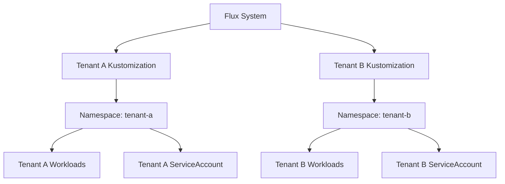

# How to Test Flux CD Multi-Tenancy Isolation

Author: [nawazdhandala](https://github.com/nawazdhandala)

Tags: flux cd, multi-tenancy, isolation, testing, kubernetes, rbac, security, gitops

Description: A practical guide to testing and validating multi-tenancy isolation in Flux CD to ensure tenant workloads are properly separated and secured.

---

Multi-tenancy in Flux CD allows multiple teams or applications to share a single Kubernetes cluster while maintaining strict isolation between them. Testing this isolation is critical to prevent one tenant from accessing or modifying another tenant's resources. This guide covers how to validate that your Flux CD multi-tenancy setup is properly isolated.

## Prerequisites

- A Kubernetes cluster with Flux CD installed
- Understanding of Kubernetes RBAC and namespaces
- Flux CLI v2.0 or later
- kubectl configured for your cluster

## Multi-Tenancy Architecture Overview

In a typical Flux CD multi-tenancy setup, each tenant gets:

- Dedicated namespaces
- A service account with limited RBAC permissions
- A separate Kustomization scoped to their path in the Git repository
- Network policies restricting cross-tenant communication



## Setting Up Multi-Tenancy

### Tenant Namespace and RBAC

```yaml
# tenants/base/tenant-a/namespace.yaml
apiVersion: v1
kind: Namespace
metadata:
  name: tenant-a
  labels:
    toolkit.fluxcd.io/tenant: tenant-a
```

```yaml
# tenants/base/tenant-a/rbac.yaml
# Service account for Tenant A's Flux reconciliation
apiVersion: v1
kind: ServiceAccount
metadata:
  name: tenant-a
  namespace: tenant-a
---
# Role granting permissions only within tenant-a namespace
apiVersion: rbac.authorization.k8s.io/v1
kind: Role
metadata:
  name: tenant-a-reconciler
  namespace: tenant-a
rules:
  - apiGroups: ["*"]
    resources: ["*"]
    verbs: ["*"]
---
# Bind the role to the tenant's service account
apiVersion: rbac.authorization.k8s.io/v1
kind: RoleBinding
metadata:
  name: tenant-a-reconciler
  namespace: tenant-a
subjects:
  - kind: ServiceAccount
    name: tenant-a
    namespace: tenant-a
roleRef:
  kind: Role
  name: tenant-a-reconciler
  apiGroup: rbac.authorization.k8s.io
```

### Flux Kustomization for Tenant A

```yaml
# clusters/production/tenants/tenant-a.yaml
apiVersion: kustomize.toolkit.fluxcd.io/v1
kind: Kustomization
metadata:
  name: tenant-a
  namespace: flux-system
spec:
  interval: 5m
  path: ./tenants/base/tenant-a
  prune: true
  sourceRef:
    kind: GitRepository
    name: flux-system
  # Run reconciliation as the tenant's service account
  serviceAccountName: tenant-a
  # Restrict to tenant's namespace only
  targetNamespace: tenant-a
  # Prevent cross-namespace references
  validation: client
```

### Network Policy for Isolation

```yaml
# tenants/base/tenant-a/network-policy.yaml
# Deny all ingress from other tenant namespaces
apiVersion: networking.k8s.io/v1
kind: NetworkPolicy
metadata:
  name: deny-cross-tenant
  namespace: tenant-a
spec:
  podSelector: {}
  policyTypes:
    - Ingress
    - Egress
  ingress:
    # Allow traffic only from within the same namespace
    - from:
        - podSelector: {}
    # Allow traffic from ingress controller
    - from:
        - namespaceSelector:
            matchLabels:
              kubernetes.io/metadata.name: ingress-system
  egress:
    # Allow DNS resolution
    - to:
        - namespaceSelector: {}
      ports:
        - protocol: UDP
          port: 53
    # Allow traffic within the same namespace
    - to:
        - podSelector: {}
    # Allow external traffic
    - to:
        - ipBlock:
            cidr: 0.0.0.0/0
            except:
              - 10.0.0.0/8
              - 172.16.0.0/12
              - 192.168.0.0/16
```

## Test 1: RBAC Isolation Validation

Verify that tenant service accounts cannot access other tenants' namespaces.

```bash
#!/bin/bash
# scripts/test-rbac-isolation.sh
# Tests that tenant service accounts are properly isolated

set -euo pipefail

TENANTS=("tenant-a" "tenant-b" "tenant-c")
ERRORS=0

echo "Testing RBAC isolation between tenants..."

for tenant in "${TENANTS[@]}"; do
  echo ""
  echo "--- Testing: $tenant ---"

  # Test 1: Tenant can access its own namespace
  echo "  Checking own namespace access..."
  if kubectl auth can-i list pods \
    --namespace "$tenant" \
    --as "system:serviceaccount:${tenant}:${tenant}" 2>/dev/null; then
    echo "  OK: $tenant can access its own namespace"
  else
    echo "  FAIL: $tenant cannot access its own namespace"
    ERRORS=$((ERRORS + 1))
  fi

  # Test 2: Tenant cannot access other tenants' namespaces
  for other_tenant in "${TENANTS[@]}"; do
    if [ "$tenant" = "$other_tenant" ]; then
      continue
    fi

    echo "  Checking cross-tenant access to $other_tenant..."
    if kubectl auth can-i list pods \
      --namespace "$other_tenant" \
      --as "system:serviceaccount:${tenant}:${tenant}" 2>/dev/null; then
      echo "  FAIL: $tenant CAN access $other_tenant namespace (should be denied)"
      ERRORS=$((ERRORS + 1))
    else
      echo "  OK: $tenant cannot access $other_tenant (correctly denied)"
    fi
  done

  # Test 3: Tenant cannot access cluster-scoped resources
  echo "  Checking cluster-scoped access..."
  if kubectl auth can-i list nodes \
    --as "system:serviceaccount:${tenant}:${tenant}" 2>/dev/null; then
    echo "  FAIL: $tenant CAN list cluster nodes (should be denied)"
    ERRORS=$((ERRORS + 1))
  else
    echo "  OK: $tenant cannot list nodes (correctly denied)"
  fi

  # Test 4: Tenant cannot create ClusterRoles
  if kubectl auth can-i create clusterroles \
    --as "system:serviceaccount:${tenant}:${tenant}" 2>/dev/null; then
    echo "  FAIL: $tenant CAN create ClusterRoles (privilege escalation risk)"
    ERRORS=$((ERRORS + 1))
  else
    echo "  OK: $tenant cannot create ClusterRoles"
  fi
done

echo ""
echo "================================"
if [ "$ERRORS" -gt 0 ]; then
  echo "RBAC isolation test FAILED with $ERRORS error(s)"
  exit 1
fi
echo "RBAC isolation test PASSED"
```

## Test 2: Namespace Boundary Validation

Verify that Flux Kustomizations cannot deploy resources outside their target namespace.

```bash
#!/bin/bash
# scripts/test-namespace-boundaries.sh
# Verifies Flux Kustomizations respect namespace boundaries

set -euo pipefail

ERRORS=0

echo "Testing namespace boundary enforcement..."

# Find all tenant Kustomizations
kubectl get kustomizations -n flux-system -o json | \
  jq -r '.items[] | select(.spec.serviceAccountName != null) | .metadata.name' | \
  while read -r ks_name; do

  echo ""
  echo "--- Kustomization: $ks_name ---"

  # Get the target namespace
  TARGET_NS=$(kubectl get kustomization "$ks_name" -n flux-system \
    -o jsonpath='{.spec.targetNamespace}')

  # Get the service account
  SA_NAME=$(kubectl get kustomization "$ks_name" -n flux-system \
    -o jsonpath='{.spec.serviceAccountName}')

  echo "  Target namespace: $TARGET_NS"
  echo "  Service account: $SA_NAME"

  # Verify the Kustomization has a target namespace set
  if [ -z "$TARGET_NS" ]; then
    echo "  WARNING: No targetNamespace set for $ks_name"
    echo "  This tenant could deploy to any namespace"
    ERRORS=$((ERRORS + 1))
  fi

  # Check the last applied resources
  READY=$(kubectl get kustomization "$ks_name" -n flux-system \
    -o jsonpath='{.status.conditions[?(@.type=="Ready")].status}')

  if [ "$READY" = "True" ]; then
    # Get the inventory of applied resources
    INVENTORY=$(kubectl get kustomization "$ks_name" -n flux-system \
      -o jsonpath='{.status.inventory.entries[*].id}')

    for entry in $INVENTORY; do
      # Extract the namespace from the inventory entry
      RESOURCE_NS=$(echo "$entry" | cut -d_ -f1)

      if [ "$RESOURCE_NS" != "$TARGET_NS" ] && [ -n "$TARGET_NS" ]; then
        echo "  FAIL: Resource deployed outside target namespace: $entry"
        ERRORS=$((ERRORS + 1))
      fi
    done

    echo "  OK: All resources within target namespace"
  else
    echo "  SKIP: Kustomization not ready"
  fi
done

echo ""
if [ "$ERRORS" -gt 0 ]; then
  echo "Namespace boundary test FAILED with $ERRORS error(s)"
  exit 1
fi
echo "Namespace boundary test PASSED"
```

## Test 3: Network Policy Validation

Test that network policies block cross-tenant traffic.

```yaml
# tests/network-policy-test.yaml
# Temporary pod for testing network connectivity
apiVersion: v1
kind: Pod
metadata:
  name: nettest
  namespace: tenant-a
  labels:
    app: nettest
spec:
  containers:
    - name: nettest
      image: busybox:1.36
      command: ["sleep", "3600"]
  restartPolicy: Never
```

```bash
#!/bin/bash
# scripts/test-network-isolation.sh
# Tests network policy enforcement between tenants

set -euo pipefail

ERRORS=0

echo "Testing network isolation..."

# Deploy test pods in each tenant namespace
for tenant in tenant-a tenant-b; do
  kubectl run nettest-$tenant \
    --namespace "$tenant" \
    --image=busybox:1.36 \
    --restart=Never \
    --command -- sleep 3600 2>/dev/null || true

  # Wait for the pod to be ready
  kubectl wait --for=condition=Ready \
    pod/nettest-$tenant \
    --namespace "$tenant" \
    --timeout=60s 2>/dev/null
done

# Get the IP of the test pod in tenant-b
TENANT_B_IP=$(kubectl get pod nettest-tenant-b \
  -n tenant-b \
  -o jsonpath='{.status.podIP}')

echo "Tenant B pod IP: $TENANT_B_IP"

# Test: Pod in tenant-a should NOT reach pod in tenant-b
echo "Testing cross-tenant connectivity (should fail)..."
if kubectl exec nettest-tenant-a -n tenant-a -- \
  wget -q -O- --timeout=5 "http://${TENANT_B_IP}:80" 2>/dev/null; then
  echo "FAIL: tenant-a CAN reach tenant-b (network policy not enforced)"
  ERRORS=$((ERRORS + 1))
else
  echo "OK: tenant-a cannot reach tenant-b (correctly blocked)"
fi

# Test: Pod in tenant-a should reach pods in its own namespace
echo "Testing same-namespace connectivity (should succeed)..."
TENANT_A_IP=$(kubectl get pod nettest-tenant-a \
  -n tenant-a \
  -o jsonpath='{.status.podIP}')

# Clean up test pods
for tenant in tenant-a tenant-b; do
  kubectl delete pod nettest-$tenant -n "$tenant" --ignore-not-found
done

echo ""
if [ "$ERRORS" -gt 0 ]; then
  echo "Network isolation test FAILED"
  exit 1
fi
echo "Network isolation test PASSED"
```

## Test 4: Resource Quota Enforcement

Verify that tenants cannot consume more resources than allocated.

```yaml
# tenants/base/tenant-a/resource-quota.yaml
# Limit the resources tenant-a can consume
apiVersion: v1
kind: ResourceQuota
metadata:
  name: tenant-a-quota
  namespace: tenant-a
spec:
  hard:
    requests.cpu: "4"
    requests.memory: 8Gi
    limits.cpu: "8"
    limits.memory: 16Gi
    pods: "20"
    services: "10"
    persistentvolumeclaims: "5"
```

```bash
#!/bin/bash
# scripts/test-resource-quotas.sh
# Verifies resource quotas are enforced for each tenant

set -euo pipefail

TENANTS=("tenant-a" "tenant-b" "tenant-c")
ERRORS=0

echo "Testing resource quota enforcement..."

for tenant in "${TENANTS[@]}"; do
  echo ""
  echo "--- Tenant: $tenant ---"

  # Check if ResourceQuota exists
  QUOTA=$(kubectl get resourcequota -n "$tenant" -o name 2>/dev/null)

  if [ -z "$QUOTA" ]; then
    echo "  FAIL: No ResourceQuota defined for $tenant"
    ERRORS=$((ERRORS + 1))
    continue
  fi

  # Display quota usage
  kubectl get resourcequota -n "$tenant" \
    -o custom-columns=NAME:.metadata.name,CPU_REQ:.status.hard.requests\\.cpu,MEM_REQ:.status.hard.requests\\.memory,PODS:.status.hard.pods

  # Check that LimitRange also exists
  LIMIT_RANGE=$(kubectl get limitrange -n "$tenant" -o name 2>/dev/null)

  if [ -z "$LIMIT_RANGE" ]; then
    echo "  WARNING: No LimitRange defined for $tenant"
    echo "  Pods without resource requests will be rejected by quota"
  fi

  echo "  OK: Resource quotas configured"
done

echo ""
if [ "$ERRORS" -gt 0 ]; then
  echo "Resource quota test FAILED"
  exit 1
fi
echo "Resource quota test PASSED"
```

## Comprehensive Test Suite

Combine all tests into a single script.

```bash
#!/bin/bash
# scripts/test-multi-tenancy.sh
# Comprehensive multi-tenancy isolation test suite

set -euo pipefail

REPO_ROOT=$(git rev-parse --show-toplevel)
TOTAL_ERRORS=0

echo "============================================"
echo "  Flux CD Multi-Tenancy Isolation Test Suite"
echo "============================================"

# Run each test suite
for test_script in \
  "$REPO_ROOT/scripts/test-rbac-isolation.sh" \
  "$REPO_ROOT/scripts/test-namespace-boundaries.sh" \
  "$REPO_ROOT/scripts/test-resource-quotas.sh"; do

  echo ""
  echo "Running: $(basename "$test_script")"
  echo "--------------------------------------------"

  if bash "$test_script"; then
    echo "RESULT: PASSED"
  else
    echo "RESULT: FAILED"
    TOTAL_ERRORS=$((TOTAL_ERRORS + 1))
  fi
done

echo ""
echo "============================================"
if [ "$TOTAL_ERRORS" -gt 0 ]; then
  echo "OVERALL: $TOTAL_ERRORS test suite(s) FAILED"
  exit 1
fi
echo "OVERALL: All test suites PASSED"
```

## CI Integration

```yaml
# .github/workflows/test-multi-tenancy.yaml
name: Multi-Tenancy Tests
on:
  schedule:
    # Run daily to detect drift
    - cron: "0 6 * * *"
  workflow_dispatch:

jobs:
  test-isolation:
    runs-on: ubuntu-latest
    steps:
      - name: Checkout
        uses: actions/checkout@v4

      - name: Set up kind cluster
        uses: helm/kind-action@v1
        with:
          cluster_name: test-cluster

      - name: Install Flux CD
        uses: fluxcd/flux2/action@main

      - name: Bootstrap tenants
        run: |
          # Apply tenant configurations
          kubectl apply -k tenants/base/tenant-a/
          kubectl apply -k tenants/base/tenant-b/

      - name: Run isolation tests
        run: bash scripts/test-multi-tenancy.sh
```

## Summary

Testing multi-tenancy isolation in Flux CD requires validating multiple layers: RBAC permissions, namespace boundaries, network policies, and resource quotas. By automating these tests and running them regularly, you can ensure that tenant isolation remains intact as your cluster evolves. Use the test scripts from this guide as a starting point and extend them based on your specific isolation requirements.
