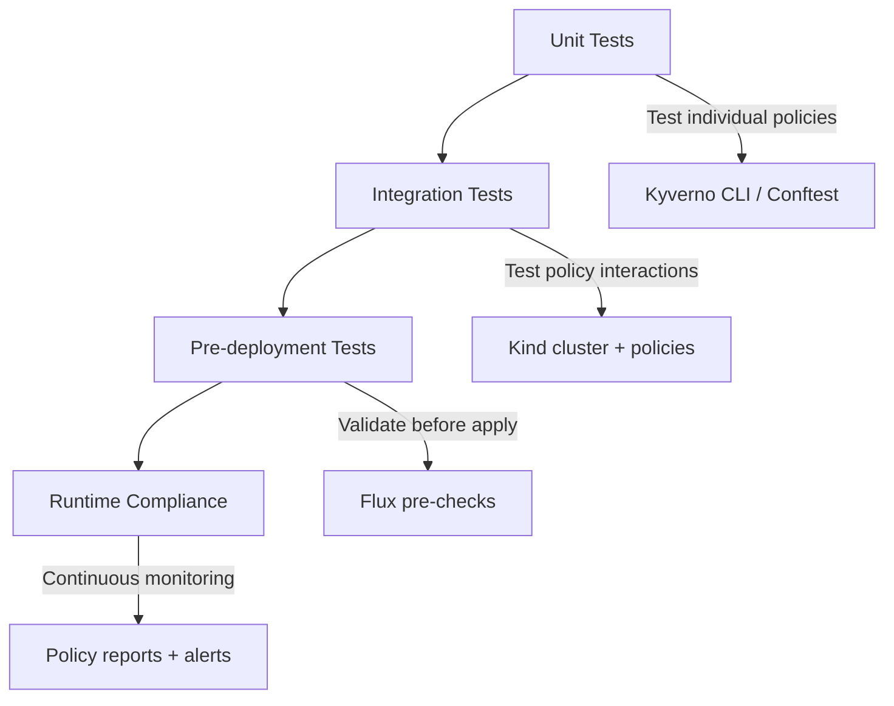

# How to Test Policy Compliance in GitOps Pipelines with Flux CD

Author: [nawazdhandala](https://github.com/nawazdhandala)

Tags: Flux CD, Policy Compliance, GitOps, Testing, CI/CD, Kyverno, Gatekeeper, Security

Description: A comprehensive guide to implementing automated policy compliance testing in GitOps pipelines powered by Flux CD.

---

## Introduction

Policy compliance testing in GitOps pipelines ensures that every change going through your Flux CD workflow meets your organization's security, operational, and regulatory requirements. Unlike one-time audits, continuous compliance testing catches violations at every stage of the deployment lifecycle.

This guide covers building a complete compliance testing framework that integrates with Flux CD's reconciliation workflow, from unit testing individual policies to integration testing full deployment pipelines.

## Prerequisites

- A Kubernetes cluster (v1.25+)
- Flux CD bootstrapped and connected to a Git repository
- A policy engine (Kyverno or Gatekeeper) installed
- GitHub Actions or equivalent CI system
- kubectl and helm CLI tools

## Compliance Testing Strategy

Policy compliance testing should happen at four levels.



## Unit Testing Kyverno Policies

Kyverno provides built-in support for policy unit tests using test manifests.

### Test Directory Structure

```yaml
# tests/
#   policies/
#     require-labels/
#       policy.yaml        - The policy to test
#       test.yaml           - Test definitions
#       resources/
#         valid-deployment.yaml
#         invalid-deployment.yaml
```

### Defining Test Cases

```yaml
# tests/policies/require-labels/test.yaml
name: require-standard-labels
policies:
  - policy.yaml
resources:
  - resources/valid-deployment.yaml
  - resources/invalid-deployment.yaml
results:
  # This resource should pass validation
  - policy: require-standard-labels
    rule: require-app-labels
    resource: valid-deployment
    kind: Deployment
    result: pass

  # This resource should fail validation
  - policy: require-standard-labels
    rule: require-app-labels
    resource: invalid-deployment
    kind: Deployment
    result: fail
```

### Valid Test Resource

```yaml
# tests/policies/require-labels/resources/valid-deployment.yaml
apiVersion: apps/v1
kind: Deployment
metadata:
  name: valid-deployment
  labels:
    app.kubernetes.io/name: my-app
    app.kubernetes.io/version: "1.0.0"
    app.kubernetes.io/component: backend
    team: team-platform
    environment: production
spec:
  replicas: 1
  selector:
    matchLabels:
      app.kubernetes.io/name: my-app
  template:
    metadata:
      labels:
        app.kubernetes.io/name: my-app
        app.kubernetes.io/component: backend
        team: team-platform
    spec:
      containers:
        - name: app
          image: ghcr.io/myorg/app:v1.0.0
          resources:
            limits:
              cpu: 500m
              memory: 256Mi
            requests:
              cpu: 100m
              memory: 128Mi
```

### Invalid Test Resource

```yaml
# tests/policies/require-labels/resources/invalid-deployment.yaml
apiVersion: apps/v1
kind: Deployment
metadata:
  name: invalid-deployment
  # Missing required labels
  labels:
    app: my-app
spec:
  replicas: 1
  selector:
    matchLabels:
      app: my-app
  template:
    metadata:
      labels:
        app: my-app
    spec:
      containers:
        - name: app
          image: nginx:latest
```

### Running Unit Tests

```bash
# Run Kyverno policy tests
kyverno test tests/policies/require-labels/

# Run all policy tests in the repository
kyverno test tests/policies/

# Run with verbose output for debugging
kyverno test tests/policies/ --detailed-results
```

## Unit Testing OPA/Gatekeeper Policies

For Rego-based policies, use OPA's built-in test framework.

```rego
# policy/require_labels_test.rego
package main

# Test that a properly labeled deployment passes
test_valid_deployment {
  input := {
    "kind": "Deployment",
    "metadata": {
      "name": "test-app",
      "labels": {
        "app.kubernetes.io/name": "test-app",
        "team": "team-platform",
        "environment": "production"
      }
    }
  }
  # Expect no deny messages
  count(deny) == 0 with input as input
}

# Test that a deployment without labels fails
test_missing_labels {
  input := {
    "kind": "Deployment",
    "metadata": {
      "name": "test-app",
      "labels": {}
    }
  }
  # Expect deny messages
  count(deny) > 0 with input as input
}

# Test that non-Deployment resources are not affected
test_skip_non_deployment {
  input := {
    "kind": "Service",
    "metadata": {
      "name": "test-service",
      "labels": {}
    }
  }
  count(deny) == 0 with input as input
}
```

```bash
# Run OPA tests
opa test policy/ -v
```

## Integration Testing with Kind

Spin up a disposable Kubernetes cluster to test policies end-to-end.

```yaml
# .github/workflows/policy-integration-test.yaml
name: Policy Integration Tests
on:
  pull_request:
    paths:
      - 'policies/**'
      - 'clusters/**'

jobs:
  integration-test:
    runs-on: ubuntu-latest
    steps:
      - uses: actions/checkout@v4

      - name: Create Kind cluster
        uses: helm/kind-action@v1
        with:
          cluster_name: policy-test

      - name: Install Flux CD
        run: |
          curl -s https://fluxcd.io/install.sh | sudo bash
          flux install --components-extra=image-reflector-controller,image-automation-controller

      - name: Install Kyverno
        run: |
          helm repo add kyverno https://kyverno.github.io/kyverno/
          helm install kyverno kyverno/kyverno \
            --namespace kyverno \
            --create-namespace \
            --wait

      - name: Apply policies
        run: |
          kubectl apply -f policies/

          # Wait for policies to be ready
          echo "Waiting for policies to become active..."
          sleep 10
          kubectl get clusterpolicies

      - name: Run compliance tests
        run: |
          FAILED=0

          # Test 1: Valid resources should be accepted
          echo "Test 1: Valid deployment should be accepted"
          if kubectl apply -f tests/integration/valid-resources/ 2>&1; then
            echo "PASS: Valid resources accepted"
          else
            echo "FAIL: Valid resources were rejected"
            FAILED=1
          fi

          # Test 2: Invalid resources should be rejected
          echo "Test 2: Invalid deployment should be rejected"
          if kubectl apply -f tests/integration/invalid-resources/ 2>&1; then
            echo "FAIL: Invalid resources were accepted"
            FAILED=1
          else
            echo "PASS: Invalid resources rejected"
          fi

          # Test 3: Mutation policies should add labels
          echo "Test 3: Mutation policies should add default labels"
          kubectl apply -f tests/integration/mutation-test/
          LABELS=$(kubectl get deployment mutation-test -o jsonpath='{.metadata.labels}')
          if echo "$LABELS" | grep -q "managed-by"; then
            echo "PASS: Mutation policy added labels"
          else
            echo "FAIL: Mutation policy did not add labels"
            FAILED=1
          fi

          if [ $FAILED -gt 0 ]; then
            echo "Integration tests failed!"
            exit 1
          fi

      - name: Check policy reports
        if: always()
        run: |
          echo "Policy Reports:"
          kubectl get policyreports -A -o yaml
          echo ""
          echo "Cluster Policy Reports:"
          kubectl get clusterpolicyreports -o yaml
```

## Compliance Gate in Flux CD Pipeline

Use Flux CD notifications and health checks to gate deployments on compliance.

```yaml
# clusters/my-cluster/compliance/compliance-check-job.yaml
apiVersion: batch/v1
kind: CronJob
metadata:
  name: compliance-audit
  namespace: flux-system
spec:
  # Run compliance audit every hour
  schedule: "0 * * * *"
  jobTemplate:
    spec:
      template:
        spec:
          serviceAccountName: compliance-auditor
          containers:
            - name: audit
              image: ghcr.io/kyverno/kyverno-cli:v1.12.0
              command:
                - /bin/sh
                - -c
                - |
                  echo "Running compliance audit..."

                  # Check for policy violations in all namespaces
                  VIOLATIONS=$(kubectl get policyreports -A -o json | \
                    jq '[.items[].results[]? | select(.result == "fail")] | length')

                  echo "Found $VIOLATIONS policy violations"

                  if [ "$VIOLATIONS" -gt "0" ]; then
                    echo "COMPLIANCE CHECK FAILED"
                    # List all violations
                    kubectl get policyreports -A -o json | \
                      jq '.items[].results[]? | select(.result == "fail") | {
                        policy: .policy,
                        rule: .rule,
                        resource: .resources[0].name,
                        message: .message
                      }'
                    exit 1
                  fi

                  echo "All resources are compliant"
          restartPolicy: OnFailure
```

## Compliance Dashboard with Policy Reports

```yaml
# clusters/my-cluster/compliance/policy-report-aggregator.yaml
apiVersion: kustomize.toolkit.fluxcd.io/v1
kind: Kustomization
metadata:
  name: compliance-dashboard
  namespace: flux-system
spec:
  interval: 10m
  sourceRef:
    kind: GitRepository
    name: flux-system
  path: ./clusters/my-cluster/compliance
  prune: true
  # Health check: ensure compliance job succeeds
  healthChecks:
    - apiVersion: batch/v1
      kind: CronJob
      name: compliance-audit
      namespace: flux-system
```

## Alerting on Compliance Failures

```yaml
# clusters/my-cluster/compliance/compliance-alert.yaml
apiVersion: notification.toolkit.fluxcd.io/v1beta3
kind: Provider
metadata:
  name: compliance-slack
  namespace: flux-system
spec:
  type: slack
  channel: compliance-alerts
  secretRef:
    name: slack-webhook-url

---
apiVersion: notification.toolkit.fluxcd.io/v1beta3
kind: Alert
metadata:
  name: compliance-failures
  namespace: flux-system
spec:
  providerRef:
    name: compliance-slack
  eventSeverity: error
  eventSources:
    - kind: Kustomization
      name: '*'
    - kind: HelmRelease
      name: '*'
  # Only alert on reconciliation failures that may indicate policy violations
  inclusionList:
    - ".*denied by.*"
    - ".*policy.*violation.*"
    - ".*admission webhook.*denied.*"
```

## Generating Compliance Reports

Create a script that generates compliance reports from policy data.

```bash
#!/bin/bash
# scripts/compliance-report.sh
# Generates a compliance report from Kyverno policy reports

echo "=== Kubernetes Policy Compliance Report ==="
echo "Generated: $(date -u)"
echo ""

# Total policies
TOTAL_POLICIES=$(kubectl get clusterpolicies --no-headers | wc -l)
echo "Active Cluster Policies: $TOTAL_POLICIES"

# Policy status breakdown
echo ""
echo "--- Policy Status ---"
kubectl get clusterpolicies -o custom-columns=\
NAME:.metadata.name,\
ACTION:.spec.validationFailureAction,\
READY:.status.conditions[0].status

# Compliance summary
echo ""
echo "--- Compliance Summary by Namespace ---"
kubectl get policyreports -A -o json | jq -r '
  .items[] |
  .metadata.namespace as $ns |
  .summary |
  "\($ns): pass=\(.pass // 0) fail=\(.fail // 0) warn=\(.warn // 0) skip=\(.skip // 0)"
'

# Detailed violations
echo ""
echo "--- Violations ---"
kubectl get policyreports -A -o json | jq -r '
  .items[] |
  .metadata.namespace as $ns |
  .results[]? |
  select(.result == "fail") |
  "[\($ns)] \(.policy)/\(.rule): \(.resources[0].name) - \(.message)"
'
```

## Running the Full Test Suite

```bash
# Run all compliance tests locally
make compliance-test

# Makefile targets for compliance testing
# Makefile
# .PHONY: compliance-test unit-test integration-test

# unit-test:
#     kyverno test tests/policies/
#     opa test policy/ -v

# integration-test:
#     kind create cluster --name compliance-test
#     helm install kyverno kyverno/kyverno -n kyverno --create-namespace --wait
#     kubectl apply -f policies/
#     sleep 10
#     ./scripts/run-integration-tests.sh
#     kind delete cluster --name compliance-test

# compliance-test: unit-test integration-test
#     echo "All compliance tests passed"
```

## Conclusion

Testing policy compliance in GitOps pipelines ensures that security and operational standards are enforced consistently and automatically. By implementing tests at multiple levels -- unit tests for individual policies, integration tests with disposable clusters, pre-deployment validation in CI, and runtime compliance monitoring -- you create a comprehensive safety net. Flux CD's reconciliation loop combined with policy engine reporting provides continuous visibility into your compliance posture. This approach transforms compliance from a periodic manual audit into an automated, continuous process that is deeply integrated into your development workflow.
