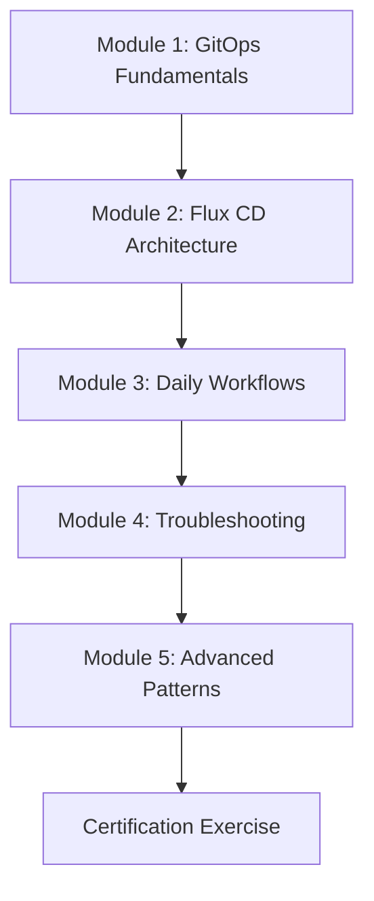

# How to Train Your Team on Flux CD GitOps Workflows

Author: [nawazdhandala](https://github.com/nawazdhandala)

Tags: flux cd, gitops, training, team onboarding, kubernetes, developer experience, workflows

Description: A practical guide to training your development team on Flux CD GitOps workflows, including training curriculum, hands-on exercises, common workflows, and troubleshooting skills.

---

## Introduction

Adopting Flux CD for GitOps is only as successful as the team's ability to use it effectively. Developers who are used to running kubectl apply or triggering CI pipelines need structured training to shift to a Git-centric deployment workflow. This guide provides a complete training curriculum, hands-on exercises, and reference materials for onboarding your team to Flux CD GitOps workflows.

## Prerequisites

- A training Kubernetes cluster (separate from production)
- Flux CD installed on the training cluster
- Each trainee should have Git access and kubectl configured
- flux CLI installed on trainee workstations

## Training Curriculum Overview



## Module 1: GitOps Fundamentals

### Key Concepts to Cover

Start with the foundational concepts that differentiate GitOps from traditional deployment:

```yaml
# training/module-1/concepts.yaml
# Use this as a slide deck reference
module_1_gitops_fundamentals:
  duration: "1 hour"
  topics:
    - what_is_gitops:
        definition: "Git as the single source of truth for infrastructure"
        principles:
          - "Declarative: Desired state is described, not scripted"
          - "Versioned: All changes tracked in Git history"
          - "Automated: Agents reconcile actual vs desired state"
          - "Observable: Drift is detected and reported"

    - gitops_vs_traditional:
        traditional:
          - "CI pushes changes to cluster"
          - "Cluster state may drift from code"
          - "No single source of truth"
          - "Hard to audit who changed what"
        gitops:
          - "Git defines desired state"
          - "Agent pulls and reconciles"
          - "Git is the single source of truth"
          - "Full audit trail via Git history"

    - pull_vs_push_model:
        push: "CI/CD tool connects to cluster and applies changes"
        pull: "In-cluster agent watches Git and applies changes"
        why_pull_is_better:
          - "No cluster credentials in CI"
          - "Automatic drift detection"
          - "Self-healing on manual changes"
```

### Hands-On Exercise 1: See GitOps in Action

```bash
# Exercise: Make a change via Git and watch it reconcile

# Step 1: Clone the training repository
git clone https://github.com/your-org/flux-training.git
cd flux-training

# Step 2: Check current state in the cluster
kubectl get deployments -n training
kubectl get pods -n training

# Step 3: Make a change in Git
# Edit the replica count in the deployment
cat > apps/training/deployment.yaml <<'EOF'
apiVersion: apps/v1
kind: Deployment
metadata:
  name: hello-gitops
  namespace: training
spec:
  replicas: 3  # Changed from 1 to 3
  selector:
    matchLabels:
      app: hello-gitops
  template:
    metadata:
      labels:
        app: hello-gitops
    spec:
      containers:
        - name: hello
          image: nginx:1.27
          ports:
            - containerPort: 80
EOF

# Step 4: Commit and push
git add -A && git commit -m "scale hello-gitops to 3 replicas"
git push

# Step 5: Watch Flux reconcile the change
flux get kustomizations --watch

# Step 6: Verify the change was applied
kubectl get pods -n training
# You should see 3 pods running
```

## Module 2: Flux CD Architecture

### Understanding Flux Components

```yaml
# training/module-2/architecture.yaml
module_2_flux_architecture:
  duration: "1.5 hours"
  components:
    source_controller:
      purpose: "Manages source artifacts (Git repos, Helm repos, OCI)"
      resources:
        - GitRepository
        - HelmRepository
        - OCIRepository
        - Bucket

    kustomize_controller:
      purpose: "Reconciles Kustomization resources"
      resources:
        - Kustomization

    helm_controller:
      purpose: "Manages Helm chart installations"
      resources:
        - HelmRelease

    notification_controller:
      purpose: "Handles events and alerts"
      resources:
        - Alert
        - Provider
        - Receiver

    image_automation_controllers:
      purpose: "Automates image tag updates"
      resources:
        - ImageRepository
        - ImagePolicy
        - ImageUpdateAutomation
```

### Hands-On Exercise 2: Explore Flux Resources

```bash
# Exercise: Explore Flux components in the cluster

# List all Flux custom resource definitions
kubectl get crds | grep fluxcd

# Check Flux system pods
kubectl get pods -n flux-system

# View all sources
flux get sources all

# View all Kustomizations
flux get kustomizations

# View all Helm releases
flux get helmreleases -A

# Check the reconciliation status
flux stats
```

## Module 3: Daily Workflows

### Workflow 1: Deploying a New Application

```yaml
# training/module-3/deploy-new-app.yaml
# Step-by-step guide for deploying a new application

# 1. Create the application manifests
# apps/base/my-new-app/deployment.yaml
apiVersion: apps/v1
kind: Deployment
metadata:
  name: my-new-app
  namespace: my-team
  labels:
    app: my-new-app
spec:
  replicas: 2
  selector:
    matchLabels:
      app: my-new-app
  template:
    metadata:
      labels:
        app: my-new-app
    spec:
      containers:
        - name: app
          image: registry.company.com/my-new-app:v1.0.0
          ports:
            - containerPort: 8080
          resources:
            requests:
              cpu: 100m
              memory: 128Mi
            limits:
              cpu: 500m
              memory: 256Mi
---
# apps/base/my-new-app/service.yaml
apiVersion: v1
kind: Service
metadata:
  name: my-new-app
  namespace: my-team
spec:
  selector:
    app: my-new-app
  ports:
    - port: 80
      targetPort: 8080
---
# apps/base/my-new-app/kustomization.yaml
apiVersion: kustomize.config.k8s.io/v1beta1
kind: Kustomization
resources:
  - deployment.yaml
  - service.yaml
```

### Workflow 2: Updating an Image Tag

```bash
# The GitOps way to update an image:

# Step 1: Edit the deployment manifest in Git
# Change the image tag from v1.0.0 to v1.1.0

# Step 2: Create a pull request
git checkout -b update-my-app-v1.1.0
# Edit the file
git add -A
git commit -m "chore: update my-new-app to v1.1.0"
git push -u origin update-my-app-v1.1.0
# Create PR via GitHub/GitLab

# Step 3: After PR is merged, Flux auto-reconciles
flux get kustomizations --watch

# IMPORTANT: Never run kubectl set image in production
# That bypasses Git and creates drift
```

### Workflow 3: Rolling Back a Deployment

```bash
# GitOps rollback is just a Git revert

# Step 1: Find the commit to revert
git log --oneline -10

# Step 2: Revert the bad commit
git revert abc1234

# Step 3: Push the revert
git push

# Step 4: Flux will reconcile to the previous state
flux get kustomizations --watch

# Alternative: If urgent, suspend and manually fix
flux suspend kustomization my-app
kubectl rollout undo deployment/my-app -n my-team
# Then fix in Git and resume
flux resume kustomization my-app
```

### Workflow 4: Adding Environment Variables

```yaml
# The correct way to add env vars via GitOps

# Option A: Direct in deployment (non-sensitive)
# Edit apps/base/my-new-app/deployment.yaml
spec:
  template:
    spec:
      containers:
        - name: app
          env:
            - name: LOG_LEVEL
              value: "info"
            - name: FEATURE_FLAG_NEW_UI
              value: "true"

# Option B: Via ConfigMap (non-sensitive, shared)
---
# apps/base/my-new-app/configmap.yaml
apiVersion: v1
kind: ConfigMap
metadata:
  name: my-new-app-config
  namespace: my-team
data:
  LOG_LEVEL: "info"
  API_TIMEOUT: "30s"
  MAX_CONNECTIONS: "100"

# Option C: Via ExternalSecret (sensitive values)
---
# apps/base/my-new-app/external-secret.yaml
apiVersion: external-secrets.io/v1beta1
kind: ExternalSecret
metadata:
  name: my-new-app-secrets
  namespace: my-team
spec:
  refreshInterval: 1h
  secretStoreRef:
    name: aws-secrets-manager
    kind: ClusterSecretStore
  target:
    name: my-new-app-secrets
  data:
    - secretKey: DATABASE_URL
      remoteRef:
        key: my-new-app/database
        property: url
    - secretKey: API_KEY
      remoteRef:
        key: my-new-app/api
        property: key
```

## Module 4: Troubleshooting

### Common Issues and Solutions

```bash
# Issue 1: Kustomization is not reconciling
# Check the kustomization status
flux get kustomization my-app

# Look at events
kubectl events -n flux-system --for kustomization/my-app

# Force reconciliation
flux reconcile kustomization my-app --with-source

# Issue 2: Source not syncing
# Check git repository status
flux get sources git

# Check for authentication errors
kubectl describe gitrepository flux-system -n flux-system

# Issue 3: Helm release stuck in "pending-upgrade"
# Check Helm release status
flux get helmrelease my-chart -n my-namespace

# Check Helm history
helm history my-chart -n my-namespace

# Force a Helm release reconciliation
flux reconcile helmrelease my-chart -n my-namespace

# Issue 4: Resources not being pruned
# Check if prune is enabled
kubectl get kustomization my-app -n flux-system \
  -o jsonpath='{.spec.prune}'

# Check for Flux inventory to see tracked resources
kubectl get kustomization my-app -n flux-system \
  -o jsonpath='{.status.inventory.entries}' | jq .
```

### Troubleshooting Decision Tree

```yaml
# training/module-4/troubleshooting-guide.yaml
troubleshooting_steps:
  - question: "Is the source syncing?"
    check: "flux get sources git"
    if_no:
      - "Check Git credentials: kubectl get secret -n flux-system"
      - "Check network access to Git host"
      - "Verify branch name is correct"
    if_yes:
      next: "Is the Kustomization reconciling?"

  - question: "Is the Kustomization reconciling?"
    check: "flux get kustomizations"
    if_no:
      - "Check for YAML syntax errors in manifests"
      - "Check kustomization.yaml is valid"
      - "Look at controller logs: kubectl logs -n flux-system deploy/kustomize-controller"
    if_yes:
      next: "Are the resources healthy?"

  - question: "Are the resources healthy?"
    check: "kubectl get pods -n my-namespace"
    if_no:
      - "Check pod events: kubectl describe pod <pod>"
      - "Check resource limits and requests"
      - "Verify image exists and is pullable"
    if_yes:
      result: "Deployment is healthy"
```

## Module 5: Advanced Patterns

### Post-Build Variable Substitution

```yaml
# training/module-5/variable-substitution.yaml
# Use postBuild to inject environment-specific values
apiVersion: kustomize.toolkit.fluxcd.io/v1
kind: Kustomization
metadata:
  name: my-app-production
  namespace: flux-system
spec:
  interval: 10m
  sourceRef:
    kind: GitRepository
    name: flux-system
  path: ./apps/base/my-app
  prune: true
  # Substitute variables in manifests
  postBuild:
    substitute:
      ENVIRONMENT: production
      REPLICAS: "5"
      LOG_LEVEL: warn
    # Load additional variables from ConfigMap/Secret
    substituteFrom:
      - kind: ConfigMap
        name: cluster-settings
      - kind: Secret
        name: cluster-secrets
```

### Dependency Management

```yaml
# training/module-5/dependencies.yaml
# Ensure resources are deployed in the correct order
apiVersion: kustomize.toolkit.fluxcd.io/v1
kind: Kustomization
metadata:
  name: app-database
  namespace: flux-system
spec:
  interval: 10m
  sourceRef:
    kind: GitRepository
    name: flux-system
  path: ./apps/base/database
  prune: true
  # Health checks ensure the database is ready
  healthChecks:
    - apiVersion: apps/v1
      kind: StatefulSet
      name: postgres
      namespace: my-team
---
apiVersion: kustomize.toolkit.fluxcd.io/v1
kind: Kustomization
metadata:
  name: app-backend
  namespace: flux-system
spec:
  interval: 10m
  sourceRef:
    kind: GitRepository
    name: flux-system
  path: ./apps/base/backend
  prune: true
  # Wait for database to be healthy before deploying backend
  dependsOn:
    - name: app-database
```

## Certification Exercise

Give trainees a practical exercise to validate their skills:

```yaml
# training/certification/exercise.yaml
certification_exercise:
  title: "Flux CD GitOps Certification"
  time_limit: "2 hours"
  tasks:
    - name: "Deploy a new application"
      description: >
        Create a new application with deployment, service, and ingress.
        Deploy it to the training namespace using Flux.
      points: 20

    - name: "Update the application"
      description: >
        Change the replica count to 3 and update the image tag.
        Use a pull request workflow.
      points: 15

    - name: "Add a Helm chart dependency"
      description: >
        Add Redis as a Helm release dependency for the application.
        Ensure the app waits for Redis to be ready.
      points: 20

    - name: "Troubleshoot a broken deployment"
      description: >
        The instructor will break something. Find and fix it using
        Flux CLI and kubectl.
      points: 25

    - name: "Rollback a bad deployment"
      description: >
        A bad image tag will be pushed. Perform a GitOps rollback.
      points: 20

  passing_score: 70
```

## Quick Reference Card

Create a quick reference card for daily use:

```bash
# === FLUX CD QUICK REFERENCE ===

# Check overall status
flux get all -A

# Reconcile a specific resource
flux reconcile kustomization <name>
flux reconcile source git <name>
flux reconcile helmrelease <name> -n <namespace>

# Suspend/Resume reconciliation
flux suspend kustomization <name>
flux resume kustomization <name>

# View logs
flux logs --kind=Kustomization --name=<name>
flux logs --kind=HelmRelease --name=<name>

# Export resources (useful for debugging)
flux export kustomization <name>
flux export source git <name>

# Check Flux system health
flux check

# View all sources
flux get sources all

# Trigger immediate reconciliation with source update
flux reconcile kustomization <name> --with-source
```

## Best Practices for Training

1. **Use a dedicated training cluster**: Never train on production or staging clusters.

2. **Provide hands-on exercises**: Theory alone is insufficient. Every concept needs a practical exercise.

3. **Create a sandbox**: Give each trainee their own namespace to experiment safely.

4. **Record sessions**: Record training sessions so team members who miss them can catch up.

5. **Create a FAQ document**: Collect and publish answers to common questions from training sessions.

6. **Pair new users with experienced ones**: Buddy up newcomers with team members who completed training.

7. **Run regular refresher sessions**: Schedule monthly office hours to address questions and share tips.

## Conclusion

Effective training is the difference between a GitOps migration that succeeds and one that stalls. By following this structured curriculum -- from fundamentals through daily workflows to advanced patterns -- you equip your team with the knowledge and confidence to work with Flux CD effectively. The hands-on exercises ensure practical skills, while the troubleshooting module prepares the team for real-world issues. Invest the time in training and the returns will compound as your team becomes self-sufficient with GitOps.
