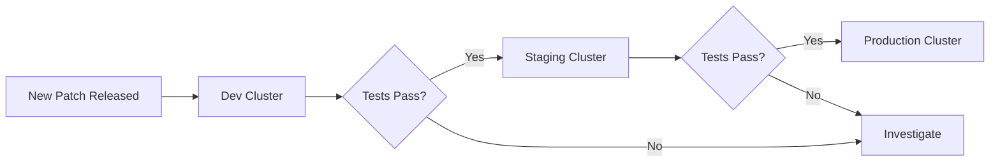

# How to Upgrade Flux CD Patch Versions

Author: [nawazdhandala](https://github.com/nawazdhandala)

Tags: Flux CD, Upgrade, Patch version, Kubernetes, GitOps, Maintenance, Security patches

Description: A practical guide to upgrading Flux CD patch versions for bug fixes and security updates with minimal disruption.

---

## Introduction

Patch version upgrades in Flux CD (for example, v2.3.0 to v2.3.1) contain bug fixes and security patches without introducing new features or breaking changes. While these upgrades are generally low-risk, following a structured process ensures a smooth and predictable update experience. This guide covers the end-to-end workflow for applying patch upgrades to your Flux CD installation.

## Why Patch Upgrades Matter

Patch releases address:

- **Security vulnerabilities** in Flux controllers or their dependencies
- **Bug fixes** for reconciliation logic, API handling, or edge cases
- **Performance improvements** that resolve memory leaks or CPU spikes
- **Compatibility fixes** for newer Kubernetes versions

Staying current with patch versions is essential for maintaining a secure and stable GitOps platform.

## Step 1: Identify Available Patch Updates

Check what patch versions are available for your current minor release.

```bash
# Check your current Flux version
flux version

# Example output:
# flux: v2.3.0
# source-controller: v1.3.0
# kustomize-controller: v1.3.0
# helm-controller: v1.0.0
# notification-controller: v1.3.0

# List available releases
gh release list --repo fluxcd/flux2 --limit 15

# View the changelog for a specific patch release
gh release view v2.3.1 --repo fluxcd/flux2
```

## Step 2: Review the Patch Release Notes

Even though patch releases should not contain breaking changes, always review what was fixed.

```bash
# Download and review the release notes
gh release view v2.3.1 --repo fluxcd/flux2 --json body -q .body

# Check individual controller changelogs if needed
gh release view v1.3.1 --repo fluxcd/source-controller --json body -q .body
gh release view v1.3.1 --repo fluxcd/kustomize-controller --json body -q .body
```

## Step 3: Quick Pre-Upgrade Health Check

Verify your current installation is healthy before upgrading.

```bash
# Run Flux health checks
flux check

# Verify all reconciliations are healthy
flux get all --all-namespaces

# Check that no resources are in a failed state
flux get sources all -A --status-selector ready=false
flux get kustomizations -A --status-selector ready=false
flux get helmreleases -A --status-selector ready=false

# Check controller pod status
kubectl get pods -n flux-system
```

## Step 4: Perform the Patch Upgrade

Patch upgrades can be performed using one of several methods.

### Method A: CLI Direct Upgrade

The simplest method is using the Flux CLI to upgrade directly.

```bash
# Preview the upgrade without applying
flux install --version=v2.3.1 --export > patch-upgrade-preview.yaml

# Review the differences
# The diff should only show image tag changes
kubectl diff -f patch-upgrade-preview.yaml

# Apply the patch upgrade
flux install --version=v2.3.1

# Verify the upgrade was successful
flux check
flux version
```

### Method B: GitOps-Managed Upgrade

If you manage Flux via GitOps, update the component manifests in your repository.

```bash
# Generate updated component manifests for the patch version
flux install --version=v2.3.1 --export \
  > clusters/production/flux-system/gotk-components.yaml

# Check what changed
git diff clusters/production/flux-system/gotk-components.yaml
```

```yaml
# The diff should primarily show controller image tag changes
# Example of what changes in a patch upgrade:
#
# Before:
#   image: ghcr.io/fluxcd/source-controller:v1.3.0
# After:
#   image: ghcr.io/fluxcd/source-controller:v1.3.1
```

```bash
# Commit and push the patch upgrade
git add clusters/production/flux-system/gotk-components.yaml
git commit -m "Upgrade Flux CD to v2.3.1 (patch release)"
git push origin main

# Watch the reconciliation
flux get kustomization flux-system -w
```

### Method C: Automated Patch Upgrades with Image Automation

You can configure Flux to automatically upgrade its own controller images for patch releases.

```yaml
# image-repo-source-controller.yaml
# Track the source-controller image for new patches
apiVersion: image.toolkit.fluxcd.io/v1
kind: ImageRepository
metadata:
  name: source-controller
  namespace: flux-system
spec:
  image: ghcr.io/fluxcd/source-controller
  interval: 1h
---
# image-policy-source-controller.yaml
# Only allow patch version updates within the current minor
apiVersion: image.toolkit.fluxcd.io/v1
kind: ImagePolicy
metadata:
  name: source-controller
  namespace: flux-system
spec:
  imageRepositoryRef:
    name: source-controller
  policy:
    semver:
      # Only match patch updates for the current minor version
      range: ">=1.3.0 <1.4.0"
---
# Repeat for each controller you want to auto-update
# image-repo-kustomize-controller.yaml
apiVersion: image.toolkit.fluxcd.io/v1
kind: ImageRepository
metadata:
  name: kustomize-controller
  namespace: flux-system
spec:
  image: ghcr.io/fluxcd/kustomize-controller
  interval: 1h
---
apiVersion: image.toolkit.fluxcd.io/v1
kind: ImagePolicy
metadata:
  name: kustomize-controller
  namespace: flux-system
spec:
  imageRepositoryRef:
    name: kustomize-controller
  policy:
    semver:
      range: ">=1.3.0 <1.4.0"
```

## Step 5: Verify the Patch Upgrade

After upgrading, run verification checks to confirm everything is working.

```bash
# Verify all controller versions are updated
flux version

# Run full health check
flux check

# Verify all pods are running and ready
kubectl get pods -n flux-system -o wide

# Check that pods restarted with the new image
kubectl get pods -n flux-system \
  -o custom-columns=NAME:.metadata.name,IMAGE:.spec.containers[0].image,RESTARTS:.status.containerStatuses[0].restartCount

# Ensure all sources are reconciling
flux get sources all -A

# Ensure all Kustomizations are reconciling
flux get kustomizations -A

# Ensure all HelmReleases are reconciling
flux get helmreleases -A
```

## Step 6: Validate Reconciliation Behavior

Trigger reconciliation on a few key resources to verify the controllers function correctly after the patch.

```bash
# Force reconcile a GitRepository source
flux reconcile source git flux-config -n flux-system

# Force reconcile a Kustomization
flux reconcile kustomization flux-system -n flux-system

# Force reconcile a HelmRelease
flux reconcile helmrelease my-app -n default

# Watch for successful reconciliation events
kubectl get events -n flux-system --sort-by=.lastTimestamp --watch
```

## Step 7: Monitor Post-Upgrade

Keep an eye on the system for the first hour after the upgrade.

```bash
# Watch controller logs for errors
kubectl logs -n flux-system deploy/source-controller -f --tail=20 &
kubectl logs -n flux-system deploy/kustomize-controller -f --tail=20 &
kubectl logs -n flux-system deploy/helm-controller -f --tail=20 &

# Monitor resource usage to detect any regressions
kubectl top pods -n flux-system

# Check for any new warning events
kubectl get events -n flux-system --field-selector type=Warning
```

## Automating Patch Upgrade Notifications

Set up notifications to be alerted when new patch versions are available.

```yaml
# patch-update-alert.yaml
# Alert when Flux controllers are updated
apiVersion: notification.toolkit.fluxcd.io/v1
kind: Alert
metadata:
  name: flux-patch-updates
  namespace: flux-system
spec:
  summary: "Flux controller updated"
  eventSeverity: info
  eventSources:
    - kind: Kustomization
      name: flux-system
      namespace: flux-system
  providerRef:
    name: slack-provider
---
apiVersion: notification.toolkit.fluxcd.io/v1
kind: Provider
metadata:
  name: slack-provider
  namespace: flux-system
spec:
  type: slack
  channel: flux-updates
  secretRef:
    name: slack-webhook
```

## Rolling Upgrades Across Multiple Clusters

If you manage multiple clusters, roll out patch upgrades incrementally.



```bash
# Upgrade dev cluster first
KUBECONFIG=~/.kube/dev flux install --version=v2.3.1
flux check

# After verification, upgrade staging
KUBECONFIG=~/.kube/staging flux install --version=v2.3.1
flux check

# Finally, upgrade production
KUBECONFIG=~/.kube/production flux install --version=v2.3.1
flux check
```

## Patch Upgrade Checklist

1. Identify available patch versions with `flux version`
2. Review patch release notes for bug fixes and security patches
3. Run pre-upgrade health check with `flux check`
4. Apply the patch upgrade using CLI or GitOps
5. Verify all controller versions are updated
6. Run post-upgrade health checks
7. Validate reconciliation on key resources
8. Monitor controller logs for one hour
9. Repeat for additional clusters if applicable

## Troubleshooting

### Controller Pod Stuck in CrashLoopBackOff

```bash
# Check the controller logs for the error
kubectl logs -n flux-system deploy/source-controller --previous

# Check if there are resource limit issues
kubectl describe pod -n flux-system -l app=source-controller

# If needed, increase resource limits
kubectl patch deployment source-controller -n flux-system \
  --type=json -p='[{"op": "replace", "path": "/spec/template/spec/containers/0/resources/limits/memory", "value": "512Mi"}]'
```

### Image Pull Failures

```bash
# Verify the image is accessible
kubectl describe pod -n flux-system -l app=source-controller | grep -A5 "Events"

# Check if there is a registry rate limit issue
kubectl get events -n flux-system --field-selector reason=Failed
```

## Conclusion

Patch version upgrades for Flux CD are straightforward and low-risk operations that keep your GitOps platform secure and stable. By following a simple verification process and rolling out changes incrementally across environments, you can maintain confidence in your upgrade process. Consider automating patch upgrades using Flux image automation to reduce manual overhead and stay current with the latest fixes.
