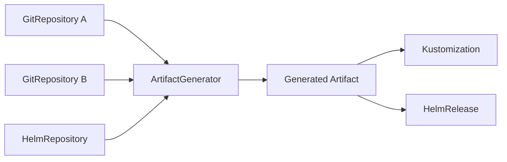

# How to Use ArtifactGenerator Resource in Flux CD

Author: [nawazdhandala](https://github.com/nawazdhandala)

Tags: Flux CD, artifactgenerator, GitOps, Kubernetes, Automation, Helm, Kustomize

Description: Learn how to use the ArtifactGenerator resource in Flux CD to dynamically generate artifacts from multiple sources and streamline your GitOps pipelines.

---

## Introduction

The ArtifactGenerator resource in Flux CD allows you to create composite artifacts by combining multiple sources into a single deployable unit. This is particularly useful when you need to merge configurations from different repositories, generate dynamic manifests, or create custom artifact pipelines that go beyond standard GitRepository or HelmRepository sources.

In this guide, we will walk through the ArtifactGenerator resource, its configuration options, and practical examples for real-world use cases.

## Prerequisites

Before you begin, ensure you have the following:

- A Kubernetes cluster (v1.28 or later)
- Flux CD v2.4 or later installed
- kubectl configured to access your cluster
- A Git repository for your Flux configurations

## Understanding ArtifactGenerator

The ArtifactGenerator is a Flux CD custom resource that takes one or more source inputs and produces a generated artifact. This artifact can then be consumed by Kustomization or HelmRelease resources just like any other source.



## Installing the ArtifactGenerator Controller

First, ensure the ArtifactGenerator controller is available in your Flux installation:

```yaml
# flux-system/kustomization.yaml
# Verify that the artifact-generator component is included
apiVersion: kustomize.toolkit.fluxcd.io/v1
kind: Kustomization
metadata:
  name: flux-system
  namespace: flux-system
spec:
  interval: 10m0s
  path: ./clusters/my-cluster
  prune: true
  sourceRef:
    kind: GitRepository
    name: flux-system
```

Check the controller status:

```bash
# Verify the artifact-generator controller is running
kubectl get pods -n flux-system | grep artifact

# Check the CRD is installed
kubectl get crd artifactgenerators.source.toolkit.fluxcd.io
```

## Basic ArtifactGenerator Configuration

Here is a basic ArtifactGenerator that combines two Git repositories:

```yaml
# artifact-generators/basic-generator.yaml
apiVersion: source.toolkit.fluxcd.io/v1
kind: ArtifactGenerator
metadata:
  name: combined-config
  namespace: flux-system
spec:
  # How often to regenerate the artifact
  interval: 5m
  # List of source inputs to combine
  inputs:
    # First input: application manifests
    - name: app-manifests
      sourceRef:
        kind: GitRepository
        name: app-repo
        namespace: flux-system
      # Only include files from this path
      path: ./manifests
    # Second input: shared configuration
    - name: shared-config
      sourceRef:
        kind: GitRepository
        name: config-repo
        namespace: flux-system
      path: ./shared
  # Output configuration
  output:
    # Merge strategy for combining inputs
    strategy: overlay
    # Output path structure
    path: ./generated
```

## Setting Up Source Repositories

Define the source repositories that the ArtifactGenerator will consume:

```yaml
# sources/app-repo.yaml
apiVersion: source.toolkit.fluxcd.io/v1
kind: GitRepository
metadata:
  name: app-repo
  namespace: flux-system
spec:
  interval: 5m
  url: https://github.com/your-org/app-manifests
  ref:
    branch: main
  secretRef:
    name: git-credentials
---
# sources/config-repo.yaml
apiVersion: source.toolkit.fluxcd.io/v1
kind: GitRepository
metadata:
  name: config-repo
  namespace: flux-system
spec:
  interval: 5m
  url: https://github.com/your-org/shared-config
  ref:
    branch: main
  secretRef:
    name: git-credentials
```

## Advanced ArtifactGenerator with Transformations

You can apply transformations to inputs before they are combined:

```yaml
# artifact-generators/transformed-generator.yaml
apiVersion: source.toolkit.fluxcd.io/v1
kind: ArtifactGenerator
metadata:
  name: env-specific-config
  namespace: flux-system
spec:
  interval: 5m
  inputs:
    # Base configuration
    - name: base
      sourceRef:
        kind: GitRepository
        name: app-repo
      path: ./base
      # Apply kustomize-style patches to this input
      transforms:
        - type: kustomize
          patches:
            - target:
                kind: Deployment
              patch: |
                - op: replace
                  path: /spec/replicas
                  value: 3
    # Environment-specific overlays
    - name: env-overlay
      sourceRef:
        kind: GitRepository
        name: config-repo
      path: ./overlays/production
      # Filter only specific file types
      transforms:
        - type: filter
          include:
            - "*.yaml"
            - "*.yml"
          exclude:
            - "test-*"
            - "*-dev.*"
  output:
    strategy: overlay
    # Priority determines which input wins on conflicts
    # Higher priority inputs override lower ones
    priority:
      - env-overlay  # highest priority
      - base         # lowest priority
```

## Using ArtifactGenerator with Helm Values

Generate combined Helm values from multiple sources:

```yaml
# artifact-generators/helm-values-generator.yaml
apiVersion: source.toolkit.fluxcd.io/v1
kind: ArtifactGenerator
metadata:
  name: helm-values-combined
  namespace: flux-system
spec:
  interval: 5m
  inputs:
    # Default Helm values
    - name: defaults
      sourceRef:
        kind: GitRepository
        name: helm-defaults
      path: ./values
    # Team-specific overrides
    - name: team-overrides
      sourceRef:
        kind: GitRepository
        name: team-config
      path: ./helm-overrides
    # Secret values from a sealed source
    - name: secrets
      sourceRef:
        kind: GitRepository
        name: sealed-secrets-repo
      path: ./sealed-values
  output:
    strategy: deepMerge
    # Deep merge YAML files with matching names
    mergeKeys:
      - filename
```

Now reference the generated artifact in a HelmRelease:

```yaml
# releases/my-app.yaml
apiVersion: helm.toolkit.fluxcd.io/v2
kind: HelmRelease
metadata:
  name: my-app
  namespace: default
spec:
  interval: 10m
  chart:
    spec:
      chart: my-app
      version: "2.1.0"
      sourceRef:
        kind: HelmRepository
        name: my-charts
  valuesFrom:
    # Reference the generated artifact
    - kind: ArtifactGenerator
      name: helm-values-combined
      valuesKey: values.yaml
```

## Multi-Environment ArtifactGenerator

Create environment-specific artifacts using a single generator pattern:

```yaml
# artifact-generators/multi-env-generator.yaml
apiVersion: source.toolkit.fluxcd.io/v1
kind: ArtifactGenerator
metadata:
  name: production-bundle
  namespace: flux-system
spec:
  interval: 5m
  inputs:
    # Shared base manifests
    - name: base-manifests
      sourceRef:
        kind: GitRepository
        name: platform-repo
      path: ./base
    # Production-specific configuration
    - name: prod-config
      sourceRef:
        kind: GitRepository
        name: platform-repo
      path: ./environments/production
    # Production secrets (encrypted)
    - name: prod-secrets
      sourceRef:
        kind: GitRepository
        name: secrets-repo
      path: ./production
  output:
    strategy: kustomize
    # Use kustomization.yaml from prod-config input
    # to control the merge behavior
    kustomizationRef:
      input: prod-config
      path: kustomization.yaml
  # Suspend generation if any input fails
  failurePolicy: stop
```

## Consuming the Generated Artifact

Use the generated artifact in a Flux Kustomization:

```yaml
# clusters/production/apps.yaml
apiVersion: kustomize.toolkit.fluxcd.io/v1
kind: Kustomization
metadata:
  name: production-apps
  namespace: flux-system
spec:
  interval: 10m
  # Reference the ArtifactGenerator as the source
  sourceRef:
    kind: ArtifactGenerator
    name: production-bundle
  path: ./generated
  prune: true
  # Wait for dependencies before applying
  dependsOn:
    - name: infrastructure
  # Health checks for deployed resources
  healthChecks:
    - apiVersion: apps/v1
      kind: Deployment
      name: my-app
      namespace: default
```

## Monitoring ArtifactGenerator Status

Check the status of your ArtifactGenerator resources:

```bash
# List all ArtifactGenerators and their status
kubectl get artifactgenerators -n flux-system

# Describe a specific ArtifactGenerator for detailed status
kubectl describe artifactgenerator combined-config -n flux-system

# Check events for troubleshooting
kubectl events -n flux-system --for artifactgenerator/combined-config
```

## Setting Up Alerts for ArtifactGenerator

Configure alerts for generation failures:

```yaml
# monitoring/artifact-alerts.yaml
apiVersion: notification.toolkit.fluxcd.io/v1beta3
kind: Alert
metadata:
  name: artifact-generator-alerts
  namespace: flux-system
spec:
  # Send alerts on error events
  eventSeverity: error
  # Watch ArtifactGenerator resources
  eventSources:
    - kind: ArtifactGenerator
      name: "*"
      namespace: flux-system
  # Send to Slack
  providerRef:
    name: slack-provider
---
apiVersion: notification.toolkit.fluxcd.io/v1beta3
kind: Provider
metadata:
  name: slack-provider
  namespace: flux-system
spec:
  type: slack
  channel: gitops-alerts
  secretRef:
    name: slack-webhook-url
```

## Troubleshooting Common Issues

### Input Source Not Ready

If an input source is not available, the ArtifactGenerator will report an error:

```bash
# Check if all referenced sources are ready
kubectl get gitrepositories -n flux-system

# Force reconciliation of a source
flux reconcile source git app-repo
```

### Merge Conflicts

When inputs have conflicting files, the merge strategy determines behavior:

```yaml
# Use explicit conflict resolution
spec:
  output:
    strategy: overlay
    # Define conflict resolution per path
    conflictResolution:
      # Always prefer team-overrides for deployment configs
      - path: "deployments/"
        prefer: team-overrides
      # Always prefer base for CRDs
      - path: "crds/"
        prefer: base
```

### Forcing Regeneration

To force an immediate regeneration:

```bash
# Annotate the resource to trigger reconciliation
flux reconcile source artifact-generator combined-config

# Or use kubectl
kubectl annotate artifactgenerator combined-config \
  reconcile.fluxcd.io/requestedAt="$(date +%s)" \
  -n flux-system --overwrite
```

## Best Practices

1. **Keep inputs focused**: Each input source should have a clear purpose. Avoid mixing unrelated configurations in a single ArtifactGenerator.

2. **Use meaningful names**: Name your inputs descriptively so the merge priority and purpose are clear.

3. **Set appropriate intervals**: Match the ArtifactGenerator interval to the frequency of changes in your source repositories.

4. **Monitor generation metrics**: Track generation duration and failure rates to identify bottlenecks.

5. **Version your generators**: Store ArtifactGenerator definitions in Git alongside your other Flux resources.

6. **Test merge behavior**: Before deploying to production, test your merge strategies in a staging environment to avoid unexpected configuration conflicts.

## Conclusion

The ArtifactGenerator resource in Flux CD provides a powerful way to compose artifacts from multiple sources, apply transformations, and generate environment-specific configurations. By leveraging this resource, you can keep your source repositories focused and modular while still producing the exact configuration bundles each environment needs. Combined with Flux CD's reconciliation loop, ArtifactGenerator ensures your generated artifacts stay up to date as upstream sources change.
