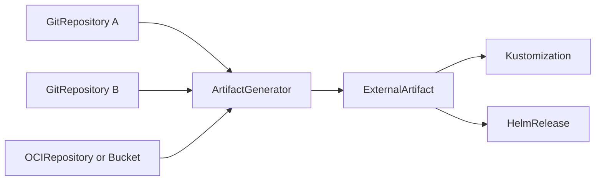

# How to Use ArtifactGenerator Resource in Flux CD

Author: [nawazdhandala](https://github.com/nawazdhandala)

Tags: Flux CD, Artifactgenerator, GitOps, Kubernetes, Automation, Helm, Kustomize

Description: Learn how to use the ArtifactGenerator resource in Flux CD to dynamically generate artifacts from multiple sources and streamline your GitOps pipelines.

---

## Introduction

The ArtifactGenerator resource in Flux CD allows you to create composite artifacts by combining multiple sources into a single deployable unit. This is particularly useful when you need to merge configurations from different repositories, generate deployment artifacts from selected paths, or create custom artifact pipelines that go beyond standard GitRepository or HelmRepository sources.

In this guide, we will walk through the ArtifactGenerator resource, its configuration options, and practical examples for real-world use cases.

## Prerequisites

Before you begin, ensure you have the following:

- A Kubernetes cluster
- Flux CD v2.7 or later installed
- The Flux source-watcher component enabled
- The ExternalArtifact feature gate enabled on kustomize-controller and helm-controller when consuming generated artifacts
- kubectl configured to access your cluster
- A Git repository for your Flux configurations

## Understanding ArtifactGenerator

The ArtifactGenerator is a Flux CD custom resource implemented by the source-watcher controller. It takes one or more source inputs and produces one or more ExternalArtifact resources. These generated artifacts can then be consumed by Kustomization or HelmRelease resources just like other Flux sources.


```mermaid
graph LR
    A[GitRepository A] --> D[ArtifactGenerator]
    B[GitRepository B] --> D
    C[OCIRepository or Bucket] --> D
    D --> E[ExternalArtifact]
    E --> F[Kustomization]
    E --> G[HelmRelease]
```

## Installing the ArtifactGenerator Controller

First, ensure the source-watcher component is available in your Flux installation:

```bash
# Include source-watcher when installing or upgrading Flux
flux install --components-extra=source-watcher
```

Check the controller status:

```bash
# Verify the source-watcher controller is running
kubectl get pods -n flux-system | grep source-watcher

# Check the CRD is installed
kubectl get crd artifactgenerators.source.extensions.fluxcd.io
```

## Basic ArtifactGenerator Configuration

Here is a basic ArtifactGenerator that combines files from two Git repositories into a generated ExternalArtifact:

```yaml
# artifact-generators/basic-generator.yaml
apiVersion: source.extensions.fluxcd.io/v1beta1
kind: ArtifactGenerator
metadata:
  name: combined-config
  namespace: flux-system
spec:
  # List of source inputs to use during artifact generation
  sources:
    # First input: application manifests
    - alias: app
      kind: GitRepository
      name: app-repo
      namespace: flux-system
    # Second input: shared configuration
    - alias: shared
      kind: GitRepository
      name: config-repo
      namespace: flux-system
  # Output artifacts to generate
  artifacts:
    - name: combined-config
      copy:
        # Copy only files from the manifests path
        - from: "@app/manifests/**"
          to: "@artifact/"
        # Copy shared configuration into the same artifact
        - from: "@shared/shared/**"
          to: "@artifact/shared/"
```

## Setting Up Source Repositories

Define the source repositories that the ArtifactGenerator will consume:

```yaml
# sources/app-repo.yaml
apiVersion: source.toolkit.fluxcd.io/v1
kind: GitRepository
metadata:
  name: app-repo
  namespace: flux-system
spec:
  interval: 5m
  url: https://github.com/your-org/app-manifests
  ref:
    branch: main
  secretRef:
    name: git-credentials
---
# sources/config-repo.yaml
apiVersion: source.toolkit.fluxcd.io/v1
kind: GitRepository
metadata:
  name: config-repo
  namespace: flux-system
spec:
  interval: 5m
  url: https://github.com/your-org/shared-config
  ref:
    branch: main
  secretRef:
    name: git-credentials
```

## Advanced ArtifactGenerator with Transformations

ArtifactGenerator does not run arbitrary Kustomize patches or filter transforms inside `spec.sources`. Instead, you select and arrange files with copy operations, `exclude` patterns, and copy strategies:

```yaml
# artifact-generators/transformed-generator.yaml
apiVersion: source.extensions.fluxcd.io/v1beta1
kind: ArtifactGenerator
metadata:
  name: env-specific-config
  namespace: flux-system
spec:
  sources:
    # Base configuration
    - alias: base
      kind: GitRepository
      name: app-repo
    # Environment-specific overlays
    - alias: env
      kind: GitRepository
      name: config-repo
  artifacts:
    - name: env-specific-config
      originRevision: "@env"
      copy:
        # Copy base manifests first
        - from: "@base/base/**"
          to: "@artifact/"
          exclude:
            - "**/test-*"
            - "**/*-dev.*"
        # Later copy operations can overwrite files copied earlier
        - from: "@env/overlays/production/**"
          to: "@artifact/"
```

## Using ArtifactGenerator with Helm Values

Generate a composed Helm chart artifact by copying a chart and merging environment-specific values:

```yaml
# artifact-generators/helm-values-generator.yaml
apiVersion: source.extensions.fluxcd.io/v1beta1
kind: ArtifactGenerator
metadata:
  name: helm-values-combined
  namespace: flux-system
spec:
  sources:
    # Packaged chart source
    - alias: chart
      kind: OCIRepository
      name: my-app-chart
    # Team-specific overrides
    - alias: team
      kind: GitRepository
      name: team-config
    # Secret manifests or sealed values stored in Git
    - alias: secrets
      kind: GitRepository
      name: sealed-secrets-repo
  artifacts:
    - name: my-app-composite
      originRevision: "@chart"
      copy:
        # Copy the chart contents into the generated artifact
        - from: "@chart/"
          to: "@artifact/"
        # Merge YAML values into the chart values file
        - from: "@team/helm-overrides/values.yaml"
          to: "@artifact/my-app/values.yaml"
          strategy: Merge
        - from: "@secrets/sealed-values/values.yaml"
          to: "@artifact/my-app/values.yaml"
          strategy: Merge
```

Now reference the generated ExternalArtifact in a HelmRelease. This requires the helm-controller `ExternalArtifact` feature gate:

```yaml
# releases/my-app.yaml
apiVersion: helm.toolkit.fluxcd.io/v2
kind: HelmRelease
metadata:
  name: my-app
  namespace: default
spec:
  interval: 10m
  chartRef:
    kind: ExternalArtifact
    name: my-app-composite
    namespace: flux-system
```

## Multi-Environment ArtifactGenerator

Create environment-specific artifacts using a single generator pattern:

```yaml
# artifact-generators/multi-env-generator.yaml
apiVersion: source.extensions.fluxcd.io/v1beta1
kind: ArtifactGenerator
metadata:
  name: production-bundle
  namespace: flux-system
spec:
  sources:
    # Shared base manifests
    - alias: platform
      kind: GitRepository
      name: platform-repo
    # Production secrets (encrypted)
    - alias: secrets
      kind: GitRepository
      name: secrets-repo
  artifacts:
    - name: production-bundle
      originRevision: "@platform"
      copy:
        - from: "@platform/base/**"
          to: "@artifact/"
        - from: "@platform/environments/production/**"
          to: "@artifact/"
        - from: "@secrets/production/**"
          to: "@artifact/secrets/"
```

## Consuming the Generated Artifact

Use the generated artifact in a Flux Kustomization. This requires the kustomize-controller `ExternalArtifact` feature gate:

```yaml
# clusters/production/apps.yaml
apiVersion: kustomize.toolkit.fluxcd.io/v1
kind: Kustomization
metadata:
  name: production-apps
  namespace: flux-system
spec:
  interval: 10m
  # Reference the generated ExternalArtifact as the source
  sourceRef:
    kind: ExternalArtifact
    name: production-bundle
  path: ./
  prune: true
  # Wait for dependencies before applying
  dependsOn:
    - name: infrastructure
  # Health checks for deployed resources
  healthChecks:
    - apiVersion: apps/v1
      kind: Deployment
      name: my-app
      namespace: default
```

## Monitoring ArtifactGenerator Status

Check the status of your ArtifactGenerator resources:

```bash
# List all ArtifactGenerators and their status
flux get artifact generators

# Describe a specific ArtifactGenerator for detailed status
kubectl describe artifactgenerator combined-config -n flux-system

# Check events for troubleshooting
kubectl events -n flux-system --for artifactgenerator/combined-config

# Print the ExternalArtifacts managed by an ArtifactGenerator
flux tree artifact generator combined-config
```

## Setting Up Alerts for ArtifactGenerator

Configure alerts for generation failures:

```yaml
# monitoring/artifact-alerts.yaml
apiVersion: notification.toolkit.fluxcd.io/v1beta3
kind: Provider
metadata:
  name: slack-provider
  namespace: flux-system
spec:
  type: slack
  channel: gitops-alerts
  address: https://slack.com/api/chat.postMessage
  secretRef:
    name: slack-bot-token
---
apiVersion: notification.toolkit.fluxcd.io/v1beta3
kind: Alert
metadata:
  name: artifact-generator-alerts
  namespace: flux-system
spec:
  # Send alerts on error events
  eventSeverity: error
  # Watch ArtifactGenerator resources
  eventSources:
    - kind: ArtifactGenerator
      name: "*"
      namespace: flux-system
  # Send to Slack
  providerRef:
    name: slack-provider
```

## Troubleshooting Common Issues

### Input Source Not Ready

If an input source is not available, the ArtifactGenerator will report an error:

```bash
# Check if all referenced sources are ready
kubectl get gitrepositories -n flux-system

# Force reconciliation of a source
flux reconcile source git app-repo
```

### Merge Conflicts

When inputs have conflicting files, copy order and copy strategy determine behavior:

```yaml
# Later copy operations can overwrite files copied earlier
spec:
  artifacts:
    - name: combined-config
      copy:
        - from: "@base/deployments/**"
          to: "@artifact/deployments/"
        - from: "@team/deployments/**"
          to: "@artifact/deployments/"
        # Use Merge only for YAML files that should be merged
        - from: "@team/values-prod.yaml"
          to: "@artifact/charts/my-app/values.yaml"
          strategy: Merge
```

### Forcing Regeneration

To force an immediate regeneration:

```bash
# Annotate the resource to trigger reconciliation
kubectl annotate artifactgenerator combined-config \
  reconcile.fluxcd.io/requestedAt="$(date +%s)" \
  -n flux-system --overwrite
```

## Best Practices

1. **Keep inputs focused**: Each input source should have a clear purpose. Avoid mixing unrelated configurations in a single ArtifactGenerator.

2. **Use meaningful aliases**: Name your source aliases descriptively so copy operations and artifact origins are clear.

3. **Rely on source intervals**: ArtifactGenerator reacts to source changes, so set appropriate intervals on the referenced GitRepository, OCIRepository, Bucket, HelmChart, or ExternalArtifact resources.

4. **Monitor generation metrics**: Track generation duration and failure rates to identify bottlenecks.

5. **Version your generators**: Store ArtifactGenerator definitions in Git alongside your other Flux resources.

6. **Test copy and merge behavior**: Before deploying to production, test your copy order and Merge strategies in a staging environment to avoid unexpected configuration conflicts.

## Conclusion

The ArtifactGenerator resource in Flux CD provides a powerful way to compose artifacts from multiple sources and generate environment-specific ExternalArtifact resources. By leveraging this resource, you can keep your source repositories focused and modular while still producing the exact configuration bundles each environment needs. Combined with Flux CD's reconciliation loop, ArtifactGenerator ensures your generated artifacts stay up to date as upstream sources change.
