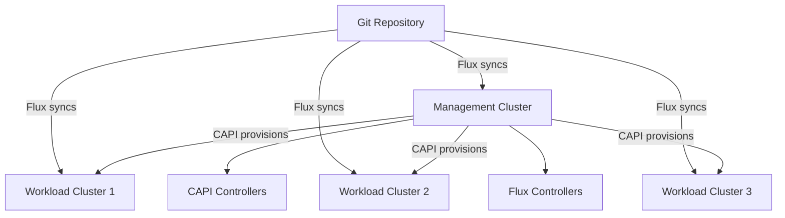

# How to Use Cluster API with Flux CD

Author: [nawazdhandala](https://github.com/nawazdhandala)

Tags: flux cd, cluster api, gitops, kubernetes, multi-cluster, infrastructure as code

Description: Learn how to use Cluster API (CAPI) with Flux CD to declaratively provision and manage Kubernetes clusters through GitOps workflows.

---

## Introduction

Cluster API (CAPI) is a Kubernetes sub-project that brings declarative, Kubernetes-style APIs to cluster creation, configuration, and management. When combined with Flux CD, you can manage your entire fleet of Kubernetes clusters through Git: commit a cluster definition, and CAPI provisions it; commit workload definitions, and Flux deploys them.

This guide shows how to set up a management cluster with CAPI and Flux CD, provision workload clusters, and automatically bootstrap Flux on each new cluster.

## Prerequisites

- A management Kubernetes cluster (can be a local kind cluster for testing)
- Flux CD installed on the management cluster
- clusterctl CLI installed
- kubectl and flux CLI installed
- Cloud provider credentials (AWS examples used here)

## Architecture Overview



## Setting Up the Management Cluster

Initialize CAPI on the management cluster with the AWS infrastructure provider.

```bash
# Set AWS environment variables for CAPI
export AWS_REGION=us-east-1
export AWS_ACCESS_KEY_ID=<your-access-key>
export AWS_SECRET_ACCESS_KEY=<your-secret-key>

# Encode credentials for CAPI
export AWS_B64ENCODED_CREDENTIALS=$(clusterawsadm bootstrap credentials encode-as-profile)

# Initialize CAPI with the AWS provider
clusterctl init --infrastructure aws
```

## Installing CAPI via Flux

Instead of using clusterctl directly, manage CAPI installation through Flux for full GitOps.

```yaml
# infrastructure/capi/namespace.yaml
# Namespace for CAPI system components
apiVersion: v1
kind: Namespace
metadata:
  name: capi-system
---
apiVersion: v1
kind: Namespace
metadata:
  name: capa-system
```

```yaml
# infrastructure/capi/helmrepository.yaml
# Helm repositories for CAPI components
apiVersion: source.toolkit.fluxcd.io/v1
kind: HelmRepository
metadata:
  name: capi
  namespace: flux-system
spec:
  interval: 1h
  url: https://kubernetes-sigs.github.io/cluster-api
---
apiVersion: source.toolkit.fluxcd.io/v1
kind: HelmRepository
metadata:
  name: capi-aws
  namespace: flux-system
spec:
  interval: 1h
  url: https://kubernetes-sigs.github.io/cluster-api-provider-aws
```

```yaml
# infrastructure/capi/core-helmrelease.yaml
# Install CAPI core controllers
apiVersion: helm.toolkit.fluxcd.io/v2
kind: HelmRelease
metadata:
  name: capi-controller
  namespace: capi-system
spec:
  interval: 15m
  chart:
    spec:
      chart: cluster-api
      version: "1.9.x"
      sourceRef:
        kind: HelmRepository
        name: capi
        namespace: flux-system
  values:
    # Core CAPI controller configuration
    core:
      resources:
        requests:
          cpu: 100m
          memory: 128Mi
    # Bootstrap provider for kubeadm
    kubeadmBootstrap:
      enabled: true
    # Control plane provider for kubeadm
    kubeadmControlPlane:
      enabled: true
```

```yaml
# infrastructure/capi/aws-helmrelease.yaml
# Install AWS infrastructure provider
apiVersion: helm.toolkit.fluxcd.io/v2
kind: HelmRelease
metadata:
  name: capi-aws-controller
  namespace: capa-system
spec:
  interval: 15m
  chart:
    spec:
      chart: cluster-api-provider-aws
      version: "2.7.x"
      sourceRef:
        kind: HelmRepository
        name: capi-aws
        namespace: flux-system
  values:
    # AWS provider configuration
    manager:
      resources:
        requests:
          cpu: 100m
          memory: 256Mi
```

## Defining Workload Clusters

Create cluster definitions as YAML manifests in Git.

```yaml
# clusters/definitions/production-east.yaml
# Define a production Kubernetes cluster on AWS
apiVersion: cluster.x-k8s.io/v1beta1
kind: Cluster
metadata:
  name: production-east
  namespace: default
  labels:
    environment: production
    region: us-east-1
spec:
  clusterNetwork:
    pods:
      cidrBlocks:
        - 192.168.0.0/16
    services:
      cidrBlocks:
        - 10.128.0.0/12
  controlPlaneRef:
    apiVersion: controlplane.cluster.x-k8s.io/v1beta1
    kind: KubeadmControlPlane
    name: production-east-control-plane
  infrastructureRef:
    apiVersion: infrastructure.cluster.x-k8s.io/v1beta2
    kind: AWSCluster
    name: production-east
---
# AWS-specific cluster configuration
apiVersion: infrastructure.cluster.x-k8s.io/v1beta2
kind: AWSCluster
metadata:
  name: production-east
  namespace: default
spec:
  region: us-east-1
  sshKeyName: capi-cluster-key
  # Use existing VPC or let CAPI create one
  network:
    vpc:
      cidrBlock: 10.0.0.0/16
    subnets:
      - availabilityZone: us-east-1a
        cidrBlock: 10.0.1.0/24
        isPublic: true
      - availabilityZone: us-east-1a
        cidrBlock: 10.0.2.0/24
        isPublic: false
```

## Defining the Control Plane

Configure the Kubernetes control plane for the workload cluster.

```yaml
# clusters/definitions/production-east-control-plane.yaml
# Kubeadm control plane configuration
apiVersion: controlplane.cluster.x-k8s.io/v1beta1
kind: KubeadmControlPlane
metadata:
  name: production-east-control-plane
  namespace: default
spec:
  # Number of control plane replicas (use odd numbers)
  replicas: 3
  version: v1.31.0
  machineTemplate:
    infrastructureRef:
      apiVersion: infrastructure.cluster.x-k8s.io/v1beta2
      kind: AWSMachineTemplate
      name: production-east-control-plane
  kubeadmConfigSpec:
    # Control plane kubeadm configuration
    clusterConfiguration:
      apiServer:
        extraArgs:
          # Enable audit logging
          audit-log-maxage: "30"
          audit-log-maxbackup: "10"
          audit-log-maxsize: "100"
    initConfiguration:
      nodeRegistration:
        name: "{{ ds.meta_data.local_hostname }}"
        kubeletExtraArgs:
          # Use the cloud provider for node identification
          cloud-provider: external
    joinConfiguration:
      nodeRegistration:
        name: "{{ ds.meta_data.local_hostname }}"
        kubeletExtraArgs:
          cloud-provider: external
---
# Machine template for control plane nodes
apiVersion: infrastructure.cluster.x-k8s.io/v1beta2
kind: AWSMachineTemplate
metadata:
  name: production-east-control-plane
  namespace: default
spec:
  template:
    spec:
      instanceType: t3.large
      iamInstanceProfile: control-plane.cluster-api-provider-aws.sigs.k8s.io
      # Use a specific AMI or let CAPI discover one
      sshKeyName: capi-cluster-key
      rootVolume:
        size: 50
        type: gp3
```

## Defining Worker Nodes

Configure the worker node pool using MachineDeployment.

```yaml
# clusters/definitions/production-east-workers.yaml
# Worker node machine deployment
apiVersion: cluster.x-k8s.io/v1beta1
kind: MachineDeployment
metadata:
  name: production-east-workers
  namespace: default
spec:
  clusterName: production-east
  replicas: 3
  selector:
    matchLabels: {}
  template:
    spec:
      clusterName: production-east
      version: v1.31.0
      bootstrap:
        configRef:
          apiVersion: bootstrap.cluster.x-k8s.io/v1beta1
          kind: KubeadmConfigTemplate
          name: production-east-workers
      infrastructureRef:
        apiVersion: infrastructure.cluster.x-k8s.io/v1beta2
        kind: AWSMachineTemplate
        name: production-east-workers
---
# Kubeadm configuration for worker nodes
apiVersion: bootstrap.cluster.x-k8s.io/v1beta1
kind: KubeadmConfigTemplate
metadata:
  name: production-east-workers
  namespace: default
spec:
  template:
    spec:
      joinConfiguration:
        nodeRegistration:
          name: "{{ ds.meta_data.local_hostname }}"
          kubeletExtraArgs:
            cloud-provider: external
---
# Machine template for worker nodes
apiVersion: infrastructure.cluster.x-k8s.io/v1beta2
kind: AWSMachineTemplate
metadata:
  name: production-east-workers
  namespace: default
spec:
  template:
    spec:
      instanceType: t3.xlarge
      iamInstanceProfile: nodes.cluster-api-provider-aws.sigs.k8s.io
      sshKeyName: capi-cluster-key
      rootVolume:
        size: 100
        type: gp3
```

## Syncing Cluster Definitions with Flux

Create Flux Kustomizations to sync the cluster definitions.

```yaml
# clusters/management/cluster-definitions.yaml
# Flux Kustomization to sync workload cluster definitions
apiVersion: kustomize.toolkit.fluxcd.io/v1
kind: Kustomization
metadata:
  name: cluster-definitions
  namespace: flux-system
spec:
  interval: 5m
  sourceRef:
    kind: GitRepository
    name: flux-system
  path: ./clusters/definitions
  prune: true
  # Wait for CAPI controllers to be ready
  dependsOn:
    - name: capi-infrastructure
  # Give clusters time to provision
  timeout: "30m"
```

## Auto-Bootstrapping Flux on Workload Clusters

Use CAPI's ClusterResourceSet to automatically install Flux on new clusters.

```yaml
# infrastructure/capi/flux-bootstrap-set.yaml
# Automatically install Flux on every new workload cluster
apiVersion: addons.cluster.x-k8s.io/v1beta1
kind: ClusterResourceSet
metadata:
  name: flux-bootstrap
  namespace: default
spec:
  # Apply to all clusters with the gitops label
  clusterSelector:
    matchLabels:
      gitops: flux
  resources:
    - kind: ConfigMap
      name: flux-install-manifests
  strategy: Reconcile
---
# ConfigMap containing Flux installation manifests
apiVersion: v1
kind: ConfigMap
metadata:
  name: flux-install-manifests
  namespace: default
data:
  flux-namespace.yaml: |
    apiVersion: v1
    kind: Namespace
    metadata:
      name: flux-system
  # Additional Flux manifests would be included here
  # In practice, use a Helm chart or kustomize to generate these
```

## Monitoring Cluster Provisioning

Check the status of your clusters.

```bash
# List all CAPI clusters
kubectl get clusters -A

# Check cluster provisioning status
kubectl describe cluster production-east

# View machine status
kubectl get machines -A

# Check control plane status
kubectl get kubeadmcontrolplane -A

# View worker node status
kubectl get machinedeployment -A

# Get the kubeconfig for a workload cluster
clusterctl get kubeconfig production-east > production-east.kubeconfig

# Verify Flux on the workload cluster
KUBECONFIG=production-east.kubeconfig kubectl get pods -n flux-system
```

## Scaling Clusters Through Git

To scale a cluster, update the YAML in Git and let Flux sync the change.

```yaml
# clusters/definitions/production-east-workers.yaml
# Update the replica count to scale the worker pool
apiVersion: cluster.x-k8s.io/v1beta1
kind: MachineDeployment
metadata:
  name: production-east-workers
  namespace: default
spec:
  clusterName: production-east
  # Scaled from 3 to 5 workers
  replicas: 5
  # ... rest of spec unchanged
```

```bash
# Commit and push the change
git add clusters/definitions/production-east-workers.yaml
git commit -m "Scale production-east workers to 5 replicas"
git push

# Flux will detect the change and apply it
# CAPI will then provision the additional worker nodes
flux reconcile kustomization cluster-definitions
```

## Conclusion

Cluster API and Flux CD together enable a fully declarative approach to managing Kubernetes clusters at scale. Every cluster is defined as YAML in Git, provisioned by CAPI, and kept in sync by Flux. Scaling, upgrading, or adding new clusters is a Git commit away. This approach brings the same GitOps benefits you use for applications (pull requests, audit trails, rollback) to the clusters themselves.
