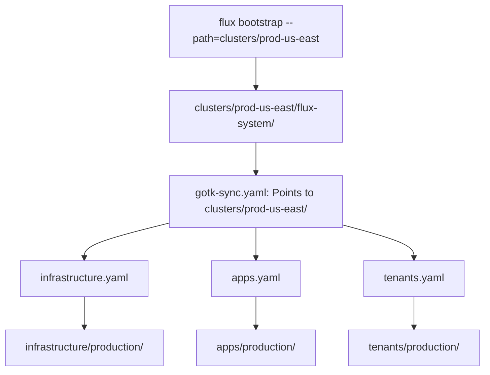

# How to Use a Cluster Directory Structure with Flux CD

Author: [nawazdhandala](https://github.com/nawazdhandala)

Tags: flux cd, cluster management, directory structure, multi-cluster, gitops, kubernetes, best practices

Description: A practical guide to organizing your Flux CD repository around cluster directories for managing multiple Kubernetes clusters with clear separation and consistent deployments.

---

## Introduction

When managing multiple Kubernetes clusters with Flux CD, the cluster directory structure is the entry point that ties everything together. Each cluster gets its own directory that defines which infrastructure and applications should be deployed, how they are configured, and what dependencies exist between components. Getting the cluster directory structure right is essential for scalable multi-cluster management.

This guide covers how to design and implement a cluster directory structure that supports multiple environments, regions, and deployment tiers.

## The Role of the Cluster Directory

The cluster directory serves as the bootstrap entry point for Flux CD. When you run `flux bootstrap`, you point Flux to a specific cluster directory. That directory contains the Kustomization resources that tell Flux what to reconcile.



## Basic Cluster Directory Layout

```
clusters/
├── production-us-east-1/
│   ├── flux-system/
│   │   ├── gotk-components.yaml
│   │   ├── gotk-sync.yaml
│   │   └── kustomization.yaml
│   ├── infrastructure.yaml
│   ├── apps.yaml
│   └── cluster-settings.yaml
├── production-eu-west-1/
│   ├── flux-system/
│   ├── infrastructure.yaml
│   ├── apps.yaml
│   └── cluster-settings.yaml
├── staging/
│   ├── flux-system/
│   ├── infrastructure.yaml
│   ├── apps.yaml
│   └── cluster-settings.yaml
└── development/
    ├── flux-system/
    ├── infrastructure.yaml
    ├── apps.yaml
    └── cluster-settings.yaml
```

## Bootstrapping a Cluster

Each cluster is bootstrapped independently, pointing to its own directory:

```bash
# Bootstrap the production US East cluster
flux bootstrap github \
  --owner=my-org \
  --repository=fleet-infra \
  --branch=main \
  --path=clusters/production-us-east-1 \
  --personal=false

# Bootstrap the staging cluster
flux bootstrap github \
  --owner=my-org \
  --repository=fleet-infra \
  --branch=main \
  --path=clusters/staging \
  --personal=false

# Bootstrap the development cluster
flux bootstrap github \
  --owner=my-org \
  --repository=fleet-infra \
  --branch=main \
  --path=clusters/development \
  --personal=false
```

## Cluster-Level Kustomization Files

### Infrastructure Kustomization

```yaml
# clusters/production-us-east-1/infrastructure.yaml
apiVersion: kustomize.toolkit.fluxcd.io/v1
kind: Kustomization
metadata:
  name: infrastructure
  namespace: flux-system
spec:
  interval: 10m
  retryInterval: 1m
  timeout: 5m
  sourceRef:
    kind: GitRepository
    name: flux-system
  path: ./infrastructure/production
  prune: true
  wait: true
  # Decrypt SOPS-encrypted secrets
  decryption:
    provider: sops
    secretRef:
      name: sops-age
```

### Applications Kustomization

```yaml
# clusters/production-us-east-1/apps.yaml
apiVersion: kustomize.toolkit.fluxcd.io/v1
kind: Kustomization
metadata:
  name: apps
  namespace: flux-system
spec:
  interval: 10m
  retryInterval: 1m
  timeout: 5m
  sourceRef:
    kind: GitRepository
    name: flux-system
  path: ./apps/production
  prune: true
  dependsOn:
    - name: infrastructure
  # Cluster-specific variable substitution
  postBuild:
    substitute:
      CLUSTER_NAME: production-us-east-1
      REGION: us-east-1
      ENVIRONMENT: production
    substituteFrom:
      - kind: ConfigMap
        name: cluster-settings
```

### Cluster Settings ConfigMap

```yaml
# clusters/production-us-east-1/cluster-settings.yaml
apiVersion: v1
kind: ConfigMap
metadata:
  name: cluster-settings
  namespace: flux-system
data:
  # Cluster identity
  CLUSTER_NAME: "production-us-east-1"
  REGION: "us-east-1"
  ENVIRONMENT: "production"
  # DNS settings
  DOMAIN: "us-east-1.prod.example.com"
  # Cloud provider settings
  CLOUD_PROVIDER: "aws"
  STORAGE_CLASS: "gp3"
  LOAD_BALANCER_TYPE: "nlb"
```

## Cluster-Specific Overrides

Some clusters need additional resources or different configurations. Use cluster-specific overlays:

```
clusters/
├── production-us-east-1/
│   ├── flux-system/
│   ├── infrastructure.yaml
│   ├── apps.yaml
│   ├── cluster-settings.yaml
│   └── cluster-overrides/
│       ├── kustomization.yaml
│       └── additional-monitoring.yaml
```

```yaml
# clusters/production-us-east-1/cluster-overrides.yaml
apiVersion: kustomize.toolkit.fluxcd.io/v1
kind: Kustomization
metadata:
  name: cluster-overrides
  namespace: flux-system
spec:
  interval: 10m
  sourceRef:
    kind: GitRepository
    name: flux-system
  path: ./clusters/production-us-east-1/cluster-overrides
  prune: true
  dependsOn:
    - name: infrastructure
```

## Multi-Region Cluster Pattern

For organizations with clusters in multiple regions, use a naming convention that encodes the environment and region:

```
clusters/
├── prod-us-east-1/
├── prod-us-west-2/
├── prod-eu-west-1/
├── prod-ap-southeast-1/
├── staging-us-east-1/
└── dev-us-east-1/
```

Each regional cluster points to the same environment overlay but with different cluster settings:

```yaml
# clusters/prod-us-west-2/cluster-settings.yaml
apiVersion: v1
kind: ConfigMap
metadata:
  name: cluster-settings
  namespace: flux-system
data:
  CLUSTER_NAME: "prod-us-west-2"
  REGION: "us-west-2"
  ENVIRONMENT: "production"
  DOMAIN: "us-west-2.prod.example.com"
  CLOUD_PROVIDER: "aws"
  # Region-specific storage class
  STORAGE_CLASS: "gp3"
  # Region-specific backup bucket
  BACKUP_BUCKET: "backups-us-west-2"
```

## Tiered Cluster Pattern

For organizations with different cluster tiers (critical vs non-critical):

```
clusters/
├── tier-1/                    # Mission-critical production clusters
│   ├── prod-primary/
│   └── prod-dr/
├── tier-2/                    # Standard production clusters
│   ├── prod-internal/
│   └── prod-batch/
├── tier-3/                    # Non-production clusters
│   ├── staging/
│   └── development/
```

Tier-1 clusters might have stricter reconciliation intervals and additional monitoring:

```yaml
# clusters/tier-1/prod-primary/infrastructure.yaml
apiVersion: kustomize.toolkit.fluxcd.io/v1
kind: Kustomization
metadata:
  name: infrastructure
  namespace: flux-system
spec:
  # Shorter interval for critical clusters
  interval: 5m
  retryInterval: 30s
  timeout: 10m
  sourceRef:
    kind: GitRepository
    name: flux-system
  path: ./infrastructure/production
  prune: true
  wait: true
  # Health checks with longer timeout for critical services
  healthChecks:
    - apiVersion: apps/v1
      kind: Deployment
      name: ingress-nginx-controller
      namespace: ingress-system
    - apiVersion: apps/v1
      kind: Deployment
      name: cert-manager
      namespace: cert-manager
```

## Shared Cluster Definitions with a Template

To reduce duplication across similar clusters, use a cluster template pattern:

```
clusters/
├── _templates/
│   ├── production-cluster/
│   │   ├── infrastructure.yaml
│   │   ├── apps.yaml
│   │   └── monitoring.yaml
│   └── staging-cluster/
│       ├── infrastructure.yaml
│       └── apps.yaml
├── prod-us-east-1/
│   ├── flux-system/
│   ├── kustomization.yaml     # References the template
│   └── cluster-settings.yaml
└── prod-eu-west-1/
    ├── flux-system/
    ├── kustomization.yaml
    └── cluster-settings.yaml
```

```yaml
# clusters/prod-us-east-1/kustomization.yaml
# This is a kustomize file that pulls from the template
apiVersion: kustomize.config.k8s.io/v1beta1
kind: Kustomization
resources:
  - ../_templates/production-cluster/infrastructure.yaml
  - ../_templates/production-cluster/apps.yaml
  - ../_templates/production-cluster/monitoring.yaml
  - cluster-settings.yaml
```

## Cluster Lifecycle Management

### Adding a New Cluster

```bash
#!/bin/bash
# add-cluster.sh - Add a new cluster to the fleet
# Usage: ./add-cluster.sh <cluster-name> <environment> <region>

set -euo pipefail

CLUSTER_NAME=$1
ENVIRONMENT=$2
REGION=$3

REPO_ROOT="/path/to/fleet-infra"
CLUSTER_DIR="${REPO_ROOT}/clusters/${CLUSTER_NAME}"

echo "Creating cluster directory for: ${CLUSTER_NAME}"

# Create the cluster directory
mkdir -p "${CLUSTER_DIR}"

# Generate cluster settings
cat > "${CLUSTER_DIR}/cluster-settings.yaml" << EOF
apiVersion: v1
kind: ConfigMap
metadata:
  name: cluster-settings
  namespace: flux-system
data:
  CLUSTER_NAME: "${CLUSTER_NAME}"
  REGION: "${REGION}"
  ENVIRONMENT: "${ENVIRONMENT}"
  DOMAIN: "${REGION}.${ENVIRONMENT}.example.com"
EOF

# Generate infrastructure Kustomization
cat > "${CLUSTER_DIR}/infrastructure.yaml" << EOF
apiVersion: kustomize.toolkit.fluxcd.io/v1
kind: Kustomization
metadata:
  name: infrastructure
  namespace: flux-system
spec:
  interval: 10m
  sourceRef:
    kind: GitRepository
    name: flux-system
  path: ./infrastructure/${ENVIRONMENT}
  prune: true
  wait: true
EOF

# Generate apps Kustomization
cat > "${CLUSTER_DIR}/apps.yaml" << EOF
apiVersion: kustomize.toolkit.fluxcd.io/v1
kind: Kustomization
metadata:
  name: apps
  namespace: flux-system
spec:
  interval: 10m
  sourceRef:
    kind: GitRepository
    name: flux-system
  path: ./apps/${ENVIRONMENT}
  prune: true
  dependsOn:
    - name: infrastructure
  postBuild:
    substituteFrom:
      - kind: ConfigMap
        name: cluster-settings
EOF

echo "Cluster directory created at: ${CLUSTER_DIR}"
echo "Next: Run 'flux bootstrap' pointing to this directory"
```

### Decommissioning a Cluster

```bash
#!/bin/bash
# remove-cluster.sh - Remove a cluster from the fleet
# Usage: ./remove-cluster.sh <cluster-name>

set -euo pipefail

CLUSTER_NAME=$1
REPO_ROOT="/path/to/fleet-infra"
CLUSTER_DIR="${REPO_ROOT}/clusters/${CLUSTER_NAME}"

echo "WARNING: This will remove cluster ${CLUSTER_NAME} from the fleet."
echo "Make sure the cluster itself has been drained and deleted first."
read -p "Continue? (y/n) " -n 1 -r
echo

if [[ $REPLY =~ ^[Yy]$ ]]; then
  # Remove the cluster directory
  rm -rf "${CLUSTER_DIR}"
  echo "Cluster directory removed: ${CLUSTER_DIR}"
  echo "Commit and push to complete the removal."
fi
```

## Validating Cluster Configurations

```bash
#!/bin/bash
# validate-clusters.sh - Validate all cluster configurations

set -euo pipefail

REPO_ROOT="$(git rev-parse --show-toplevel)"
ERRORS=0

for cluster_dir in "${REPO_ROOT}"/clusters/*/; do
  CLUSTER_NAME=$(basename "$cluster_dir")

  # Skip templates
  if [[ "$CLUSTER_NAME" == _* ]]; then
    continue
  fi

  echo "Validating cluster: ${CLUSTER_NAME}"

  # Check required files exist
  for required_file in infrastructure.yaml apps.yaml cluster-settings.yaml; do
    if [ ! -f "${cluster_dir}${required_file}" ]; then
      echo "  MISSING: ${required_file}"
      ERRORS=$((ERRORS + 1))
    fi
  done

  # Validate YAML syntax
  for yaml_file in "${cluster_dir}"*.yaml; do
    if ! yq eval '.' "$yaml_file" > /dev/null 2>&1; then
      echo "  INVALID YAML: $(basename "$yaml_file")"
      ERRORS=$((ERRORS + 1))
    fi
  done

  # Verify cluster-settings has required fields
  REQUIRED_VARS="CLUSTER_NAME REGION ENVIRONMENT"
  for var in $REQUIRED_VARS; do
    if ! grep -q "$var" "${cluster_dir}cluster-settings.yaml" 2>/dev/null; then
      echo "  MISSING VAR: ${var} in cluster-settings.yaml"
      ERRORS=$((ERRORS + 1))
    fi
  done

  echo "  OK"
done

if [ $ERRORS -gt 0 ]; then
  echo "Validation failed with ${ERRORS} errors"
  exit 1
fi

echo "All cluster configurations validated successfully"
```

## Best Practices

1. **One directory per cluster** - Each cluster should have exactly one directory, even if clusters share configurations through templates.
2. **Use consistent naming** - Encode environment and region in the directory name (e.g., `prod-us-east-1`).
3. **Keep cluster directories thin** - Cluster directories should mostly contain Flux Kustomization pointers, not raw manifests.
4. **Use cluster-settings ConfigMap** - Store cluster-specific variables in a ConfigMap for post-build substitution.
5. **Template common patterns** - Use a `_templates` directory to reduce duplication across similar clusters.
6. **Validate in CI** - Check that all cluster directories have the required files and valid YAML.
7. **Document cluster tiers** - Make it clear which clusters are mission-critical and which are not.
8. **Automate lifecycle operations** - Use scripts for adding and removing clusters to ensure consistency.

## Conclusion

The cluster directory structure is the foundation of multi-cluster management with Flux CD. By giving each cluster its own entry point with clear references to shared infrastructure and application layers, you create a scalable and maintainable system. Whether you manage 2 clusters or 200, the patterns in this guide -- cluster settings, templates, tiered management, and automated lifecycle scripts -- will keep your Flux CD repository organized and your deployments consistent.
