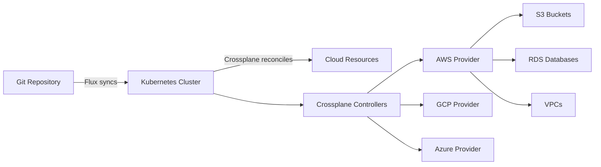

# How to Use Crossplane with Flux CD for Infrastructure

Author: [nawazdhandala](https://github.com/nawazdhandala)

Tags: Flux CD, Crossplane, GitOps, Kubernetes, Infrastructure as Code, cloud resources

Description: Learn how to combine Crossplane and Flux CD to provision and manage cloud infrastructure resources using Kubernetes-native GitOps workflows.

---

## Introduction

Crossplane extends Kubernetes with the ability to provision and manage cloud infrastructure using Kubernetes custom resources. When paired with Flux CD, you get a fully GitOps-driven infrastructure management workflow: define your cloud resources as YAML in Git, and both Crossplane and Flux work together to make reality match your desired state.

This guide walks through installing Crossplane with Flux, configuring cloud providers, and provisioning real cloud resources through Git.

## Prerequisites

- A Kubernetes cluster (v1.28+)
- Flux CD installed and bootstrapped
- An AWS account (examples use AWS, adaptable to GCP/Azure)
- kubectl and flux CLI installed

## Architecture Overview



## Installing Crossplane with Flux

Create a HelmRelease to install Crossplane through Flux.

```yaml
# infrastructure/crossplane/namespace.yaml
# Dedicated namespace for Crossplane system components
apiVersion: v1
kind: Namespace
metadata:
  name: crossplane-system
  labels:
    app.kubernetes.io/managed-by: flux
```

```yaml
# infrastructure/crossplane/helmrepository.yaml
# Helm repository source for Crossplane charts
apiVersion: source.toolkit.fluxcd.io/v1
kind: HelmRepository
metadata:
  name: crossplane
  namespace: flux-system
spec:
  interval: 1h
  url: https://charts.crossplane.io/stable
```

```yaml
# infrastructure/crossplane/helmrelease.yaml
# Install Crossplane using the Helm chart
apiVersion: helm.toolkit.fluxcd.io/v2
kind: HelmRelease
metadata:
  name: crossplane
  namespace: crossplane-system
spec:
  interval: 15m
  chart:
    spec:
      chart: crossplane
      version: "1.17.x"
      sourceRef:
        kind: HelmRepository
        name: crossplane
        namespace: flux-system
  values:
    # Enable resource requests for production stability
    resourcesCrossplane:
      requests:
        cpu: 100m
        memory: 256Mi
    resourcesRBACManager:
      requests:
        cpu: 50m
        memory: 128Mi
    # Enable external secret stores for credential management
    args:
      - --enable-external-secret-stores
```

## Installing the AWS Provider

Configure Crossplane to manage AWS resources.

```yaml
# infrastructure/crossplane/providers/aws-provider.yaml
# Install the AWS provider for Crossplane
apiVersion: pkg.crossplane.io/v1
kind: Provider
metadata:
  name: provider-aws-s3
spec:
  # Use the official Upbound AWS S3 provider
  package: xpkg.upbound.io/upbound/provider-aws-s3:v1.14.0
  runtimeConfigRef:
    name: default
---
# Install the AWS provider for EC2 resources
apiVersion: pkg.crossplane.io/v1
kind: Provider
metadata:
  name: provider-aws-ec2
spec:
  package: xpkg.upbound.io/upbound/provider-aws-ec2:v1.14.0
---
# Install the AWS provider for RDS resources
apiVersion: pkg.crossplane.io/v1
kind: Provider
metadata:
  name: provider-aws-rds
spec:
  package: xpkg.upbound.io/upbound/provider-aws-rds:v1.14.0
```

## Configuring AWS Credentials

Create a Kubernetes secret with AWS credentials and a ProviderConfig.

```bash
# Create a secret with AWS credentials
# In production, use IRSA (IAM Roles for Service Accounts) instead
kubectl create secret generic aws-creds \
  -n crossplane-system \
  --from-file=creds=./aws-credentials.txt
```

```yaml
# infrastructure/crossplane/providers/aws-provider-config.yaml
# Configure how Crossplane authenticates with AWS
apiVersion: aws.upbound.io/v1beta1
kind: ProviderConfig
metadata:
  name: default
spec:
  credentials:
    source: Secret
    secretRef:
      namespace: crossplane-system
      name: aws-creds
      key: creds
```

## Deploying the Crossplane Stack with Flux

Create a Flux Kustomization to manage the Crossplane installation.

```yaml
# clusters/production/infrastructure.yaml
# Kustomization that deploys Crossplane and its providers
apiVersion: kustomize.toolkit.fluxcd.io/v1
kind: Kustomization
metadata:
  name: crossplane
  namespace: flux-system
spec:
  interval: 10m
  sourceRef:
    kind: GitRepository
    name: flux-system
  path: ./infrastructure/crossplane
  prune: true
  wait: true
  # Health checks to verify Crossplane is operational
  healthChecks:
    - apiVersion: apps/v1
      kind: Deployment
      name: crossplane
      namespace: crossplane-system
    - apiVersion: apps/v1
      kind: Deployment
      name: crossplane-rbac-manager
      namespace: crossplane-system
```

```yaml
# clusters/production/crossplane-providers.yaml
# Deploy Crossplane providers after Crossplane is ready
apiVersion: kustomize.toolkit.fluxcd.io/v1
kind: Kustomization
metadata:
  name: crossplane-providers
  namespace: flux-system
spec:
  interval: 10m
  sourceRef:
    kind: GitRepository
    name: flux-system
  path: ./infrastructure/crossplane/providers
  prune: true
  # Wait for Crossplane to be installed first
  dependsOn:
    - name: crossplane
  # Give providers time to install and become healthy
  timeout: "10m"
```

## Provisioning Cloud Resources

Now define cloud resources as Kubernetes manifests in Git. Flux syncs them, Crossplane provisions them.

```yaml
# infrastructure/cloud-resources/s3-bucket.yaml
# Create an S3 bucket for application data
apiVersion: s3.aws.upbound.io/v1beta2
kind: Bucket
metadata:
  name: my-app-data-bucket
  labels:
    environment: production
    managed-by: crossplane
spec:
  forProvider:
    region: us-east-1
    # Enable versioning for data protection
    tags:
      Environment: production
      Team: platform
      ManagedBy: crossplane-flux
  providerConfigRef:
    name: default
---
# Configure bucket versioning
apiVersion: s3.aws.upbound.io/v1beta1
kind: BucketVersioning
metadata:
  name: my-app-data-versioning
spec:
  forProvider:
    bucketRef:
      name: my-app-data-bucket
    region: us-east-1
    versioningConfiguration:
      - status: Enabled
  providerConfigRef:
    name: default
---
# Configure server-side encryption
apiVersion: s3.aws.upbound.io/v1beta1
kind: BucketServerSideEncryptionConfiguration
metadata:
  name: my-app-data-encryption
spec:
  forProvider:
    bucketRef:
      name: my-app-data-bucket
    region: us-east-1
    rule:
      - applyServerSideEncryptionByDefault:
          - sseAlgorithm: aws:kms
  providerConfigRef:
    name: default
```

## Provisioning a VPC

Define a complete VPC setup in Git.

```yaml
# infrastructure/cloud-resources/vpc.yaml
# Create a VPC for the application workloads
apiVersion: ec2.aws.upbound.io/v1beta1
kind: VPC
metadata:
  name: production-vpc
  labels:
    network: production
spec:
  forProvider:
    region: us-east-1
    cidrBlock: 10.0.0.0/16
    enableDnsHostnames: true
    enableDnsSupport: true
    tags:
      Name: production-vpc
      Environment: production
  providerConfigRef:
    name: default
---
# Create public subnets across availability zones
apiVersion: ec2.aws.upbound.io/v1beta1
kind: Subnet
metadata:
  name: public-subnet-1a
spec:
  forProvider:
    region: us-east-1
    availabilityZone: us-east-1a
    cidrBlock: 10.0.1.0/24
    vpcIdRef:
      name: production-vpc
    mapPublicIpOnLaunch: true
    tags:
      Name: public-subnet-1a
      Type: public
  providerConfigRef:
    name: default
---
apiVersion: ec2.aws.upbound.io/v1beta1
kind: Subnet
metadata:
  name: public-subnet-1b
spec:
  forProvider:
    region: us-east-1
    availabilityZone: us-east-1b
    cidrBlock: 10.0.2.0/24
    vpcIdRef:
      name: production-vpc
    mapPublicIpOnLaunch: true
    tags:
      Name: public-subnet-1b
      Type: public
  providerConfigRef:
    name: default
```

## Provisioning an RDS Database

Define a managed database through Git.

```yaml
# infrastructure/cloud-resources/rds.yaml
# Create an RDS PostgreSQL instance
apiVersion: rds.aws.upbound.io/v1beta2
kind: Instance
metadata:
  name: app-database
  labels:
    database: production
spec:
  forProvider:
    region: us-east-1
    engine: postgres
    engineVersion: "16"
    instanceClass: db.t3.medium
    allocatedStorage: 50
    # Reference the database password from a Kubernetes Secret
    passwordSecretRef:
      name: db-credentials
      namespace: crossplane-system
      key: password
    username: appadmin
    # Place in the production VPC subnets
    dbSubnetGroupNameRef:
      name: production-db-subnet-group
    skipFinalSnapshot: false
    finalSnapshotIdentifier: app-database-final
    backupRetentionPeriod: 7
    storageEncrypted: true
    tags:
      Environment: production
      ManagedBy: crossplane
  providerConfigRef:
    name: default
  # Write connection details to a Kubernetes Secret
  writeConnectionSecretToRef:
    name: app-database-connection
    namespace: default
```

## Syncing Cloud Resources with Flux

Create a Flux Kustomization for the cloud resources.

```yaml
# clusters/production/cloud-resources.yaml
# Sync cloud resource definitions from Git
apiVersion: kustomize.toolkit.fluxcd.io/v1
kind: Kustomization
metadata:
  name: cloud-resources
  namespace: flux-system
spec:
  interval: 5m
  sourceRef:
    kind: GitRepository
    name: flux-system
  path: ./infrastructure/cloud-resources
  prune: true
  # Wait for Crossplane providers to be ready
  dependsOn:
    - name: crossplane-providers
  # Timeout for cloud resource provisioning
  timeout: "30m"
```

## Verifying Resources

Check the status of your cloud resources.

```bash
# Check all Crossplane managed resources
kubectl get managed

# Check specific resource types
kubectl get buckets.s3.aws.upbound.io
kubectl get vpcs.ec2.aws.upbound.io
kubectl get instances.rds.aws.upbound.io

# Get detailed status of a resource
kubectl describe bucket my-app-data-bucket

# Check Flux reconciliation status
flux get kustomizations
```

## Handling Resource Dependencies

Use Crossplane references to manage dependencies between cloud resources.

```yaml
# infrastructure/cloud-resources/security-group.yaml
# Security group that references the VPC
apiVersion: ec2.aws.upbound.io/v1beta1
kind: SecurityGroup
metadata:
  name: app-database-sg
spec:
  forProvider:
    region: us-east-1
    # Reference the VPC by name - Crossplane resolves the ID
    vpcIdRef:
      name: production-vpc
    description: "Security group for application database"
    tags:
      Name: app-database-sg
  providerConfigRef:
    name: default
```

## Conclusion

Crossplane and Flux CD together provide a Kubernetes-native approach to managing cloud infrastructure. All your cloud resources are defined as YAML in Git, synced by Flux, and provisioned by Crossplane. This means you get pull request workflows for infrastructure changes, drift detection through continuous reconciliation, and a single control plane for both Kubernetes workloads and cloud resources.
