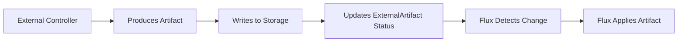

# How to Use ExternalArtifact Resource in Flux CD

Author: [nawazdhandala](https://github.com/nawazdhandala)

Tags: Flux CD, externalartifact, GitOps, Kubernetes, Artifacts, Source, Best Practices

Description: A practical guide to using the ExternalArtifact resource in Flux CD for referencing artifacts from external systems not natively supported by Flux source controllers.

---

## Introduction

Flux CD provides built-in source controllers for Git repositories, Helm charts, OCI registries, and S3 buckets. However, there are scenarios where your deployment artifacts come from external systems that Flux does not natively support. The ExternalArtifact resource bridges this gap by providing a generic API that allows third-party controllers to produce and store artifact objects in the same way as Flux's own source-controller. Flux Kustomizations and HelmReleases can then reference these artifacts as sources.

## Prerequisites

- Flux CD v2.5+ with ExternalArtifact support
- A Kubernetes cluster with Flux installed
- An external controller that produces artifacts (or you can manage ExternalArtifact status manually)

## What is ExternalArtifact

ExternalArtifact is a Flux source type whose lifecycle is managed outside of Flux's source-controller. Instead of Flux pulling and reconciling the source, an external controller or process writes artifact metadata into the ExternalArtifact's `.status.artifact` field. Flux then uses this metadata to fetch and apply the artifact from the in-cluster storage URL.



## Basic ExternalArtifact Configuration

### Creating an ExternalArtifact Resource

The ExternalArtifact spec contains an optional `sourceRef` that references the custom resource the artifact is based on:

```yaml
# clusters/my-cluster/sources/external-artifact.yaml
apiVersion: source.toolkit.fluxcd.io/v1
kind: ExternalArtifact
metadata:
  name: my-app-artifact
  namespace: flux-system
spec:
  # Optional reference to the custom resource that produces this artifact
  sourceRef:
    apiVersion: builds.example.com/v1
    kind: BuildArtifact
    name: my-app-build
```

The artifact details are stored in the status by the external controller:

```yaml
# Status populated by the external controller
status:
  artifact:
    digest: sha256:35d47c9db0eee6ffe08a404dfb416bee31b2b79eabc3f2eb26749163ce487f52
    lastUpdateTime: "2026-03-06T10:30:00Z"
    path: source/flux-system/my-app-artifact/35d47c9d.tar.gz
    revision: v1.2.3@sha256:35d47c9db0eee6ffe08a404dfb416bee31b2b79eabc3f2eb26749163ce487f52
    size: 20914
    url: http://source-controller.flux-system.svc.cluster.internal./source/flux-system/my-app-artifact/35d47c9d.tar.gz
```

### Using ExternalArtifact with Kustomization

Reference the ExternalArtifact as a source in your Kustomization:

```yaml
# clusters/my-cluster/apps/my-app-kustomization.yaml
apiVersion: kustomize.toolkit.fluxcd.io/v1
kind: Kustomization
metadata:
  name: my-app
  namespace: flux-system
spec:
  interval: 10m
  sourceRef:
    kind: ExternalArtifact
    name: my-app-artifact
  # Path within the artifact tarball
  path: ./manifests
  prune: true
  healthChecks:
    - apiVersion: apps/v1
      kind: Deployment
      name: my-app
      namespace: default
```

## Using ArtifactGenerator

The ArtifactGenerator resource enables generating ExternalArtifacts from multiple Flux sources or splitting a single source into multiple artifacts:

```yaml
# clusters/my-cluster/sources/artifact-generator.yaml
apiVersion: source.toolkit.fluxcd.io/v1
kind: ArtifactGenerator
metadata:
  name: my-app-generator
  namespace: flux-system
spec:
  # Generate an ExternalArtifact from a GitRepository sub-path
  sourceRef:
    kind: GitRepository
    name: flux-system
  path: ./apps/my-app
```

## Updating ExternalArtifact from an External Controller

An external controller manages the ExternalArtifact by writing artifact metadata to its status. Here is an example using kubectl to simulate what an external controller would do:

```bash
#!/bin/bash
# ci/update-artifact-status.sh

# Variables from CI environment
ARTIFACT_REVISION="v1.2.3"
ARTIFACT_DIGEST="sha256:$(sha256sum artifact.tar.gz | cut -d' ' -f1)"
ARTIFACT_PATH="source/flux-system/my-app-artifact/$(echo $ARTIFACT_DIGEST | cut -c8-15).tar.gz"
ARTIFACT_SIZE=$(stat -f%z artifact.tar.gz 2>/dev/null || stat --printf="%s" artifact.tar.gz)

# Update the ExternalArtifact status
kubectl patch externalartifact my-app-artifact \
  -n flux-system \
  --type merge \
  --subresource status \
  -p "{
    \"status\": {
      \"artifact\": {
        \"digest\": \"${ARTIFACT_DIGEST}\",
        \"lastUpdateTime\": \"$(date -u +%Y-%m-%dT%H:%M:%SZ)\",
        \"path\": \"${ARTIFACT_PATH}\",
        \"revision\": \"${ARTIFACT_REVISION}@${ARTIFACT_DIGEST}\",
        \"size\": ${ARTIFACT_SIZE},
        \"url\": \"http://source-controller.flux-system.svc.cluster.internal./${ARTIFACT_PATH}\"
      }
    }
  }"

echo "Updated ExternalArtifact status"
```

## Multiple Environments with ExternalArtifact

```yaml
# clusters/staging/sources/external-artifact.yaml
apiVersion: source.toolkit.fluxcd.io/v1
kind: ExternalArtifact
metadata:
  name: my-app-staging
  namespace: flux-system
spec:
  sourceRef:
    apiVersion: builds.example.com/v1
    kind: BuildArtifact
    name: my-app-staging-build
---
# clusters/production/sources/external-artifact.yaml
apiVersion: source.toolkit.fluxcd.io/v1
kind: ExternalArtifact
metadata:
  name: my-app-production
  namespace: flux-system
spec:
  sourceRef:
    apiVersion: builds.example.com/v1
    kind: BuildArtifact
    name: my-app-production-build
```

## ExternalArtifact with HelmRelease

Use ExternalArtifact as a source for HelmReleases when charts come from non-standard locations:

```yaml
# clusters/my-cluster/apps/helm-from-external.yaml
apiVersion: source.toolkit.fluxcd.io/v1
kind: ExternalArtifact
metadata:
  name: custom-chart
  namespace: flux-system
spec:
  sourceRef:
    apiVersion: charts.example.com/v1
    kind: ChartBuild
    name: my-chart-build
---
apiVersion: helm.toolkit.fluxcd.io/v2
kind: HelmRelease
metadata:
  name: my-app
  namespace: default
spec:
  interval: 10m
  chartRef:
    kind: ExternalArtifact
    name: custom-chart
    namespace: flux-system
  values:
    replicaCount: 3
    image:
      repository: ghcr.io/myorg/my-app
      tag: v1.2.3
```

## RBAC for ExternalArtifact Management

```yaml
# rbac/external-artifact-manager.yaml
apiVersion: v1
kind: ServiceAccount
metadata:
  name: artifact-promoter
  namespace: flux-system
---
apiVersion: rbac.authorization.k8s.io/v1
kind: Role
metadata:
  name: external-artifact-manager
  namespace: flux-system
rules:
  # Permission to read and update ExternalArtifact resources
  - apiGroups: ["source.toolkit.fluxcd.io"]
    resources: ["externalartifacts"]
    verbs: ["get", "list", "patch", "update"]
  - apiGroups: ["source.toolkit.fluxcd.io"]
    resources: ["externalartifacts/status"]
    verbs: ["get", "patch", "update"]
---
apiVersion: rbac.authorization.k8s.io/v1
kind: RoleBinding
metadata:
  name: artifact-promoter
  namespace: flux-system
subjects:
  - kind: ServiceAccount
    name: artifact-promoter
    namespace: flux-system
roleRef:
  kind: Role
  name: external-artifact-manager
  apiGroup: rbac.authorization.k8s.io
```

## Monitoring ExternalArtifact Status

### Check Current Artifact Status

```bash
# View the current state of an ExternalArtifact
kubectl get externalartifact -n flux-system

# Get detailed status
kubectl get externalartifact my-app-artifact -n flux-system -o yaml

# Check if the artifact is ready
kubectl get externalartifact my-app-artifact -n flux-system \
  -o jsonpath='{.status.conditions[?(@.type=="Ready")].status}'
```

### Alert on Artifact Issues

```yaml
# clusters/my-cluster/alerts/artifact-alert.yaml
apiVersion: notification.toolkit.fluxcd.io/v1
kind: Alert
metadata:
  name: artifact-alert
  namespace: flux-system
spec:
  providerRef:
    name: slack-provider
  eventSeverity: error
  eventSources:
    - kind: ExternalArtifact
      name: '*'
      namespace: flux-system
  summary: "ExternalArtifact update detected or failed"
```

## Comparison with Other Source Types

Understanding when to use ExternalArtifact versus other Flux sources:

### Use GitRepository When

- Your manifests are in a Git repository
- You want Flux to manage the full reconciliation lifecycle
- You need branch/tag tracking

### Use OCIRepository When

- Your artifacts are stored in an OCI-compliant registry
- You want to leverage container registry infrastructure

### Use ExternalArtifact When

- Artifacts are produced by a custom controller or build system
- You need integration with third-party Kubernetes operators
- The artifact source is not Git, OCI, Helm, or S3
- You want external controllers to manage artifact lifecycle

## Best Practices

### Always Include Digest Verification

The `.status.artifact.digest` field ensures integrity. External controllers should always set it so Flux can verify artifact contents.

### Use Immutable Artifact Revisions

Include the build ID or commit SHA in the artifact revision to ensure each version is unique and traceable.

### Implement Artifact Retention

Set up lifecycle policies on your artifact storage to clean up old artifacts. Keep artifacts for at least as long as you might need to roll back.

### Secure the Status Update Path

Limit who and what can update ExternalArtifact status. Use Kubernetes RBAC to restrict status patch access to trusted controllers and service accounts.

### Use ArtifactGenerator When Possible

If your source is already a Flux source type (GitRepository, OCIRepository, etc.) but you need to split it into multiple artifacts, use ArtifactGenerator instead of manually managing ExternalArtifact status.

## Conclusion

ExternalArtifact extends Flux CD's source capabilities to work with any artifact-producing controller. By providing a generic API for artifact metadata, it enables integration with custom build systems and third-party operators while maintaining the GitOps reconciliation model. Whether you are building a custom controller or integrating with an existing system, ExternalArtifact provides the interoperability layer to bring external artifacts into your Flux CD workflow.
