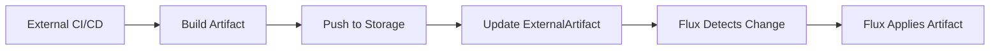

# How to Use ExternalArtifact Resource in Flux CD

Author: [nawazdhandala](https://github.com/nawazdhandala)

Tags: flux cd, externalartifact, gitops, kubernetes, artifacts, sources, best practices

Description: A practical guide to using the ExternalArtifact resource in Flux CD for referencing artifacts from external systems not natively supported by Flux source controllers.

---

## Introduction

Flux CD provides built-in source controllers for Git repositories, Helm charts, OCI registries, and S3 buckets. However, there are scenarios where your deployment artifacts come from external systems that Flux does not natively support. The ExternalArtifact resource bridges this gap by allowing you to reference artifacts produced by external CI/CD systems, build pipelines, or custom tooling, and use them as sources for Flux Kustomizations and HelmReleases.

## Prerequisites

- Flux CD v2.4+ with ExternalArtifact support
- A Kubernetes cluster with Flux installed
- An external system that produces deployment artifacts

## What is ExternalArtifact

ExternalArtifact is a Flux source type that represents an artifact whose lifecycle is managed outside of Flux. Instead of Flux pulling and reconciling the source, an external process pushes artifact metadata to the ExternalArtifact resource. Flux then uses this metadata to fetch and apply the artifact.



## Basic ExternalArtifact Configuration

### Creating an ExternalArtifact Resource

```yaml
# clusters/my-cluster/sources/external-artifact.yaml
apiVersion: source.toolkit.fluxcd.io/v1
kind: ExternalArtifact
metadata:
  name: my-app-artifact
  namespace: flux-system
spec:
  # URL where the artifact tarball can be downloaded
  url: "https://artifacts.example.com/my-app/latest.tar.gz"
  # Digest for integrity verification
  digest: "sha256:abc123def456..."
  # Content type of the artifact
  contentType: "application/x-tar"
```

### Using ExternalArtifact with Kustomization

Reference the ExternalArtifact as a source in your Kustomization:

```yaml
# clusters/my-cluster/apps/my-app-kustomization.yaml
apiVersion: kustomize.toolkit.fluxcd.io/v1
kind: Kustomization
metadata:
  name: my-app
  namespace: flux-system
spec:
  interval: 10m
  sourceRef:
    kind: ExternalArtifact
    name: my-app-artifact
  # Path within the artifact tarball
  path: ./manifests
  prune: true
  healthChecks:
    - apiVersion: apps/v1
      kind: Deployment
      name: my-app
      namespace: default
```

## Updating ExternalArtifact from CI/CD

### Using kubectl from a CI Pipeline

Update the ExternalArtifact when your CI pipeline produces a new artifact:

```bash
#!/bin/bash
# ci/update-artifact.sh

# Variables from CI environment
ARTIFACT_URL="https://artifacts.example.com/my-app/${BUILD_ID}.tar.gz"
ARTIFACT_DIGEST="sha256:$(sha256sum artifact.tar.gz | cut -d' ' -f1)"

# Update the ExternalArtifact resource
kubectl patch externalartifact my-app-artifact \
  -n flux-system \
  --type merge \
  -p "{
    \"spec\": {
      \"url\": \"${ARTIFACT_URL}\",
      \"digest\": \"${ARTIFACT_DIGEST}\"
    }
  }"

echo "Updated ExternalArtifact to ${ARTIFACT_URL}"
```

### Using the Flux CLI

```bash
# Update artifact URL and digest
flux reconcile source externalartifact my-app-artifact \
  --namespace flux-system
```

### GitHub Actions Integration

```yaml
# .github/workflows/deploy.yaml
name: Build and Deploy
on:
  push:
    branches: [main]

jobs:
  build-and-deploy:
    runs-on: ubuntu-latest
    steps:
      - name: Checkout
        uses: actions/checkout@v4

      - name: Build manifests
        run: |
          # Generate Kubernetes manifests
          kustomize build ./deploy > manifests.yaml
          # Package as tarball
          tar czf artifact.tar.gz manifests.yaml

      - name: Upload artifact
        run: |
          # Upload to your artifact storage (S3, GCS, etc.)
          aws s3 cp artifact.tar.gz \
            s3://my-artifacts/my-app/${{ github.sha }}.tar.gz

      - name: Calculate digest
        id: digest
        run: |
          DIGEST="sha256:$(sha256sum artifact.tar.gz | cut -d' ' -f1)"
          echo "digest=${DIGEST}" >> $GITHUB_OUTPUT

      - name: Update ExternalArtifact
        env:
          KUBECONFIG_DATA: ${{ secrets.KUBECONFIG }}
        run: |
          echo "${KUBECONFIG_DATA}" | base64 -d > /tmp/kubeconfig
          export KUBECONFIG=/tmp/kubeconfig

          kubectl patch externalartifact my-app-artifact \
            -n flux-system \
            --type merge \
            -p '{
              "spec": {
                "url": "https://my-artifacts.s3.amazonaws.com/my-app/${{ github.sha }}.tar.gz",
                "digest": "${{ steps.digest.outputs.digest }}"
              }
            }'
```

## Advanced ExternalArtifact Patterns

### Multiple Environments with ExternalArtifact

```yaml
# clusters/staging/sources/external-artifact.yaml
apiVersion: source.toolkit.fluxcd.io/v1
kind: ExternalArtifact
metadata:
  name: my-app-staging
  namespace: flux-system
spec:
  url: "https://artifacts.example.com/my-app/staging/latest.tar.gz"
  digest: "sha256:staging-digest..."
  contentType: "application/x-tar"
---
# clusters/production/sources/external-artifact.yaml
apiVersion: source.toolkit.fluxcd.io/v1
kind: ExternalArtifact
metadata:
  name: my-app-production
  namespace: flux-system
spec:
  url: "https://artifacts.example.com/my-app/production/latest.tar.gz"
  digest: "sha256:production-digest..."
  contentType: "application/x-tar"
```

### ExternalArtifact with Authentication

When your artifact storage requires authentication:

```yaml
# clusters/my-cluster/sources/external-artifact-auth.yaml
apiVersion: source.toolkit.fluxcd.io/v1
kind: ExternalArtifact
metadata:
  name: private-artifact
  namespace: flux-system
spec:
  url: "https://private-artifacts.example.com/my-app/latest.tar.gz"
  digest: "sha256:abc123..."
  contentType: "application/x-tar"
  # Reference a secret with authentication credentials
  secretRef:
    name: artifact-auth
---
# Secret with authentication for artifact download
apiVersion: v1
kind: Secret
metadata:
  name: artifact-auth
  namespace: flux-system
type: Opaque
stringData:
  # HTTP Basic Auth credentials
  username: artifact-reader
  password: "${ARTIFACT_PASSWORD}"
```

### ExternalArtifact with HelmRelease

Use ExternalArtifact as a source for HelmReleases when charts come from non-standard locations:

```yaml
# clusters/my-cluster/apps/helm-from-external.yaml
apiVersion: source.toolkit.fluxcd.io/v1
kind: ExternalArtifact
metadata:
  name: custom-chart
  namespace: flux-system
spec:
  url: "https://builds.example.com/charts/my-chart-1.2.3.tgz"
  digest: "sha256:chart-digest..."
  contentType: "application/x-tar"
---
apiVersion: helm.toolkit.fluxcd.io/v1
kind: HelmRelease
metadata:
  name: my-app
  namespace: default
spec:
  interval: 10m
  chartRef:
    kind: ExternalArtifact
    name: custom-chart
    namespace: flux-system
  values:
    replicaCount: 3
    image:
      repository: ghcr.io/myorg/my-app
      tag: v1.2.3
```

## Promotion Pipeline with ExternalArtifact

Implement a promotion workflow where artifacts flow from dev to staging to production:

```yaml
# Promotion controller job
apiVersion: batch/v1
kind: CronJob
metadata:
  name: promote-to-staging
  namespace: flux-system
spec:
  schedule: "0 */4 * * *"
  jobTemplate:
    spec:
      template:
        spec:
          serviceAccountName: artifact-promoter
          containers:
            - name: promoter
              image: bitnami/kubectl:latest
              command:
                - /bin/sh
                - -c
                - |
                  # Get the current dev artifact details
                  DEV_URL=$(kubectl get externalartifact my-app-dev \
                    -n flux-system \
                    -o jsonpath='{.spec.url}')
                  DEV_DIGEST=$(kubectl get externalartifact my-app-dev \
                    -n flux-system \
                    -o jsonpath='{.spec.digest}')

                  # Promote to staging by updating the staging artifact
                  kubectl patch externalartifact my-app-staging \
                    -n flux-system \
                    --type merge \
                    -p "{
                      \"spec\": {
                        \"url\": \"${DEV_URL}\",
                        \"digest\": \"${DEV_DIGEST}\"
                      }
                    }"
                  echo "Promoted dev artifact to staging"
          restartPolicy: OnFailure
```

## RBAC for ExternalArtifact Management

```yaml
# rbac/external-artifact-manager.yaml
apiVersion: v1
kind: ServiceAccount
metadata:
  name: artifact-promoter
  namespace: flux-system
---
apiVersion: rbac.authorization.k8s.io/v1
kind: Role
metadata:
  name: external-artifact-manager
  namespace: flux-system
rules:
  # Permission to read and update ExternalArtifact resources
  - apiGroups: ["source.toolkit.fluxcd.io"]
    resources: ["externalartifacts"]
    verbs: ["get", "list", "patch", "update"]
---
apiVersion: rbac.authorization.k8s.io/v1
kind: RoleBinding
metadata:
  name: artifact-promoter
  namespace: flux-system
subjects:
  - kind: ServiceAccount
    name: artifact-promoter
    namespace: flux-system
roleRef:
  kind: Role
  name: external-artifact-manager
  apiGroup: rbac.authorization.k8s.io
```

## Monitoring ExternalArtifact Status

### Check Current Artifact Status

```bash
# View the current state of an ExternalArtifact
kubectl get externalartifact -n flux-system

# Get detailed status
kubectl get externalartifact my-app-artifact -n flux-system -o yaml

# Check if the artifact is ready
kubectl get externalartifact my-app-artifact -n flux-system \
  -o jsonpath='{.status.conditions[?(@.type=="Ready")].status}'
```

### Alert on Artifact Issues

```yaml
# clusters/my-cluster/alerts/artifact-alert.yaml
apiVersion: notification.toolkit.fluxcd.io/v1beta3
kind: Alert
metadata:
  name: artifact-alert
  namespace: flux-system
spec:
  providerRef:
    name: slack-provider
  eventSeverity: error
  eventSources:
    - kind: ExternalArtifact
      name: '*'
      namespace: flux-system
  summary: "ExternalArtifact update detected or failed"
```

## Comparison with Other Source Types

Understanding when to use ExternalArtifact versus other Flux sources:

### Use GitRepository When

- Your manifests are in a Git repository
- You want Flux to manage the full reconciliation lifecycle
- You need branch/tag tracking

### Use OCIRepository When

- Your artifacts are stored in an OCI-compliant registry
- You want to leverage container registry infrastructure

### Use ExternalArtifact When

- Artifacts come from a custom build system
- You need integration with legacy CI/CD pipelines
- The artifact source is not Git, OCI, Helm, or S3
- You want external systems to control when Flux deploys

## Best Practices

### Always Include Digest Verification

Never deploy an artifact without digest verification. The digest ensures that the artifact Flux downloads matches what your CI pipeline produced.

### Use Immutable Artifact URLs

Include the build ID or commit SHA in the artifact URL to ensure each version is unique and traceable:

```
https://artifacts.example.com/my-app/abc123def.tar.gz  # Good
https://artifacts.example.com/my-app/latest.tar.gz      # Avoid
```

### Implement Artifact Retention

Set up lifecycle policies on your artifact storage to clean up old artifacts. Keep artifacts for at least as long as you might need to roll back.

### Secure the Update Path

Limit who and what can update ExternalArtifact resources. Use Kubernetes RBAC to restrict patch access to trusted CI/CD service accounts.

### Version Your Artifacts

Include version information in the artifact metadata or URL to make it easy to trace which version is deployed in each environment.

## Conclusion

ExternalArtifact extends Flux CD's source capabilities to work with any artifact storage system. By decoupling artifact production from deployment, it enables integration with existing CI/CD pipelines while maintaining the GitOps reconciliation model. Whether you are migrating from a traditional deployment pipeline or integrating with a custom build system, ExternalArtifact provides the flexibility to bring external artifacts into your Flux CD workflow.
