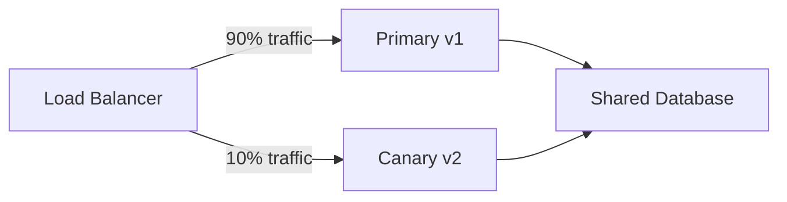

# How to Use Flagger for Database Migration Canary with Flux

Author: [nawazdhandala](https://github.com/nawazdhandala)

Tags: flux, flagger, Canary, Database, Migration, Kubernetes, GitOps, progressive-delivery

Description: Learn how to safely perform database migrations using Flagger canary deployments in a Flux CD environment with backward-compatible schema changes.

---

## Introduction

Database migrations are one of the riskiest parts of any deployment. When combined with canary deployments, they require careful planning because both the old and new versions of your application must work with the database simultaneously during the rollout.

This guide covers strategies for using Flagger canary deployments alongside database migrations in a Flux-managed Kubernetes cluster, focusing on backward-compatible migration patterns.

## Prerequisites

- A Kubernetes cluster with Flux CD installed
- Flagger installed and configured with a service mesh
- A database (PostgreSQL used in examples)
- Familiarity with database migration tools (Flyway, Liquibase, or similar)

## The Challenge of Canary + Database Migrations

During a canary deployment, both the primary (old) and canary (new) versions run simultaneously. This creates a fundamental challenge:



Both versions must work with the same database schema. This means migrations must be backward-compatible, often requiring a multi-phase approach.

## Step 1: Set Up the Expand-Contract Migration Pattern

The expand-contract pattern splits breaking migrations into safe, backward-compatible steps.

### Phase 1: Expand (Add new columns/tables without removing old ones)

```yaml
# migrations/V2__expand_add_email_column.sql
-- Phase 1: Add new column without removing old one
-- Both v1 and v2 of the app can work with this schema
ALTER TABLE users ADD COLUMN email_address VARCHAR(255);

-- Copy existing data to new column
UPDATE users SET email_address = email WHERE email_address IS NULL;

-- Create trigger to keep both columns in sync during canary
CREATE OR REPLACE FUNCTION sync_email_columns()
RETURNS TRIGGER AS $$
BEGIN
  IF NEW.email IS DISTINCT FROM OLD.email THEN
    NEW.email_address := NEW.email;
  END IF;
  IF NEW.email_address IS DISTINCT FROM OLD.email_address THEN
    NEW.email := NEW.email_address;
  END IF;
  RETURN NEW;
END;
$$ LANGUAGE plpgsql;

CREATE TRIGGER email_sync_trigger
  BEFORE UPDATE ON users
  FOR EACH ROW
  EXECUTE FUNCTION sync_email_columns();
```

### Phase 2: Contract (Remove old columns after full promotion)

```yaml
# migrations/V3__contract_remove_old_email.sql
-- Phase 2: Only run AFTER canary is fully promoted
-- Remove the old column and sync trigger
DROP TRIGGER IF EXISTS email_sync_trigger ON users;
DROP FUNCTION IF EXISTS sync_email_columns();
ALTER TABLE users DROP COLUMN email;
-- Rename new column to final name
ALTER TABLE users RENAME COLUMN email_address TO email;
```

## Step 2: Create Migration Job Configuration

Run migrations as a Kubernetes Job that executes before the canary starts.

```yaml
# apps/my-app/migration-job.yaml
apiVersion: batch/v1
kind: Job
metadata:
  name: my-app-migration
  namespace: production
  annotations:
    # Ensure this job runs before the canary analysis starts
    flagger.app/pre-rollout: "true"
spec:
  backoffLimit: 3
  activeDeadlineSeconds: 300
  template:
    spec:
      restartPolicy: Never
      containers:
        - name: migrate
          image: my-app:latest
          command:
            - "/bin/sh"
            - "-c"
            # Run only expand migrations (backward-compatible)
            - |
              echo "Running expand migrations..."
              flyway -url=jdbc:postgresql://${DB_HOST}:5432/${DB_NAME} \
                     -user=${DB_USER} \
                     -password=${DB_PASSWORD} \
                     -target=2 \
                     migrate
              echo "Migration complete."
          envFrom:
            - secretRef:
                name: db-credentials
          resources:
            requests:
              cpu: 100m
              memory: 256Mi
            limits:
              cpu: 500m
              memory: 512Mi
```

## Step 3: Configure the Canary with Migration Webhooks

Use Flagger webhooks to orchestrate migrations as part of the canary process.

```yaml
# apps/my-app/canary.yaml
apiVersion: flagger.app/v1beta1
kind: Canary
metadata:
  name: my-app
  namespace: production
spec:
  targetRef:
    apiVersion: apps/v1
    kind: Deployment
    name: my-app
  service:
    port: 80
    targetPort: 8080
  analysis:
    iterations: 10
    interval: 2m
    threshold: 2
    maxWeight: 50
    stepWeight: 5
    metrics:
      - name: request-success-rate
        thresholdRange:
          min: 99
        interval: 1m
      - name: request-duration
        thresholdRange:
          max: 500
        interval: 1m
    webhooks:
      # Step 1: Run expand migration before canary starts
      - name: run-expand-migration
        type: pre-rollout
        url: http://flagger-loadtester.flagger-system/
        timeout: 5m
        metadata:
          type: bash
          cmd: |
            # Run the expand migration job
            kubectl apply -f /migrations/expand-job.yaml -n production
            # Wait for the job to complete
            kubectl wait --for=condition=complete \
              job/my-app-expand-migration \
              -n production \
              --timeout=300s
      # Step 2: Verify database schema is compatible
      - name: verify-schema
        type: pre-rollout
        url: http://flagger-loadtester.flagger-system/
        timeout: 2m
        metadata:
          type: bash
          cmd: |
            # Verify both old and new app versions can connect
            curl -sf http://my-app.production:8080/health/db
            curl -sf http://my-app-canary.production:8080/health/db
      # Step 3: Run load tests during canary analysis
      - name: load-test
        type: rollout
        url: http://flagger-loadtester.flagger-system/
        timeout: 5m
        metadata:
          type: cmd
          cmd: "hey -z 1m -q 10 -c 2 http://my-app-canary.production:8080/"
      # Step 4: Run contract migration after successful promotion
      - name: run-contract-migration
        type: post-rollout
        url: http://flagger-loadtester.flagger-system/
        timeout: 5m
        metadata:
          type: bash
          cmd: |
            # Only run contract migration after full promotion
            kubectl apply -f /migrations/contract-job.yaml -n production
            kubectl wait --for=condition=complete \
              job/my-app-contract-migration \
              -n production \
              --timeout=300s
```

## Step 4: Configure Database Health Check Metrics

Create a custom metric template to monitor database health during the canary.

```yaml
# apps/my-app/db-metric-template.yaml
apiVersion: flagger.app/v1beta1
kind: MetricTemplate
metadata:
  name: db-query-duration
  namespace: production
spec:
  provider:
    type: prometheus
    address: http://prometheus.monitoring:9090
  query: |
    # Monitor database query duration for the canary
    # Ensures migrations haven't degraded database performance
    histogram_quantile(0.99,
      sum(
        rate(
          app_db_query_duration_seconds_bucket{
            namespace="{{ namespace }}",
            pod=~"{{ target }}-canary-[0-9a-zA-Z]+"
          }[{{ interval }}]
        )
      ) by (le)
    )
```

```yaml
# apps/my-app/db-error-metric.yaml
apiVersion: flagger.app/v1beta1
kind: MetricTemplate
metadata:
  name: db-error-rate
  namespace: production
spec:
  provider:
    type: prometheus
    address: http://prometheus.monitoring:9090
  query: |
    # Monitor database error rate during canary
    # Catches schema incompatibilities early
    sum(
      rate(
        app_db_errors_total{
          namespace="{{ namespace }}",
          pod=~"{{ target }}-canary-[0-9a-zA-Z]+"
        }[{{ interval }}]
      )
    )
```

Reference these metrics in your canary analysis:

```yaml
# Add to canary.yaml analysis.metrics section
    metrics:
      - name: request-success-rate
        thresholdRange:
          min: 99
        interval: 1m
      - name: db-query-duration
        templateRef:
          name: db-query-duration
          namespace: production
        # Max p99 query duration in seconds
        thresholdRange:
          max: 0.5
        interval: 1m
      - name: db-error-rate
        templateRef:
          name: db-error-rate
          namespace: production
        # Zero database errors allowed
        thresholdRange:
          max: 0
        interval: 1m
```

## Step 5: Application Code for Backward Compatibility

Your application must handle both the old and new schema during the canary window.

```yaml
# apps/my-app/deployment.yaml
apiVersion: apps/v1
kind: Deployment
metadata:
  name: my-app
  namespace: production
spec:
  replicas: 3
  selector:
    matchLabels:
      app: my-app
  template:
    metadata:
      labels:
        app: my-app
    spec:
      containers:
        - name: my-app
          image: my-app:v2
          ports:
            - containerPort: 8080
          env:
            # Feature flag to control which schema columns to use
            - name: USE_NEW_SCHEMA
              value: "true"
            # Database connection
            - name: DB_HOST
              valueFrom:
                secretKeyRef:
                  name: db-credentials
                  key: host
            - name: DB_NAME
              valueFrom:
                secretKeyRef:
                  name: db-credentials
                  key: database
          # Health check that includes database connectivity
          readinessProbe:
            httpGet:
              path: /health/db
              port: 8080
            initialDelaySeconds: 10
            periodSeconds: 5
          livenessProbe:
            httpGet:
              path: /health
              port: 8080
            initialDelaySeconds: 15
            periodSeconds: 10
```

## Step 6: Integrate with Flux GitOps Workflow

Structure your Flux Kustomization to handle the migration ordering.

```yaml
# flux/apps-kustomization.yaml
apiVersion: kustomize.toolkit.fluxcd.io/v1
kind: Kustomization
metadata:
  name: my-app
  namespace: flux-system
spec:
  interval: 10m
  sourceRef:
    kind: GitRepository
    name: my-app
  path: ./apps/my-app
  prune: true
  # Depend on database being available
  dependsOn:
    - name: database
  healthChecks:
    - apiVersion: apps/v1
      kind: Deployment
      name: my-app
      namespace: production
  # Timeout long enough for migration + canary analysis
  timeout: 30m
```

## Step 7: Rollback Handling

When a canary with a migration fails, you need a rollback strategy.

```yaml
# apps/my-app/rollback-job.yaml
apiVersion: batch/v1
kind: Job
metadata:
  name: my-app-rollback-migration
  namespace: production
spec:
  backoffLimit: 1
  template:
    spec:
      restartPolicy: Never
      containers:
        - name: rollback
          image: my-app:latest
          command:
            - "/bin/sh"
            - "-c"
            # Undo the expand migration if canary fails
            - |
              echo "Rolling back expand migration..."
              flyway -url=jdbc:postgresql://${DB_HOST}:5432/${DB_NAME} \
                     -user=${DB_USER} \
                     -password=${DB_PASSWORD} \
                     undo
              echo "Rollback complete."
          envFrom:
            - secretRef:
                name: db-credentials
```

Configure Flagger to trigger the rollback job on failure:

```yaml
# Add to canary.yaml webhooks section
      - name: rollback-migration
        type: rollback
        url: http://flagger-loadtester.flagger-system/
        timeout: 5m
        metadata:
          type: bash
          cmd: |
            kubectl apply -f /migrations/rollback-job.yaml -n production
            kubectl wait --for=condition=complete \
              job/my-app-rollback-migration \
              -n production \
              --timeout=300s
```

## Monitoring During Migration Canaries

Keep an eye on these key indicators during a database migration canary:

```bash
# Watch canary progress
kubectl get canary my-app -n production -w

# Monitor database connection pool
kubectl logs -n production -l app=my-app -f | grep "db_pool"

# Check migration job status
kubectl get jobs -n production | grep migration

# View Flagger events
kubectl get events -n production --field-selector reason=Synced --watch
```

## Best Practices

1. **Always use expand-contract migrations**: Never remove columns or tables in the same release that introduces the change.
2. **Test migrations in staging first**: Run the full canary cycle in staging before production.
3. **Set generous timeouts**: Database migrations can take time, especially on large tables.
4. **Monitor query performance**: Schema changes can affect query plans and performance.
5. **Keep migrations small**: Break large schema changes into multiple small, backward-compatible steps.
6. **Use database feature flags**: Control which schema version your application reads from using environment variables.

## Summary

Using Flagger for database migration canaries in Flux requires the expand-contract migration pattern. By splitting migrations into backward-compatible expand steps and post-promotion contract steps, both the primary and canary versions can safely share the same database. Flagger webhooks orchestrate the migration lifecycle, running expand migrations as pre-rollout hooks and contract migrations as post-rollout hooks. Custom metrics monitor database health throughout the process, and rollback hooks ensure clean recovery if the canary fails.
