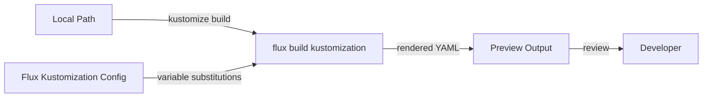

# How to Use flux build kustomization for Local Preview

Author: [nawazdhandala](https://github.com/nawazdhandala)

Tags: flux, fluxcd, gitops, kubernetes, cli, build, kustomization, preview, local, devops

Description: A practical guide to using the flux build kustomization command to preview and validate Kustomization output locally before deploying to your cluster.

---

## Introduction

One of the biggest challenges in GitOps is knowing exactly what will be applied to your cluster before pushing changes. The `flux build kustomization` command solves this by letting you build and preview the output of a Kustomization locally, using the same logic Flux uses during reconciliation. This gives you a dry-run capability that catches errors before they reach your cluster.

This guide demonstrates how to use `flux build kustomization` for local development, validation, and CI/CD integration.

## Prerequisites

Ensure you have:

- A running Kubernetes cluster with Flux CD installed
- `kubectl` configured for your cluster
- The Flux CLI installed locally
- A Git repository with Kustomization manifests

Verify your setup:

```bash
# Check Flux installation
flux check

# List existing kustomizations
flux get kustomizations --all-namespaces
```

## What flux build kustomization Does

The `flux build kustomization` command renders the final YAML output that a Kustomization would apply to your cluster. It processes:

- Kustomize overlays and patches
- Variable substitutions defined in Flux
- Resource transformations
- Post-build variable replacements



## Basic Usage

Build a Kustomization using a local path:

```bash
# Build a kustomization named "apps" using local source files
flux build kustomization apps --path ./clusters/production/apps
```

This renders the complete YAML output that Flux would apply, printed to stdout:

```yaml
apiVersion: apps/v1
kind: Deployment
metadata:
  name: my-app
  namespace: my-app
spec:
  replicas: 3
  selector:
    matchLabels:
      app: my-app
  template:
    metadata:
      labels:
        app: my-app
    spec:
      containers:
      - name: my-app
        image: myregistry/my-app:v1.2.3
        ports:
        - containerPort: 8080
---
apiVersion: v1
kind: Service
metadata:
  name: my-app-svc
  namespace: my-app
spec:
  selector:
    app: my-app
  ports:
  - port: 80
    targetPort: 8080
```

## Using with Local Source Path

The `--path` flag specifies the local directory containing your Kustomization files:

```bash
# Build from a specific local directory
flux build kustomization apps --path /home/user/repos/my-infra/clusters/production/apps

# Build from a relative path
flux build kustomization apps --path ./apps/overlays/production
```

## Building with Variable Substitutions

Flux supports post-build variable substitutions. You can preview how these substitutions are applied:

```bash
# Build with variable substitutions from the cluster
flux build kustomization apps --path ./clusters/production/apps
```

If your Kustomization uses `spec.postBuild.substitute` or `spec.postBuild.substituteFrom`, the build command reads these from the cluster and applies them.

Example Kustomization with substitution variables:

```yaml
# Kustomization manifest in the cluster
apiVersion: kustomize.toolkit.fluxcd.io/v1
kind: Kustomization
metadata:
  name: apps
  namespace: flux-system
spec:
  path: ./clusters/production/apps
  postBuild:
    substitute:
      ENVIRONMENT: production
      REPLICAS: "3"
    substituteFrom:
      - kind: ConfigMap
        name: cluster-vars
```

Build to see the substituted output:

```bash
# Build with substitutions applied
flux build kustomization apps --path ./clusters/production/apps
```

The output will show `${ENVIRONMENT}` replaced with `production` and `${REPLICAS}` replaced with `3`.

## Saving Build Output to a File

Redirect the output for review or comparison:

```bash
# Save the build output to a file
flux build kustomization apps --path ./clusters/production/apps > /tmp/apps-output.yaml

# Review the output
cat /tmp/apps-output.yaml

# Count the number of resources
grep "^kind:" /tmp/apps-output.yaml | sort | uniq -c
```

## Practical Use Cases

### Use Case 1: Validating Changes Before Pushing to Git

Before committing changes, verify the output is correct:

```bash
# Step 1: Make your changes to the local files
# Edit deployment.yaml, service.yaml, etc.

# Step 2: Build the kustomization to preview the output
flux build kustomization apps --path ./clusters/production/apps

# Step 3: Validate the output with kubectl
flux build kustomization apps --path ./clusters/production/apps | kubectl apply --dry-run=client -f -

# Step 4: If everything looks good, commit and push
git add .
git commit -m "Update deployment configuration"
git push
```

### Use Case 2: Reviewing Variable Substitutions

When using Flux variable substitutions, verify the values are correct:

```bash
# Build and look for substituted values
flux build kustomization apps --path ./clusters/production/apps | grep -E "replicas|image|environment"

# Compare with staging
flux build kustomization apps-staging --path ./clusters/staging/apps | grep -E "replicas|image|environment"
```

### Use Case 3: Debugging Kustomize Overlay Issues

When overlays or patches are not working as expected:

```bash
# Build the base first
flux build kustomization apps-base --path ./apps/base

# Build the overlay
flux build kustomization apps-production --path ./apps/overlays/production

# Compare the outputs to see what the overlay changes
diff <(flux build kustomization apps-base --path ./apps/base) \
     <(flux build kustomization apps-production --path ./apps/overlays/production)
```

### Use Case 4: CI/CD Pipeline Validation

Add build validation to your CI/CD pipeline:

```yaml
# .github/workflows/validate.yaml
name: Validate Flux Kustomizations

on:
  pull_request:
    branches: [main]

jobs:
  validate:
    runs-on: ubuntu-latest
    steps:
      - uses: actions/checkout@v4

      - name: Setup Flux CLI
        uses: fluxcd/flux2/action@main

      - name: Build and validate apps kustomization
        run: |
          # Build the kustomization
          flux build kustomization apps \
            --path ./clusters/production/apps \
            > /tmp/output.yaml

          # Validate with kubeconform or kubeval
          kubeconform -strict /tmp/output.yaml

      - name: Build and validate infrastructure kustomization
        run: |
          flux build kustomization infrastructure \
            --path ./clusters/production/infrastructure \
            > /tmp/infra-output.yaml

          kubeconform -strict /tmp/infra-output.yaml
```

### Use Case 5: Comparing Environments

Compare the rendered output between different environments:

```bash
# Build staging configuration
flux build kustomization apps \
  --path ./clusters/staging/apps \
  > /tmp/staging.yaml

# Build production configuration
flux build kustomization apps \
  --path ./clusters/production/apps \
  > /tmp/production.yaml

# Compare the two environments
diff /tmp/staging.yaml /tmp/production.yaml
```

## Building Without a Cluster

For local development without a cluster connection, you can still build Kustomizations, but variable substitutions from ConfigMaps and Secrets will not be available:

```bash
# Build locally (substitutions from cluster will be skipped)
flux build kustomization apps --path ./clusters/production/apps --dry-run
```

## Validating the Build Output

After building, validate the output:

```bash
# Validate with kubectl dry-run (client-side)
flux build kustomization apps --path ./clusters/production/apps \
  | kubectl apply --dry-run=client -f -

# Validate with kubectl dry-run (server-side, requires cluster access)
flux build kustomization apps --path ./clusters/production/apps \
  | kubectl apply --dry-run=server -f -

# Validate with kubeconform
flux build kustomization apps --path ./clusters/production/apps \
  | kubeconform -strict -
```

## Analyzing Build Output

Extract useful information from the build output:

```bash
# List all resource kinds in the output
flux build kustomization apps --path ./clusters/production/apps \
  | grep "^kind:" | sort | uniq -c

# List all namespaces referenced
flux build kustomization apps --path ./clusters/production/apps \
  | grep "namespace:" | sort | uniq

# List all container images
flux build kustomization apps --path ./clusters/production/apps \
  | grep "image:" | sort | uniq

# Count total resources
flux build kustomization apps --path ./clusters/production/apps \
  | grep "^---" | wc -l
```

## Common Flags Reference

| Flag | Description |
|------|-------------|
| `--path` | Local path to the Kustomization directory |
| `--namespace` | Namespace of the Kustomization resource |
| `--dry-run` | Build without connecting to the cluster |

## Troubleshooting

### Build Fails with Kustomize Errors

If the build fails with kustomize errors:

```bash
# Run kustomize directly to get more detailed error messages
kustomize build ./clusters/production/apps

# Check the kustomization.yaml file for syntax errors
cat ./clusters/production/apps/kustomization.yaml
```

### Variable Substitutions Not Applied

If variables are not being replaced:

```bash
# Check the Kustomization spec for postBuild configuration
kubectl get kustomization apps -n flux-system -o yaml | grep -A20 "postBuild"

# Verify the ConfigMap or Secret referenced in substituteFrom exists
kubectl get configmap cluster-vars -n flux-system -o yaml
```

### Output Differs from What Is Applied in the Cluster

If the local build differs from what Flux applies:

```bash
# Ensure your local files match the Git repository
git status
git diff

# Check the source revision Flux is using
flux get source git my-repo

# Ensure you are building from the same path Flux uses
kubectl get kustomization apps -n flux-system -o jsonpath='{.spec.path}'
```

## Best Practices

1. **Build before every push** - Preview changes locally before pushing to Git
2. **Integrate into CI/CD** - Add build validation to your pull request pipeline
3. **Compare environments** - Use build to compare staging and production configurations
4. **Validate output** - Always run the build output through a validator like kubeconform
5. **Save builds for audit** - Store build outputs in CI artifacts for review and auditing

## Summary

The `flux build kustomization` command is a powerful tool for previewing what Flux will apply to your cluster. By building Kustomizations locally, you can catch errors, verify variable substitutions, validate resource configurations, and compare environments before changes reach your cluster. Integrating this command into your development workflow and CI/CD pipelines significantly reduces the risk of deploying broken configurations.
