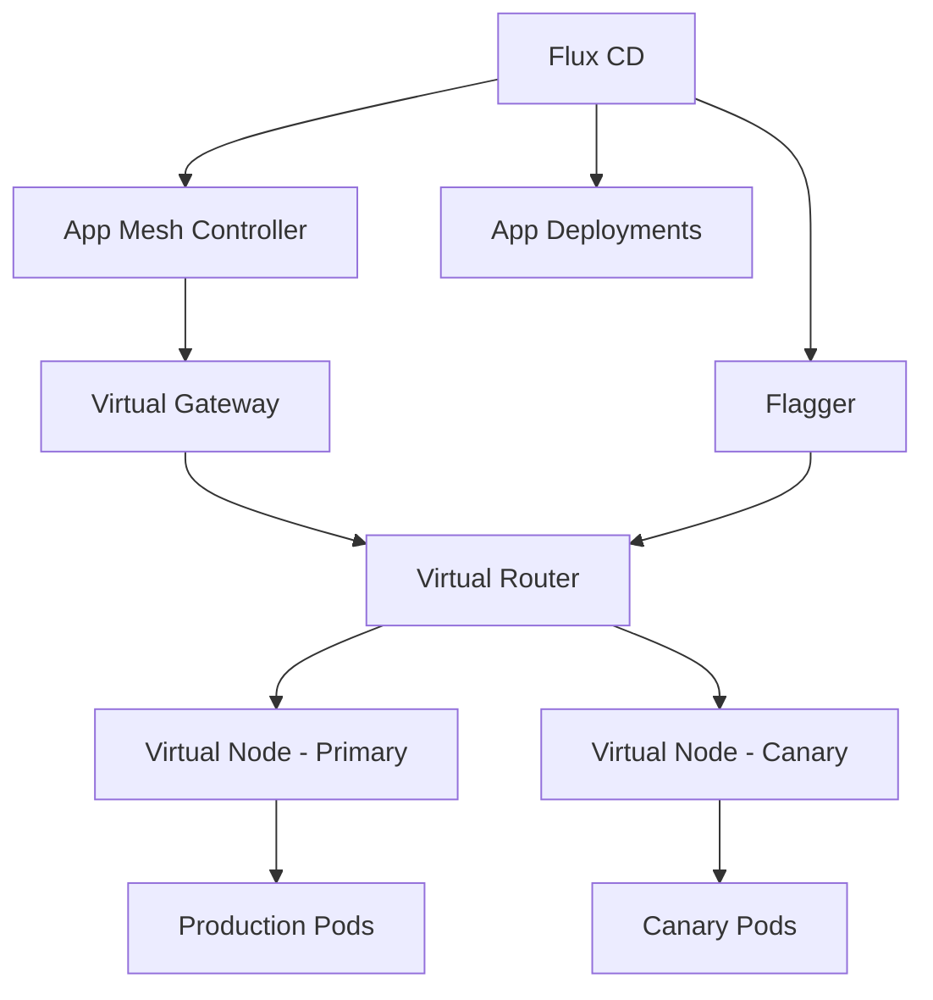

# How to Use Flux CD with AWS App Mesh

Author: [nawazdhandala](https://github.com/nawazdhandala)

Tags: Flux CD, AWS App Mesh, Service Mesh, Canary Deployment, Flagger, Kubernetes, GitOps

Description: Deploy and manage AWS App Mesh with Flux CD, including virtual services configuration and progressive delivery with Flagger.

---

## Introduction

AWS App Mesh is a service mesh that provides application-level networking, allowing your services to communicate with each other across multiple types of compute infrastructure. By managing App Mesh through Flux CD, you can version-control your mesh configuration and use Flagger for automated canary deployments.

This guide covers deploying the App Mesh controller via Flux, configuring virtual services, and setting up progressive delivery with Flagger.

## Prerequisites

Before starting, ensure you have:

- An Amazon EKS cluster running Kubernetes 1.25 or later
- Flux CD installed and bootstrapped
- AWS CLI configured with appropriate permissions
- An OIDC provider associated with your EKS cluster
- kubectl access to the cluster

## Architecture Overview



## Step 1: Create IAM Role for App Mesh Controller

```bash
ACCOUNT_ID=$(aws sts get-caller-identity --query Account --output text)
OIDC_PROVIDER=$(aws eks describe-cluster \
  --name my-cluster \
  --query "cluster.identity.oidc.issuer" \
  --output text | sed 's|https://||')

# Create trust policy for App Mesh controller
cat > appmesh-trust-policy.json <<EOF
{
  "Version": "2012-10-17",
  "Statement": [
    {
      "Effect": "Allow",
      "Principal": {
        "Federated": "arn:aws:iam::${ACCOUNT_ID}:oidc-provider/${OIDC_PROVIDER}"
      },
      "Action": "sts:AssumeRoleWithWebIdentity",
      "Condition": {
        "StringEquals": {
          "${OIDC_PROVIDER}:sub": "system:serviceaccount:appmesh-system:appmesh-controller",
          "${OIDC_PROVIDER}:aud": "sts.amazonaws.com"
        }
      }
    }
  ]
}
EOF

# Create the IAM role
aws iam create-role \
  --role-name AmazonEKSAppMeshControllerRole \
  --assume-role-policy-document file://appmesh-trust-policy.json

# Attach required policies
aws iam attach-role-policy \
  --role-name AmazonEKSAppMeshControllerRole \
  --policy-arn arn:aws:iam::aws:policy/AWSAppMeshFullAccess

aws iam attach-role-policy \
  --role-name AmazonEKSAppMeshControllerRole \
  --policy-arn arn:aws:iam::aws:policy/AWSCloudMapFullAccess
```

## Step 2: Deploy the App Mesh Controller via Flux

```yaml
# infrastructure/appmesh/namespace.yaml
apiVersion: v1
kind: Namespace
metadata:
  name: appmesh-system
  labels:
    app.kubernetes.io/managed-by: flux
```

```yaml
# infrastructure/appmesh/helm-repo.yaml
apiVersion: source.toolkit.fluxcd.io/v1
kind: HelmRepository
metadata:
  name: eks-charts
  namespace: flux-system
spec:
  interval: 1h
  url: https://aws.github.io/eks-charts
```

```yaml
# infrastructure/appmesh/controller.yaml
apiVersion: helm.toolkit.fluxcd.io/v2
kind: HelmRelease
metadata:
  name: appmesh-controller
  namespace: appmesh-system
spec:
  interval: 15m
  chart:
    spec:
      chart: appmesh-controller
      version: "1.12.x"
      sourceRef:
        kind: HelmRepository
        name: eks-charts
        namespace: flux-system
  values:
    # AWS region
    region: us-east-1
    # Service account with IRSA
    serviceAccount:
      create: true
      name: appmesh-controller
      annotations:
        eks.amazonaws.com/role-arn: arn:aws:iam::123456789012:role/AmazonEKSAppMeshControllerRole
    # Enable tracing with X-Ray
    tracing:
      enabled: true
      provider: x-ray
    # Resource allocation
    resources:
      requests:
        cpu: 100m
        memory: 128Mi
      limits:
        cpu: 200m
        memory: 256Mi
    # Sidecar injector configuration
    sidecar:
      image:
        repository: 840364872350.dkr.ecr.us-east-1.amazonaws.com/aws-appmesh-envoy
      logLevel: info
      resources:
        requests:
          cpu: 100m
          memory: 128Mi
        limits:
          cpu: 500m
          memory: 512Mi
```

## Step 3: Create the App Mesh

Define the mesh resource that all services will join.

```yaml
# infrastructure/appmesh/mesh.yaml
apiVersion: appmesh.k8s.aws/v1beta2
kind: Mesh
metadata:
  name: my-app-mesh
spec:
  # Namespace selector - only namespaces with this label join the mesh
  namespaceSelector:
    matchLabels:
      mesh: my-app-mesh
  # Allow traffic from outside the mesh
  egressFilter:
    type: ALLOW_ALL
```

## Step 4: Label Namespaces for Mesh Membership

```yaml
# apps/namespace.yaml
apiVersion: v1
kind: Namespace
metadata:
  name: my-app
  labels:
    mesh: my-app-mesh
    # Enable sidecar injection
    appmesh.k8s.aws/sidecarInjectorWebhook: enabled
```

## Step 5: Create Virtual Nodes and Services

Define the App Mesh resources for your application.

```yaml
# apps/mesh-config/virtual-node-backend.yaml
# Virtual Node represents a backend service
apiVersion: appmesh.k8s.aws/v1beta2
kind: VirtualNode
metadata:
  name: backend-service
  namespace: my-app
spec:
  podSelector:
    matchLabels:
      app: backend
  listeners:
    - portMapping:
        port: 8080
        protocol: http
      healthCheck:
        protocol: http
        path: /health
        healthyThreshold: 2
        unhealthyThreshold: 3
        timeoutMillis: 5000
        intervalMillis: 10000
  # Backend services this node can communicate with
  backends:
    - virtualService:
        virtualServiceRef:
          name: database-service
  serviceDiscovery:
    dns:
      hostname: backend-service.my-app.svc.cluster.local
  logging:
    accessLog:
      file:
        path: /dev/stdout
```

```yaml
# apps/mesh-config/virtual-node-frontend.yaml
# Virtual Node for the frontend service
apiVersion: appmesh.k8s.aws/v1beta2
kind: VirtualNode
metadata:
  name: frontend-service
  namespace: my-app
spec:
  podSelector:
    matchLabels:
      app: frontend
  listeners:
    - portMapping:
        port: 3000
        protocol: http
      healthCheck:
        protocol: http
        path: /health
        healthyThreshold: 2
        unhealthyThreshold: 3
        timeoutMillis: 5000
        intervalMillis: 10000
  backends:
    - virtualService:
        virtualServiceRef:
          name: backend-service
  serviceDiscovery:
    dns:
      hostname: frontend-service.my-app.svc.cluster.local
```

```yaml
# apps/mesh-config/virtual-service.yaml
# Virtual Service routes traffic to the virtual router
apiVersion: appmesh.k8s.aws/v1beta2
kind: VirtualService
metadata:
  name: backend-service
  namespace: my-app
spec:
  awsName: backend-service.my-app.svc.cluster.local
  provider:
    virtualRouter:
      virtualRouterRef:
        name: backend-router
```

```yaml
# apps/mesh-config/virtual-router.yaml
# Virtual Router with weighted routing for canary deployments
apiVersion: appmesh.k8s.aws/v1beta2
kind: VirtualRouter
metadata:
  name: backend-router
  namespace: my-app
spec:
  listeners:
    - portMapping:
        port: 8080
        protocol: http
  routes:
    - name: backend-route
      httpRoute:
        match:
          prefix: /
        action:
          weightedTargets:
            # Primary receives 100% of traffic initially
            - virtualNodeRef:
                name: backend-service
              weight: 100
```

## Step 6: Create a Virtual Gateway

Set up a Virtual Gateway for ingress traffic.

```yaml
# apps/mesh-config/virtual-gateway.yaml
apiVersion: appmesh.k8s.aws/v1beta2
kind: VirtualGateway
metadata:
  name: ingress-gateway
  namespace: my-app
spec:
  namespaceSelector:
    matchLabels:
      mesh: my-app-mesh
  podSelector:
    matchLabels:
      app: ingress-gateway
  listeners:
    - portMapping:
        port: 8080
        protocol: http
  logging:
    accessLog:
      file:
        path: /dev/stdout
---
# Gateway Route to the frontend service
apiVersion: appmesh.k8s.aws/v1beta2
kind: GatewayRoute
metadata:
  name: frontend-gateway-route
  namespace: my-app
spec:
  httpRoute:
    match:
      prefix: /
    action:
      target:
        virtualService:
          virtualServiceRef:
            name: frontend-service
```

## Step 7: Deploy Flagger for Progressive Delivery

Install Flagger configured for AWS App Mesh.

```yaml
# infrastructure/flagger/helm-repo.yaml
apiVersion: source.toolkit.fluxcd.io/v1
kind: HelmRepository
metadata:
  name: flagger
  namespace: flux-system
spec:
  interval: 1h
  url: https://flagger.app
```

```yaml
# infrastructure/flagger/flagger.yaml
apiVersion: helm.toolkit.fluxcd.io/v2
kind: HelmRelease
metadata:
  name: flagger
  namespace: appmesh-system
spec:
  interval: 15m
  chart:
    spec:
      chart: flagger
      version: "1.37.x"
      sourceRef:
        kind: HelmRepository
        name: flagger
        namespace: flux-system
  values:
    # Configure Flagger for App Mesh
    meshProvider: appmesh:v1beta2
    # Metrics server for canary analysis
    metricsServer: http://prometheus.amazon-cloudwatch:9090
    resources:
      requests:
        cpu: 50m
        memory: 64Mi
      limits:
        cpu: 100m
        memory: 128Mi
```

## Step 8: Create a Canary Deployment

Define a Flagger Canary resource for automated progressive delivery.

```yaml
# apps/canary/backend-canary.yaml
apiVersion: flagger.app/v1beta1
kind: Canary
metadata:
  name: backend-service
  namespace: my-app
spec:
  # Target deployment to canary
  targetRef:
    apiVersion: apps/v1
    kind: Deployment
    name: backend-service
  # Progressive delivery configuration
  progressDeadlineSeconds: 600
  service:
    port: 8080
    targetPort: 8080
    # App Mesh specific configuration
    meshName: my-app-mesh
    backends:
      - database-service.my-app
  analysis:
    # Schedule canary analysis every minute
    interval: 1m
    # Maximum number of failed checks before rollback
    threshold: 5
    # Number of successful checks to promote
    iterations: 10
    # Traffic weight step for each iteration
    stepWeight: 10
    # Maximum traffic percentage for canary
    maxWeight: 50
    # Custom metrics for canary analysis
    metrics:
      - name: request-success-rate
        # Minimum success rate threshold
        thresholdRange:
          min: 99
        interval: 1m
      - name: request-duration
        # Maximum request duration in milliseconds
        thresholdRange:
          max: 500
        interval: 1m
    # Webhooks for integration testing
    webhooks:
      - name: load-test
        type: rollout
        url: http://flagger-loadtester.my-app/
        metadata:
          cmd: "hey -z 1m -q 10 -c 2 http://backend-service-canary.my-app:8080/"
```

## Step 9: Deploy the Flagger Load Tester

```yaml
# apps/canary/loadtester.yaml
apiVersion: apps/v1
kind: Deployment
metadata:
  name: flagger-loadtester
  namespace: my-app
  labels:
    app: flagger-loadtester
spec:
  replicas: 1
  selector:
    matchLabels:
      app: flagger-loadtester
  template:
    metadata:
      labels:
        app: flagger-loadtester
    spec:
      containers:
        - name: loadtester
          image: ghcr.io/fluxcd/flagger-loadtester:0.31.0
          ports:
            - containerPort: 8080
          resources:
            requests:
              cpu: 50m
              memory: 64Mi
            limits:
              cpu: 100m
              memory: 128Mi
---
apiVersion: v1
kind: Service
metadata:
  name: flagger-loadtester
  namespace: my-app
spec:
  selector:
    app: flagger-loadtester
  ports:
    - port: 80
      targetPort: 8080
```

## Step 10: Organize and Deploy via Flux

```yaml
# apps/mesh-config/kustomization.yaml
apiVersion: kustomize.config.k8s.io/v1beta1
kind: Kustomization
resources:
  - ../namespace.yaml
  - virtual-node-backend.yaml
  - virtual-node-frontend.yaml
  - virtual-service.yaml
  - virtual-router.yaml
  - virtual-gateway.yaml
```

```yaml
# clusters/my-cluster/appmesh.yaml
apiVersion: kustomize.toolkit.fluxcd.io/v1
kind: Kustomization
metadata:
  name: appmesh-infrastructure
  namespace: flux-system
spec:
  interval: 10m
  sourceRef:
    kind: GitRepository
    name: fleet-infra
  path: ./infrastructure/appmesh
  prune: true
  wait: true
  timeout: 5m
---
apiVersion: kustomize.toolkit.fluxcd.io/v1
kind: Kustomization
metadata:
  name: appmesh-apps
  namespace: flux-system
spec:
  interval: 10m
  dependsOn:
    - name: appmesh-infrastructure
  sourceRef:
    kind: GitRepository
    name: fleet-infra
  path: ./apps/mesh-config
  prune: true
  wait: true
  timeout: 5m
```

## Verify the Setup

```bash
# Check App Mesh controller is running
kubectl get pods -n appmesh-system

# Verify mesh was created
kubectl get mesh

# Check virtual nodes
kubectl get virtualnodes -n my-app

# Check virtual services
kubectl get virtualservices -n my-app

# Check Flagger canary status
kubectl get canaries -n my-app

# Verify Envoy sidecars are injected
kubectl get pods -n my-app -o jsonpath='{range .items[*]}{.metadata.name}{": "}{range .spec.containers[*]}{.name}{" "}{end}{"\n"}{end}'
```

## Troubleshooting

```bash
# Issue: Envoy sidecar not injecting
# Verify namespace labels
kubectl get namespace my-app --show-labels

# Issue: Virtual node not syncing to AWS
# Check controller logs
kubectl logs -n appmesh-system -l app.kubernetes.io/name=appmesh-controller --tail=50

# Issue: Canary stuck in "Progressing"
# Check Flagger logs
kubectl logs -n appmesh-system -l app.kubernetes.io/name=flagger --tail=50

# Issue: Mesh connectivity issues
# Check Envoy proxy logs
kubectl logs -n my-app <pod-name> -c envoy --tail=50
```

## Conclusion

Combining AWS App Mesh with Flux CD and Flagger provides a powerful GitOps-driven service mesh with progressive delivery capabilities. The App Mesh controller manages the Envoy sidecars and routing configuration, while Flagger automates canary deployments by gradually shifting traffic and monitoring metrics. All configuration lives in Git, giving you full audit trails and the ability to roll back mesh changes through standard Git operations.
