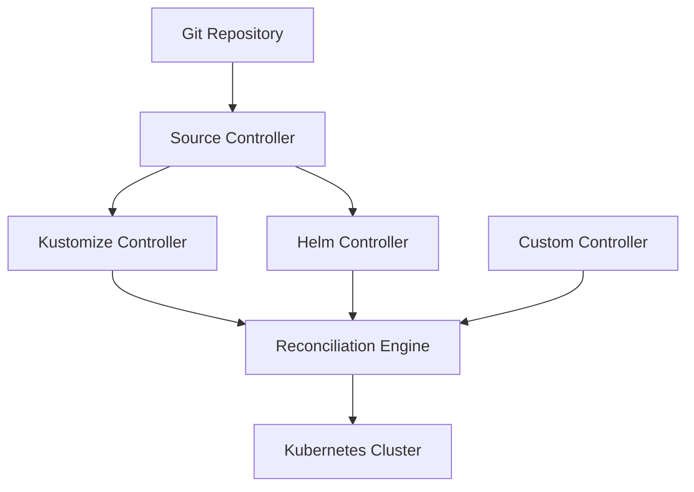
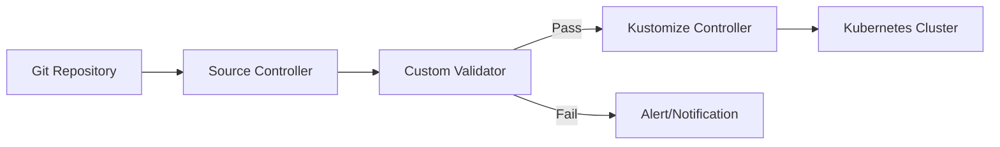

# How to Use Flux CD with GitOps Engine

Author: [nawazdhandala](https://github.com/nawazdhandala)

Tags: Flux CD, gitops engine, Kubernetes, GitOps, Reconciliation, Automation, library

Description: A practical guide to understanding and using the GitOps Engine library with Flux CD for building custom GitOps controllers and automation.

---

## Introduction

The GitOps Engine is a library that provides the core reconciliation logic used by GitOps tools. While Flux CD uses its own set of controllers, understanding the GitOps Engine helps you build custom controllers that complement Flux CD or create specialized automation for your specific use cases.

In this guide, you will learn what the GitOps Engine provides, how it relates to Flux CD, and how to build custom controllers and automation that work alongside your Flux CD installation.

## Prerequisites

Before you begin, ensure you have:

- A running Kubernetes cluster (v1.26 or later)
- Flux CD installed and bootstrapped
- Go 1.21 or later installed
- kubectl configured to access your cluster
- Basic understanding of Kubernetes controllers

```bash
# Verify your environment
kubectl cluster-info
flux check
go version
```

## Understanding the GitOps Engine

### What Is the GitOps Engine

The GitOps Engine is a set of libraries and patterns for implementing GitOps workflows. It provides:

- Reconciliation primitives for syncing desired state to clusters
- Diff calculation between desired and live state
- Resource ordering and dependency management
- Health assessment for Kubernetes resources
- Sync hooks and lifecycle management

### How It Relates to Flux CD

Flux CD implements its own reconciliation engine through its controllers. The GitOps Engine concept provides a framework for understanding and extending these patterns:



## Building Custom Controllers with Flux CD

### Setting Up the Project

Create a new Go project for your custom controller:

```bash
# Create a new Go module
mkdir flux-custom-controller
cd flux-custom-controller
go mod init github.com/myorg/flux-custom-controller
```

### Adding Dependencies

Add the necessary Flux and Kubernetes dependencies:

```bash
# Add Flux runtime and API dependencies
go get github.com/fluxcd/pkg/runtime@latest
go get github.com/fluxcd/pkg/apis/meta@latest
go get sigs.k8s.io/controller-runtime@latest
go get k8s.io/apimachinery@latest
go get k8s.io/client-go@latest
```

### Creating a Custom Resource

Define a custom resource that integrates with Flux CD:

```yaml
# config/crd/custom-deployment.yaml
# CRD for a custom deployment resource that works with Flux
apiVersion: apiextensions.k8s.io/v1
kind: CustomResourceDefinition
metadata:
  name: customdeployments.gitops.example.com
spec:
  group: gitops.example.com
  names:
    kind: CustomDeployment
    listKind: CustomDeploymentList
    plural: customdeployments
    singular: customdeployment
    shortNames:
      - cdeploy
  scope: Namespaced
  versions:
    - name: v1alpha1
      served: true
      storage: true
      schema:
        openAPIV3Schema:
          type: object
          properties:
            spec:
              type: object
              properties:
                # Reference to a Flux source
                sourceRef:
                  type: object
                  properties:
                    kind:
                      type: string
                      enum: [GitRepository, OCIRepository, Bucket]
                    name:
                      type: string
                    namespace:
                      type: string
                # Path within the source
                path:
                  type: string
                # Reconciliation interval
                interval:
                  type: string
                # Custom validation rules
                validation:
                  type: object
                  properties:
                    enabled:
                      type: boolean
                    rules:
                      type: array
                      items:
                        type: string
            status:
              type: object
              properties:
                conditions:
                  type: array
                  items:
                    type: object
                    properties:
                      type:
                        type: string
                      status:
                        type: string
                      reason:
                        type: string
                      message:
                        type: string
                      lastTransitionTime:
                        type: string
                        format: date-time
      subresources:
        status: {}
      additionalPrinterColumns:
        - name: Ready
          type: string
          jsonPath: .status.conditions[?(@.type=="Ready")].status
        - name: Age
          type: date
          jsonPath: .metadata.creationTimestamp
```

### Implementing the Controller

Create a controller that watches Flux sources and performs custom reconciliation:

```go
// controllers/customdeployment_controller.go
package controllers

import (
    "context"
    "fmt"
    "time"

    // Kubernetes client libraries
    "k8s.io/apimachinery/pkg/runtime"
    ctrl "sigs.k8s.io/controller-runtime"
    "sigs.k8s.io/controller-runtime/pkg/client"
    "sigs.k8s.io/controller-runtime/pkg/log"

    // Flux API types for source references
    sourcev1 "github.com/fluxcd/source-controller/api/v1"
    metav1 "k8s.io/apimachinery/pkg/apis/meta/v1"
)

// CustomDeploymentReconciler reconciles custom deployment resources
type CustomDeploymentReconciler struct {
    client.Client
    Scheme *runtime.Scheme
}

// Reconcile performs the reconciliation loop
func (r *CustomDeploymentReconciler) Reconcile(
    ctx context.Context,
    req ctrl.Request,
) (ctrl.Result, error) {
    logger := log.FromContext(ctx)
    logger.Info("Reconciling CustomDeployment", "name", req.NamespacedName)

    // Fetch the CustomDeployment resource
    var customDeploy CustomDeployment
    if err := r.Get(ctx, req.NamespacedName, &customDeploy); err != nil {
        // Resource was deleted, nothing to do
        return ctrl.Result{}, client.IgnoreNotFound(err)
    }

    // Fetch the referenced Flux source
    var gitRepo sourcev1.GitRepository
    sourceRef := client.ObjectKey{
        Name:      customDeploy.Spec.SourceRef.Name,
        Namespace: customDeploy.Spec.SourceRef.Namespace,
    }

    if err := r.Get(ctx, sourceRef, &gitRepo); err != nil {
        logger.Error(err, "Failed to get source", "source", sourceRef)
        return ctrl.Result{RequeueAfter: 1 * time.Minute}, err
    }

    // Check if the source has an artifact ready
    if gitRepo.Status.Artifact == nil {
        logger.Info("Source artifact not ready, requeuing")
        return ctrl.Result{RequeueAfter: 30 * time.Second}, nil
    }

    // Get the artifact URL for downloading
    artifactURL := gitRepo.Status.Artifact.URL
    logger.Info("Processing artifact", "url", artifactURL,
        "revision", gitRepo.Status.Artifact.Revision)

    // Perform custom validation if enabled
    if customDeploy.Spec.Validation.Enabled {
        if err := r.validateArtifact(ctx, artifactURL,
            customDeploy.Spec.Validation.Rules); err != nil {
            // Update status with validation failure
            r.updateStatus(ctx, &customDeploy, "ValidationFailed", err.Error())
            return ctrl.Result{RequeueAfter: 5 * time.Minute}, nil
        }
    }

    // Apply the resources from the artifact
    if err := r.applyResources(ctx, artifactURL, customDeploy.Spec.Path); err != nil {
        r.updateStatus(ctx, &customDeploy, "ApplyFailed", err.Error())
        return ctrl.Result{RequeueAfter: 5 * time.Minute}, err
    }

    // Update status to ready
    r.updateStatus(ctx, &customDeploy, "ReconciliationSucceeded",
        fmt.Sprintf("Applied revision: %s", gitRepo.Status.Artifact.Revision))

    // Parse the interval and requeue
    interval, _ := time.ParseDuration(customDeploy.Spec.Interval)
    return ctrl.Result{RequeueAfter: interval}, nil
}

// validateArtifact checks the artifact against custom rules
func (r *CustomDeploymentReconciler) validateArtifact(
    ctx context.Context,
    artifactURL string,
    rules []string,
) error {
    // Implement custom validation logic here
    // For example: schema validation, policy checks, etc.
    return nil
}

// applyResources downloads and applies resources from the artifact
func (r *CustomDeploymentReconciler) applyResources(
    ctx context.Context,
    artifactURL string,
    path string,
) error {
    // Download the artifact from the source controller
    // Extract files from the specified path
    // Apply resources to the cluster
    return nil
}

// updateStatus updates the status conditions of the custom deployment
func (r *CustomDeploymentReconciler) updateStatus(
    ctx context.Context,
    obj *CustomDeployment,
    reason string,
    message string,
) {
    // Update the status conditions
    obj.Status.Conditions = []metav1.Condition{
        {
            Type:               "Ready",
            Status:             metav1.ConditionTrue,
            Reason:             reason,
            Message:            message,
            LastTransitionTime: metav1.Now(),
        },
    }
    _ = r.Status().Update(ctx, obj)
}

// SetupWithManager registers the controller with the manager
func (r *CustomDeploymentReconciler) SetupWithManager(
    mgr ctrl.Manager,
) error {
    return ctrl.NewControllerManagedBy(mgr).
        For(&CustomDeployment{}).
        Complete(r)
}
```

## Integrating with Flux CD Sources

### Consuming Flux Artifacts

Your custom controller can consume artifacts produced by Flux source controllers:

```yaml
# example-custom-deployment.yaml
# CustomDeployment that references a Flux GitRepository
apiVersion: gitops.example.com/v1alpha1
kind: CustomDeployment
metadata:
  name: my-validated-app
  namespace: default
spec:
  # Reference a Flux GitRepository as the source
  sourceRef:
    kind: GitRepository
    name: app-source
    namespace: flux-system
  # Path within the repository to process
  path: ./deploy/manifests
  # How often to reconcile
  interval: 10m
  # Enable custom validation
  validation:
    enabled: true
    rules:
      - "no-latest-tags"
      - "require-resource-limits"
      - "require-labels"
```

### Setting Up the Source

Create the Flux GitRepository that your custom controller will consume:

```yaml
# app-source.yaml
# GitRepository that provides artifacts to the custom controller
apiVersion: source.toolkit.fluxcd.io/v1
kind: GitRepository
metadata:
  name: app-source
  namespace: flux-system
spec:
  interval: 5m
  url: https://github.com/myorg/my-app
  ref:
    branch: main
  # Include only the deployment manifests
  include:
    - fromPath: deploy/
      toPath: deploy/
```

## Building a Reconciliation Pipeline

### Combining Flux and Custom Controllers

Create a pipeline that uses Flux for source management and your custom controller for validation:

```yaml
# pipeline-source.yaml
# Step 1: Flux fetches the source
apiVersion: source.toolkit.fluxcd.io/v1
kind: GitRepository
metadata:
  name: pipeline-source
  namespace: flux-system
spec:
  interval: 5m
  url: https://github.com/myorg/platform-config
  ref:
    branch: main
---
# Step 2: Custom controller validates the manifests
apiVersion: gitops.example.com/v1alpha1
kind: CustomDeployment
metadata:
  name: validate-config
  namespace: flux-system
spec:
  sourceRef:
    kind: GitRepository
    name: pipeline-source
    namespace: flux-system
  path: ./manifests
  interval: 10m
  validation:
    enabled: true
    rules:
      - "no-latest-tags"
      - "require-resource-limits"
---
# Step 3: Flux applies the validated manifests
apiVersion: kustomize.toolkit.fluxcd.io/v1
kind: Kustomization
metadata:
  name: apply-config
  namespace: flux-system
spec:
  interval: 10m
  sourceRef:
    kind: GitRepository
    name: pipeline-source
  path: ./manifests
  prune: true
  # Depend on validation passing
  dependsOn:
    - name: validate-config
  healthChecks:
    - apiVersion: apps/v1
      kind: Deployment
      name: my-app
      namespace: default
```



## Event-Driven Integration

### Watching Flux Events

Build a controller that reacts to Flux reconciliation events:

```yaml
# event-watcher.yaml
# Flux notification receiver for custom webhooks
apiVersion: notification.toolkit.fluxcd.io/v1
kind: Receiver
metadata:
  name: custom-engine-receiver
  namespace: flux-system
spec:
  type: generic
  secretRef:
    name: receiver-token
  resources:
    - kind: Kustomization
      name: "*"
      namespace: flux-system
```

### Webhook Handler

Deploy a webhook handler that processes Flux events:

```yaml
# webhook-handler.yaml
# Deployment for the custom webhook handler
apiVersion: apps/v1
kind: Deployment
metadata:
  name: gitops-engine-handler
  namespace: flux-system
spec:
  replicas: 1
  selector:
    matchLabels:
      app: gitops-engine-handler
  template:
    metadata:
      labels:
        app: gitops-engine-handler
    spec:
      containers:
        - name: handler
          image: myorg/gitops-engine-handler:latest
          ports:
            - containerPort: 8080
          env:
            # Flux notification controller endpoint
            - name: FLUX_NOTIFICATION_URL
              value: "http://notification-controller.flux-system.svc.cluster.local./"
            # Cluster name for event correlation
            - name: CLUSTER_NAME
              value: "production"
          resources:
            requests:
              cpu: 50m
              memory: 64Mi
            limits:
              cpu: 200m
              memory: 128Mi
---
# Service for the webhook handler
apiVersion: v1
kind: Service
metadata:
  name: gitops-engine-handler
  namespace: flux-system
spec:
  selector:
    app: gitops-engine-handler
  ports:
    - port: 8080
      targetPort: 8080
```

## Custom Health Checks

### Extending Flux Health Assessment

Create custom health checks that Flux Kustomizations can reference:

```yaml
# custom-healthcheck-kustomization.yaml
# Kustomization with custom health checks
apiVersion: kustomize.toolkit.fluxcd.io/v1
kind: Kustomization
metadata:
  name: my-app
  namespace: flux-system
spec:
  interval: 10m
  sourceRef:
    kind: GitRepository
    name: flux-system
  path: ./apps/my-app
  prune: true
  # Health checks for various resource types
  healthChecks:
    # Standard deployment check
    - apiVersion: apps/v1
      kind: Deployment
      name: my-app
      namespace: default
    # Custom resource health check
    - apiVersion: gitops.example.com/v1alpha1
      kind: CustomDeployment
      name: my-validated-app
      namespace: default
    # Check a Job completed successfully
    - apiVersion: batch/v1
      kind: Job
      name: db-migration
      namespace: default
```

## Deploying the Custom Controller

### Controller Deployment Manifest

```yaml
# custom-controller-deployment.yaml
# Deployment for the custom GitOps controller
apiVersion: apps/v1
kind: Deployment
metadata:
  name: custom-gitops-controller
  namespace: flux-system
spec:
  replicas: 1
  selector:
    matchLabels:
      app: custom-gitops-controller
  template:
    metadata:
      labels:
        app: custom-gitops-controller
    spec:
      serviceAccountName: custom-gitops-controller
      containers:
        - name: controller
          image: myorg/custom-gitops-controller:latest
          args:
            # Watch all namespaces for custom resources
            - --watch-all-namespaces=true
            # Log level for debugging
            - --log-level=info
            # Metrics port
            - --metrics-addr=:8080
            # Health probe port
            - --health-addr=:8081
          ports:
            - containerPort: 8080
              name: metrics
            - containerPort: 8081
              name: health
          resources:
            requests:
              cpu: 100m
              memory: 128Mi
            limits:
              cpu: 500m
              memory: 256Mi
          livenessProbe:
            httpGet:
              path: /healthz
              port: health
          readinessProbe:
            httpGet:
              path: /readyz
              port: health
```

## Troubleshooting

### Controller Not Reconciling

```bash
# Check controller logs
kubectl logs -n flux-system deployment/custom-gitops-controller

# Verify CRDs are installed
kubectl get crd customdeployments.gitops.example.com

# Check RBAC permissions
kubectl auth can-i list gitrepositories.source.toolkit.fluxcd.io \
  --as=system:serviceaccount:flux-system:custom-gitops-controller
```

### Source Artifacts Not Available

```bash
# Check source controller status
flux get sources git -A

# Verify artifact URL is accessible
kubectl get gitrepository app-source -n flux-system \
  -o jsonpath='{.status.artifact.url}'
```

## Summary

The GitOps Engine concept provides a foundation for building custom controllers that extend Flux CD capabilities. By leveraging Flux source artifacts and reconciliation patterns, you can create specialized automation such as custom validators, policy enforcers, and deployment pipelines that integrate seamlessly with your existing Flux CD installation. This approach lets you maintain the benefits of Flux CD while adding domain-specific logic tailored to your organization's needs.
