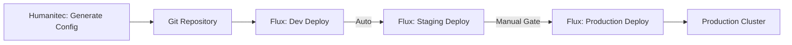

# How to Use Flux CD with Humanitec Platform Orchestrator

Author: [nawazdhandala](https://github.com/nawazdhandala)

Tags: Flux CD, Humanitec, Platform orchestrator, Kubernetes, GitOps, Internal Developer Platform, IdP

Description: A practical guide to integrating Flux CD with the Humanitec Platform Orchestrator for building an enterprise-grade internal developer platform.

---

## Introduction

Humanitec Platform Orchestrator is a platform engineering tool that automates application configuration and deployment across environments. When combined with Flux CD, it creates a powerful internal developer platform where Humanitec handles the application configuration logic and Flux CD manages the GitOps delivery to Kubernetes clusters.

In this guide, you will learn how to integrate Humanitec with Flux CD, configure the GitOps delivery pipeline, and set up automated deployments that leverage both tools.

## Prerequisites

Before you begin, ensure you have:

- A running Kubernetes cluster (v1.26 or later)
- Flux CD installed and bootstrapped
- A Humanitec account (trial available at humanitec.com)
- The Humanitec CLI (humctl) installed
- A Git repository for deployment manifests

```bash
# Verify Flux is running
flux check

# Verify Humanitec CLI
humctl version

# Verify cluster access
kubectl cluster-info
```

## Understanding the Integration Architecture

Humanitec and Flux CD work together in a complementary way:

- **Humanitec** generates Kubernetes manifests based on application configurations, resource definitions, and environment rules
- **Flux CD** watches a Git repository for changes and applies the manifests to the cluster


## Configuring Humanitec for GitOps Delivery

### Step 1: Create a GitOps Resource Definition

Configure Humanitec to push generated manifests to a Git repository:

```yaml
# humanitec-gitops-resource.yaml
# Resource definition for GitOps delivery in Humanitec
apiVersion: entity.humanitec.io/v1b1
kind: Definition
metadata:
  id: flux-gitops-delivery
entity:
  name: Flux GitOps Delivery
  type: config
  driver_type: humanitec/template
  driver_inputs:
    values:
      # Git repository for storing generated manifests
      gitRepo: https://github.com/myorg/fleet-deployments
      # Branch for deployment manifests
      branch: main
      # Path pattern for organizing manifests by environment
      pathPattern: "clusters/${context.env.id}/${context.app.id}"
    templates:
      # Template for generating the deployment structure
      init: |
        name: {{ .driver.values.gitRepo }}
        branch: {{ .driver.values.branch }}
        path: {{ .driver.values.pathPattern }}
```

### Step 2: Configure the Git Credentials

Set up Git credentials in Humanitec for pushing to the deployment repository:

```bash
# Create a GitHub token secret in Humanitec
humctl create secret git-credentials \
  --org myorg \
  --description "Git credentials for Flux deployment repo" \
  --value '{"username":"git","password":"ghp_your_github_token"}'
```

### Step 3: Set Up the Humanitec Agent

Deploy the Humanitec Agent in your cluster to enable communication:

```yaml
# humanitec-agent-helmrelease.yaml
# HelmRelease to deploy the Humanitec Agent via Flux
apiVersion: source.toolkit.fluxcd.io/v1
kind: HelmRepository
metadata:
  name: humanitec
  namespace: flux-system
spec:
  url: https://charts.humanitec.io
  interval: 1h
---
apiVersion: helm.toolkit.fluxcd.io/v2
kind: HelmRelease
metadata:
  name: humanitec-agent
  namespace: humanitec-system
spec:
  interval: 1h
  chart:
    spec:
      chart: humanitec-agent
      version: "1.x"
      sourceRef:
        kind: HelmRepository
        name: humanitec
        namespace: flux-system
  install:
    createNamespace: true
  values:
    # Humanitec organization ID
    humanitec:
      org: myorg
    # Agent authentication
    auth:
      # Reference to a secret containing the agent token
      existingSecret: humanitec-agent-credentials
    # Resource limits for the agent
    resources:
      requests:
        cpu: 100m
        memory: 128Mi
      limits:
        cpu: 500m
        memory: 256Mi
```

Create the agent credentials secret:

```yaml
# humanitec-agent-secret.yaml
# Secret for Humanitec Agent authentication
apiVersion: v1
kind: Secret
metadata:
  name: humanitec-agent-credentials
  namespace: humanitec-system
type: Opaque
stringData:
  # Agent token from Humanitec dashboard
  token: "your-humanitec-agent-token"
```

## Setting Up the Flux CD Delivery Pipeline

### Step 1: Configure the Git Repository Source

```yaml
# fleet-source.yaml
# GitRepository for the Humanitec-generated deployment manifests
apiVersion: source.toolkit.fluxcd.io/v1
kind: GitRepository
metadata:
  name: fleet-deployments
  namespace: flux-system
spec:
  interval: 1m
  url: https://github.com/myorg/fleet-deployments
  ref:
    branch: main
  secretRef:
    # Git credentials for accessing the repository
    name: fleet-git-credentials
```

```yaml
# fleet-git-secret.yaml
# Git credentials for the deployment repository
apiVersion: v1
kind: Secret
metadata:
  name: fleet-git-credentials
  namespace: flux-system
type: Opaque
stringData:
  username: git
  password: "ghp_your_github_token"
```

### Step 2: Create Environment-Specific Kustomizations

Create Flux Kustomizations for each environment that Humanitec manages:

```yaml
# kustomization-staging.yaml
# Kustomization for the staging environment
apiVersion: kustomize.toolkit.fluxcd.io/v1
kind: Kustomization
metadata:
  name: staging-apps
  namespace: flux-system
spec:
  interval: 5m
  sourceRef:
    kind: GitRepository
    name: fleet-deployments
  # Path matches Humanitec's pathPattern for staging
  path: ./clusters/staging
  prune: true
  # Wait for infrastructure to be ready first
  dependsOn:
    - name: staging-infrastructure
  # Health checks for deployed applications
  healthChecks:
    - apiVersion: apps/v1
      kind: Deployment
      name: "*"
      namespace: staging
  # Force apply resources that Humanitec manages
  force: false
```

```yaml
# kustomization-production.yaml
# Kustomization for the production environment
apiVersion: kustomize.toolkit.fluxcd.io/v1
kind: Kustomization
metadata:
  name: production-apps
  namespace: flux-system
spec:
  interval: 5m
  sourceRef:
    kind: GitRepository
    name: fleet-deployments
  # Path matches Humanitec's pathPattern for production
  path: ./clusters/production
  prune: true
  dependsOn:
    - name: production-infrastructure
  healthChecks:
    - apiVersion: apps/v1
      kind: Deployment
      name: "*"
      namespace: production
  # Post-build variable substitution for environment-specific values
  postBuild:
    substituteFrom:
      - kind: ConfigMap
        name: production-vars
```

### Step 3: Create Infrastructure Kustomizations

Manage shared infrastructure through Flux separately from application workloads:

```yaml
# kustomization-infra.yaml
# Infrastructure Kustomization that runs before application deployments
apiVersion: kustomize.toolkit.fluxcd.io/v1
kind: Kustomization
metadata:
  name: staging-infrastructure
  namespace: flux-system
spec:
  interval: 30m
  sourceRef:
    kind: GitRepository
    name: fleet-deployments
  path: ./infrastructure/staging
  prune: true
  healthChecks:
    - apiVersion: apps/v1
      kind: Deployment
      name: ingress-nginx-controller
      namespace: ingress-nginx
```

## Configuring Humanitec Resource Definitions

### Kubernetes Namespace Resource

```yaml
# humanitec-namespace-resource.yaml
# Resource definition for creating Kubernetes namespaces
apiVersion: entity.humanitec.io/v1b1
kind: Definition
metadata:
  id: k8s-namespace
entity:
  name: Kubernetes Namespace
  type: k8s-namespace
  driver_type: humanitec/template
  driver_inputs:
    values:
      # Namespace naming convention
      namespacePattern: "${context.env.id}-${context.app.id}"
    templates:
      manifests: |
        namespace.yaml:
          location: namespace
          data:
            apiVersion: v1
            kind: Namespace
            metadata:
              name: {{ .driver.values.namespacePattern }}
              labels:
                app.kubernetes.io/managed-by: humanitec
                toolkit.fluxcd.io/tenant: {{ .context.env.id }}
```

### Deployment Resource with Flux Annotations

```yaml
# humanitec-deployment-resource.yaml
# Resource definition that generates deployments with Flux-compatible labels
apiVersion: entity.humanitec.io/v1b1
kind: Definition
metadata:
  id: k8s-deployment
entity:
  name: Kubernetes Deployment
  type: workload
  driver_type: humanitec/template
  driver_inputs:
    templates:
      manifests: |
        deployment.yaml:
          location: namespace
          data:
            apiVersion: apps/v1
            kind: Deployment
            metadata:
              name: {{ .id }}
              labels:
                # Labels for Flux health checking
                app.kubernetes.io/name: {{ .id }}
                app.kubernetes.io/part-of: {{ .context.app.id }}
                app.kubernetes.io/managed-by: humanitec
            spec:
              replicas: {{ .driver.values.replicas | default 1 }}
              selector:
                matchLabels:
                  app.kubernetes.io/name: {{ .id }}
              template:
                metadata:
                  labels:
                    app.kubernetes.io/name: {{ .id }}
                spec:
                  containers:
                    - name: main
                      image: {{ .driver.values.image }}
                      ports:
                        - containerPort: {{ .driver.values.port | default 8080 }}
                      resources:
                        requests:
                          cpu: {{ .driver.values.cpu_request | default "100m" }}
                          memory: {{ .driver.values.memory_request | default "128Mi" }}
                        limits:
                          cpu: {{ .driver.values.cpu_limit | default "500m" }}
                          memory: {{ .driver.values.memory_limit | default "256Mi" }}
```

## Setting Up Notifications

### Flux Notifications for Humanitec

Configure Flux to send notifications when deployments succeed or fail:

```yaml
# flux-humanitec-notification.yaml
# Provider for sending webhook notifications to Humanitec
apiVersion: notification.toolkit.fluxcd.io/v1
kind: Provider
metadata:
  name: humanitec-webhook
  namespace: flux-system
spec:
  type: generic
  # Humanitec webhook endpoint for deployment status
  address: https://api.humanitec.io/orgs/myorg/webhooks/flux
  secretRef:
    name: humanitec-webhook-secret
---
# Alert configuration for deployment events
apiVersion: notification.toolkit.fluxcd.io/v1
kind: Alert
metadata:
  name: humanitec-deployment-alerts
  namespace: flux-system
spec:
  providerRef:
    name: humanitec-webhook
  # Notify on both success and failure
  eventSeverity: info
  eventSources:
    # Watch all application Kustomizations
    - kind: Kustomization
      name: "staging-apps"
      namespace: flux-system
    - kind: Kustomization
      name: "production-apps"
      namespace: flux-system
  # Include event metadata
  eventMetadata:
    cluster: production
    managed-by: flux-cd
---
# Webhook authentication secret
apiVersion: v1
kind: Secret
metadata:
  name: humanitec-webhook-secret
  namespace: flux-system
type: Opaque
stringData:
  token: "your-humanitec-webhook-token"
```

## Environment Promotion Pipeline

### Automated Promotion with Humanitec and Flux

Set up a promotion pipeline that uses Humanitec for configuration and Flux for delivery:

```yaml
# promotion-pipeline.yaml
# Kustomization for the development environment (auto-deploy)
apiVersion: kustomize.toolkit.fluxcd.io/v1
kind: Kustomization
metadata:
  name: dev-apps
  namespace: flux-system
spec:
  interval: 2m
  sourceRef:
    kind: GitRepository
    name: fleet-deployments
  path: ./clusters/development
  prune: true
---
# Kustomization for staging (auto-deploy after dev succeeds)
apiVersion: kustomize.toolkit.fluxcd.io/v1
kind: Kustomization
metadata:
  name: staging-apps
  namespace: flux-system
spec:
  interval: 5m
  sourceRef:
    kind: GitRepository
    name: fleet-deployments
  path: ./clusters/staging
  prune: true
  dependsOn:
    - name: dev-apps
---
# Kustomization for production (manual gate via suspend)
apiVersion: kustomize.toolkit.fluxcd.io/v1
kind: Kustomization
metadata:
  name: production-apps
  namespace: flux-system
spec:
  interval: 10m
  sourceRef:
    kind: GitRepository
    name: fleet-deployments
  path: ./clusters/production
  prune: true
  # Start suspended; resume after approval
  suspend: true
  dependsOn:
    - name: staging-apps
```



## Monitoring the Integration

### Checking Deployment Status

```bash
# Check Flux reconciliation status for all environments
flux get kustomization -A

# Check if Humanitec-generated manifests are in the repo
git -C /path/to/fleet-deployments log --oneline -10

# Check the Humanitec Agent status
kubectl get pods -n humanitec-system

# View deployment history in Humanitec
humctl get deployments --org myorg --app my-app --env staging
```

### Verifying End-to-End Flow

```bash
# 1. Trigger a deployment in Humanitec
humctl deploy --org myorg --app my-app --env staging

# 2. Wait for manifests to appear in Git
git -C /path/to/fleet-deployments pull
ls clusters/staging/my-app/

# 3. Check Flux reconciliation
flux get kustomization staging-apps -n flux-system

# 4. Verify the deployment in the cluster
kubectl get deployments -n staging -l app.kubernetes.io/managed-by=humanitec
```

## Troubleshooting

### Manifests Not Appearing in Git

```bash
# Check Humanitec deployment logs
humctl get deployment-errors --org myorg --app my-app --env staging

# Verify Git credentials in Humanitec
humctl get secrets --org myorg | grep git

# Check the Humanitec Agent logs
kubectl logs -n humanitec-system deployment/humanitec-agent
```

### Flux Not Applying Manifests

```bash
# Check source reconciliation
flux get source git fleet-deployments -n flux-system

# Check Kustomization status for errors
flux get kustomization staging-apps -n flux-system -o yaml

# View recent events
flux events --for Kustomization/staging-apps
```

### Resource Conflicts

If Flux and Humanitec conflict on resource ownership:

```bash
# Check for field manager conflicts
kubectl get deployment my-app -n staging -o yaml \
  | grep -A5 managedFields

# Ensure Flux has force apply enabled if needed
# Add force: true to the Kustomization spec
```

## Summary

Integrating Flux CD with the Humanitec Platform Orchestrator combines the strengths of both tools: Humanitec's intelligent configuration management with Flux CD's reliable GitOps delivery. This integration gives platform teams a way to abstract infrastructure complexity while maintaining the auditability and reliability of GitOps. Developers interact with Humanitec's high-level abstractions, while Flux CD ensures that the generated configurations are consistently applied to the target clusters.
