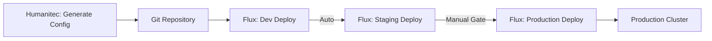

# How to Use Flux CD with Humanitec Platform Orchestrator

Author: [nawazdhandala](https://github.com/nawazdhandala)

Tags: Flux CD, Humanitec, Platform orchestrator, Kubernetes, GitOps, Internal Developer Platform, IdP

Description: A practical guide to integrating Flux CD with the Humanitec Platform Orchestrator for building an enterprise-grade internal developer platform.

---

## Introduction

Humanitec Platform Orchestrator is a platform engineering tool that automates application configuration and deployment across environments. When combined with Flux CD, it creates a powerful internal developer platform where Humanitec handles the application configuration logic and Flux CD manages the GitOps delivery to Kubernetes clusters.

In this guide, you will learn how to integrate Humanitec with Flux CD, configure the GitOps delivery pipeline, and set up automated deployments that leverage both tools.

## Prerequisites

Before you begin, ensure you have:

- A running Kubernetes cluster (v1.26 or later)
- Flux CD installed and bootstrapped
- A Humanitec account (trial available at humanitec.com)
- The Humanitec CLI (humctl) installed
- A Git repository for deployment manifests
- Permission to install the Humanitec Operator in the target cluster

```bash
# Verify Flux is running

flux check

# Verify Humanitec CLI
humctl version

# Verify cluster access
kubectl cluster-info
```

## Understanding the Integration Architecture

Humanitec and Flux CD work together in a complementary way:

- **Humanitec** writes Humanitec custom resources (CRs) that represent the deployment's Resource Graph to Git
- **Flux CD** watches the Git repository and applies those CRs to the cluster, where the Humanitec Operator processes them and creates the Kubernetes resources


```mermaid
graph LR
    A[Developer] --> B[Humanitec Platform Orchestrator]
    B --> C[Write Humanitec CRs]
    C --> D[Git Repository]
    D --> E[Flux CD Source Controller]
    E --> F[Flux CD Kustomize Controller]
    F --> G[Humanitec Operator]
    G --> H[Kubernetes Cluster]
```

## Configuring Humanitec for GitOps Delivery

### Step 1: Create a GitOps Cluster Resource Definition

Configure Humanitec to push generated Humanitec CRs to a Git repository:

```yaml
# humanitec-gitops-resource.yaml
# Resource definition for GitOps delivery in Humanitec
apiVersion: entity.humanitec.io/v1b1
kind: Definition
metadata:
  id: flux-gitops-delivery
entity:
  name: Flux GitOps Delivery
  type: k8s-cluster
  driver_type: humanitec/k8s-cluster-git
  driver_inputs:
    values:
      # Git repository for storing generated Humanitec CRs
      url: https://github.com/myorg/fleet-deployments.git
      # Branch for deployment manifests
      branch: main
      # Path pattern for organizing manifests by environment
      path: "${context.app.id}/${context.env.id}"
      # User for HTTPS Git authentication. Defaults to git if omitted.
      username: git
    secrets:
      credentials:
        # GitHub personal access token or Git password
        password: ghp_your_github_token
  criteria:
    - env_type: development
    - env_type: staging
    - env_type: production
```

### Step 2: Configure the Git Credentials

Apply the Resource Definition to store the Git target and credentials in Humanitec:

```bash
humctl apply -f humanitec-gitops-resource.yaml --org myorg
```

### Step 3: Set Up the Humanitec Operator

Deploy the Humanitec Operator in your cluster so it can process the CRs applied by Flux:

```yaml
# humanitec-operator-helmrelease.yaml
# HelmRelease to deploy the Humanitec Operator via Flux
apiVersion: source.toolkit.fluxcd.io/v1
kind: HelmRepository
metadata:
  name: humanitec
  namespace: flux-system
spec:
  type: oci
  url: oci://ghcr.io/humanitec/charts
  interval: 1h
---
apiVersion: helm.toolkit.fluxcd.io/v2
kind: HelmRelease
metadata:
  name: humanitec-operator
  namespace: flux-system
spec:
  interval: 1h
  targetNamespace: humanitec-operator-system
  chart:
    spec:
      chart: humanitec-operator
      sourceRef:
        kind: HelmRepository
        name: humanitec
        namespace: flux-system
  install:
    createNamespace: true
  values:
    # Add operator chart values here if your setup requires overrides.
    controllerManager: {}
```

## Setting Up the Flux CD Delivery Pipeline

### Step 1: Configure the Git Repository Source

```yaml
# fleet-source.yaml
# GitRepository for the Humanitec-generated deployment manifests
apiVersion: source.toolkit.fluxcd.io/v1
kind: GitRepository
metadata:
  name: fleet-deployments
  namespace: flux-system
spec:
  interval: 1m
  url: https://github.com/myorg/fleet-deployments
  ref:
    branch: main
  secretRef:
    # Git credentials for accessing the repository
    name: fleet-git-credentials
```

```yaml
# fleet-git-secret.yaml
# Git credentials for the deployment repository
apiVersion: v1
kind: Secret
metadata:
  name: fleet-git-credentials
  namespace: flux-system
type: Opaque
stringData:
  username: git
  password: "ghp_your_github_token"
```

### Step 2: Create Environment-Specific Kustomizations

Create Flux Kustomizations for each environment that Humanitec manages. Ensure the target namespaces exist first, for example by creating them in your infrastructure Kustomization:

```yaml
# kustomization-staging.yaml
# Kustomization for the staging environment
apiVersion: kustomize.toolkit.fluxcd.io/v1
kind: Kustomization
metadata:
  name: staging-apps
  namespace: flux-system
spec:
  interval: 5m
  sourceRef:
    kind: GitRepository
    name: fleet-deployments
  # Path matches the k8s-cluster-git Resource Definition path for staging
  path: ./my-app/staging
  # Retain Humanitec CRs in the cluster if they are removed from Git to avoid
  # deleting real-world resources unexpectedly.
  prune: false
  targetNamespace: my-app-staging
  # Wait for infrastructure to be ready first
  dependsOn:
    - name: staging-infrastructure
  # Force apply resources only if server-side apply conflicts need to be resolved
  force: false
```

```yaml
# kustomization-production.yaml
# Kustomization for the production environment
apiVersion: kustomize.toolkit.fluxcd.io/v1
kind: Kustomization
metadata:
  name: production-apps
  namespace: flux-system
spec:
  interval: 5m
  sourceRef:
    kind: GitRepository
    name: fleet-deployments
  # Path matches the k8s-cluster-git Resource Definition path for production
  path: ./my-app/production
  prune: false
  targetNamespace: my-app-production
  dependsOn:
    - name: production-infrastructure
  # Post-build variable substitution for environment-specific values
  postBuild:
    substituteFrom:
      - kind: ConfigMap
        name: production-vars
```

### Step 3: Create Infrastructure Kustomizations

Manage shared infrastructure through Flux separately from application workloads:

```yaml
# kustomization-infra.yaml
# Infrastructure Kustomization that runs before application deployments
apiVersion: kustomize.toolkit.fluxcd.io/v1
kind: Kustomization
metadata:
  name: staging-infrastructure
  namespace: flux-system
spec:
  interval: 30m
  sourceRef:
    kind: GitRepository
    name: fleet-deployments
  path: ./infrastructure/staging
  prune: true
  healthChecks:
    - apiVersion: apps/v1
      kind: Deployment
      name: ingress-nginx-controller
      namespace: ingress-nginx
```

## Configuring Humanitec Resource Definitions

### Kubernetes Namespace Resource

```yaml
# humanitec-namespace-resource.yaml
# Resource definition for creating Kubernetes namespaces
apiVersion: entity.humanitec.io/v1b1
kind: Definition
metadata:
  id: k8s-namespace
entity:
  name: Kubernetes Namespace
  type: k8s-namespace
  driver_type: humanitec/echo
  driver_inputs:
    values:
      # Namespace naming convention. This must match the Flux targetNamespace.
      namespace: "${context.app.id}-${context.env.id}"
  criteria:
    - {}
```

### Workload Deployment with Score

```yaml
# score.yaml
# Workload definition deployed through Humanitec
apiVersion: score.dev/v1b1
metadata:
  name: my-app
containers:
  web:
    image: ghcr.io/myorg/my-app:1.0.0
    service:
      ports:
        http:
          port: 8080
          targetPort: 8080
    resources:
      requests:
        cpu: 100m
        memory: 128Mi
      limits:
        cpu: 500m
        memory: 256Mi
```

## Setting Up Notifications

### Flux Notifications for a Deployment Status Bridge

Configure Flux to send notifications when GitOps synchronization succeeds or fails. If you want these events reflected in Humanitec, point the generic provider at a service you own that receives Flux events and calls the Humanitec API:

```yaml
# flux-humanitec-notification.yaml
# Provider for sending webhook notifications to an external bridge
apiVersion: notification.toolkit.fluxcd.io/v1beta3
kind: Provider
metadata:
  name: deployment-status-bridge
  namespace: flux-system
spec:
  type: generic
  # Your HTTPS endpoint that accepts Flux events
  address: https://status-bridge.example.com/flux
  secretRef:
    name: deployment-status-bridge-secret
---
# Alert configuration for deployment events
apiVersion: notification.toolkit.fluxcd.io/v1beta3
kind: Alert
metadata:
  name: deployment-status-alerts
  namespace: flux-system
spec:
  providerRef:
    name: deployment-status-bridge
  # Notify on both success and failure
  eventSeverity: info
  eventSources:
    # Watch all application Kustomizations
    - kind: Kustomization
      name: "staging-apps"
      namespace: flux-system
    - kind: Kustomization
      name: "production-apps"
      namespace: flux-system
  # Include event metadata
  eventMetadata:
    cluster: production
    managed-by: flux-cd
---
# Webhook authentication secret
apiVersion: v1
kind: Secret
metadata:
  name: deployment-status-bridge-secret
  namespace: flux-system
type: Opaque
stringData:
  token: "your-bridge-token"
```

## Environment Promotion Pipeline

### Automated Promotion with Humanitec and Flux

Set up Flux ordering for environments after your CI/CD or Humanitec pipeline has written the desired CRs to each environment path. `dependsOn` controls reconciliation order; it does not copy or promote manifests between directories:

```yaml
# promotion-pipeline.yaml
# Kustomization for the development environment (auto-deploy)
apiVersion: kustomize.toolkit.fluxcd.io/v1
kind: Kustomization
metadata:
  name: dev-apps
  namespace: flux-system
spec:
  interval: 2m
  sourceRef:
    kind: GitRepository
    name: fleet-deployments
  path: ./my-app/development
  prune: false
  targetNamespace: my-app-development
---
# Kustomization for staging (reconcile after dev succeeds)
apiVersion: kustomize.toolkit.fluxcd.io/v1
kind: Kustomization
metadata:
  name: staging-apps
  namespace: flux-system
spec:
  interval: 5m
  sourceRef:
    kind: GitRepository
    name: fleet-deployments
  path: ./my-app/staging
  prune: false
  targetNamespace: my-app-staging
  dependsOn:
    - name: dev-apps
---
# Kustomization for production (manual gate via suspend)
apiVersion: kustomize.toolkit.fluxcd.io/v1
kind: Kustomization
metadata:
  name: production-apps
  namespace: flux-system
spec:
  interval: 10m
  sourceRef:
    kind: GitRepository
    name: fleet-deployments
  path: ./my-app/production
  prune: false
  targetNamespace: my-app-production
  # Start suspended; resume after approval
  suspend: true
  dependsOn:
    - name: staging-apps
```


```mermaid
graph LR
    A[Humanitec: Generate Config] --> B[Git Repository]
    B --> C[Flux: Dev Deploy]
    C -->|Auto| D[Flux: Staging Deploy]
    D -->|Manual Gate| E[Flux: Production Deploy]
    E --> F[Production Cluster]
```

## Monitoring the Integration

### Checking Deployment Status

```bash
# Check Flux reconciliation status for all environments
flux get kustomization -A

# Check if Humanitec-generated manifests are in the repo
git -C /path/to/fleet-deployments log --oneline -10

# Check the Humanitec Operator status
kubectl get pods -n humanitec-operator-system

# View deployment history in Humanitec
humctl get deploy . --org myorg --app my-app --env staging
```

### Verifying End-to-End Flow

```bash
# 1. Trigger a deployment in Humanitec
humctl score deploy -f score.yaml --org myorg --app my-app --env staging --wait

# 2. Wait for Humanitec CRs to appear in Git
git -C /path/to/fleet-deployments pull
ls my-app/staging/

# 3. Check Flux reconciliation
flux get kustomization staging-apps -n flux-system

# 4. Verify the Humanitec CRs and resulting workload in the cluster
kubectl get workloads,resources -n my-app-staging
kubectl get deployments -n my-app-staging
```

## Troubleshooting

### Manifests Not Appearing in Git

```bash
# Check Humanitec deployment logs
humctl get deploy-error --org myorg --app my-app --env staging

# Verify the GitOps Resource Definition in Humanitec
humctl get def flux-gitops-delivery --org myorg -o yaml

# Check the Humanitec Operator logs
kubectl logs -n humanitec-operator-system deployment/humanitec-operator-controller-manager -c manager
```

### Flux Not Applying Manifests

```bash
# Check source reconciliation
flux get source git fleet-deployments -n flux-system

# Check Kustomization status for errors
flux get kustomization staging-apps -n flux-system -o yaml

# View recent events
flux events --for Kustomization/staging-apps
```

Resource Conflicts

If Flux and Humanitec conflict on resource ownership:

```bash
# Check for field manager conflicts
kubectl get deployment my-app -n my-app-staging -o yaml \
  | grep -A5 managedFields

# Enable force apply only if needed
# Add force: true to the Kustomization spec
```

## Summary

Integrating Flux CD with the Humanitec Platform Orchestrator combines the strengths of both tools: Humanitec's intelligent configuration management with Flux CD's reliable GitOps delivery. This integration gives platform teams a way to abstract infrastructure complexity while maintaining the auditability and reliability of GitOps. Developers interact with Humanitec's high-level abstractions, while Flux CD ensures that the generated Humanitec CRs are consistently applied to the target clusters and the Humanitec Operator turns them into Kubernetes resources.
