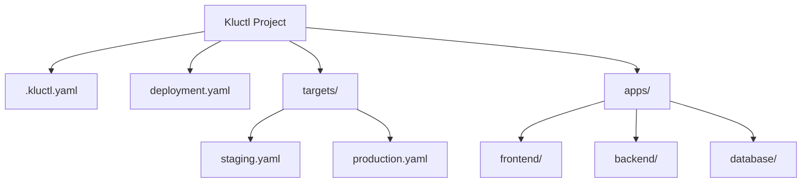

# How to Use Flux CD with Kluctl for Deployments

Author: [nawazdhandala](https://github.com/nawazdhandala)

Tags: flux cd, kluctl, kubernetes, gitops, deployments, templating

Description: Learn how to integrate Kluctl with Flux CD to leverage advanced templating, multi-environment deployments, and diff-based deployment strategies.

---

## Introduction

Kluctl is a deployment tool for Kubernetes that combines the flexibility of Kustomize with Jinja2 templating and a powerful diff-based deployment approach. When integrated with Flux CD through the Kluctl Controller, you get the best of both worlds: Kluctl's advanced templating and multi-environment capabilities with Flux CD's GitOps reconciliation engine.

This guide demonstrates how to set up the Kluctl Controller for Flux CD and build sophisticated deployment pipelines.

## Prerequisites

Before starting, ensure you have:

- A Kubernetes cluster (v1.25 or later)
- Flux CD installed and bootstrapped
- Kluctl CLI installed
- A Git repository connected to Flux CD
- kubectl configured for your cluster

## Installing Kluctl CLI

```bash
# Install on macOS
brew install kluctl/tap/kluctl

# Install on Linux
curl -sSL https://kluctl.io/install.sh | bash

# Verify installation
kluctl version
```

## Installing the Kluctl Controller

The Kluctl Controller integrates natively with Flux CD:

```bash
# Install the Kluctl controller into your cluster
kluctl controller install

# Verify the controller is running
kubectl get pods -n kluctl-system
```

Alternatively, install via Flux CD itself:

```yaml
# clusters/production/infrastructure/kluctl-controller.yaml
apiVersion: source.toolkit.fluxcd.io/v1
kind: HelmRepository
metadata:
  name: kluctl
  namespace: flux-system
spec:
  interval: 1h
  url: https://kluctl.github.io/charts
---
apiVersion: helm.toolkit.fluxcd.io/v1
kind: HelmRelease
metadata:
  name: kluctl-controller
  namespace: kluctl-system
spec:
  interval: 1h
  chart:
    spec:
      chart: kluctl-controller
      version: ">=2.0.0"
      sourceRef:
        kind: HelmRepository
        name: kluctl
        namespace: flux-system
  install:
    createNamespace: true
```

## Understanding Kluctl Project Structure

A Kluctl project uses a hierarchical structure with targets for different environments:



## Creating a Kluctl Project

### Project Configuration

```yaml
# .kluctl.yaml
# Main Kluctl project configuration
targets:
  # Staging environment target
  - name: staging
    context: staging-cluster
    args:
      environment: staging
      replicas: 1
      domain: staging.example.com
    discriminator: "staging-{{ args.environment }}"

  # Production environment target
  - name: production
    context: production-cluster
    args:
      environment: production
      replicas: 3
      domain: example.com
    discriminator: "production-{{ args.environment }}"
```

### Root Deployment File

```yaml
# deployment.yaml
# Root deployment descriptor
deployments:
  # Deploy namespace first
  - path: namespaces

  # Deploy infrastructure components
  - path: infrastructure
    barrier: true  # Wait for infrastructure before proceeding

  # Deploy application workloads
  - path: apps

# Common variables available to all deployments
commonLabels:
  managed-by: kluctl
  environment: "{{ args.environment }}"

# Override files for environment-specific values
overrideVars:
  - file: "targets/{{ args.environment }}.yaml"
```

### Environment-Specific Variables

```yaml
# targets/staging.yaml
# Variables specific to the staging environment
database:
  host: postgres-staging.internal
  port: 5432
  name: myapp_staging
  replicas: 1

redis:
  host: redis-staging.internal
  port: 6379

monitoring:
  enabled: false

resources:
  cpu_limit: "500m"
  memory_limit: "256Mi"
  cpu_request: "100m"
  memory_request: "128Mi"
```

```yaml
# targets/production.yaml
# Variables specific to the production environment
database:
  host: postgres-production.internal
  port: 5432
  name: myapp_production
  replicas: 3

redis:
  host: redis-production.internal
  port: 6379

monitoring:
  enabled: true

resources:
  cpu_limit: "2000m"
  memory_limit: "1Gi"
  cpu_request: "500m"
  memory_request: "512Mi"
```

## Defining Application Deployments

### Namespace Definition

```yaml
# namespaces/namespace.yaml
apiVersion: v1
kind: Namespace
metadata:
  name: "{{ args.environment }}"
  labels:
    environment: "{{ args.environment }}"
```

### Backend Application with Jinja2 Templating

```yaml
# apps/backend/deployment.yaml
apiVersion: apps/v1
kind: Deployment
metadata:
  name: backend
  namespace: "{{ args.environment }}"
  labels:
    app: backend
    environment: "{{ args.environment }}"
spec:
  # Replicas from target-specific args
  replicas: {{ args.replicas }}
  selector:
    matchLabels:
      app: backend
  template:
    metadata:
      labels:
        app: backend
    spec:
      containers:
        - name: backend
          image: myregistry.io/backend:v2.1.0
          ports:
            - containerPort: 8080
          env:
            # Database configuration from environment variables
            - name: DATABASE_HOST
              value: "{{ database.host }}"
            - name: DATABASE_PORT
              value: "{{ database.port }}"
            - name: DATABASE_NAME
              value: "{{ database.name }}"
            - name: REDIS_URL
              value: "redis://{{ redis.host }}:{{ redis.port }}"
          resources:
            limits:
              cpu: "{{ resources.cpu_limit }}"
              memory: "{{ resources.memory_limit }}"
            requests:
              cpu: "{{ resources.cpu_request }}"
              memory: "{{ resources.memory_request }}"
          # Health check probes
          livenessProbe:
            httpGet:
              path: /healthz
              port: 8080
            initialDelaySeconds: 15
            periodSeconds: 20
          readinessProbe:
            httpGet:
              path: /ready
              port: 8080
            initialDelaySeconds: 5
            periodSeconds: 10
```

### Service with Conditional Configuration

```yaml
# apps/backend/service.yaml
apiVersion: v1
kind: Service
metadata:
  name: backend
  namespace: "{{ args.environment }}"
spec:
  selector:
    app: backend
  ports:
    - port: 80
      targetPort: 8080
      protocol: TCP
  type: ClusterIP
```

### Apps Deployment Descriptor

```yaml
# apps/deployment.yaml
deployments:
  - path: backend
  - path: frontend

  # Only deploy monitoring in environments where it is enabled
  - path: monitoring

```

## Integrating Kluctl with Flux CD

### Create a KluctlDeployment Resource

The KluctlDeployment CRD is the bridge between Kluctl and Flux CD:

```yaml
# clusters/production/apps/kluctl-deployment.yaml
apiVersion: gitops.kluctl.io/v1beta1
kind: KluctlDeployment
metadata:
  name: my-application
  namespace: kluctl-system
spec:
  # Reconciliation interval
  interval: 10m
  # Source repository
  source:
    kind: GitRepository
    name: flux-system
    namespace: flux-system
  # Target to deploy (maps to .kluctl.yaml targets)
  target: production
  # Enable pruning of orphaned resources
  prune: true
  # Enable dry-run validation before deploying
  dryRun: false
  # Timeout for deployment
  timeout: 5m
  # Deploy on changes only
  deployOnChanges: true
```

### KluctlDeployment with Manual Approval

For production deployments that require approval:

```yaml
# clusters/production/apps/kluctl-deployment-manual.yaml
apiVersion: gitops.kluctl.io/v1beta1
kind: KluctlDeployment
metadata:
  name: my-application-manual
  namespace: kluctl-system
spec:
  interval: 10m
  source:
    kind: GitRepository
    name: flux-system
    namespace: flux-system
  target: production
  prune: true
  # Suspend automatic deployment - requires manual approval
  suspend: true
  # Only perform dry-run to show changes
  dryRun: true
  # Manual approval annotation
  # Set to "true" to approve deployment
  # kubectl annotate kluctldeployment my-application-manual \
  #   -n kluctl-system \
  #   kluctl.io/request-deploy=true
```

## Using Kluctl Diff for Safe Deployments

Kluctl's diff feature lets you preview changes before they are applied:

```bash
# Preview changes for staging
kluctl diff --target staging

# Preview changes for production
kluctl diff --target production

# Deploy after reviewing the diff
kluctl deploy --target production --yes
```

## Multi-Cluster Deployment with Kluctl and Flux

Deploy the same application to multiple clusters:

```yaml
# clusters/staging/apps/kluctl-staging.yaml
apiVersion: gitops.kluctl.io/v1beta1
kind: KluctlDeployment
metadata:
  name: my-application
  namespace: kluctl-system
spec:
  interval: 5m
  source:
    kind: GitRepository
    name: flux-system
    namespace: flux-system
  # Deploy to staging target
  target: staging
  prune: true
  deployOnChanges: true
```

```yaml
# clusters/production/apps/kluctl-production.yaml
apiVersion: gitops.kluctl.io/v1beta1
kind: KluctlDeployment
metadata:
  name: my-application
  namespace: kluctl-system
spec:
  interval: 10m
  source:
    kind: GitRepository
    name: flux-system
    namespace: flux-system
  # Deploy to production target
  target: production
  prune: true
  # Longer timeout for production
  timeout: 10m
  deployOnChanges: true
```

## Monitoring Kluctl Deployments

Check the status of your Kluctl deployments:

```bash
# List all KluctlDeployments
kubectl get kluctldeployments -n kluctl-system

# View detailed deployment status
kubectl describe kluctldeployment my-application -n kluctl-system

# Check deployment conditions
kubectl get kluctldeployment my-application -n kluctl-system \
  -o jsonpath='{.status.conditions[*].message}'
```

## Setting Up Notifications for Kluctl Deployments

```yaml
# clusters/production/monitoring/kluctl-alerts.yaml
apiVersion: notification.toolkit.fluxcd.io/v1beta3
kind: Alert
metadata:
  name: kluctl-deployments
  namespace: flux-system
spec:
  severity: info
  providerRef:
    name: slack-notifications
  eventSources:
    # Watch KluctlDeployment events
    - kind: KluctlDeployment
      name: "*"
      namespace: kluctl-system
```

## Troubleshooting

### Kluctl Template Rendering Errors

```bash
# Validate templates locally
kluctl render --target staging

# Check for undefined variables
kluctl validate --target production
```

### KluctlDeployment Not Reconciling

```bash
# Check controller logs
kubectl logs -n kluctl-system deployment/kluctl-controller

# Force reconciliation
kubectl annotate kluctldeployment my-application \
  -n kluctl-system \
  kluctl.io/request-deploy=true --overwrite
```

## Best Practices

1. **Use targets for environments** - Define separate targets in `.kluctl.yaml` for each environment with appropriate variables.
2. **Leverage barriers** - Use `barrier: true` in deployment descriptors to ensure dependencies are ready before deploying dependents.
3. **Preview with diff** - Always run `kluctl diff` before deploying to production to review changes.
4. **Use discriminators** - Set unique discriminators per target to prevent resource conflicts across environments.
5. **Enable prune carefully** - Start with `prune: false` and enable it only after verifying your deployment configurations are correct.

## Conclusion

Kluctl and Flux CD together provide a powerful deployment solution that combines Kluctl's advanced Jinja2 templating, multi-environment targets, and diff-based deployments with Flux CD's GitOps reconciliation. The KluctlDeployment CRD bridges both tools seamlessly, giving you a production-grade deployment pipeline with full visibility into changes before they hit your cluster.
