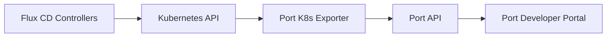

# How to Use Flux CD with Port Developer Portal

Author: [nawazdhandala](https://github.com/nawazdhandala)

Tags: flux cd, port, developer portal, kubernetes, gitops, internal developer platform, service catalog

Description: A practical guide to integrating Flux CD with Port developer portal for unified service catalog management and GitOps deployment visibility.

---

## Introduction

Port is a developer portal platform that helps organizations build internal developer portals with a focus on service catalogs, scorecards, and self-service actions. By integrating Flux CD with Port, you can automatically populate your service catalog with GitOps deployment data, track reconciliation status, and give developers visibility into their deployments without needing direct cluster access.

In this guide, you will learn how to connect Flux CD to Port, map Flux resources to Port entities, and set up automation to keep your developer portal in sync with your GitOps state.

## Prerequisites

Before you begin, ensure you have:

- A running Kubernetes cluster with Flux CD installed
- A Port account (free tier available at getport.io)
- Port API credentials (Client ID and Client Secret)
- kubectl configured to access your cluster

```bash
# Verify Flux is running
flux check

# Verify cluster access
kubectl cluster-info
```

## Understanding the Port and Flux CD Integration

The integration works by:

1. Installing the Port Kubernetes exporter in your cluster
2. The exporter watches Flux custom resources
3. Flux resources are mapped to Port entities (blueprints)
4. Port displays the data in its developer portal UI



## Setting Up Port Blueprints

### Creating the Flux Namespace Blueprint

Define blueprints in Port that represent Flux resources. Start with the namespace:

```json
{
  "identifier": "fluxNamespace",
  "title": "Flux Namespace",
  "icon": "Kubernetes",
  "schema": {
    "properties": {
      "clusterName": {
        "type": "string",
        "title": "Cluster Name"
      }
    }
  }
}
```

### Creating the GitRepository Blueprint

```json
{
  "identifier": "fluxGitRepository",
  "title": "Flux Git Repository",
  "icon": "Git",
  "schema": {
    "properties": {
      "url": {
        "type": "string",
        "title": "Repository URL",
        "format": "url"
      },
      "branch": {
        "type": "string",
        "title": "Branch"
      },
      "revision": {
        "type": "string",
        "title": "Current Revision"
      },
      "ready": {
        "type": "boolean",
        "title": "Ready"
      },
      "lastReconciled": {
        "type": "string",
        "title": "Last Reconciled",
        "format": "date-time"
      },
      "interval": {
        "type": "string",
        "title": "Sync Interval"
      }
    }
  },
  "relations": {
    "namespace": {
      "target": "fluxNamespace",
      "title": "Namespace",
      "required": false
    }
  }
}
```

### Creating the Kustomization Blueprint

```json
{
  "identifier": "fluxKustomization",
  "title": "Flux Kustomization",
  "icon": "Deployment",
  "schema": {
    "properties": {
      "path": {
        "type": "string",
        "title": "Path"
      },
      "sourceRef": {
        "type": "string",
        "title": "Source Reference"
      },
      "revision": {
        "type": "string",
        "title": "Applied Revision"
      },
      "ready": {
        "type": "boolean",
        "title": "Ready"
      },
      "suspended": {
        "type": "boolean",
        "title": "Suspended"
      },
      "lastReconciled": {
        "type": "string",
        "title": "Last Reconciled",
        "format": "date-time"
      },
      "statusMessage": {
        "type": "string",
        "title": "Status Message"
      },
      "prune": {
        "type": "boolean",
        "title": "Prune Enabled"
      }
    }
  },
  "relations": {
    "namespace": {
      "target": "fluxNamespace",
      "title": "Namespace",
      "required": false
    },
    "source": {
      "target": "fluxGitRepository",
      "title": "Source",
      "required": false
    }
  }
}
```

### Creating the HelmRelease Blueprint

```json
{
  "identifier": "fluxHelmRelease",
  "title": "Flux Helm Release",
  "icon": "Deployment",
  "schema": {
    "properties": {
      "chartName": {
        "type": "string",
        "title": "Chart Name"
      },
      "chartVersion": {
        "type": "string",
        "title": "Chart Version"
      },
      "ready": {
        "type": "boolean",
        "title": "Ready"
      },
      "suspended": {
        "type": "boolean",
        "title": "Suspended"
      },
      "lastReconciled": {
        "type": "string",
        "title": "Last Reconciled",
        "format": "date-time"
      },
      "statusMessage": {
        "type": "string",
        "title": "Status Message"
      },
      "helmVersion": {
        "type": "string",
        "title": "Installed Version"
      }
    }
  },
  "relations": {
    "namespace": {
      "target": "fluxNamespace",
      "title": "Namespace",
      "required": false
    }
  }
}
```

## Installing the Port Kubernetes Exporter

### Creating Port Credentials Secret

```yaml
# port-credentials.yaml
# Secret storing Port API credentials
apiVersion: v1
kind: Secret
metadata:
  name: port-credentials
  namespace: port-system
type: Opaque
stringData:
  # Your Port Client ID (from Port settings)
  PORT_CLIENT_ID: "your-port-client-id"
  # Your Port Client Secret (from Port settings)
  PORT_CLIENT_SECRET: "your-port-client-secret"
```

### Deploying the Exporter with Flux

```yaml
# port-helmrepo.yaml
# HelmRepository for the Port Kubernetes exporter
apiVersion: source.toolkit.fluxcd.io/v1
kind: HelmRepository
metadata:
  name: port
  namespace: flux-system
spec:
  url: https://port-labs.github.io/helm-charts
  interval: 1h
```

```yaml
# port-exporter-helmrelease.yaml
# HelmRelease to deploy the Port Kubernetes exporter
apiVersion: helm.toolkit.fluxcd.io/v1
kind: HelmRelease
metadata:
  name: port-k8s-exporter
  namespace: port-system
spec:
  interval: 1h
  chart:
    spec:
      chart: port-k8s-exporter
      version: "0.x"
      sourceRef:
        kind: HelmRepository
        name: port
        namespace: flux-system
  install:
    createNamespace: true
  values:
    # Port API configuration
    secret:
      existingSecret: port-credentials
    # Cluster identifier in Port
    stateKey: "production-cluster"
    # Event listener configuration
    eventListener:
      type: POLLING
    # Resource mapping configuration
    resources:
      # Map Flux GitRepositories to Port entities
      - kind: source.toolkit.fluxcd.io/v1/GitRepository
        selector:
          query: "true"
        port:
          entity:
            mappings:
              - identifier: ".metadata.name + \"-\" + .metadata.namespace"
                title: .metadata.name
                blueprint: '"fluxGitRepository"'
                properties:
                  url: .spec.url
                  branch: .spec.ref.branch
                  revision: .status.artifact.revision
                  ready: '.status.conditions[] | select(.type=="Ready") | .status == "True"'
                  lastReconciled: '.status.conditions[] | select(.type=="Ready") | .lastTransitionTime'
                  interval: .spec.interval
                relations:
                  namespace: '".metadata.namespace"'

      # Map Flux Kustomizations to Port entities
      - kind: kustomize.toolkit.fluxcd.io/v1/Kustomization
        selector:
          query: "true"
        port:
          entity:
            mappings:
              - identifier: ".metadata.name + \"-\" + .metadata.namespace"
                title: .metadata.name
                blueprint: '"fluxKustomization"'
                properties:
                  path: .spec.path
                  sourceRef: '.spec.sourceRef.kind + "/" + .spec.sourceRef.name'
                  revision: .status.lastAppliedRevision
                  ready: '.status.conditions[] | select(.type=="Ready") | .status == "True"'
                  suspended: '.spec.suspend // false'
                  lastReconciled: '.status.conditions[] | select(.type=="Ready") | .lastTransitionTime'
                  statusMessage: '.status.conditions[] | select(.type=="Ready") | .message'
                  prune: '.spec.prune // false'
                relations:
                  namespace: '".metadata.namespace"'
                  source: '.spec.sourceRef.name + "-" + .metadata.namespace'

      # Map Flux HelmReleases to Port entities
      - kind: helm.toolkit.fluxcd.io/v1/HelmRelease
        selector:
          query: "true"
        port:
          entity:
            mappings:
              - identifier: ".metadata.name + \"-\" + .metadata.namespace"
                title: .metadata.name
                blueprint: '"fluxHelmRelease"'
                properties:
                  chartName: .spec.chart.spec.chart
                  chartVersion: .spec.chart.spec.version
                  ready: '.status.conditions[] | select(.type=="Ready") | .status == "True"'
                  suspended: '.spec.suspend // false'
                  lastReconciled: '.status.conditions[] | select(.type=="Ready") | .lastTransitionTime'
                  statusMessage: '.status.conditions[] | select(.type=="Ready") | .message'
                  helmVersion: .status.lastAppliedRevision
                relations:
                  namespace: '".metadata.namespace"'
```

Apply the resources:

```bash
kubectl create namespace port-system
kubectl apply -f port-credentials.yaml
kubectl apply -f port-helmrepo.yaml
kubectl apply -f port-exporter-helmrelease.yaml
```

### Verify the Exporter

```bash
# Check the exporter pod is running
kubectl get pods -n port-system

# View exporter logs
kubectl logs -n port-system -l app.kubernetes.io/name=port-k8s-exporter
```

## Creating Self-Service Actions

### Reconcile Action

Create a Port self-service action that triggers Flux reconciliation:

```yaml
# port-reconcile-action.yaml
# Flux Receiver to accept Port webhook calls
apiVersion: notification.toolkit.fluxcd.io/v1
kind: Receiver
metadata:
  name: port-reconcile
  namespace: flux-system
spec:
  type: generic
  # Secret for webhook authentication
  secretRef:
    name: port-webhook-token
  resources:
    - kind: Kustomization
      name: "*"
      namespace: flux-system
    - kind: HelmRelease
      name: "*"
---
# Secret for the webhook token
apiVersion: v1
kind: Secret
metadata:
  name: port-webhook-token
  namespace: flux-system
type: Opaque
stringData:
  token: "your-secure-webhook-token"
```

### Suspend/Resume Action

Create an action to suspend or resume Flux resources from Port:

```yaml
# port-action-handler.yaml
# Deployment for handling Port self-service actions
apiVersion: apps/v1
kind: Deployment
metadata:
  name: port-action-handler
  namespace: port-system
spec:
  replicas: 1
  selector:
    matchLabels:
      app: port-action-handler
  template:
    metadata:
      labels:
        app: port-action-handler
    spec:
      serviceAccountName: port-action-handler
      containers:
        - name: handler
          image: myorg/port-flux-handler:latest
          ports:
            - containerPort: 8080
          env:
            # Port API credentials for reporting action results
            - name: PORT_CLIENT_ID
              valueFrom:
                secretKeyRef:
                  name: port-credentials
                  key: PORT_CLIENT_ID
            - name: PORT_CLIENT_SECRET
              valueFrom:
                secretKeyRef:
                  name: port-credentials
                  key: PORT_CLIENT_SECRET
          resources:
            requests:
              cpu: 50m
              memory: 64Mi
            limits:
              cpu: 200m
              memory: 128Mi
---
# Service account with permissions to manage Flux resources
apiVersion: v1
kind: ServiceAccount
metadata:
  name: port-action-handler
  namespace: port-system
---
apiVersion: rbac.authorization.k8s.io/v1
kind: ClusterRole
metadata:
  name: port-action-handler
rules:
  - apiGroups: ["kustomize.toolkit.fluxcd.io"]
    resources: ["kustomizations"]
    verbs: ["get", "list", "patch"]
  - apiGroups: ["helm.toolkit.fluxcd.io"]
    resources: ["helmreleases"]
    verbs: ["get", "list", "patch"]
  - apiGroups: ["source.toolkit.fluxcd.io"]
    resources: ["gitrepositories"]
    verbs: ["get", "list", "patch"]
---
apiVersion: rbac.authorization.k8s.io/v1
kind: ClusterRoleBinding
metadata:
  name: port-action-handler
subjects:
  - kind: ServiceAccount
    name: port-action-handler
    namespace: port-system
roleRef:
  kind: ClusterRole
  name: port-action-handler
  apiGroup: rbac.authorization.k8s.io
```

## Setting Up Scorecards

### GitOps Readiness Scorecard

Create a scorecard in Port to track GitOps best practices:

```json
{
  "identifier": "gitopsReadiness",
  "title": "GitOps Readiness",
  "blueprint": "fluxKustomization",
  "rules": [
    {
      "identifier": "hasPruneEnabled",
      "title": "Prune Enabled",
      "level": "Gold",
      "query": {
        "combinator": "and",
        "conditions": [
          {
            "property": "prune",
            "operator": "=",
            "value": true
          }
        ]
      }
    },
    {
      "identifier": "isReady",
      "title": "Reconciliation Healthy",
      "level": "Silver",
      "query": {
        "combinator": "and",
        "conditions": [
          {
            "property": "ready",
            "operator": "=",
            "value": true
          }
        ]
      }
    },
    {
      "identifier": "notSuspended",
      "title": "Not Suspended",
      "level": "Bronze",
      "query": {
        "combinator": "and",
        "conditions": [
          {
            "property": "suspended",
            "operator": "=",
            "value": false
          }
        ]
      }
    }
  ]
}
```

## Troubleshooting

### Entities Not Appearing in Port

```bash
# Check the exporter pod logs
kubectl logs -n port-system -l app.kubernetes.io/name=port-k8s-exporter

# Verify Flux resources exist
flux get all -A

# Test the Port API connection
curl -X POST "https://api.getport.io/v1/auth/access_token" \
  -H "Content-Type: application/json" \
  -d '{"clientId":"your-id","clientSecret":"your-secret"}'
```

### Mapping Errors

```bash
# Check for JQ mapping errors in exporter logs
kubectl logs -n port-system -l app.kubernetes.io/name=port-k8s-exporter \
  | grep -i error

# Verify the resource mapping syntax
# Common issues: incorrect JQ paths, missing fields in Flux resources
```

### Stale Data

```bash
# Restart the exporter to force a full resync
kubectl rollout restart deployment port-k8s-exporter -n port-system

# Check the polling interval configuration
kubectl get helmrelease port-k8s-exporter -n port-system -o yaml \
  | grep -A5 eventListener
```

## Summary

Integrating Flux CD with Port creates a developer portal that automatically reflects your GitOps deployment state. By mapping Flux resources to Port blueprints, you give developers visibility into Kustomizations, HelmReleases, and source repositories without needing direct cluster access. Self-service actions enable developers to trigger reconciliation or manage resource suspension through the portal, while scorecards help track GitOps best practices across your organization.
