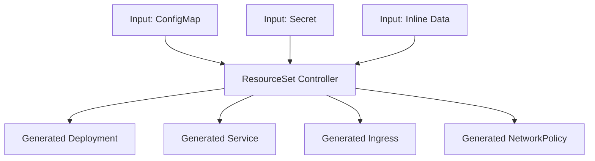

# How to Use Flux CD ResourceSets for Dynamic Resource Generation

Author: [nawazdhandala](https://github.com/nawazdhandala)

Tags: flux cd, resourcesets, dynamic resources, gitops, kubernetes, templating, automation

Description: Learn how to use Flux CD ResourceSets to dynamically generate Kubernetes resources from templates and data sources, reducing repetitive manifests across environments.

---

## Introduction

Flux CD ResourceSets provide a powerful way to dynamically generate Kubernetes resources from templates combined with input data. Instead of maintaining dozens of near-identical YAML files for different teams, environments, or applications, you can define a template once and let ResourceSets generate the actual resources based on input parameters.

This guide covers the ResourceSet resource, its templating capabilities, and practical patterns for reducing configuration duplication in your GitOps workflows.

## Prerequisites

- A Kubernetes cluster (v1.28 or later)
- Flux CD v2.4 or later with the ResourceSet controller enabled
- kubectl configured to access your cluster
- Familiarity with Go templates

## What Are ResourceSets?

A ResourceSet consists of two parts:

1. **Inputs**: Data sources that provide values (ConfigMaps, Secrets, or inline data)
2. **Resources**: Go templates that use input values to generate Kubernetes resources



## Basic ResourceSet Example

Here is a simple ResourceSet that generates a namespace and associated resources for each team:

```yaml
# resourcesets/team-resources.yaml
apiVersion: fluxcd.controlplane.io/v1
kind: ResourceSet
metadata:
  name: team-namespaces
  namespace: flux-system
spec:
  # Input data - list of teams
  inputs:
    - name: teams
      inline:
        - teamName: frontend
          quota_cpu: "4"
          quota_memory: "8Gi"
          contact: frontend-team@company.com
        - teamName: backend
          quota_cpu: "8"
          quota_memory: "16Gi"
          contact: backend-team@company.com
        - teamName: data
          quota_cpu: "16"
          quota_memory: "32Gi"
          contact: data-team@company.com
  # Resource templates - generated for each input item
  resources:
    # Create a namespace for each team
    - apiVersion: v1
      kind: Namespace
      metadata:
        name: "{{ .teamName }}"
        labels:
          team: "{{ .teamName }}"
          managed-by: flux-resourceset
          contact: "{{ .contact }}"
    # Create resource quotas for each team
    - apiVersion: v1
      kind: ResourceQuota
      metadata:
        name: "{{ .teamName }}-quota"
        namespace: "{{ .teamName }}"
      spec:
        hard:
          requests.cpu: "{{ .quota_cpu }}"
          requests.memory: "{{ .quota_memory }}"
          limits.cpu: "{{ .quota_cpu }}"
          limits.memory: "{{ .quota_memory }}"
```

## Using ConfigMap as Input

Load input data from a ConfigMap for easier management:

```yaml
# inputs/team-config.yaml
apiVersion: v1
kind: ConfigMap
metadata:
  name: team-definitions
  namespace: flux-system
data:
  # JSON array of team configurations
  teams.json: |
    [
      {
        "teamName": "platform",
        "environment": "production",
        "replicas": 3,
        "domain": "platform.company.com",
        "tier": "critical"
      },
      {
        "teamName": "analytics",
        "environment": "production",
        "replicas": 2,
        "domain": "analytics.company.com",
        "tier": "standard"
      },
      {
        "teamName": "mobile-api",
        "environment": "production",
        "replicas": 5,
        "domain": "mobile-api.company.com",
        "tier": "critical"
      }
    ]
---
# resourcesets/app-deployment.yaml
apiVersion: fluxcd.controlplane.io/v1
kind: ResourceSet
metadata:
  name: team-deployments
  namespace: flux-system
spec:
  inputs:
    - name: teams
      configMapRef:
        name: team-definitions
        key: teams.json
  resources:
    # Deployment for each team
    - apiVersion: apps/v1
      kind: Deployment
      metadata:
        name: "{{ .teamName }}-app"
        namespace: "{{ .teamName }}"
        labels:
          app: "{{ .teamName }}"
          tier: "{{ .tier }}"
      spec:
        replicas: {{ .replicas }}
        selector:
          matchLabels:
            app: "{{ .teamName }}"
        template:
          metadata:
            labels:
              app: "{{ .teamName }}"
              tier: "{{ .tier }}"
          spec:
            containers:
              - name: app
                image: "registry.company.com/{{ .teamName }}:latest"
                resources:
                  requests:
                    cpu: "250m"
                    memory: "256Mi"
                  limits:
                    cpu: "500m"
                    memory: "512Mi"
    # Service for each team
    - apiVersion: v1
      kind: Service
      metadata:
        name: "{{ .teamName }}-svc"
        namespace: "{{ .teamName }}"
      spec:
        selector:
          app: "{{ .teamName }}"
        ports:
          - port: 80
            targetPort: 8080
            protocol: TCP
    # Ingress for each team
    - apiVersion: networking.k8s.io/v1
      kind: Ingress
      metadata:
        name: "{{ .teamName }}-ingress"
        namespace: "{{ .teamName }}"
        annotations:
          cert-manager.io/cluster-issuer: letsencrypt-prod
      spec:
        ingressClassName: nginx
        tls:
          - hosts:
              - "{{ .domain }}"
            secretName: "{{ .teamName }}-tls"
        rules:
          - host: "{{ .domain }}"
            http:
              paths:
                - path: /
                  pathType: Prefix
                  backend:
                    service:
                      name: "{{ .teamName }}-svc"
                      port:
                        number: 80
```

## Conditional Resource Generation

Use Go template conditionals to generate resources based on input values:

```yaml
# resourcesets/conditional-resources.yaml
apiVersion: fluxcd.controlplane.io/v1
kind: ResourceSet
metadata:
  name: tiered-resources
  namespace: flux-system
spec:
  inputs:
    - name: services
      inline:
        - name: payment-service
          tier: critical
          needsPDB: true
          needsHPA: true
          minReplicas: 3
          maxReplicas: 10
        - name: notification-service
          tier: standard
          needsPDB: false
          needsHPA: true
          minReplicas: 1
          maxReplicas: 5
        - name: reporting-service
          tier: batch
          needsPDB: false
          needsHPA: false
          minReplicas: 1
          maxReplicas: 1
  resources:
    # HPA - only for services that need autoscaling
    - apiVersion: autoscaling/v2
      kind: HorizontalPodAutoscaler
      metadata:
        name: "{{ .name }}-hpa"
        namespace: default
        # Skip generation if needsHPA is false
        annotations:
          fluxcd.io/skip: "{{ not .needsHPA }}"
      spec:
        scaleTargetRef:
          apiVersion: apps/v1
          kind: Deployment
          name: "{{ .name }}"
        minReplicas: {{ .minReplicas }}
        maxReplicas: {{ .maxReplicas }}
        metrics:
          - type: Resource
            resource:
              name: cpu
              target:
                type: Utilization
                averageUtilization: 70
    # PDB - only for critical services
    - apiVersion: policy/v1
      kind: PodDisruptionBudget
      metadata:
        name: "{{ .name }}-pdb"
        namespace: default
        annotations:
          fluxcd.io/skip: "{{ not .needsPDB }}"
      spec:
        minAvailable: 2
        selector:
          matchLabels:
            app: "{{ .name }}"
    # NetworkPolicy - generated for all services
    - apiVersion: networking.k8s.io/v1
      kind: NetworkPolicy
      metadata:
        name: "{{ .name }}-netpol"
        namespace: default
      spec:
        podSelector:
          matchLabels:
            app: "{{ .name }}"
        policyTypes:
          - Ingress
          - Egress
        ingress:
          - from:
              - namespaceSelector:
                  matchLabels:
                    tier: "{{ .tier }}"
```

## Multi-Environment ResourceSets

Generate environment-specific configurations from a single template:

```yaml
# resourcesets/multi-env.yaml
apiVersion: fluxcd.controlplane.io/v1
kind: ResourceSet
metadata:
  name: multi-env-apps
  namespace: flux-system
spec:
  inputs:
    - name: environments
      inline:
        - env: dev
          namespace: app-dev
          replicas: 1
          ingressHost: dev.app.company.com
          resourceLimit_cpu: "500m"
          resourceLimit_memory: "512Mi"
          enableDebug: "true"
        - env: staging
          namespace: app-staging
          replicas: 2
          ingressHost: staging.app.company.com
          resourceLimit_cpu: "1"
          resourceLimit_memory: "1Gi"
          enableDebug: "false"
        - env: production
          namespace: app-production
          replicas: 5
          ingressHost: app.company.com
          resourceLimit_cpu: "2"
          resourceLimit_memory: "2Gi"
          enableDebug: "false"
  resources:
    # Namespace per environment
    - apiVersion: v1
      kind: Namespace
      metadata:
        name: "{{ .namespace }}"
        labels:
          environment: "{{ .env }}"
    # Flux Kustomization per environment
    - apiVersion: kustomize.toolkit.fluxcd.io/v1
      kind: Kustomization
      metadata:
        name: "app-{{ .env }}"
        namespace: flux-system
      spec:
        interval: 10m
        sourceRef:
          kind: GitRepository
          name: app-repo
        path: "./deploy/overlays/{{ .env }}"
        prune: true
        targetNamespace: "{{ .namespace }}"
        # Pass environment-specific values via postBuild
        postBuild:
          substitute:
            ENV: "{{ .env }}"
            REPLICAS: "{{ .replicas }}"
            INGRESS_HOST: "{{ .ingressHost }}"
            CPU_LIMIT: "{{ .resourceLimit_cpu }}"
            MEMORY_LIMIT: "{{ .resourceLimit_memory }}"
            DEBUG_ENABLED: "{{ .enableDebug }}"
```

## ResourceSet with Secret Inputs

Use secrets for sensitive input data:

```yaml
# resourcesets/database-credentials.yaml
apiVersion: fluxcd.controlplane.io/v1
kind: ResourceSet
metadata:
  name: database-secrets
  namespace: flux-system
spec:
  inputs:
    - name: databases
      secretRef:
        name: database-configs
        key: databases.json
  resources:
    # Create a secret in each service namespace
    - apiVersion: v1
      kind: Secret
      metadata:
        name: "{{ .serviceName }}-db-credentials"
        namespace: "{{ .namespace }}"
      type: Opaque
      stringData:
        DB_HOST: "{{ .dbHost }}"
        DB_PORT: "{{ .dbPort }}"
        DB_NAME: "{{ .dbName }}"
        DB_USER: "{{ .dbUser }}"
        DB_PASSWORD: "{{ .dbPassword }}"
    # Create an ExternalSecret reference instead for production
    - apiVersion: external-secrets.io/v1beta1
      kind: ExternalSecret
      metadata:
        name: "{{ .serviceName }}-db-external"
        namespace: "{{ .namespace }}"
      spec:
        refreshInterval: 1h
        secretStoreRef:
          name: vault-backend
          kind: ClusterSecretStore
        target:
          name: "{{ .serviceName }}-db-credentials"
        data:
          - secretKey: DB_PASSWORD
            remoteRef:
              key: "databases/{{ .serviceName }}"
              property: password
```

## Monitoring ResourceSet Status

Check the status and output of your ResourceSets:

```bash
# List all ResourceSets
kubectl get resourcesets -n flux-system

# Check detailed status
kubectl describe resourceset team-namespaces -n flux-system

# View generated resources
kubectl get resourceset team-namespaces -n flux-system -o jsonpath='{.status.generatedResources}'

# Check events
kubectl events -n flux-system --for resourceset/team-namespaces
```

## Troubleshooting

### Template Rendering Errors

```bash
# Check controller logs for template errors
kubectl logs -n flux-system deploy/resourceset-controller | grep -i error

# Validate your Go templates locally
# Ensure all referenced fields exist in input data
```

### Input Data Issues

```bash
# Verify ConfigMap data is valid JSON
kubectl get cm team-definitions -n flux-system -o jsonpath='{.data.teams\.json}' | jq .

# Check that Secret exists and has expected keys
kubectl get secret database-configs -n flux-system -o jsonpath='{.data.databases\.json}' | base64 -d | jq .
```

## Best Practices

1. **Keep templates simple**: Avoid deeply nested conditionals in templates. If logic becomes complex, consider splitting into multiple ResourceSets.

2. **Validate inputs**: Ensure input data has all required fields before applying. Missing fields will cause template rendering failures.

3. **Use meaningful names**: Generated resource names should clearly indicate their source ResourceSet and input parameters.

4. **Version your input data**: Store ConfigMaps and input definitions in Git so changes are tracked and auditable.

5. **Start small**: Begin with a single ResourceSet for one use case, then expand as you gain confidence with the templating system.

6. **Document templates**: Add comments to your Go templates explaining the purpose of each generated resource.

## Conclusion

Flux CD ResourceSets dramatically reduce the amount of repetitive YAML in your GitOps repositories. By defining resource templates once and driving them with input data, you can manage hundreds of similar resources with minimal configuration. This approach scales well for multi-tenant platforms, multi-environment deployments, and organizations with many teams sharing similar infrastructure patterns.
