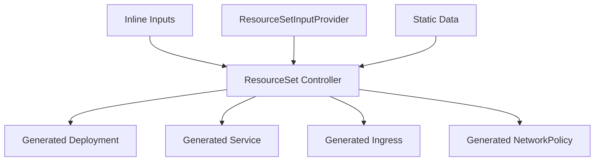

# How to Use Flux CD ResourceSets for Dynamic Resource Generation

Author: [nawazdhandala](https://github.com/nawazdhandala)

Tags: Flux CD, ResourceSets, Dynamic Resources, GitOps, Kubernetes, Templating, Automation

Description: Learn how to use Flux CD ResourceSets to dynamically generate Kubernetes resources from templates and data sources, reducing repetitive manifests across environments.

---

## Introduction

Flux Operator ResourceSets provide a powerful way to dynamically generate Kubernetes resources from templates combined with input data. Instead of maintaining dozens of near-identical YAML files for different teams, environments, or applications, you can define a template once and let ResourceSets generate the actual resources based on input parameters.

This guide covers the ResourceSet resource, its templating capabilities, and practical patterns for reducing configuration duplication in your GitOps workflows.

## Prerequisites

- A Kubernetes cluster supported by your Flux Operator and Flux versions
- Flux Operator installed with the ResourceSet API available
- kubectl configured to access your cluster
- Familiarity with Go templates

## What Are ResourceSets?

A ResourceSet consists of two parts:

1. **Inputs**: Inline values or values supplied by ResourceSetInputProvider objects
2. **Resources**: Go templates that use input values to generate Kubernetes resources


```mermaid
graph TD
    A[Inline Inputs] --> D[ResourceSet Controller]
    B[ResourceSetInputProvider] --> D
    C[Static Data] --> D
    D --> E[Generated Deployment]
    D --> F[Generated Service]
    D --> G[Generated Ingress]
    D --> H[Generated NetworkPolicy]
```

## Basic ResourceSet Example

Here is a simple ResourceSet that generates a namespace and associated resources for each team:

```yaml
# resourcesets/team-resources.yaml

apiVersion: fluxcd.controlplane.io/v1
kind: ResourceSet
metadata:
  name: team-namespaces
  namespace: flux-system
spec:
  # Input data - list of teams
  inputs:
    - teamName: frontend
      quota_cpu: "4"
      quota_memory: "8Gi"
      contact: frontend-team@company.com
    - teamName: backend
      quota_cpu: "8"
      quota_memory: "16Gi"
      contact: backend-team@company.com
    - teamName: data
      quota_cpu: "16"
      quota_memory: "32Gi"
      contact: data-team@company.com
  # Resource templates - generated for each input item
  resources:
    # Create a namespace for each team
    - apiVersion: v1
      kind: Namespace
      metadata:
        name: << inputs.teamName >>
        labels:
          team: << inputs.teamName | quote >>
          managed-by: flux-resourceset
          contact: << inputs.contact | quote >>
    # Create resource quotas for each team
    - apiVersion: v1
      kind: ResourceQuota
      metadata:
        name: << printf "%s-quota" inputs.teamName >>
        namespace: << inputs.teamName >>
      spec:
        hard:
          requests.cpu: << inputs.quota_cpu | quote >>
          requests.memory: << inputs.quota_memory | quote >>
          limits.cpu: << inputs.quota_cpu | quote >>
          limits.memory: << inputs.quota_memory | quote >>
```

## Using ResourceSetInputProvider as Input

Load input data from ResourceSetInputProvider objects for easier management:

```yaml
# inputs/platform-team.yaml
apiVersion: fluxcd.controlplane.io/v1
kind: ResourceSetInputProvider
metadata:
  name: platform-team
  namespace: flux-system
  labels:
    app.kubernetes.io/part-of: team-apps
spec:
  type: Static
  defaultValues:
    teamName: platform
    environment: production
    replicas: 3
    domain: platform.company.com
    tier: critical
---
# inputs/analytics-team.yaml
apiVersion: fluxcd.controlplane.io/v1
kind: ResourceSetInputProvider
metadata:
  name: analytics-team
  namespace: flux-system
  labels:
    app.kubernetes.io/part-of: team-apps
spec:
  type: Static
  defaultValues:
    teamName: analytics
    environment: production
    replicas: 2
    domain: analytics.company.com
    tier: standard
---
# resourcesets/app-deployment.yaml
apiVersion: fluxcd.controlplane.io/v1
kind: ResourceSet
metadata:
  name: team-deployments
  namespace: flux-system
spec:
  inputsFrom:
    - kind: ResourceSetInputProvider
      selector:
        matchLabels:
          app.kubernetes.io/part-of: team-apps
  resources:
    # Deployment for each team
    - apiVersion: apps/v1
      kind: Deployment
      metadata:
        name: << printf "%s-app" inputs.teamName >>
        namespace: << inputs.teamName >>
        labels:
          app: << inputs.teamName | quote >>
          tier: << inputs.tier | quote >>
      spec:
        replicas: << inputs.replicas | int >>
        selector:
          matchLabels:
            app: << inputs.teamName | quote >>
        template:
          metadata:
            labels:
              app: << inputs.teamName | quote >>
              tier: << inputs.tier | quote >>
          spec:
            containers:
              - name: app
                image: << printf "registry.company.com/%s:latest" inputs.teamName | quote >>
                resources:
                  requests:
                    cpu: "250m"
                    memory: "256Mi"
                  limits:
                    cpu: "500m"
                    memory: "512Mi"
    # Service for each team
    - apiVersion: v1
      kind: Service
      metadata:
        name: << printf "%s-svc" inputs.teamName >>
        namespace: << inputs.teamName >>
      spec:
        selector:
          app: << inputs.teamName | quote >>
        ports:
          - port: 80
            targetPort: 8080
            protocol: TCP
    # Ingress for each team
    - apiVersion: networking.k8s.io/v1
      kind: Ingress
      metadata:
        name: << printf "%s-ingress" inputs.teamName >>
        namespace: << inputs.teamName >>
        annotations:
          cert-manager.io/cluster-issuer: letsencrypt-prod
      spec:
        ingressClassName: nginx
        tls:
          - hosts:
              - << inputs.domain | quote >>
            secretName: << printf "%s-tls" inputs.teamName >>
        rules:
          - host: << inputs.domain | quote >>
            http:
              paths:
                - path: /
                  pathType: Prefix
                  backend:
                    service:
                      name: << printf "%s-svc" inputs.teamName >>
                      port:
                        number: 80
```

## Conditional Resource Generation

Use Go template conditionals to generate resources based on input values:

```yaml
# resourcesets/conditional-resources.yaml
apiVersion: fluxcd.controlplane.io/v1
kind: ResourceSet
metadata:
  name: tiered-resources
  namespace: flux-system
spec:
  inputs:
    - name: payment-service
      tier: critical
      needsPDB: true
      needsHPA: true
      minReplicas: 3
      maxReplicas: 10
    - name: notification-service
      tier: standard
      needsPDB: false
      needsHPA: true
      minReplicas: 1
      maxReplicas: 5
    - name: reporting-service
      tier: batch
      needsPDB: false
      needsHPA: false
      minReplicas: 1
      maxReplicas: 1
  resources:
    # HPA - only for services that need autoscaling
    - apiVersion: autoscaling/v2
      kind: HorizontalPodAutoscaler
      metadata:
        name: << printf "%s-hpa" inputs.name >>
        namespace: default
        # Skip generation if needsHPA is false
        annotations:
          fluxcd.controlplane.io/reconcile: << if inputs.needsHPA >>enabled<< else >>disabled<< end >>
      spec:
        scaleTargetRef:
          apiVersion: apps/v1
          kind: Deployment
          name: << inputs.name >>
        minReplicas: << inputs.minReplicas | int >>
        maxReplicas: << inputs.maxReplicas | int >>
        metrics:
          - type: Resource
            resource:
              name: cpu
              target:
                type: Utilization
                averageUtilization: 70
    # PDB - only for critical services
    - apiVersion: policy/v1
      kind: PodDisruptionBudget
      metadata:
        name: << printf "%s-pdb" inputs.name >>
        namespace: default
        annotations:
          fluxcd.controlplane.io/reconcile: << if inputs.needsPDB >>enabled<< else >>disabled<< end >>
      spec:
        minAvailable: 2
        selector:
          matchLabels:
            app: << inputs.name | quote >>
    # NetworkPolicy - generated for all services
    - apiVersion: networking.k8s.io/v1
      kind: NetworkPolicy
      metadata:
        name: << printf "%s-netpol" inputs.name >>
        namespace: default
      spec:
        podSelector:
          matchLabels:
            app: << inputs.name | quote >>
        policyTypes:
          - Ingress
          - Egress
        ingress:
          - from:
              - namespaceSelector:
                  matchLabels:
                    tier: << inputs.tier | quote >>
```

## Multi-Environment ResourceSets

Generate environment-specific configurations from a single template:

```yaml
# resourcesets/multi-env.yaml
apiVersion: fluxcd.controlplane.io/v1
kind: ResourceSet
metadata:
  name: multi-env-apps
  namespace: flux-system
spec:
  inputs:
    - env: dev
      namespace: app-dev
      replicas: 1
      ingressHost: dev.app.company.com
      resourceLimit_cpu: "500m"
      resourceLimit_memory: "512Mi"
      enableDebug: "true"
    - env: staging
      namespace: app-staging
      replicas: 2
      ingressHost: staging.app.company.com
      resourceLimit_cpu: "1"
      resourceLimit_memory: "1Gi"
      enableDebug: "false"
    - env: production
      namespace: app-production
      replicas: 5
      ingressHost: app.company.com
      resourceLimit_cpu: "2"
      resourceLimit_memory: "2Gi"
      enableDebug: "false"
  resources:
    # Namespace per environment
    - apiVersion: v1
      kind: Namespace
      metadata:
        name: << inputs.namespace >>
        labels:
          environment: << inputs.env | quote >>
    # Flux Kustomization per environment
    - apiVersion: kustomize.toolkit.fluxcd.io/v1
      kind: Kustomization
      metadata:
        name: << printf "app-%s" inputs.env >>
        namespace: flux-system
      spec:
        interval: 10m
        sourceRef:
          kind: GitRepository
          name: app-repo
        path: << printf "./deploy/overlays/%s" inputs.env | quote >>
        prune: true
        targetNamespace: << inputs.namespace | quote >>
        # Pass environment-specific values via postBuild
        postBuild:
          substitute:
            ENV: << inputs.env | quote >>
            REPLICAS: << inputs.replicas | quote >>
            INGRESS_HOST: << inputs.ingressHost | quote >>
            CPU_LIMIT: << inputs.resourceLimit_cpu | quote >>
            MEMORY_LIMIT: << inputs.resourceLimit_memory | quote >>
            DEBUG_ENABLED: << inputs.enableDebug | quote >>
```

## ResourceSet with External Secret References

Use ExternalSecret resources for sensitive data and keep only non-sensitive routing values in ResourceSet inputs:

```yaml
# resourcesets/database-credentials.yaml
apiVersion: fluxcd.controlplane.io/v1
kind: ResourceSet
metadata:
  name: database-secrets
  namespace: flux-system
spec:
  inputs:
    - serviceName: billing
      namespace: billing
    - serviceName: orders
      namespace: orders
  resources:
    # Create an ExternalSecret reference in each service namespace
    - apiVersion: external-secrets.io/v1beta1
      kind: ExternalSecret
      metadata:
        name: << printf "%s-db-external" inputs.serviceName >>
        namespace: << inputs.namespace >>
      spec:
        refreshInterval: 1h
        secretStoreRef:
          name: vault-backend
          kind: ClusterSecretStore
        target:
          name: << printf "%s-db-credentials" inputs.serviceName >>
        data:
          - secretKey: DB_HOST
            remoteRef:
              key: << printf "databases/%s" inputs.serviceName | quote >>
              property: host
          - secretKey: DB_PORT
            remoteRef:
              key: << printf "databases/%s" inputs.serviceName | quote >>
              property: port
          - secretKey: DB_NAME
            remoteRef:
              key: << printf "databases/%s" inputs.serviceName | quote >>
              property: name
          - secretKey: DB_USER
            remoteRef:
              key: << printf "databases/%s" inputs.serviceName | quote >>
              property: user
          - secretKey: DB_PASSWORD
            remoteRef:
              key: << printf "databases/%s" inputs.serviceName | quote >>
              property: password
```

## Monitoring ResourceSet Status

Check the status and output of your ResourceSets:

```bash
# List all ResourceSets
kubectl get resourcesets -n flux-system

# Check detailed status
kubectl describe resourceset team-namespaces -n flux-system

# View the reconciled resource inventory
kubectl get resourceset team-namespaces -n flux-system -o jsonpath='{.status.inventory.entries}'

# Check events
kubectl events -n flux-system --for resourceset/team-namespaces
```

## Troubleshooting

### Template Rendering Errors

```bash
# Check operator logs for template errors
kubectl logs -n flux-system deploy/flux-operator | grep -i error

# Build your ResourceSet locally
flux-operator build rset -f resourcesets/team-resources.yaml
```

### Input Data Issues

```bash
# Verify ResourceSetInputProvider status
kubectl get resourcesetinputproviders -n flux-system

# Check detailed input provider status
kubectl describe resourcesetinputprovider platform-team -n flux-system
```

## Best Practices

1. **Keep templates simple**: Avoid deeply nested conditionals in templates. If logic becomes complex, consider splitting into multiple ResourceSets.

2. **Validate inputs**: Ensure input data has all required fields before applying. Missing fields will cause template rendering failures.

3. **Use meaningful names**: Generated resource names should clearly indicate their source ResourceSet and input parameters.

4. **Version your input data**: Store ResourceSet and ResourceSetInputProvider definitions in Git so changes are tracked and auditable.

5. **Start small**: Begin with a single ResourceSet for one use case, then expand as you gain confidence with the templating system.

6. **Document templates**: Add comments to your Go templates explaining the purpose of each generated resource.

## Conclusion

Flux Operator ResourceSets dramatically reduce the amount of repetitive YAML in your GitOps repositories. By defining resource templates once and driving them with input data, you can manage hundreds of similar resources with minimal configuration. This approach scales well for multi-tenant platforms, multi-environment deployments, and organizations with many teams sharing similar infrastructure patterns.
