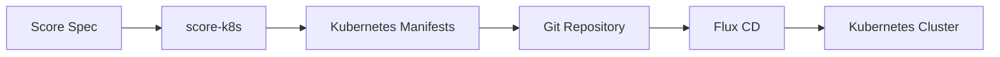

# How to Use Flux CD with Score for Workload Specification

Author: [nawazdhandala](https://github.com/nawazdhandala)

Tags: Flux CD, Score, Workload specification, Kubernetes, GitOps, Platform Engineering

Description: Learn how to combine Flux CD with Score to create platform-agnostic workload specifications that deploy seamlessly to Kubernetes.

---

## Introduction

Score is an open-source workload specification that allows developers to define their application requirements in a platform-agnostic way. When combined with Flux CD, you can create a powerful GitOps workflow where developers describe what their application needs, and Score translates that into Kubernetes manifests that Flux CD reconciles automatically.

This guide walks you through setting up Score with Flux CD to streamline your deployment workflow and reduce the complexity developers face when deploying to Kubernetes.

## Prerequisites

Before getting started, ensure you have the following:

- A Kubernetes cluster (v1.25 or later)
- Flux CD installed and bootstrapped
- The Score CLI (`score-k8s`) installed
- A Git repository connected to Flux CD
- kubectl configured for your cluster

## Understanding the Score Workload Model

Score provides a declarative specification that abstracts away platform-specific details. Developers define what their application needs (containers, resources, ports) without worrying about Kubernetes-specific constructs.



## Installing Score CLI

Install the Score CLI for Kubernetes target:

```bash
# Install score-k8s on macOS
brew install score-spec/tap/score-k8s

# Or download directly for Linux
wget https://github.com/score-spec/score-k8s/releases/latest/download/score-k8s_linux_amd64.tar.gz
tar -xzf score-k8s_linux_amd64.tar.gz
sudo mv score-k8s /usr/local/bin/

# Verify installation
score-k8s --version
```

## Setting Up the Repository Structure

Organize your Git repository to work with both Score and Flux CD:

```bash
# Create the directory structure
mkdir -p apps/my-web-app
mkdir -p clusters/production/apps
mkdir -p generated/my-web-app
```

The structure looks like this:

```text
repo/
  apps/
    my-web-app/
      score.yaml          # Score workload spec
  generated/
    my-web-app/
      manifests.yaml      # Generated Kubernetes manifests
  clusters/
    production/
      apps/
        my-web-app.yaml   # Flux Kustomization pointing to generated/
```

## Writing a Score Workload Specification

Create the Score file that defines your application:

```yaml
# apps/my-web-app/score.yaml
apiVersion: score.dev/v1b1
metadata:
  # Name of the workload
  name: my-web-app

# Container definitions for the workload
containers:
  main:
    image: my-registry.io/my-web-app:latest
    # Define the command to run
    command:
      - node
      - server.js
    # Environment variables for the container
    variables:
      PORT: "8080"
      NODE_ENV: "production"
      # Reference a shared resource for the database URL
      DATABASE_URL: "postgresql://${resources.db.username}:${resources.db.password}@${resources.db.host}:${resources.db.port}/${resources.db.name}"
      # Reference a shared resource for Redis
      REDIS_URL: "redis://${resources.cache.host}:${resources.cache.port}"

# Service configuration
service:
  ports:
    # Define the HTTP port
    http:
      port: 80
      targetPort: 8080
      protocol: TCP

# Resource dependencies
resources:
  # PostgreSQL database resource
  db:
    type: postgres
    metadata:
      annotations:
        score.dev/source: "external"
    properties:
      host:
      port:
      name:
      username:
      password:
  # Redis cache resource
  cache:
    type: redis
    metadata:
      annotations:
        score.dev/source: "external"
    properties:
      host:
      port:
```

## Configuring Score Resource Provisioners

Set up resource provisioners so Score knows how to resolve resource references:

```yaml
# apps/my-web-app/score-k8s-provisioners.yaml
apiVersion: score.dev/v1b1
kind: ResourceProvisioner

# Provisioner for PostgreSQL resources
provisioners:
  - uri: template://postgres
    type: postgres
    # Map outputs to actual values from Kubernetes secrets
    outputs:
      host: "postgres-service.database.svc.cluster.local"
      port: "5432"
      name: "myapp"
      username: "{{ .StateItem \"username\" }}"
      password: "{{ .StateItem \"password\" }}"
    state:
      username:
        secret:
          name: postgres-credentials
          key: username
      password:
        secret:
          name: postgres-credentials
          key: password

  # Provisioner for Redis resources
  - uri: template://redis
    type: redis
    outputs:
      host: "redis-service.cache.svc.cluster.local"
      port: "6379"
```

## Generating Kubernetes Manifests from Score

Use the Score CLI to generate Kubernetes-native manifests:

```bash
# Initialize the score-k8s project
cd apps/my-web-app
score-k8s init

# Load the provisioners
score-k8s provisioners load score-k8s-provisioners.yaml

# Generate Kubernetes manifests
score-k8s generate score.yaml \
  --output ../../generated/my-web-app/manifests.yaml

# Review the generated output
cat ../../generated/my-web-app/manifests.yaml
```

The generated output will include Kubernetes Deployment, Service, and related resources.

## Creating the Flux CD Kustomization

Create a Flux Kustomization that watches the generated manifests:

```yaml
# clusters/production/apps/my-web-app.yaml
apiVersion: kustomize.toolkit.fluxcd.io/v1
kind: Kustomization
metadata:
  name: my-web-app
  namespace: flux-system
spec:
  # Reconcile every 5 minutes
  interval: 5m
  # Path to the generated manifests
  path: ./generated/my-web-app
  # Prune resources that are no longer in the manifests
  prune: true
  # Reference the source repository
  sourceRef:
    kind: GitRepository
    name: flux-system
  # Target namespace for the workload
  targetNamespace: production
  # Wait for resources to be ready
  wait: true
  # Timeout for readiness checks
  timeout: 3m
  # Health checks for the deployment
  healthChecks:
    - apiVersion: apps/v1
      kind: Deployment
      name: my-web-app
      namespace: production
```

## Setting Up CI Pipeline for Score Generation

Automate the Score-to-Kubernetes conversion in your CI pipeline:

```yaml
# .github/workflows/score-generate.yaml
name: Generate Kubernetes Manifests from Score

on:
  push:
    paths:
      # Trigger when Score specs change
      - 'apps/**/score.yaml'
      - 'apps/**/score-k8s-provisioners.yaml'

jobs:
  generate:
    runs-on: ubuntu-latest
    steps:
      - name: Checkout repository
        uses: actions/checkout@v4

      - name: Install score-k8s
        run: |
          # Download and install the Score CLI
          wget https://github.com/score-spec/score-k8s/releases/latest/download/score-k8s_linux_amd64.tar.gz
          tar -xzf score-k8s_linux_amd64.tar.gz
          sudo mv score-k8s /usr/local/bin/

      - name: Generate manifests for all apps
        run: |
          # Loop through all Score workloads and generate manifests
          for app_dir in apps/*/; do
            app_name=$(basename "$app_dir")
            if [ -f "$app_dir/score.yaml" ]; then
              echo "Generating manifests for $app_name"
              cd "$app_dir"
              score-k8s init
              if [ -f "score-k8s-provisioners.yaml" ]; then
                score-k8s provisioners load score-k8s-provisioners.yaml
              fi
              score-k8s generate score.yaml \
                --output "../../generated/$app_name/manifests.yaml"
              cd ../..
            fi
          done

      - name: Commit and push generated manifests
        run: |
          git config user.name "github-actions"
          git config user.email "github-actions@github.com"
          git add generated/
          git diff --cached --quiet || git commit -m "chore: regenerate Kubernetes manifests from Score specs"
          git push
```

## Advanced Score Workload with Multiple Containers

Define a more complex workload with sidecars:

```yaml
# apps/api-service/score.yaml
apiVersion: score.dev/v1b1
metadata:
  name: api-service

# Multiple containers in the workload
containers:
  # Main API container
  api:
    image: my-registry.io/api-service:v2.1.0
    command:
      - ./api-server
    variables:
      PORT: "8080"
      LOG_LEVEL: "info"
      DB_URL: "postgresql://${resources.db.username}:${resources.db.password}@${resources.db.host}:${resources.db.port}/${resources.db.name}"
    # Resource limits
    resources:
      limits:
        cpu: "500m"
        memory: "256Mi"
      requests:
        cpu: "100m"
        memory: "128Mi"
    # Liveness probe
    livenessProbe:
      httpGet:
        path: /healthz
        port: 8080
      initialDelaySeconds: 10
      periodSeconds: 15
    # Readiness probe
    readinessProbe:
      httpGet:
        path: /ready
        port: 8080
      initialDelaySeconds: 5
      periodSeconds: 10

  # Sidecar for log forwarding
  log-forwarder:
    image: fluent/fluent-bit:latest
    variables:
      FLUENT_OUTPUT: "elasticsearch"
      FLUENT_ES_HOST: "${resources.logging.host}"

service:
  ports:
    http:
      port: 80
      targetPort: 8080

resources:
  db:
    type: postgres
    properties:
      host:
      port:
      name:
      username:
      password:
  logging:
    type: elasticsearch
    properties:
      host:
```

## Adding Flux CD Image Automation with Score

Combine Score with Flux image automation to automatically update workload images:

```yaml
# clusters/production/image-automation/image-policy.yaml
apiVersion: image.toolkit.fluxcd.io/v1
kind: ImagePolicy
metadata:
  name: api-service
  namespace: flux-system
spec:
  imageRepositoryRef:
    name: api-service
  policy:
    # Use semver to select the latest stable version
    semver:
      range: ">=2.0.0 <3.0.0"
```

```yaml
# clusters/production/image-automation/image-update.yaml
apiVersion: image.toolkit.fluxcd.io/v1
kind: ImageUpdateAutomation
metadata:
  name: score-image-update
  namespace: flux-system
spec:
  interval: 5m
  sourceRef:
    kind: GitRepository
    name: flux-system
  git:
    checkout:
      ref:
        branch: main
    commit:
      author:
        name: flux-image-updater
        email: flux@example.com
      messageTemplate: "chore: update image {{ .ImageName }} to {{ .NewTag }}"
    push:
      branch: main
  update:
    # Update images in Score spec files
    path: ./apps
    strategy: Setters
```

## Monitoring Score Workloads with Flux CD

Set up alerts for your Score-generated deployments:

```yaml
# clusters/production/monitoring/alerts.yaml
apiVersion: notification.toolkit.fluxcd.io/v1
kind: Alert
metadata:
  name: score-workloads
  namespace: flux-system
spec:
  # Send alerts for warning and error severity
  severity: info
  # Provider reference for notifications
  providerRef:
    name: slack-notifications
  # Watch all Score-generated Kustomizations
  eventSources:
    - kind: Kustomization
      name: "my-web-app"
    - kind: Kustomization
      name: "api-service"
```

```yaml
# clusters/production/monitoring/provider.yaml
apiVersion: notification.toolkit.fluxcd.io/v1
kind: Provider
metadata:
  name: slack-notifications
  namespace: flux-system
spec:
  type: slack
  channel: deployments
  secretRef:
    name: slack-webhook-url
```

## Troubleshooting Common Issues

### Score Generation Fails

If Score fails to generate manifests, check your provisioners:

```bash
# Validate the Score file
score-k8s run --dry-run score.yaml

# Check provisioner configuration
score-k8s provisioners list
```

### Flux Reconciliation Errors

If Flux cannot reconcile the generated manifests:

```bash
# Check Flux Kustomization status
flux get kustomizations my-web-app

# View detailed events
kubectl describe kustomization my-web-app -n flux-system

# Force reconciliation after fixing issues
flux reconcile kustomization my-web-app --with-source
```

### Resource Reference Resolution

If database or cache references are not resolving:

```bash
# Verify the secrets exist in the target namespace
kubectl get secrets -n production

# Check the generated manifests for correct references
cat generated/my-web-app/manifests.yaml | grep -A5 "env:"
```

## Best Practices

1. **Keep Score specs simple** - Let Score handle abstraction; avoid embedding Kubernetes-specific details in Score files.
2. **Version your provisioners** - Store provisioner configurations alongside Score specs for reproducibility.
3. **Use CI for generation** - Never manually generate and commit manifests; automate it in your CI pipeline.
4. **Separate environments** - Use different provisioner files for staging and production with different resource endpoints.
5. **Validate before commit** - Run `score-k8s run --dry-run` in CI before committing generated manifests.

## Conclusion

By combining Score with Flux CD, you create a developer-friendly workflow where application teams define their requirements in a simple, platform-agnostic format, while the platform team controls how those requirements are fulfilled in Kubernetes. Score handles the translation from workload specification to Kubernetes manifests, and Flux CD ensures those manifests are continuously reconciled with the cluster state. This separation of concerns reduces cognitive load on developers and maintains operational control for platform teams.
