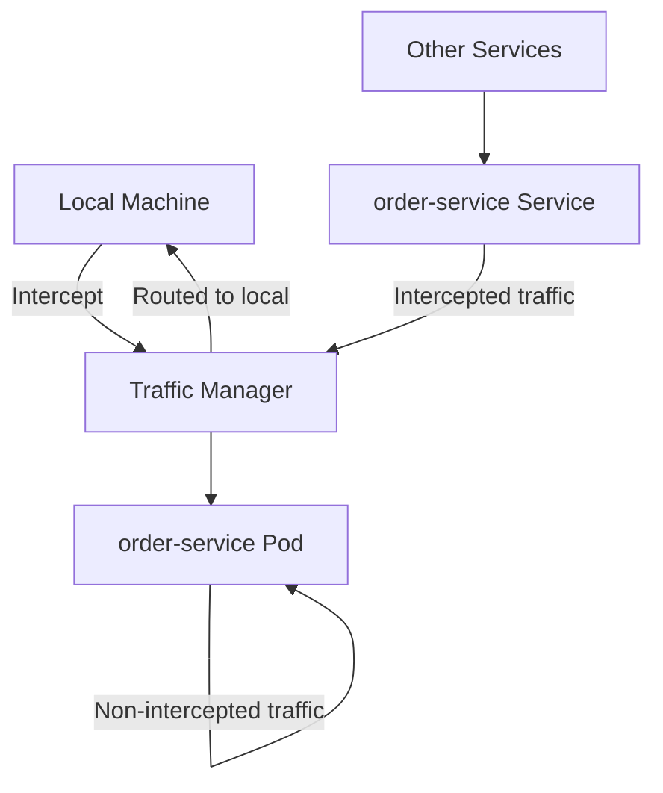

# How to Use Flux CD with Telepresence for Remote Debugging

Author: [nawazdhandala](https://github.com/nawazdhandala)

Tags: flux cd, telepresence, remote debugging, kubernetes, gitops, development

Description: Learn how to use Telepresence with Flux CD-managed clusters to debug services remotely by intercepting live traffic on your local machine.

---

## Introduction

Telepresence is a tool that lets you run a single service locally while connecting it to a remote Kubernetes cluster. It intercepts traffic destined for a service in the cluster and routes it to your local machine. When working with Flux CD-managed clusters, Telepresence enables developers to debug services in a realistic environment without disrupting the GitOps workflow.

This guide shows you how to set up Telepresence to work with Flux CD-managed deployments for efficient remote debugging.

## Prerequisites

Before getting started, ensure you have:

- A Kubernetes cluster with Flux CD installed and bootstrapped
- Telepresence CLI installed
- kubectl configured for your cluster
- Your application deployed via Flux CD
- A local development environment for the service you want to debug

## Installing Telepresence

```bash
# Install on macOS
brew install datawire/blackbird/telepresence-oss

# Install on Linux
sudo curl -fL https://app.getambassador.io/download/tel2oss/releases/download/v2.20.0/telepresence-linux-amd64 \
  -o /usr/local/bin/telepresence
sudo chmod +x /usr/local/bin/telepresence

# Verify installation
telepresence version
```

## Flux CD Deployment Setup

First, ensure your services are deployed via Flux CD. Here is a typical setup:

```yaml
# clusters/staging/apps/order-service.yaml
apiVersion: kustomize.toolkit.fluxcd.io/v1
kind: Kustomization
metadata:
  name: order-service
  namespace: flux-system
spec:
  interval: 5m
  path: ./apps/order-service/k8s
  prune: true
  sourceRef:
    kind: GitRepository
    name: flux-system
  targetNamespace: staging
  wait: true
  timeout: 3m
```

```yaml
# apps/order-service/k8s/deployment.yaml
apiVersion: apps/v1
kind: Deployment
metadata:
  name: order-service
  labels:
    app: order-service
spec:
  replicas: 2
  selector:
    matchLabels:
      app: order-service
  template:
    metadata:
      labels:
        app: order-service
    spec:
      containers:
        - name: order-service
          image: myregistry.io/order-service:v1.5.0
          ports:
            - containerPort: 8080
              name: http
          env:
            - name: DATABASE_URL
              valueFrom:
                secretKeyRef:
                  name: db-credentials
                  key: url
            - name: PAYMENT_SERVICE_URL
              value: "http://payment-service:8080"
            - name: INVENTORY_SERVICE_URL
              value: "http://inventory-service:8080"
            - name: REDIS_URL
              value: "redis://redis:6379"
          resources:
            requests:
              cpu: "200m"
              memory: "256Mi"
            limits:
              cpu: "1000m"
              memory: "512Mi"
```

```yaml
# apps/order-service/k8s/service.yaml
apiVersion: v1
kind: Service
metadata:
  name: order-service
spec:
  selector:
    app: order-service
  ports:
    - port: 8080
      targetPort: 8080
      protocol: TCP
      name: http
  type: ClusterIP
```

## Connecting Telepresence to the Cluster

### Install the Traffic Manager

Telepresence requires a Traffic Manager component in the cluster:

```bash
# Connect Telepresence to the cluster
telepresence connect

# Verify the connection
telepresence status

# List available services that can be intercepted
telepresence list -n staging
```

### Understanding the Telepresence Architecture



## Intercepting a Flux CD-Managed Service

### Basic Intercept

Route all traffic for a service to your local machine:

```bash
# Intercept the order-service in the staging namespace
telepresence intercept order-service \
  --namespace staging \
  --port 8080:8080 \
  --env-file order-service.env

# This creates a file with all the environment variables
# from the running pod, including secrets
cat order-service.env
```

### Personal Intercept with Header Matching

Intercept only specific traffic using HTTP headers, so other developers are not affected:

```bash
# Create a personal intercept that only catches requests
# with a specific header
telepresence intercept order-service \
  --namespace staging \
  --port 8080:8080 \
  --http-header x-debug-user=myname \
  --env-file order-service.env

# Only requests with the header 'x-debug-user: myname'
# will be routed to your local machine
# All other traffic continues to the cluster pods
```

## Running the Service Locally

### Loading Cluster Environment Variables

```bash
# Source the environment variables from the intercepted service
export $(cat order-service.env | xargs)

# Start your local service with the cluster environment
# For a Go service:
go run ./cmd/server/main.go

# For a Node.js service:
npm run dev

# For a Python service:
python app.py

# For a Java service:
./gradlew bootRun
```

### Using Docker Compose for Local Dependencies

If your service needs local overrides for some dependencies:

```yaml
# docker-compose.debug.yaml
version: '3.8'
services:
  # Run the service locally with cluster environment
  order-service:
    build:
      context: ./apps/order-service
      dockerfile: Dockerfile.dev
    ports:
      - "8080:8080"
    env_file:
      # Load environment from the Telepresence intercept
      - order-service.env
    environment:
      # Override specific variables for local debugging
      - LOG_LEVEL=debug
      - ENABLE_PROFILING=true
    volumes:
      # Mount source code for hot reload
      - ./apps/order-service/src:/app/src
```

```bash
# Start the local service with cluster connectivity
docker compose -f docker-compose.debug.yaml up
```

## Debugging with IDE Integration

### VS Code Configuration

```json
// .vscode/launch.json
{
  "version": "0.2.0",
  "configurations": [
    {
      "name": "Debug Order Service (Telepresence)",
      "type": "go",
      "request": "launch",
      "mode": "auto",
      "program": "${workspaceFolder}/apps/order-service/cmd/server",
      "envFile": "${workspaceFolder}/order-service.env",
      "env": {
        "LOG_LEVEL": "debug"
      },
      "args": [],
      "showLog": true
    }
  ]
}
```

### IntelliJ Configuration

```xml
<!-- .run/Telepresence Debug.run.xml -->
<component name="ProjectRunConfigurationManager">
  <configuration type="GoApplicationRunConfiguration"
                 name="Debug Order Service (Telepresence)">
    <module name="order-service" />
    <working_directory value="$PROJECT_DIR$" />
    <envs>
      <env name="ENV_FILE" value="$PROJECT_DIR$/order-service.env" />
    </envs>
    <kind value="PACKAGE" />
    <package value="github.com/myorg/order-service/cmd/server" />
    <method v="2" />
  </configuration>
</component>
```

## Preventing Flux CD Conflicts

When using Telepresence with Flux CD-managed services, the Traffic Manager modifies pods by injecting a sidecar. Flux CD might try to reconcile these changes. Here is how to handle this:

### Annotate Deployments to Allow Telepresence

```yaml
# apps/order-service/k8s/deployment.yaml
apiVersion: apps/v1
kind: Deployment
metadata:
  name: order-service
  labels:
    app: order-service
  annotations:
    # Tell Flux to ignore Telepresence modifications to the pod spec
    kustomize.toolkit.fluxcd.io/ssa: IfNotPresent
spec:
  replicas: 2
  selector:
    matchLabels:
      app: order-service
  template:
    metadata:
      labels:
        app: order-service
    spec:
      containers:
        - name: order-service
          image: myregistry.io/order-service:v1.5.0
          ports:
            - containerPort: 8080
```

### Suspend Flux Reconciliation During Debugging

For extended debugging sessions, suspend the Flux Kustomization:

```bash
# Suspend reconciliation for the order-service
flux suspend kustomization order-service

# Perform your debugging with Telepresence
telepresence intercept order-service \
  --namespace staging \
  --port 8080:8080 \
  --env-file order-service.env

# ... debug locally ...

# When done, clean up the intercept
telepresence leave order-service

# Resume Flux reconciliation
flux resume kustomization order-service

# Force reconciliation to restore the original state
flux reconcile kustomization order-service --with-source
```

## Automating the Debug Workflow

Create a script that automates the Telepresence setup with Flux CD awareness:

```bash
#!/bin/bash
# debug-service.sh - Start a debug session with Telepresence and Flux CD

SERVICE_NAME=$1
NAMESPACE=${2:-staging}

if [ -z "$SERVICE_NAME" ]; then
  echo "Usage: ./debug-service.sh <service-name> [namespace]"
  exit 1
fi

echo "Starting debug session for $SERVICE_NAME in $NAMESPACE"

# Step 1: Suspend Flux reconciliation
echo "Suspending Flux reconciliation..."
flux suspend kustomization "$SERVICE_NAME"

# Step 2: Connect Telepresence
echo "Connecting Telepresence..."
telepresence connect

# Step 3: Create the intercept
echo "Creating intercept..."
telepresence intercept "$SERVICE_NAME" \
  --namespace "$NAMESPACE" \
  --port 8080:8080 \
  --env-file "${SERVICE_NAME}.env"

echo ""
echo "Debug session active!"
echo "Environment variables saved to ${SERVICE_NAME}.env"
echo ""
echo "Run your service locally with:"
echo "  export \$(cat ${SERVICE_NAME}.env | xargs)"
echo ""
echo "When done, run: ./stop-debug.sh $SERVICE_NAME $NAMESPACE"
```

```bash
#!/bin/bash
# stop-debug.sh - Clean up a debug session

SERVICE_NAME=$1
NAMESPACE=${2:-staging}

echo "Stopping debug session for $SERVICE_NAME"

# Leave the intercept
telepresence leave "$SERVICE_NAME"

# Disconnect Telepresence
telepresence quit

# Resume Flux reconciliation
flux resume kustomization "$SERVICE_NAME"

# Force reconciliation to restore original state
flux reconcile kustomization "$SERVICE_NAME" --with-source

# Clean up env file
rm -f "${SERVICE_NAME}.env"

echo "Debug session ended. Flux reconciliation resumed."
```

## Multi-Service Debugging

When debugging services that depend on each other:

```bash
# Intercept multiple services simultaneously
telepresence intercept order-service \
  --namespace staging \
  --port 8080:8080 \
  --env-file order-service.env

telepresence intercept payment-service \
  --namespace staging \
  --port 8081:8080 \
  --env-file payment-service.env

# Run both services locally
# Terminal 1:
export $(cat order-service.env | xargs)
cd apps/order-service && go run ./cmd/server

# Terminal 2:
export $(cat payment-service.env | xargs)
cd apps/payment-service && go run ./cmd/server
```

## Monitoring Intercept Status

```bash
# List all active intercepts
telepresence list -n staging

# View detailed intercept information
telepresence status

# Check the Traffic Manager logs in the cluster
kubectl logs -n ambassador deployment/traffic-manager

# Verify Flux status after debugging
flux get kustomizations
```

## Troubleshooting

### Telepresence Cannot Connect

```bash
# Check cluster connectivity
kubectl cluster-info

# Reinstall the Traffic Manager
telepresence uninstall --everything
telepresence connect

# Check for RBAC issues
kubectl auth can-i create pods -n staging
```

### Flux Reconciliation Conflicts

```bash
# If Flux reverts Telepresence changes, suspend reconciliation
flux suspend kustomization order-service

# After debugging, force reconciliation
flux resume kustomization order-service
flux reconcile kustomization order-service --with-source
```

### Environment Variables Not Loading

```bash
# Check the generated env file
cat order-service.env

# Verify the pod has the expected env vars
kubectl exec -n staging deployment/order-service -- env

# Manually set missing variables
export DATABASE_URL="postgresql://..."
```

## Best Practices

1. **Use personal intercepts** - Always use header-based personal intercepts in shared environments to avoid disrupting other developers and traffic.
2. **Suspend Flux during debugging** - Suspend Flux reconciliation for the specific service being debugged to prevent conflicts.
3. **Clean up intercepts** - Always leave intercepts and resume Flux reconciliation when done to restore the cluster to its GitOps-managed state.
4. **Use staging clusters** - Never use Telepresence against production clusters. Debug against staging or development environments.
5. **Automate the workflow** - Create scripts that handle Flux suspension, Telepresence setup, and cleanup to reduce manual steps.

## Conclusion

Telepresence and Flux CD work together to give developers the ability to debug services in realistic cluster environments without breaking the GitOps workflow. Telepresence intercepts live traffic and routes it to your local machine where you can use your favorite IDE and debugger, while Flux CD ensures the cluster state is restored to its declared configuration once debugging is complete. The key is to manage Flux reconciliation during debug sessions and always clean up intercepts when finished.
