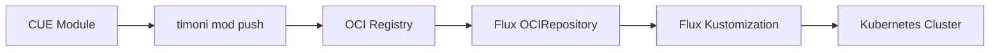

# How to Use Flux CD with Timoni for OCI Module Management

Author: [nawazdhandala](https://github.com/nawazdhandala)

Tags: flux cd, timoni, oci, module management, kubernetes, gitops, cue

Description: Learn how to use Timoni with Flux CD to manage OCI-based Kubernetes modules using CUE language for type-safe configuration.

---

## Introduction

Timoni is a package manager for Kubernetes powered by CUE, a type-safe configuration language. It distributes Kubernetes modules as OCI artifacts, making them easy to version, share, and consume. When paired with Flux CD, Timoni modules provide a robust GitOps workflow with strong typing guarantees and OCI-native distribution.

This guide covers how to set up Timoni modules, publish them to OCI registries, and deploy them using Flux CD for continuous reconciliation.

## Prerequisites

Before starting, ensure you have:

- A Kubernetes cluster (v1.25 or later)
- Flux CD installed and bootstrapped
- Timoni CLI installed
- Access to an OCI-compatible registry (GitHub Container Registry, Docker Hub, or Harbor)
- kubectl configured for your cluster

## Installing Timoni

Install the Timoni CLI on your system:

```bash
# Install on macOS
brew install stefanprodan/tap/timoni

# Install on Linux
curl -sSL https://github.com/stefanprodan/timoni/releases/latest/download/timoni_linux_amd64.tar.gz | \
  tar -xz && sudo mv timoni /usr/local/bin/

# Verify installation
timoni version
```

## Understanding Timoni Modules

Timoni modules are packages of CUE definitions that generate Kubernetes resources. They are distributed as OCI artifacts.



## Creating a Timoni Module

Create a Timoni module for a web application:

```bash
# Scaffold a new module
timoni mod init my-webapp

# This creates the following structure:
# my-webapp/
#   cue.mod/
#   templates/
#     config.cue
#     deployment.cue
#     service.cue
#   values.cue
#   timoni.cue
```

## Defining Module Values

Define the configurable values for your module using CUE:

```cue
// my-webapp/values.cue
package main

import "strings"

// Values defines the configurable parameters for the module
#Values: {
	// Name of the application
	name: string & =~"^[a-z0-9-]+$" & strings.MaxRunes(63)

	// Container image configuration
	image: {
		// Registry and repository
		repository: string
		// Image tag
		tag: string | *"latest"
		// Pull policy
		pullPolicy: *"IfNotPresent" | "Always" | "Never"
	}

	// Replicas for the deployment
	replicas: int & >=1 & <=100 | *2

	// Service port configuration
	service: {
		port: int & >=1 & <=65535 | *80
		targetPort: int & >=1 & <=65535 | *8080
		type: *"ClusterIP" | "NodePort" | "LoadBalancer"
	}

	// Resource limits and requests
	resources: {
		limits: {
			cpu: string | *"500m"
			memory: string | *"256Mi"
		}
		requests: {
			cpu: string | *"100m"
			memory: string | *"128Mi"
		}
	}

	// Optional ingress configuration
	ingress: {
		enabled: bool | *false
		host: string | *""
		className: string | *"nginx"
		tls: bool | *false
	}

	// Metadata labels
	metadata: {
		labels: {[string]: string} | *{}
		annotations: {[string]: string} | *{}
	}
}
```

## Defining Module Templates

Create the Kubernetes resource templates in CUE:

```cue
// my-webapp/templates/deployment.cue
package templates

import (
	appsv1 "k8s.io/api/apps/v1"
)

// Deployment template using typed CUE definitions
#Deployment: appsv1.#Deployment & {
	_config: #Config

	apiVersion: "apps/v1"
	kind: "Deployment"
	metadata: {
		name: _config.name
		namespace: _config.namespace
		labels: _config.labels
		if _config.metadata.annotations != _|_ {
			annotations: _config.metadata.annotations
		}
	}
	spec: {
		// Number of replicas from values
		replicas: _config.replicas
		selector: matchLabels: _config.selectorLabels
		template: {
			metadata: labels: _config.selectorLabels
			spec: containers: [{
				// Container configuration from values
				name: _config.name
				image: "\(_config.image.repository):\(_config.image.tag)"
				imagePullPolicy: _config.image.pullPolicy
				ports: [{
					containerPort: _config.service.targetPort
					protocol: "TCP"
				}]
				// Resource management
				resources: _config.resources
				// Health checks
				livenessProbe: {
					httpGet: {
						path: "/healthz"
						port: _config.service.targetPort
					}
					initialDelaySeconds: 10
					periodSeconds: 15
				}
				readinessProbe: {
					httpGet: {
						path: "/ready"
						port: _config.service.targetPort
					}
					initialDelaySeconds: 5
					periodSeconds: 10
				}
			}]
		}
	}
}
```

```cue
// my-webapp/templates/service.cue
package templates

import (
	corev1 "k8s.io/api/core/v1"
)

// Service template
#Service: corev1.#Service & {
	_config: #Config

	apiVersion: "v1"
	kind: "Service"
	metadata: {
		name: _config.name
		namespace: _config.namespace
		labels: _config.labels
	}
	spec: {
		type: _config.service.type
		selector: _config.selectorLabels
		ports: [{
			port: _config.service.port
			targetPort: _config.service.targetPort
			protocol: "TCP"
			name: "http"
		}]
	}
}
```

## Publishing the Module to OCI Registry

Push your Timoni module to an OCI registry:

```bash
# Log in to the OCI registry
timoni registry login ghcr.io -u $GITHUB_USER -p $GITHUB_TOKEN

# Build and push the module with a version tag
timoni mod push my-webapp oci://ghcr.io/myorg/modules/my-webapp \
  --version 1.0.0 \
  --source https://github.com/myorg/timoni-modules \
  --latest

# List available versions
timoni mod list oci://ghcr.io/myorg/modules/my-webapp
```

## Configuring Flux CD to Consume OCI Modules

Set up Flux CD to pull Timoni modules from your OCI registry.

### Create OCI Repository Source

```yaml
# clusters/production/sources/timoni-modules.yaml
apiVersion: source.toolkit.fluxcd.io/v1
kind: OCIRepository
metadata:
  name: my-webapp-module
  namespace: flux-system
spec:
  # Reconcile interval
  interval: 5m
  # OCI artifact URL
  url: oci://ghcr.io/myorg/modules/my-webapp
  # Reference a specific semver range
  ref:
    semver: ">=1.0.0 <2.0.0"
  # Authentication for private registries
  secretRef:
    name: ghcr-credentials
```

### Create Registry Credentials

```yaml
# clusters/production/sources/ghcr-credentials.yaml
apiVersion: v1
kind: Secret
metadata:
  name: ghcr-credentials
  namespace: flux-system
type: kubernetes.io/dockerconfigjson
stringData:
  # Docker config JSON for OCI registry authentication
  .dockerconfigjson: |
    {
      "auths": {
        "ghcr.io": {
          "username": "flux",
          "password": "${GITHUB_TOKEN}"
        }
      }
    }
```

## Creating Timoni Bundle for Multi-Instance Deployments

Timoni bundles allow you to deploy multiple instances of modules with different configurations:

```cue
// bundles/production.cue
bundle: {
	apiVersion: "v1alpha1"
	name: "production-apps"
	instances: {
		// Frontend application instance
		"frontend": {
			module: {
				url: "oci://ghcr.io/myorg/modules/my-webapp"
				version: "1.0.0"
			}
			namespace: "production"
			values: {
				name: "frontend"
				image: {
					repository: "ghcr.io/myorg/frontend"
					tag: "v3.2.1"
				}
				replicas: 3
				service: {
					port: 80
					targetPort: 3000
				}
				resources: limits: {
					cpu: "1000m"
					memory: "512Mi"
				}
				ingress: {
					enabled: true
					host: "app.example.com"
					tls: true
				}
			}
		}
		// API service instance
		"api": {
			module: {
				url: "oci://ghcr.io/myorg/modules/my-webapp"
				version: "1.0.0"
			}
			namespace: "production"
			values: {
				name: "api"
				image: {
					repository: "ghcr.io/myorg/api"
					tag: "v2.5.0"
				}
				replicas: 5
				service: {
					port: 80
					targetPort: 8080
				}
				resources: limits: {
					cpu: "2000m"
					memory: "1Gi"
				}
				ingress: {
					enabled: true
					host: "api.example.com"
					tls: true
				}
			}
		}
	}
}
```

## Generating Manifests from Timoni for Flux

Use Timoni to generate static manifests that Flux can reconcile:

```bash
# Generate manifests from a bundle
timoni bundle build -f bundles/production.cue \
  --output ./generated/production/

# Or generate from a single instance
timoni mod vendor oci://ghcr.io/myorg/modules/my-webapp \
  --version 1.0.0 \
  --output ./generated/my-webapp/
```

## Flux Kustomization for Generated Manifests

```yaml
# clusters/production/apps/webapp-bundle.yaml
apiVersion: kustomize.toolkit.fluxcd.io/v1
kind: Kustomization
metadata:
  name: production-apps
  namespace: flux-system
spec:
  # Reconcile every 10 minutes
  interval: 10m
  # Path to the generated manifests
  path: ./generated/production
  # Prune deleted resources
  prune: true
  sourceRef:
    kind: GitRepository
    name: flux-system
  # Wait for all resources to be ready
  wait: true
  timeout: 5m
```

## CI Pipeline for Timoni Module Publishing

Automate module publishing and manifest generation:

```yaml
# .github/workflows/timoni-publish.yaml
name: Publish Timoni Modules

on:
  push:
    tags:
      - 'v*'

jobs:
  publish:
    runs-on: ubuntu-latest
    permissions:
      packages: write
      contents: read
    steps:
      - name: Checkout
        uses: actions/checkout@v4

      - name: Install Timoni
        run: |
          curl -sSL https://github.com/stefanprodan/timoni/releases/latest/download/timoni_linux_amd64.tar.gz | \
            tar -xz && sudo mv timoni /usr/local/bin/

      - name: Login to GHCR
        run: |
          # Authenticate with the OCI registry
          timoni registry login ghcr.io \
            -u ${{ github.actor }} \
            -p ${{ secrets.GITHUB_TOKEN }}

      - name: Publish module
        run: |
          # Extract version from git tag
          VERSION=${GITHUB_REF#refs/tags/v}
          # Push the module to the OCI registry
          timoni mod push my-webapp \
            oci://ghcr.io/${{ github.repository_owner }}/modules/my-webapp \
            --version $VERSION \
            --source ${{ github.server_url }}/${{ github.repository }} \
            --latest
```

## Verifying OCI Module Integrity with Cosign

Sign and verify your Timoni modules for supply chain security:

```bash
# Sign the OCI artifact with Cosign
cosign sign ghcr.io/myorg/modules/my-webapp:1.0.0

# Configure Flux to verify signatures
```

```yaml
# clusters/production/sources/verified-module.yaml
apiVersion: source.toolkit.fluxcd.io/v1
kind: OCIRepository
metadata:
  name: verified-webapp-module
  namespace: flux-system
spec:
  interval: 5m
  url: oci://ghcr.io/myorg/modules/my-webapp
  ref:
    semver: ">=1.0.0"
  # Verify the OCI artifact signature
  verify:
    provider: cosign
    secretRef:
      name: cosign-public-key
```

## Troubleshooting

### Module Push Failures

```bash
# Verify OCI registry connectivity
timoni registry login ghcr.io -u $USER -p $TOKEN

# Check module CUE syntax
timoni mod lint my-webapp/

# Validate module before pushing
timoni mod vet my-webapp/
```

### Flux OCI Source Issues

```bash
# Check OCIRepository status
flux get sources oci

# View detailed status
kubectl describe ocirepository my-webapp-module -n flux-system

# Force reconciliation
flux reconcile source oci my-webapp-module
```

## Best Practices

1. **Use semver for modules** - Follow semantic versioning for your OCI modules so Flux can automatically pick up compatible updates.
2. **Sign your artifacts** - Use Cosign to sign OCI artifacts and configure Flux to verify signatures for supply chain security.
3. **Validate CUE schemas** - CUE provides type safety; leverage it by defining strict constraints in your values schema.
4. **Use bundles for environments** - Create separate Timoni bundles for each environment (staging, production) with appropriate values.
5. **Cache modules locally** - Use `timoni mod vendor` to vendor modules locally for offline development and faster CI builds.

## Conclusion

Timoni and Flux CD together create a powerful GitOps workflow centered on OCI artifacts. Timoni brings type-safe configuration through CUE and OCI-native module distribution, while Flux CD provides continuous reconciliation and drift detection. This combination gives you versioned, signed, and validated Kubernetes packages that deploy reliably through your GitOps pipeline.
