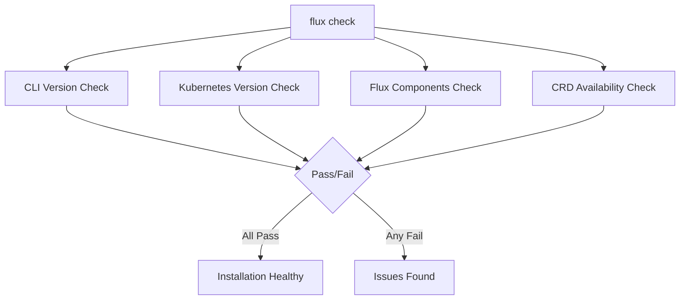

# How to Use flux check to Verify Installation

Author: [nawazdhandala](https://github.com/nawazdhandala)

Tags: flux, fluxcd, gitops, kubernetes, cli, verification, health-check, troubleshooting

Description: Learn how to use the flux check command to verify your Flux CD installation, diagnose issues, and ensure all components are running correctly.

---

## Introduction

After installing Flux CD on a Kubernetes cluster, verifying that everything is working correctly is an essential step. The `flux check` command performs a comprehensive health assessment of your Flux installation, checking prerequisites, component versions, API availability, and controller health.

This guide shows you how to use `flux check` effectively for installation verification, troubleshooting, and ongoing monitoring.

## Prerequisites

- Flux CLI installed (v2.2.0 or later)
- A running Kubernetes cluster
- kubectl configured with cluster access

## What flux check Verifies

The `flux check` command runs through several verification stages:



The command checks:

1. Whether the Flux CLI version is up to date
2. Whether the Kubernetes cluster meets minimum version requirements
3. Whether all Flux controllers are deployed and healthy
4. Whether Flux Custom Resource Definitions (CRDs) are installed

## Running a Basic Check

The simplest way to verify your installation:

```bash
# Run the full verification suite
flux check
```

Healthy output looks like this:

```
> checking prerequisites
> Kubernetes 1.28.5 >=1.25.0-0
> checking controllers
> helm-controller: deployment ready
> helm-controller: ghcr.io/fluxcd/helm-controller:v0.37.4
> kustomize-controller: deployment ready
> kustomize-controller: ghcr.io/fluxcd/kustomize-controller:v1.2.2
> notification-controller: deployment ready
> notification-controller: ghcr.io/fluxcd/notification-controller:v1.2.4
> source-controller: deployment ready
> source-controller: ghcr.io/fluxcd/source-controller:v1.2.4
> checking crds
> alerts.notification.toolkit.fluxcd.io/v1beta3
> buckets.source.toolkit.fluxcd.io/v1
> gitrepositories.source.toolkit.fluxcd.io/v1
> helmcharts.source.toolkit.fluxcd.io/v1
> helmreleases.helm.toolkit.fluxcd.io/v2
> helmrepositories.source.toolkit.fluxcd.io/v1
> kustomizations.kustomize.toolkit.fluxcd.io/v1
> ocirepositories.source.toolkit.fluxcd.io/v1
> providers.notification.toolkit.fluxcd.io/v1beta3
> receivers.notification.toolkit.fluxcd.io/v1
> all checks passed
```

## Checking Only Prerequisites

If you want to verify cluster compatibility before installing Flux:

```bash
# Check only prerequisites (no Flux installation required)
flux check --pre
```

This is useful for pre-flight checks before running `flux bootstrap` or `flux install`:

```
> checking prerequisites
> Kubernetes 1.28.5 >=1.25.0-0
> prerequisites checks passed
```

## Understanding Check Output

### Successful Checks

Each line in the output indicates a verification step:

```bash
# Run the check and examine each section
flux check

# Kubernetes version verification
# > Kubernetes 1.28.5 >=1.25.0-0
# This confirms your cluster version meets the minimum requirement

# Controller status
# > helm-controller: deployment ready
# This confirms the controller pod is running and healthy

# Controller image version
# > helm-controller: ghcr.io/fluxcd/helm-controller:v0.37.4
# This shows the exact version of each controller

# CRD availability
# > gitrepositories.source.toolkit.fluxcd.io/v1
# This confirms the CRD is installed and at the correct API version
```

### Failed Checks

When issues are found, the output clearly indicates what went wrong:

```bash
# Example of failed check output
flux check

# > checking prerequisites
# > Kubernetes 1.28.5 >=1.25.0-0
# > checking controllers
# > helm-controller: deployment ready
# > source-controller: deployment not ready
# > source-controller: container not ready (CrashLoopBackOff)
# > checking crds
# > all CRDs present
# > check failed
```

## Using Exit Codes in Scripts

The `flux check` command returns meaningful exit codes for automation:

```bash
#!/bin/bash
# health-check.sh
# Automated Flux health check for monitoring systems

# Run the check and capture the exit code
flux check > /tmp/flux-check-output.txt 2>&1
EXIT_CODE=$?

if [ $EXIT_CODE -eq 0 ]; then
  echo "HEALTHY: Flux installation is operational"
  exit 0
else
  echo "UNHEALTHY: Flux check failed"
  echo "Details:"
  cat /tmp/flux-check-output.txt
  exit 1
fi
```

## Pre-Installation Verification

Before installing Flux on a new cluster, run a pre-flight check:

```bash
#!/bin/bash
# pre-install-check.sh
# Verify cluster is ready for Flux installation

echo "Running Flux pre-installation checks..."

# Check prerequisites
if flux check --pre; then
  echo ""
  echo "Cluster is ready for Flux installation."
  echo "You can proceed with: flux bootstrap or flux install"
else
  echo ""
  echo "Cluster does not meet Flux prerequisites."
  echo "Please resolve the issues above before installing."
  exit 1
fi
```

## Checking Specific Components

While `flux check` examines all components, you can also verify individual controllers:

```bash
# Check if specific controllers are running using kubectl
kubectl get deployments -n flux-system

# Expected output for a full installation:
# NAME                      READY   UP-TO-DATE   AVAILABLE
# helm-controller           1/1     1            1
# kustomize-controller      1/1     1            1
# notification-controller   1/1     1            1
# source-controller         1/1     1            1

# Check controller logs for issues
kubectl logs -n flux-system deployment/source-controller --tail=20

# Check controller pod events
kubectl describe deployment source-controller -n flux-system
```

## Diagnosing Common Issues

### Controllers Not Ready

```bash
# If flux check reports controllers not ready, investigate:

# Check pod status
kubectl get pods -n flux-system

# Look for CrashLoopBackOff or ImagePullBackOff
kubectl describe pod -n flux-system -l app=source-controller

# Check resource limits
kubectl top pods -n flux-system
```

### CRDs Missing

```bash
# If CRDs are missing, reinstall them:

# List installed Flux CRDs
kubectl get crds | grep fluxcd

# If CRDs are missing, you can reinstall Flux components
flux install --components-extra=image-reflector-controller,image-automation-controller
```

### Version Mismatch

```bash
# Check for version mismatches between CLI and controllers
flux check

# If CLI version is newer than controllers, upgrade the cluster components
flux install

# If controllers are newer, upgrade the CLI
# On macOS:
brew upgrade fluxcd/tap/flux

# On Linux:
curl -s https://fluxcd.io/install.sh | sudo bash
```

## Integrating with Monitoring

### Prometheus Monitoring

Flux controllers expose Prometheus metrics that complement `flux check`:

```bash
# Check if metrics endpoints are accessible
kubectl port-forward -n flux-system \
  deployment/source-controller 8080:8080 &

# Query the metrics endpoint
curl -s http://localhost:8080/metrics | head -20

# Kill the port-forward
kill %1
```

### Kubernetes Liveness Probes

Flux controllers have built-in health endpoints. You can verify them directly:

```bash
# Check the health endpoint of source-controller
kubectl exec -n flux-system deployment/source-controller -- \
  wget -qO- http://localhost:9440/healthz

# Check the readiness endpoint
kubectl exec -n flux-system deployment/source-controller -- \
  wget -qO- http://localhost:9440/readyz
```

## Automated Health Monitoring Script

Here is a comprehensive monitoring script:

```bash
#!/bin/bash
# flux-monitor.sh
# Comprehensive Flux health monitoring script

set -euo pipefail

NAMESPACE="flux-system"
LOG_FILE="/var/log/flux-health.log"
TIMESTAMP=$(date '+%Y-%m-%d %H:%M:%S')

log() {
  echo "[${TIMESTAMP}] $1" | tee -a "${LOG_FILE}"
}

# Run flux check
log "Starting Flux health check..."
CHECK_OUTPUT=$(flux check 2>&1)
CHECK_EXIT=$?

if [ $CHECK_EXIT -eq 0 ]; then
  log "STATUS: HEALTHY"
  log "All Flux components are operational."
else
  log "STATUS: UNHEALTHY"
  log "Flux check output:"
  echo "${CHECK_OUTPUT}" | while IFS= read -r line; do
    log "  ${line}"
  done

  # Gather additional diagnostics
  log "Pod status:"
  kubectl get pods -n "${NAMESPACE}" -o wide 2>&1 | while IFS= read -r line; do
    log "  ${line}"
  done

  log "Recent events:"
  kubectl get events -n "${NAMESPACE}" \
    --sort-by='.lastTimestamp' 2>&1 | tail -10 | while IFS= read -r line; do
    log "  ${line}"
  done
fi

# Check reconciliation status
log "Checking reconciliation status..."

# Check for failed Kustomizations
FAILED_KS=$(flux get kustomizations -A 2>/dev/null | grep -c "False" || echo "0")
log "Failed Kustomizations: ${FAILED_KS}"

# Check for failed HelmReleases
FAILED_HR=$(flux get helmreleases -A 2>/dev/null | grep -c "False" || echo "0")
log "Failed HelmReleases: ${FAILED_HR}"

# Check for failed sources
FAILED_SRC=$(flux get sources all -A 2>/dev/null | grep -c "False" || echo "0")
log "Failed Sources: ${FAILED_SRC}"

# Summary
TOTAL_FAILED=$((FAILED_KS + FAILED_HR + FAILED_SRC))
if [ $TOTAL_FAILED -gt 0 ]; then
  log "WARNING: ${TOTAL_FAILED} resources have failed reconciliation"
else
  log "All resources are reconciling successfully"
fi

log "Health check complete."
```

## CI/CD Pipeline Integration

Use `flux check` as a gate in your deployment pipeline:

```bash
#!/bin/bash
# ci-gate.sh
# Gate CI/CD deployments on Flux health

echo "Verifying Flux installation health..."

# Allow up to 3 retries with 10-second intervals
MAX_RETRIES=3
RETRY_COUNT=0

while [ $RETRY_COUNT -lt $MAX_RETRIES ]; do
  if flux check > /dev/null 2>&1; then
    echo "Flux installation is healthy. Proceeding with deployment."
    exit 0
  fi

  RETRY_COUNT=$((RETRY_COUNT + 1))
  echo "Flux check failed (attempt ${RETRY_COUNT}/${MAX_RETRIES})"

  if [ $RETRY_COUNT -lt $MAX_RETRIES ]; then
    echo "Retrying in 10 seconds..."
    sleep 10
  fi
done

echo "Flux installation is unhealthy after ${MAX_RETRIES} attempts."
echo "Aborting deployment."
flux check
exit 1
```

## Best Practices

1. **Run flux check after every installation or upgrade** to confirm everything is working.
2. **Use --pre before new installations** to catch cluster compatibility issues early.
3. **Integrate checks into CI/CD** to gate deployments on cluster health.
4. **Automate monitoring** with scripts that run `flux check` periodically.
5. **Compare versions regularly** to ensure CLI and controller versions are compatible.

## Summary

The `flux check` command is your first line of defense for verifying Flux CD installations. It performs comprehensive validation of prerequisites, controllers, and CRDs in a single command. By integrating it into your workflows, from pre-installation verification to ongoing monitoring, you can maintain confidence that your GitOps infrastructure is healthy and operational.
