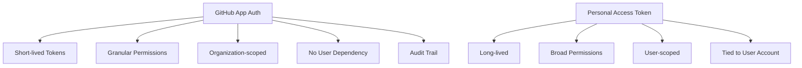

# How to Use flux create secret githubapp for GitHub App Auth

Author: [nawazdhandala](https://github.com/nawazdhandala)

Tags: flux, fluxcd, GitHub, github-app, Secret, Authentication, GitOps, Kubernetes

Description: A practical guide to configuring GitHub App authentication for Flux using the flux create secret githubapp command.

---

## Introduction

GitHub Apps provide a more secure and scalable alternative to personal access tokens for authenticating with GitHub repositories. The `flux create secret githubapp` command creates Kubernetes secrets that enable Flux to authenticate using a GitHub App's private key and installation ID, generating short-lived tokens automatically.

This guide covers setting up GitHub App authentication end-to-end, from creating the GitHub App to configuring Flux to use it for repository access.

## Prerequisites

- Flux CLI v2.0 or later installed
- kubectl configured with cluster access
- Flux installed on your Kubernetes cluster
- GitHub organization admin access to create a GitHub App

```bash
# Verify Flux installation
flux check
```

## Why Use GitHub App Authentication

GitHub Apps offer several advantages over personal access tokens:



Key benefits:
- Tokens are generated automatically and expire after one hour
- Permissions are scoped to specific repositories
- Not tied to individual user accounts
- Better audit logging in GitHub

## Step 1: Create a GitHub App

### Through the GitHub UI

1. Go to your GitHub organization settings
2. Navigate to Developer settings > GitHub Apps > New GitHub App
3. Configure the following settings:

```yaml
App Name: flux-gitops-bot
Homepage URL: https://fluxcd.io
Webhook: Deactivate (uncheck "Active")

Permissions:
  Repository permissions:
    - Contents: Read-only (required for cloning)
    - Metadata: Read-only (automatically selected)

  Organization permissions:
    - (none required for basic usage)

Where can this app be installed:
  - Only on this account
```

4. Click "Create GitHub App"
5. Note the **App ID** displayed on the app settings page
6. Generate a **private key** and download the PEM file

### Install the App on Your Repositories

1. From the app settings page, click "Install App" in the sidebar
2. Select the organization
3. Choose "Only select repositories" and pick the repositories Flux needs access to
4. Click "Install"
5. Note the **Installation ID** from the URL (e.g., `https://github.com/settings/installations/12345678`)

## Step 2: Create the Flux Secret

### Basic GitHub App Secret

```bash
# Create the secret with the App ID, Installation ID, and private key
flux create secret githubapp github-app-auth \
  --app-id=${GITHUB_APP_ID} \
  --app-installation-id=${GITHUB_APP_INSTALLATION_ID} \
  --app-private-key-file=./github-app-private-key.pem \
  --namespace=flux-system
```

### With Base URL for GitHub Enterprise

```bash
# For GitHub Enterprise Server, specify the base URL
flux create secret githubapp ghes-app-auth \
  --app-id=${GITHUB_APP_ID} \
  --app-installation-id=${GITHUB_APP_INSTALLATION_ID} \
  --app-private-key-file=./github-app-private-key.pem \
  --app-base-url=https://github.company.com/api/v3 \
  --namespace=flux-system
```

## Step 3: Reference the Secret in GitRepository

```yaml
# git-repository.yaml
apiVersion: source.toolkit.fluxcd.io/v1
kind: GitRepository
metadata:
  name: app-repo
  namespace: flux-system
spec:
  interval: 5m
  url: https://github.com/myorg/myrepo
  ref:
    branch: main
  secretRef:
    name: github-app-auth
```

```bash
# Apply the GitRepository
kubectl apply -f git-repository.yaml

# Verify it syncs successfully
flux get sources git
```

## Complete Workflow Example

### Setting Up from Scratch

```bash
# Step 1: Store your GitHub App details
export GITHUB_APP_ID="123456"
export GITHUB_APP_INSTALLATION_ID="78901234"
export GITHUB_APP_KEY_FILE="./my-app-private-key.pem"

# Step 2: Create the GitHub App secret
flux create secret githubapp github-app-auth \
  --app-id=${GITHUB_APP_ID} \
  --app-installation-id=${GITHUB_APP_INSTALLATION_ID} \
  --app-private-key-file=${GITHUB_APP_KEY_FILE} \
  --namespace=flux-system

# Step 3: Create the GitRepository source
flux create source git myapp \
  --url=https://github.com/myorg/myrepo \
  --branch=main \
  --secret-ref=github-app-auth \
  --interval=5m \
  --namespace=flux-system

# Step 4: Verify the source
flux get sources git

# Step 5: Create a Kustomization to deploy from the source
flux create kustomization myapp \
  --source=GitRepository/myapp \
  --path="./deploy" \
  --prune=true \
  --interval=10m \
  --namespace=flux-system

# Step 6: Verify the kustomization
flux get kustomizations
```

### Bootstrapping with GitHub App

```bash
# You can also use GitHub App auth during bootstrap
flux bootstrap github \
  --owner=myorg \
  --repository=fleet-infra \
  --branch=main \
  --path=clusters/production \
  --token-auth=false \
  --ssh-hostname=github.com
```

## Multiple Repository Access

A single GitHub App installation can access multiple repositories. Create one secret and reference it in multiple GitRepository resources.

```bash
# Create one secret for the GitHub App
flux create secret githubapp org-github-app \
  --app-id=${GITHUB_APP_ID} \
  --app-installation-id=${GITHUB_APP_INSTALLATION_ID} \
  --app-private-key-file=./github-app-private-key.pem \
  --namespace=flux-system
```

```yaml
# Reference the same secret across multiple GitRepository resources
---
apiVersion: source.toolkit.fluxcd.io/v1
kind: GitRepository
metadata:
  name: frontend-repo
  namespace: flux-system
spec:
  interval: 5m
  url: https://github.com/myorg/frontend
  ref:
    branch: main
  secretRef:
    name: org-github-app
---
apiVersion: source.toolkit.fluxcd.io/v1
kind: GitRepository
metadata:
  name: backend-repo
  namespace: flux-system
spec:
  interval: 5m
  url: https://github.com/myorg/backend
  ref:
    branch: main
  secretRef:
    name: org-github-app
---
apiVersion: source.toolkit.fluxcd.io/v1
kind: GitRepository
metadata:
  name: infra-repo
  namespace: flux-system
spec:
  interval: 5m
  url: https://github.com/myorg/infrastructure
  ref:
    branch: main
  secretRef:
    name: org-github-app
```

## GitHub Enterprise Server

```bash
# For GitHub Enterprise Server, include the API base URL
flux create secret githubapp ghes-auth \
  --app-id=${GHES_APP_ID} \
  --app-installation-id=${GHES_APP_INSTALLATION_ID} \
  --app-private-key-file=./ghes-app-key.pem \
  --app-base-url=https://github.company.com/api/v3 \
  --namespace=flux-system
```

```yaml
# GitRepository for GitHub Enterprise Server
apiVersion: source.toolkit.fluxcd.io/v1
kind: GitRepository
metadata:
  name: enterprise-repo
  namespace: flux-system
spec:
  interval: 5m
  url: https://github.company.com/myorg/myrepo
  ref:
    branch: main
  secretRef:
    name: ghes-auth
```

## Exporting Secrets

```bash
# Export the secret as YAML for version control
flux create secret githubapp github-app-auth \
  --app-id=${GITHUB_APP_ID} \
  --app-installation-id=${GITHUB_APP_INSTALLATION_ID} \
  --app-private-key-file=./github-app-private-key.pem \
  --namespace=flux-system \
  --export > github-app-secret.yaml

# Encrypt with SOPS before committing
sops --encrypt --in-place github-app-secret.yaml
```

## Private Key Management

### Securing the Private Key

```bash
# Never commit the private key to Git unencrypted
# Store it in a secure vault (HashiCorp Vault, AWS Secrets Manager, etc.)

# Example: Retrieve from AWS Secrets Manager
aws secretsmanager get-secret-value \
  --secret-id flux/github-app-private-key \
  --query SecretString \
  --output text > /tmp/github-app-key.pem

# Create the secret using the retrieved key
flux create secret githubapp github-app-auth \
  --app-id=${GITHUB_APP_ID} \
  --app-installation-id=${GITHUB_APP_INSTALLATION_ID} \
  --app-private-key-file=/tmp/github-app-key.pem \
  --namespace=flux-system

# Remove the temporary key file
rm /tmp/github-app-key.pem
```

### Rotating the Private Key

```bash
# Generate a new private key from the GitHub App settings page
# Then update the Flux secret

flux create secret githubapp github-app-auth \
  --app-id=${GITHUB_APP_ID} \
  --app-installation-id=${GITHUB_APP_INSTALLATION_ID} \
  --app-private-key-file=./new-private-key.pem \
  --namespace=flux-system \
  --export | kubectl apply -f -

# Force reconciliation to use the new key
flux reconcile source git myapp

# After verifying everything works, revoke the old key
# from the GitHub App settings page
```

## Troubleshooting

### Authentication Failures

```bash
# Check the GitRepository status
flux get sources git

# Get detailed events
kubectl describe gitrepository myapp -n flux-system

# Check source controller logs for GitHub App auth errors
kubectl logs deployment/source-controller -n flux-system | grep -i "github\|app\|auth"
```

### Common Errors

```bash
# Error: "could not create token for installation"
# Causes:
# - Invalid App ID or Installation ID
# - Private key does not match the GitHub App
# - The GitHub App installation has been suspended or removed
#
# Solution: Verify the App ID and Installation ID in GitHub settings
echo "App ID: ${GITHUB_APP_ID}"
echo "Installation ID: ${GITHUB_APP_INSTALLATION_ID}"

# Error: "private key is not valid"
# The PEM file format may be incorrect
# Verify the key format
openssl rsa -in github-app-private-key.pem -check -noout

# Error: "resource not accessible by integration"
# The GitHub App does not have sufficient permissions
# Check that the app has "Contents: Read" permission
# and is installed on the target repository

# Error: "installation not found"
# The installation ID is incorrect or the app was uninstalled
# Verify the installation exists at:
# https://github.com/organizations/myorg/settings/installations
```

### Verifying the Secret

```bash
# Check the secret exists and has the expected keys
kubectl get secret github-app-auth -n flux-system -o json | jq '.data | keys'
# Expected: ["githubAppBaseURL", "githubAppID", "githubAppInstallationID", "githubAppPrivateKey"]

# Verify the App ID stored in the secret
kubectl get secret github-app-auth -n flux-system \
  -o jsonpath='{.data.githubAppID}' | base64 -d

# Verify the Installation ID
kubectl get secret github-app-auth -n flux-system \
  -o jsonpath='{.data.githubAppInstallationID}' | base64 -d
```

## Comparison with Other Auth Methods

| Feature | GitHub App | Personal Access Token | SSH Deploy Key |
|---------|-----------|----------------------|----------------|
| Token Lifetime | 1 hour (auto-renewed) | Manual expiry | No expiry |
| Scope | Per-installation | Per-user | Per-repository |
| Multi-repo | Yes (one secret) | Yes (one secret) | No (one per repo) |
| Audit | Detailed | Basic | Basic |
| User dependency | None | Tied to user | None |
| Setup complexity | Medium | Low | Low |

## Best Practices

1. **Prefer GitHub Apps over PATs** for organization-wide deployments because they provide better security and are not tied to user accounts.
2. **Use minimal permissions** when configuring the GitHub App (Contents: Read is sufficient for Flux).
3. **Store private keys in a vault** rather than on local filesystems.
4. **Rotate private keys periodically** and use the GitHub App settings to revoke old keys.
5. **Use one GitHub App per environment** (staging, production) for better isolation.
6. **Monitor the GitHub App's activity** through the GitHub audit log.

## Summary

The `flux create secret githubapp` command provides a secure and scalable way to authenticate Flux with GitHub repositories using GitHub App credentials. By generating short-lived tokens automatically and offering granular permissions, GitHub App authentication is the recommended approach for organizations running Flux at scale. The setup process involves creating a GitHub App, installing it on your repositories, and creating a Flux secret with the app's credentials -- after which Flux handles token generation and renewal transparently.
