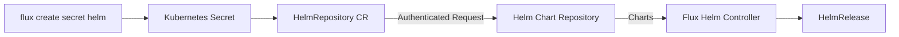

# How to Use flux create secret helm for Helm Authentication

Author: [nawazdhandala](https://github.com/nawazdhandala)

Tags: Flux, fluxcd, Helm, Secret, Authentication, GitOps, Kubernetes, chart-repository

Description: A practical guide to creating Helm repository authentication secrets with the flux create secret helm command.

---

## Introduction

Many organizations host private Helm chart repositories that require authentication. The `flux create secret helm` command creates Kubernetes secrets that Flux uses to authenticate with Helm repositories when fetching charts. This command supports both basic authentication (username/password) and TLS certificate-based authentication.

This guide walks through setting up Helm authentication for various repository types, including ChartMuseum, Harbor, Artifactory, and cloud-hosted registries.

## Prerequisites

- Flux CLI v2.0 or later installed
- kubectl configured with cluster access
- Flux installed on your Kubernetes cluster
- Access credentials for your Helm repository

```bash
# Verify Flux installation
flux check

# List existing Helm sources
flux get sources helm
```

## Understanding Helm Repository Authentication



## Basic Authentication

### Username and Password

```bash
# Create a Helm repository secret with basic auth credentials
# This is the most common authentication method
flux create secret helm my-helm-auth \
  --username=admin \
  --password=secretpassword \
  --namespace=flux-system
```

### Using Environment Variables

```bash
# Use environment variables to avoid exposing credentials in shell history
export HELM_USER="deploy-user"
export HELM_PASS="deploy-password"

flux create secret helm repo-auth \
  --username=${HELM_USER} \
  --password=${HELM_PASS} \
  --namespace=flux-system
```

## Provider-Specific Configurations

### ChartMuseum

```bash
# ChartMuseum with basic auth
# ChartMuseum supports basic authentication out of the box
flux create secret helm chartmuseum-auth \
  --username=admin \
  --password=${CHARTMUSEUM_PASSWORD} \
  --namespace=flux-system
```

Then reference it in a HelmRepository:

```yaml
# chartmuseum-repo.yaml
apiVersion: source.toolkit.fluxcd.io/v1
kind: HelmRepository
metadata:
  name: chartmuseum
  namespace: flux-system
spec:
  interval: 10m
  url: https://charts.internal.company.com
  secretRef:
    name: chartmuseum-auth
```

### Harbor Registry

```bash
# Harbor uses standard basic auth for its chart repository
flux create secret helm harbor-auth \
  --username=robot-account \
  --password=${HARBOR_ROBOT_TOKEN} \
  --namespace=flux-system
```

```yaml
# harbor-repo.yaml
apiVersion: source.toolkit.fluxcd.io/v1
kind: HelmRepository
metadata:
  name: harbor-charts
  namespace: flux-system
spec:
  interval: 10m
  url: https://harbor.company.com/chartrepo/myproject
  secretRef:
    name: harbor-auth
```

### JFrog Artifactory

```bash
# Artifactory with an API key
flux create secret helm artifactory-auth \
  --username=deploy@company.com \
  --password=${ARTIFACTORY_API_KEY} \
  --namespace=flux-system
```

```yaml
# artifactory-repo.yaml
apiVersion: source.toolkit.fluxcd.io/v1
kind: HelmRepository
metadata:
  name: artifactory-charts
  namespace: flux-system
spec:
  interval: 10m
  url: https://company.jfrog.io/artifactory/helm-local
  secretRef:
    name: artifactory-auth
```

### Nexus Repository Manager

```bash
# Nexus with basic auth
flux create secret helm nexus-auth \
  --username=helm-reader \
  --password=${NEXUS_PASSWORD} \
  --namespace=flux-system
```

```yaml
# nexus-repo.yaml
apiVersion: source.toolkit.fluxcd.io/v1
kind: HelmRepository
metadata:
  name: nexus-charts
  namespace: flux-system
spec:
  interval: 10m
  url: https://nexus.company.com/repository/helm-hosted
  secretRef:
    name: nexus-auth
```

### AWS ECR (OCI-based Helm Repository)

```bash
# For ECR, you typically use the OCI provider instead
# But if using a proxy, basic auth works
flux create secret helm ecr-auth \
  --username=AWS \
  --password=$(aws ecr get-login-password --region us-east-1) \
  --namespace=flux-system
```

### Google Artifact Registry

```bash
# Google Artifact Registry with service account key
flux create secret helm gar-auth \
  --username=_json_key \
  --password="$(cat service-account-key.json)" \
  --namespace=flux-system
```

### Azure Container Registry

```bash
# ACR with service principal credentials
flux create secret helm acr-auth \
  --username=${ACR_CLIENT_ID} \
  --password=${ACR_CLIENT_SECRET} \
  --namespace=flux-system
```

## TLS Certificate Authentication

### Client Certificate Auth

```bash
# Create a secret with TLS client certificate authentication
# This is used when the Helm repository requires mutual TLS
flux create secret helm tls-helm-auth \
  --username=admin \
  --password=password \
  --cert-file=./client.crt \
  --key-file=./client.key \
  --ca-file=./ca.crt \
  --namespace=flux-system
```

### Custom CA Certificate

```bash
# When your Helm repository uses a self-signed or internal CA
flux create secret helm custom-ca-auth \
  --username=deploy \
  --password=${DEPLOY_PASSWORD} \
  --ca-file=./internal-ca.crt \
  --namespace=flux-system
```

## Complete Workflow Example

### Setting Up a Private Helm Repository

```bash
# Step 1: Create the authentication secret
flux create secret helm private-charts-auth \
  --username=helm-deploy \
  --password=${HELM_DEPLOY_TOKEN} \
  --namespace=flux-system

# Step 2: Create the HelmRepository source
flux create source helm private-charts \
  --url=https://charts.private.company.com \
  --secret-ref=private-charts-auth \
  --interval=10m \
  --namespace=flux-system

# Step 3: Verify the source is accessible
flux get sources helm

# Step 4: Create a HelmRelease using a chart from the private repo
flux create helmrelease my-app \
  --source=HelmRepository/private-charts \
  --chart=my-application \
  --chart-version="1.2.x" \
  --namespace=default \
  --target-namespace=default
```

### Exporting as YAML

```bash
# Export the secret for version control
flux create secret helm private-charts-auth \
  --username=helm-deploy \
  --password=${HELM_DEPLOY_TOKEN} \
  --namespace=flux-system \
  --export > helm-secret.yaml

# Encrypt before committing to Git
sops --encrypt --in-place helm-secret.yaml
git add helm-secret.yaml
git commit -m "Add encrypted Helm repository secret"
```

## Multiple Repositories Setup

```bash
# Create secrets for multiple Helm repositories

# Internal charts repository
flux create secret helm internal-charts-auth \
  --username=internal-deploy \
  --password=${INTERNAL_TOKEN} \
  --namespace=flux-system

# Partner charts repository
flux create secret helm partner-charts-auth \
  --username=partner-user \
  --password=${PARTNER_TOKEN} \
  --namespace=flux-system

# Vendor charts repository
flux create secret helm vendor-charts-auth \
  --username=vendor-key \
  --password=${VENDOR_API_KEY} \
  --namespace=flux-system
```

```yaml
# Define all HelmRepository sources referencing their secrets
---
apiVersion: source.toolkit.fluxcd.io/v1
kind: HelmRepository
metadata:
  name: internal-charts
  namespace: flux-system
spec:
  interval: 10m
  url: https://charts.internal.company.com
  secretRef:
    name: internal-charts-auth
---
apiVersion: source.toolkit.fluxcd.io/v1
kind: HelmRepository
metadata:
  name: partner-charts
  namespace: flux-system
spec:
  interval: 30m
  url: https://charts.partner.io
  secretRef:
    name: partner-charts-auth
---
apiVersion: source.toolkit.fluxcd.io/v1
kind: HelmRepository
metadata:
  name: vendor-charts
  namespace: flux-system
spec:
  interval: 1h
  url: https://helm.vendor.com/stable
  secretRef:
    name: vendor-charts-auth
```

## Updating Credentials

```bash
# When credentials need to be rotated, recreate the secret
flux create secret helm private-charts-auth \
  --username=helm-deploy \
  --password=${NEW_HELM_TOKEN} \
  --namespace=flux-system \
  --export | kubectl apply -f -

# Force reconciliation to use the new credentials immediately
flux reconcile source helm private-charts
```

## Troubleshooting

### Common Issues

```bash
# Check HelmRepository status for authentication errors
flux get sources helm

# Get detailed error messages
kubectl describe helmrepository private-charts -n flux-system

# Common error: "401 Unauthorized"
# Verify credentials are correct
kubectl get secret private-charts-auth -n flux-system -o jsonpath='{.data.username}' | base64 -d
# This should output the username you configured

# Common error: "x509: certificate signed by unknown authority"
# You need to provide the CA certificate
flux create secret helm private-charts-auth \
  --username=deploy \
  --password=${TOKEN} \
  --ca-file=./ca.crt \
  --namespace=flux-system

# Common error: "dial tcp: lookup charts.company.com: no such host"
# DNS resolution issue - verify the URL is reachable from the cluster
kubectl run -it --rm debug --image=curlimages/curl -- curl -v https://charts.company.com
```

### Verifying Secret Contents

```bash
# Check that the secret was created with the correct keys
kubectl get secret private-charts-auth -n flux-system -o json | \
  jq '.data | keys'

# Expected keys for basic auth: ["password", "username"]
# Expected keys with TLS: ["ca.crt", "certFile", "keyFile", "password", "username"]
```

## Best Practices

1. **Use robot accounts or service accounts** instead of personal credentials for Helm repository access.
2. **Rotate credentials regularly** and update secrets accordingly.
3. **Use SOPS or Sealed Secrets** to encrypt secrets before storing them in Git.
4. **Create separate secrets** for each Helm repository rather than sharing credentials.
5. **Use the export flag** to generate YAML manifests that can be managed declaratively.
6. **Set appropriate intervals** on HelmRepository resources to balance freshness with API rate limits.

## Summary

The `flux create secret helm` command provides a clean interface for configuring Helm repository authentication in Flux. By creating properly formatted Kubernetes secrets, it enables Flux to access private chart repositories securely. Whether you are working with ChartMuseum, Harbor, Artifactory, or cloud registries, this command handles the credential management needed for authenticated Helm chart access in your GitOps workflows.
