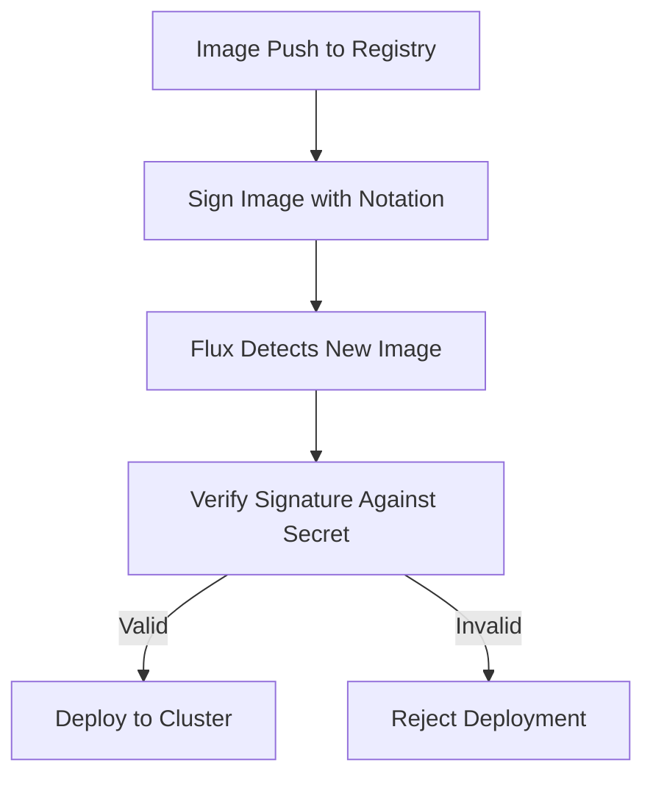

# How to Use flux create secret notation for Notation Signing

Author: [nawazdhandala](https://github.com/nawazdhandala)

Tags: flux cd, notation, signing, secrets, security, gitops, kubernetes

Description: A practical guide to using the flux create secret notation command to configure Notation signing verification for container images in Flux CD.

---

## Introduction

Container image signing is a critical security practice that ensures only trusted images are deployed to your Kubernetes clusters. Notation is an open-source tool from the CNCF that provides a standards-based approach to signing and verifying container images. Flux CD integrates with Notation through the `flux create secret notation` command, allowing you to store verification credentials as Kubernetes secrets.

In this guide, you will learn how to set up Notation signing verification with Flux CD, create the necessary secrets, and configure your Flux resources to verify image signatures before deployment.

## Prerequisites

Before getting started, make sure you have the following tools installed and configured:

- Flux CLI v2.2.0 or later
- kubectl configured with cluster access
- A Notation-compatible signing certificate
- An OCI registry that supports image signing

```bash
# Verify Flux CLI version supports notation secrets
flux version --client

# Check cluster connectivity
kubectl cluster-info
```

## Understanding Notation Signing in Flux CD

Notation signing verification in Flux CD works by validating container image signatures against trusted certificates before allowing deployments. The verification process follows this flow:



## Generating a Notation Signing Certificate

First, you need to generate or obtain a signing certificate. Here is how to create a self-signed certificate for testing purposes:

```bash
# Install notation CLI
brew install notation

# Generate a test RSA key pair and self-signed certificate
notation cert generate-test --default "flux-test-cert"

# List available signing keys
notation key ls

# List available certificates
notation cert ls
```

For production environments, you should use certificates from a trusted Certificate Authority (CA):

```bash
# Import a CA-signed certificate for production use
notation cert add --type ca \
  --store production-store \
  /path/to/ca-certificate.pem
```

## Creating the Notation Secret with Flux CLI

The `flux create secret notation` command creates a Kubernetes secret containing the trust policy and certificate data needed for signature verification.

### Basic Usage

```bash
# Create a notation secret with a CA certificate
flux create secret notation notation-verify-secret \
  --namespace=flux-system \
  --trust-policy-file=./trustpolicy.json \
  --ca-cert-file=./ca-certificate.crt
```

### Trust Policy Configuration

Before creating the secret, you need to define a trust policy. Create a `trustpolicy.json` file:

```json
{
  "version": "1.0",
  "trustPolicies": [
    {
      "name": "production-images",
      "registryScopes": [
        "registry.example.com/production/*"
      ],
      "signatureVerification": {
        "level": "strict"
      },
      "trustStores": [
        "ca:production-store"
      ],
      "trustedIdentities": [
        "x509.subject: C=US, ST=California, O=MyOrg, CN=production-signer"
      ]
    }
  ]
}
```

### Creating Secrets for Multiple Registries

You can create separate secrets for different registries or environments:

```bash
# Secret for production registry
flux create secret notation prod-notation-secret \
  --namespace=flux-system \
  --trust-policy-file=./prod-trustpolicy.json \
  --ca-cert-file=./prod-ca.crt \
  --export > prod-notation-secret.yaml

# Secret for staging registry
flux create secret notation staging-notation-secret \
  --namespace=flux-system \
  --trust-policy-file=./staging-trustpolicy.json \
  --ca-cert-file=./staging-ca.crt \
  --export > staging-notation-secret.yaml
```

## Exporting and Storing Secrets in Git

For GitOps workflows, you should encrypt secrets before storing them in Git. Use the `--export` flag to generate the YAML manifest:

```bash
# Export the secret as YAML
flux create secret notation notation-verify-secret \
  --namespace=flux-system \
  --trust-policy-file=./trustpolicy.json \
  --ca-cert-file=./ca-certificate.crt \
  --export > notation-secret.yaml

# Encrypt with SOPS before committing to Git
sops --encrypt \
  --age age1xxxxxxxxxxxxxxxxxxxxxxxxxxxxxxxxxxxxxxxxx \
  --encrypted-regex '^(data|stringData)$' \
  notation-secret.yaml > notation-secret.enc.yaml
```

## Configuring ImagePolicy with Notation Verification

After creating the notation secret, configure your Flux image resources to use it for verification:

```yaml
# image-repository.yaml
apiVersion: image.toolkit.fluxcd.io/v1
kind: ImageRepository
metadata:
  name: my-app
  namespace: flux-system
spec:
  image: registry.example.com/production/my-app
  interval: 5m
  provider: generic
  verify:
    provider: notation
    secretRef:
      name: notation-verify-secret
```

```yaml
# image-policy.yaml
apiVersion: image.toolkit.fluxcd.io/v1
kind: ImagePolicy
metadata:
  name: my-app
  namespace: flux-system
spec:
  imageRepositoryRef:
    name: my-app
  policy:
    semver:
      range: ">=1.0.0"
```

## Configuring OCIRepository with Notation Verification

You can also use Notation verification with OCI repositories:

```yaml
# oci-repository.yaml
apiVersion: source.toolkit.fluxcd.io/v1
kind: OCIRepository
metadata:
  name: my-app-manifests
  namespace: flux-system
spec:
  interval: 5m
  url: oci://registry.example.com/production/my-app-manifests
  ref:
    tag: latest
  verify:
    provider: notation
    secretRef:
      name: notation-verify-secret
```

## Verifying the Setup

After applying your configuration, verify that the notation secret and image verification are working correctly:

```bash
# Check the secret was created
kubectl get secret notation-verify-secret -n flux-system

# Describe the secret to see its metadata
kubectl describe secret notation-verify-secret -n flux-system

# Check the ImageRepository status for verification results
flux get image repository my-app

# Check for any verification errors in the source controller logs
kubectl logs -n flux-system deployment/source-controller \
  --since=5m | grep -i notation
```

## Troubleshooting Common Issues

### Certificate Mismatch

If you see signature verification failures, check that the certificate in the secret matches the one used for signing:

```bash
# View the certificate details from the secret
kubectl get secret notation-verify-secret -n flux-system \
  -o jsonpath='{.data.ca\.crt}' | base64 -d | openssl x509 -text -noout

# Compare with the signing certificate
openssl x509 -in /path/to/signing-cert.crt -text -noout
```

### Trust Policy Errors

Verify the trust policy is correctly formatted:

```bash
# Validate the trust policy JSON
cat trustpolicy.json | python3 -m json.tool

# Check that registry scopes match your actual registry paths
flux get image repository my-app -o json | jq '.spec.image'
```

### Secret Not Found

Ensure the secret is in the same namespace as the Flux resource referencing it:

```bash
# List notation secrets across all namespaces
kubectl get secrets --all-namespaces | grep notation

# Verify the namespace matches
flux get image repository my-app -o json | jq '.spec.verify.secretRef'
```

## Rotating Certificates

When certificates expire, you need to update the notation secret:

```bash
# Update the secret with a new certificate
flux create secret notation notation-verify-secret \
  --namespace=flux-system \
  --trust-policy-file=./trustpolicy.json \
  --ca-cert-file=./new-ca-certificate.crt

# Reconcile immediately to pick up the changes
flux reconcile image repository my-app
```

## Best Practices

1. **Use strict verification in production** - Always set the signature verification level to "strict" for production workloads.
2. **Separate signing keys per environment** - Use different certificates for staging and production.
3. **Encrypt secrets in Git** - Always use SOPS or sealed-secrets before committing secret manifests.
4. **Automate certificate rotation** - Set up alerts for certificate expiry and automate renewal.
5. **Scope trust policies narrowly** - Use specific registry scopes rather than wildcards when possible.
6. **Monitor verification failures** - Set up alerts for image verification failures in your monitoring system.

## Conclusion

Using `flux create secret notation` provides a secure and GitOps-native way to verify container image signatures before deployment. By combining Notation signing with Flux CD's automated reconciliation, you can ensure that only trusted and verified images make it to your production clusters. Make sure to follow the best practices outlined above, especially around certificate management and secret encryption, to maintain a strong security posture in your GitOps pipeline.
