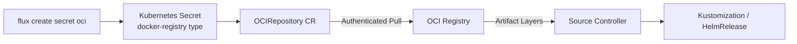

# How to Use flux create secret oci for OCI Authentication

Author: [nawazdhandala](https://github.com/nawazdhandala)

Tags: flux, fluxcd, oci, secret, authentication, gitops, kubernetes, container-registry

Description: A practical guide to creating OCI registry authentication secrets with the flux create secret oci command for secure artifact access.

---

## Introduction

OCI (Open Container Initiative) registries are increasingly used in GitOps workflows to store and distribute Kubernetes manifests, Helm charts, and other configuration artifacts. The `flux create secret oci` command creates Kubernetes secrets that enable Flux to authenticate with OCI-compatible registries when pulling artifacts.

This guide covers authentication setup for all major OCI registries, including Docker Hub, GitHub Container Registry, AWS ECR, Google Artifact Registry, and Azure Container Registry.

## Prerequisites

- Flux CLI v2.0 or later installed
- kubectl configured with cluster access
- Flux installed on your Kubernetes cluster
- Registry credentials for your OCI provider

```bash
# Verify Flux is healthy
flux check

# List existing OCI sources
flux get sources oci
```

## How OCI Authentication Works in Flux



## Basic Usage

### Standard Username and Password

```bash
# Create an OCI registry secret with basic credentials
flux create secret oci my-registry-auth \
  --url=ghcr.io \
  --username=myuser \
  --password=${REGISTRY_PASSWORD} \
  --namespace=flux-system
```

### Specifying the Full Registry URL

```bash
# Include the full registry URL for clarity
flux create secret oci docker-auth \
  --url=registry-1.docker.io \
  --username=myuser \
  --password=${DOCKER_PASSWORD} \
  --namespace=flux-system
```

## Provider-Specific Configurations

### Docker Hub

```bash
# Create a secret for Docker Hub authentication
# Use a Docker Hub access token instead of your password
flux create secret oci dockerhub-auth \
  --url=registry-1.docker.io \
  --username=${DOCKER_USERNAME} \
  --password=${DOCKER_ACCESS_TOKEN} \
  --namespace=flux-system
```

```yaml
# Reference in an OCIRepository
apiVersion: source.toolkit.fluxcd.io/v1beta2
kind: OCIRepository
metadata:
  name: app-manifests
  namespace: flux-system
spec:
  interval: 5m
  url: oci://registry-1.docker.io/myuser/app-config
  ref:
    tag: latest
  secretRef:
    name: dockerhub-auth
```

### GitHub Container Registry (GHCR)

```bash
# Create a secret for GitHub Container Registry
# Use a Personal Access Token with packages:read scope
flux create secret oci ghcr-auth \
  --url=ghcr.io \
  --username=${GITHUB_USERNAME} \
  --password=${GITHUB_TOKEN} \
  --namespace=flux-system
```

```yaml
# Reference in an OCIRepository
apiVersion: source.toolkit.fluxcd.io/v1beta2
kind: OCIRepository
metadata:
  name: app-config
  namespace: flux-system
spec:
  interval: 5m
  url: oci://ghcr.io/myorg/app-config
  ref:
    semver: ">=1.0.0"
  secretRef:
    name: ghcr-auth
```

### AWS Elastic Container Registry (ECR)

```bash
# For ECR, you can use static IAM credentials
flux create secret oci ecr-auth \
  --url=123456789.dkr.ecr.us-east-1.amazonaws.com \
  --username=AWS \
  --password=$(aws ecr get-login-password --region us-east-1) \
  --namespace=flux-system
```

For automatic token refresh with ECR, use the provider field instead:

```yaml
# ecr-oci-repository.yaml
# Using the AWS provider for automatic credential refresh
apiVersion: source.toolkit.fluxcd.io/v1beta2
kind: OCIRepository
metadata:
  name: app-config
  namespace: flux-system
spec:
  interval: 5m
  url: oci://123456789.dkr.ecr.us-east-1.amazonaws.com/app-config
  ref:
    tag: latest
  provider: aws
```

### Google Artifact Registry (GAR)

```bash
# Using a service account key for Google Artifact Registry
flux create secret oci gar-auth \
  --url=us-docker.pkg.dev \
  --username=_json_key \
  --password="$(cat gcp-service-account.json)" \
  --namespace=flux-system
```

For automatic authentication with GKE Workload Identity:

```yaml
# gar-oci-repository.yaml
apiVersion: source.toolkit.fluxcd.io/v1beta2
kind: OCIRepository
metadata:
  name: app-config
  namespace: flux-system
spec:
  interval: 5m
  url: oci://us-docker.pkg.dev/myproject/myrepo/app-config
  ref:
    tag: latest
  provider: gcp
```

### Azure Container Registry (ACR)

```bash
# Using a service principal for Azure Container Registry
flux create secret oci acr-auth \
  --url=myregistry.azurecr.io \
  --username=${ACR_CLIENT_ID} \
  --password=${ACR_CLIENT_SECRET} \
  --namespace=flux-system
```

For automatic authentication with Azure Workload Identity:

```yaml
# acr-oci-repository.yaml
apiVersion: source.toolkit.fluxcd.io/v1beta2
kind: OCIRepository
metadata:
  name: app-config
  namespace: flux-system
spec:
  interval: 5m
  url: oci://myregistry.azurecr.io/app-config
  ref:
    tag: latest
  provider: azure
```

### GitLab Container Registry

```bash
# Create a secret for GitLab Container Registry
# Use a deploy token or personal access token
flux create secret oci gitlab-registry-auth \
  --url=registry.gitlab.com \
  --username=${GITLAB_DEPLOY_TOKEN_USER} \
  --password=${GITLAB_DEPLOY_TOKEN} \
  --namespace=flux-system
```

### Self-Hosted Registry

```bash
# For self-hosted registries like Harbor or Nexus
flux create secret oci internal-registry-auth \
  --url=registry.internal.company.com \
  --username=deploy-user \
  --password=${REGISTRY_PASSWORD} \
  --namespace=flux-system
```

## Complete Workflow

### End-to-End OCI Authentication Setup

```bash
# Step 1: Create the OCI authentication secret
flux create secret oci ghcr-auth \
  --url=ghcr.io \
  --username=${GITHUB_USERNAME} \
  --password=${GITHUB_TOKEN} \
  --namespace=flux-system

# Step 2: Create the OCIRepository source
flux create source oci app-config \
  --url=oci://ghcr.io/myorg/app-config \
  --tag=production \
  --secret-ref=ghcr-auth \
  --interval=5m \
  --namespace=flux-system

# Step 3: Verify the source is accessible
flux get sources oci

# Step 4: Create a Kustomization to apply the OCI artifact
flux create kustomization app-deploy \
  --source=OCIRepository/app-config \
  --path="./" \
  --prune=true \
  --interval=10m \
  --namespace=flux-system
```

### Exporting Secrets

```bash
# Export the secret as YAML for declarative management
flux create secret oci ghcr-auth \
  --url=ghcr.io \
  --username=${GITHUB_USERNAME} \
  --password=${GITHUB_TOKEN} \
  --namespace=flux-system \
  --export > oci-secret.yaml

# View the generated YAML structure
cat oci-secret.yaml

# Encrypt with SOPS before committing to Git
sops --encrypt --in-place oci-secret.yaml
```

## Multi-Registry Setup

```bash
# Set up authentication for multiple registries

# Production registry (GHCR)
flux create secret oci prod-registry \
  --url=ghcr.io \
  --username=${GITHUB_USERNAME} \
  --password=${GITHUB_TOKEN} \
  --namespace=flux-system

# Internal staging registry (Harbor)
flux create secret oci staging-registry \
  --url=harbor.staging.company.com \
  --username=flux-deploy \
  --password=${HARBOR_TOKEN} \
  --namespace=flux-system

# Vendor registry (Docker Hub)
flux create secret oci vendor-registry \
  --url=registry-1.docker.io \
  --username=${DOCKER_USER} \
  --password=${DOCKER_TOKEN} \
  --namespace=flux-system
```

```yaml
# Reference different secrets for different OCIRepositories
---
apiVersion: source.toolkit.fluxcd.io/v1beta2
kind: OCIRepository
metadata:
  name: prod-config
  namespace: flux-system
spec:
  interval: 5m
  url: oci://ghcr.io/myorg/prod-config
  ref:
    tag: latest
  secretRef:
    name: prod-registry
---
apiVersion: source.toolkit.fluxcd.io/v1beta2
kind: OCIRepository
metadata:
  name: staging-config
  namespace: flux-system
spec:
  interval: 5m
  url: oci://harbor.staging.company.com/staging-config
  ref:
    tag: latest
  secretRef:
    name: staging-registry
```

## Credential Rotation

```bash
# Rotate OCI registry credentials by recreating the secret
# Use --export and kubectl apply for an atomic update
flux create secret oci ghcr-auth \
  --url=ghcr.io \
  --username=${GITHUB_USERNAME} \
  --password=${NEW_GITHUB_TOKEN} \
  --namespace=flux-system \
  --export | kubectl apply -f -

# Force immediate reconciliation with new credentials
flux reconcile source oci app-config
```

## Troubleshooting

### Diagnosing Authentication Failures

```bash
# Check the OCIRepository status
flux get sources oci

# Get detailed error messages from the resource
kubectl describe ocirepository app-config -n flux-system

# Verify the secret exists and has the correct type
kubectl get secret ghcr-auth -n flux-system -o jsonpath='{.type}'
# Should output: kubernetes.io/dockerconfigjson

# View the secret's registry URL (without revealing the password)
kubectl get secret ghcr-auth -n flux-system -o jsonpath='{.data.\.dockerconfigjson}' | \
  base64 -d | jq '.auths | keys'
```

### Common Errors

```bash
# Error: "unauthorized: authentication required"
# Verify your credentials work outside of Flux
docker login ghcr.io -u ${GITHUB_USERNAME} -p ${GITHUB_TOKEN}

# Error: "denied: requested access to the resource is denied"
# Check that the token has read access to the specific repository

# Error: "name unknown: repository not found"
# Verify the OCI URL matches the actual repository path

# Error: "token expired" (common with ECR)
# Use the provider field for automatic token refresh
# Or set up a CronJob to rotate the secret
```

### ECR Token Refresh CronJob

```yaml
# ecr-token-refresh.yaml
# CronJob to refresh ECR credentials every 6 hours
apiVersion: batch/v1
kind: CronJob
metadata:
  name: ecr-token-refresh
  namespace: flux-system
spec:
  schedule: "0 */6 * * *"
  jobTemplate:
    spec:
      template:
        spec:
          serviceAccountName: ecr-refresh-sa
          containers:
            - name: refresh
              image: amazon/aws-cli:latest
              command:
                - /bin/sh
                - -c
                - |
                  TOKEN=$(aws ecr get-login-password --region us-east-1)
                  kubectl delete secret ecr-auth -n flux-system --ignore-not-found
                  kubectl create secret docker-registry ecr-auth \
                    --docker-server=123456789.dkr.ecr.us-east-1.amazonaws.com \
                    --docker-username=AWS \
                    --docker-password=$TOKEN \
                    -n flux-system
          restartPolicy: OnFailure
```

## Best Practices

1. **Use cloud provider integration** (provider field) when running on managed Kubernetes for automatic credential management.
2. **Prefer service accounts and robot tokens** over personal credentials.
3. **Rotate credentials regularly** and automate the rotation process.
4. **Use SOPS or Sealed Secrets** to encrypt OCI secrets stored in Git.
5. **Create dedicated read-only tokens** for Flux to follow the principle of least privilege.
6. **Monitor authentication failures** through Flux events and alerting.

## Summary

The `flux create secret oci` command is essential for setting up authenticated access to OCI registries in Flux. It creates docker-registry type Kubernetes secrets that the source controller uses when pulling OCI artifacts. Whether you are using public cloud registries with automatic provider-based authentication or private registries with static credentials, this command provides a consistent interface for managing OCI authentication in your GitOps workflows.
