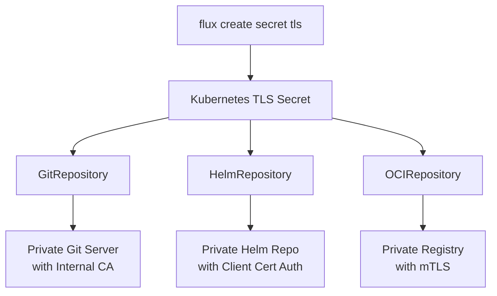

# How to Use flux create secret tls for TLS Configuration

Author: [nawazdhandala](https://github.com/nawazdhandala)

Tags: Flux, fluxcd, TLS, Secret, Certificates, GitOps, Kubernetes, Security, HTTPS

Description: A practical guide to creating TLS secrets with the flux create secret tls command for secure communication in GitOps workflows.

---

## Introduction

Transport Layer Security (TLS) is fundamental to securing communication between Flux components and external services. The `flux create secret tls` command creates Kubernetes TLS secrets that Flux uses for mutual TLS (mTLS) authentication, custom CA trust, and encrypted communication with Git repositories, Helm repositories, and OCI registries that use self-signed or internal certificates.

This guide covers setting up TLS secrets for various scenarios, from simple CA trust to full mutual TLS authentication.

## Prerequisites

- Flux CLI v2.0 or later installed
- kubectl configured with cluster access
- Flux installed on your Kubernetes cluster
- TLS certificates and keys as needed

```bash
# Verify Flux installation
flux check

# Ensure openssl is available for certificate operations
openssl version
```

## Understanding TLS in Flux



## Basic Usage

### Creating a TLS Secret with CA Certificate

```bash
# Create a TLS secret with a custom CA certificate
# This is used when your server uses a certificate signed by an internal CA
flux create secret tls my-tls-secret \
  --ca-file=./ca.crt \
  --namespace=flux-system
```

### Creating a TLS Secret with Client Certificate

```bash
# Create a TLS secret with client certificate and key for mutual TLS
flux create secret tls mtls-secret \
  --cert-file=./client.crt \
  --key-file=./client.key \
  --ca-file=./ca.crt \
  --namespace=flux-system
```

### Minimal TLS Secret (CA Only)

```bash
# When you only need to trust a custom CA without client authentication
flux create secret tls custom-ca \
  --ca-file=./internal-ca.crt \
  --namespace=flux-system
```

## Generating Certificates for Testing

### Creating a Self-Signed CA

```bash
# Generate a self-signed CA certificate for testing
# This CA will be used to sign server and client certificates

# Generate the CA private key
openssl genrsa -out ca.key 4096

# Generate the CA certificate (valid for 10 years)
openssl req -x509 -new -nodes \
  -key ca.key \
  -sha256 \
  -days 3650 \
  -out ca.crt \
  -subj "/CN=Flux Internal CA/O=MyOrg/C=US"
```

### Creating a Client Certificate

```bash
# Generate a client certificate signed by the CA

# Generate client private key
openssl genrsa -out client.key 4096

# Generate client certificate signing request (CSR)
openssl req -new \
  -key client.key \
  -out client.csr \
  -subj "/CN=flux-client/O=MyOrg/C=US"

# Sign the client certificate with the CA
openssl x509 -req \
  -in client.csr \
  -CA ca.crt \
  -CAkey ca.key \
  -CAcreateserial \
  -out client.crt \
  -days 365 \
  -sha256

# Verify the client certificate
openssl verify -CAfile ca.crt client.crt
```

### Creating a Server Certificate

```bash
# Generate a server certificate for testing (used by your Git/Helm server)

# Create an extensions file for Subject Alternative Names
cat > server-ext.cnf << 'EOF'
authorityKeyIdentifier=keyid,issuer
basicConstraints=CA:FALSE
keyUsage = digitalSignature, nonRepudiation, keyEncipherment, dataEncipherment
subjectAltName = @alt_names

[alt_names]
DNS.1 = git.internal.company.com
DNS.2 = *.internal.company.com
IP.1 = 10.0.0.50
EOF

# Generate server key and certificate
openssl genrsa -out server.key 4096

openssl req -new \
  -key server.key \
  -out server.csr \
  -subj "/CN=git.internal.company.com/O=MyOrg/C=US"

openssl x509 -req \
  -in server.csr \
  -CA ca.crt \
  -CAkey ca.key \
  -CAcreateserial \
  -out server.crt \
  -days 365 \
  -sha256 \
  -extfile server-ext.cnf
```

## Use Cases

### Self-Signed Git Server

```bash
# Create a TLS secret for a Git server with a self-signed certificate
flux create secret tls git-tls \
  --ca-file=./ca.crt \
  --namespace=flux-system
```

```yaml
# Reference the TLS secret in a GitRepository
apiVersion: source.toolkit.fluxcd.io/v1
kind: GitRepository
metadata:
  name: private-repo
  namespace: flux-system
spec:
  interval: 5m
  url: https://git.internal.company.com/myorg/myrepo
  ref:
    branch: main
  secretRef:
    # This secret contains Git credentials (username/password)
    name: git-auth
  certSecretRef:
    # This secret contains the CA certificate for TLS verification
    name: git-tls
```

### Mutual TLS with Helm Repository

```bash
# Create a TLS secret with client cert for mTLS with a Helm repository
flux create secret tls helm-mtls \
  --cert-file=./client.crt \
  --key-file=./client.key \
  --ca-file=./ca.crt \
  --namespace=flux-system
```

```yaml
# Reference in a HelmRepository that requires client certificate auth
apiVersion: source.toolkit.fluxcd.io/v1
kind: HelmRepository
metadata:
  name: private-charts
  namespace: flux-system
spec:
  interval: 10m
  url: https://charts.internal.company.com
  certSecretRef:
    name: helm-mtls
```

### Internal OCI Registry

```bash
# Create a TLS secret for an internal OCI registry with a custom CA
flux create secret tls oci-tls \
  --ca-file=./internal-ca.crt \
  --namespace=flux-system
```

```yaml
# Reference in an OCIRepository
apiVersion: source.toolkit.fluxcd.io/v1
kind: OCIRepository
metadata:
  name: internal-artifacts
  namespace: flux-system
spec:
  interval: 5m
  url: oci://registry.internal.company.com/artifacts
  ref:
    tag: latest
  certSecretRef:
    name: oci-tls
  secretRef:
    name: oci-auth
```

### Notification Controller Webhooks

```bash
# Create a TLS secret for webhook receivers that use self-signed certs
flux create secret tls webhook-tls \
  --cert-file=./webhook-server.crt \
  --key-file=./webhook-server.key \
  --namespace=flux-system
```

## Exporting Secrets

```bash
# Export the TLS secret as YAML for declarative management
flux create secret tls git-tls \
  --ca-file=./ca.crt \
  --namespace=flux-system \
  --export > tls-secret.yaml

# Export mTLS secret
flux create secret tls mtls-secret \
  --cert-file=./client.crt \
  --key-file=./client.key \
  --ca-file=./ca.crt \
  --namespace=flux-system \
  --export > mtls-secret.yaml

# Encrypt before committing to Git
sops --encrypt --in-place tls-secret.yaml
sops --encrypt --in-place mtls-secret.yaml
```

## Certificate Rotation

### Manual Rotation

```bash
# When certificates are renewed, update the TLS secret
# Generate new certificates first, then update the secret

flux create secret tls git-tls \
  --ca-file=./new-ca.crt \
  --namespace=flux-system \
  --export | kubectl apply -f -

# For mTLS, update both client cert and CA
flux create secret tls mtls-secret \
  --cert-file=./new-client.crt \
  --key-file=./new-client.key \
  --ca-file=./new-ca.crt \
  --namespace=flux-system \
  --export | kubectl apply -f -

# Force reconciliation to use the new certificates
flux reconcile source git private-repo
```

### Automated Rotation with cert-manager

```yaml
# Use cert-manager to automatically manage client certificates
apiVersion: cert-manager.io/v1
kind: Certificate
metadata:
  name: flux-client-cert
  namespace: flux-system
spec:
  secretName: flux-client-tls
  duration: 2160h    # 90 days
  renewBefore: 360h  # Renew 15 days before expiry
  privateKey:
    algorithm: ECDSA
    size: 256
  usages:
    - client auth
  issuerRef:
    name: internal-ca-issuer
    kind: ClusterIssuer
```

## Combining TLS with Other Secrets

```bash
# Many scenarios require both authentication and TLS secrets

# Step 1: Create the auth secret for Git credentials
flux create secret git git-auth \
  --url=https://git.internal.company.com/myorg/myrepo \
  --username=deploy \
  --password=${GIT_TOKEN} \
  --namespace=flux-system

# Step 2: Create the TLS secret for certificate trust
flux create secret tls git-tls \
  --ca-file=./ca.crt \
  --namespace=flux-system

# Step 3: Reference both in the GitRepository
# The secretRef provides authentication
# The certSecretRef provides TLS configuration
```

## Verifying TLS Configuration

```bash
# Verify the secret was created correctly
kubectl get secret git-tls -n flux-system -o jsonpath='{.data}' | jq 'keys'

# Check that the CA certificate is valid
kubectl get secret git-tls -n flux-system -o jsonpath='{.data.ca\.crt}' | \
  base64 -d | openssl x509 -text -noout

# Check certificate expiration date
kubectl get secret git-tls -n flux-system -o jsonpath='{.data.ca\.crt}' | \
  base64 -d | openssl x509 -enddate -noout

# For mTLS secrets, verify the client certificate
kubectl get secret mtls-secret -n flux-system -o jsonpath='{.data.tls\.crt}' | \
  base64 -d | openssl x509 -text -noout
```

## Troubleshooting

```bash
# Error: "x509: certificate signed by unknown authority"
# The CA certificate is missing or incorrect
# Verify the CA certificate matches the server's certificate chain
openssl s_client -connect git.internal.company.com:443 -showcerts

# Error: "tls: bad certificate"
# The client certificate is rejected by the server
# Verify the client cert is signed by a CA the server trusts
openssl verify -CAfile server-trusted-ca.crt client.crt

# Error: "tls: private key does not match public key"
# The private key does not match the certificate
openssl x509 -noout -modulus -in client.crt | md5
openssl rsa -noout -modulus -in client.key | md5
# Both hashes should match

# Check the GitRepository or HelmRepository for TLS errors
kubectl describe gitrepository private-repo -n flux-system
flux get sources git
```

## Best Practices

1. **Use cert-manager** for automated certificate lifecycle management when possible.
2. **Separate CA and client certificates** into different secrets if they have different rotation schedules.
3. **Monitor certificate expiration** and set up alerts before certificates expire.
4. **Use ECDSA keys** instead of RSA for better performance and shorter key lengths.
5. **Store CA certificates securely** and limit access to private keys.
6. **Test TLS configuration** with openssl before creating Flux secrets.

## Summary

The `flux create secret tls` command enables secure TLS communication between Flux and your infrastructure services. Whether you need to trust a custom CA for self-signed certificates or set up full mutual TLS authentication, this command creates the properly formatted Kubernetes secrets that Flux controllers use for encrypted and authenticated connections. Combined with cert-manager for automated certificate rotation, you can build a robust and secure GitOps infrastructure.
