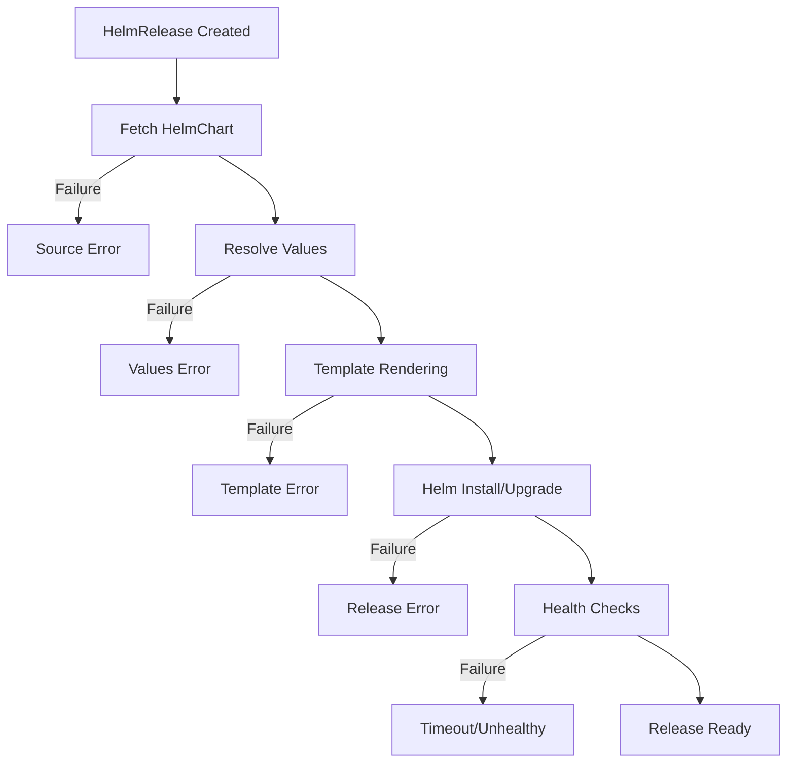

# How to Use flux debug helmrelease for Helm Debugging

Author: [nawazdhandala](https://github.com/nawazdhandala)

Tags: Flux CD, Helm, Debugging, HelmRelease, Troubleshooting, GitOps, Kubernetes

Description: A practical guide to using the flux debug helmrelease command to diagnose and resolve Helm release issues in Flux CD.

---

## Introduction

When managing Helm releases through Flux CD, things can go wrong at various stages: chart fetching, template rendering, value resolution, or the actual Helm upgrade. The `flux debug helmrelease` command is a powerful diagnostic tool that helps you inspect the computed values, identify configuration errors, and understand why a HelmRelease might be failing.

This guide walks you through practical usage of `flux debug helmrelease` with real-world debugging scenarios.

## Prerequisites

Before you begin, ensure you have:

- Flux CLI v2.2.0 or later
- A running Kubernetes cluster with Flux CD installed
- At least one HelmRelease deployed in your cluster

```bash
# Verify Flux installation
flux check

# List existing HelmReleases
flux get helmreleases --all-namespaces
```

## Understanding the HelmRelease Lifecycle

Before diving into debugging, it helps to understand where failures can occur:



## Basic Usage of flux debug helmrelease

The `flux debug helmrelease` command outputs the computed values that Flux will pass to Helm during installation or upgrade:

```bash
# Debug a HelmRelease in the default namespace
flux debug helmrelease my-app

# Debug a HelmRelease in a specific namespace
flux debug helmrelease my-app --namespace=production

# Output the computed values to a file for inspection
flux debug helmrelease my-app --namespace=production > computed-values.yaml
```

## Inspecting Computed Values

One of the most common issues with HelmReleases is incorrect or unexpected values. The debug command shows you exactly what Flux computes:

```bash
# View the full computed values
flux debug helmrelease nginx-ingress --namespace=ingress-system
```

Example output:

```yaml
# Computed values for HelmRelease ingress-system/nginx-ingress
controller:
  replicaCount: 3
  service:
    type: LoadBalancer
    annotations:
      service.beta.kubernetes.io/aws-load-balancer-type: nlb
  resources:
    requests:
      cpu: 100m
      memory: 128Mi
    limits:
      cpu: 500m
      memory: 256Mi
  metrics:
    enabled: true
    serviceMonitor:
      enabled: true
```

## Debugging Value Overrides

HelmReleases can pull values from multiple sources. Use the debug command to verify that overrides are applied correctly:

```yaml
# helmrelease.yaml - Example with multiple value sources
apiVersion: helm.toolkit.fluxcd.io/v2
kind: HelmRelease
metadata:
  name: my-app
  namespace: production
spec:
  interval: 10m
  chart:
    spec:
      chart: my-app
      version: "2.1.0"
      sourceRef:
        kind: HelmRepository
        name: my-charts
  # Base values defined inline
  values:
    replicaCount: 2
    image:
      repository: my-registry.io/my-app
      tag: latest
  # Additional values from ConfigMap and Secret
  valuesFrom:
    - kind: ConfigMap
      name: my-app-values
      valuesKey: values.yaml
    - kind: Secret
      name: my-app-secrets
      valuesKey: secrets.yaml
```

```bash
# Debug to see the merged values from all sources
flux debug helmrelease my-app --namespace=production

# Compare with the inline values to identify what valuesFrom added
flux debug helmrelease my-app --namespace=production | \
  diff - <(kubectl get helmrelease my-app -n production \
    -o jsonpath='{.spec.values}' | yq eval -P -)
```

## Debugging with Show Values Flag

You can control what information the debug command outputs:

```bash
# Show only the computed values (default behavior)
flux debug helmrelease my-app --show-values

# Show detailed information about the HelmRelease status
flux debug helmrelease my-app --show-status
```

## Common Debugging Scenarios

### Scenario 1: Chart Not Found

When Flux cannot fetch the Helm chart:

```bash
# Check the HelmRelease status
flux get helmrelease my-app -n production

# Check the associated HelmChart
flux get sources chart -n production

# Debug the helmrelease for clues
flux debug helmrelease my-app -n production

# Verify the HelmRepository is accessible
flux get sources helm --all-namespaces

# Force a reconciliation to see fresh errors
flux reconcile source helm my-charts -n flux-system
```

### Scenario 2: Values Merge Conflict

When values from different sources conflict:

```bash
# Step 1: See the final computed values
flux debug helmrelease my-app -n production > /tmp/computed.yaml

# Step 2: Check the inline values
kubectl get helmrelease my-app -n production \
  -o jsonpath='{.spec.values}' | yq eval -P - > /tmp/inline.yaml

# Step 3: Check the ConfigMap values
kubectl get configmap my-app-values -n production \
  -o jsonpath='{.data.values\.yaml}' > /tmp/configmap.yaml

# Step 4: Check the Secret values
kubectl get secret my-app-secrets -n production \
  -o jsonpath='{.data.secrets\.yaml}' | base64 -d > /tmp/secret.yaml

# Step 5: Compare to understand merge order
# Values are merged in order: inline < valuesFrom (in order listed)
diff /tmp/inline.yaml /tmp/computed.yaml
```

### Scenario 3: Template Rendering Failures

When Helm templates fail to render:

```bash
# Get the error message from the HelmRelease status
kubectl get helmrelease my-app -n production \
  -o jsonpath='{.status.conditions[?(@.type=="Ready")].message}'

# Debug the values to identify template input issues
flux debug helmrelease my-app -n production

# Try rendering the chart locally with the same values
flux debug helmrelease my-app -n production > /tmp/debug-values.yaml

# Pull the chart and test rendering locally
helm pull my-charts/my-app --version 2.1.0 --untar
helm template my-app ./my-app -f /tmp/debug-values.yaml
```

### Scenario 4: Upgrade Failures

When the Helm upgrade operation fails:

```bash
# Check the HelmRelease conditions
kubectl describe helmrelease my-app -n production

# Debug to verify values are correct
flux debug helmrelease my-app -n production

# Check the Helm history for the release
helm history my-app -n production

# Check the helm-controller logs for detailed error messages
kubectl logs -n flux-system deployment/helm-controller \
  --since=10m | grep my-app
```

### Scenario 5: Health Check Timeouts

When the release installs but health checks fail:

```bash
# Debug the helmrelease to check timeout and health check config
flux debug helmrelease my-app -n production

# Check what resources are not ready
kubectl get pods -n production -l app.kubernetes.io/name=my-app

# Describe failing pods
kubectl describe pod -n production -l app.kubernetes.io/name=my-app

# Check events in the namespace
kubectl get events -n production --sort-by='.lastTimestamp' | tail -20
```

## Using Debug Output for Local Testing

A powerful workflow is to use the debug output for local Helm testing:

```bash
# Export computed values
flux debug helmrelease my-app -n production > computed-values.yaml

# Add the Helm repository locally
helm repo add my-charts https://charts.example.com
helm repo update

# Test template rendering with the exact values Flux uses
helm template my-app my-charts/my-app \
  --version 2.1.0 \
  -f computed-values.yaml \
  --namespace production

# Perform a dry-run upgrade
helm upgrade my-app my-charts/my-app \
  --version 2.1.0 \
  -f computed-values.yaml \
  --namespace production \
  --dry-run
```

## Integrating Debug into CI/CD Pipelines

You can use the debug command in CI pipelines to validate HelmRelease configurations:

```bash
#!/bin/bash
# validate-helmreleases.sh
# Script to validate all HelmReleases in a cluster

# Get all HelmReleases
RELEASES=$(flux get helmreleases --all-namespaces --no-header | awk '{print $1 "/" $2}')

for release in $RELEASES; do
  NAMESPACE=$(echo $release | cut -d'/' -f1)
  NAME=$(echo $release | cut -d'/' -f2)

  echo "Debugging HelmRelease: $NAMESPACE/$NAME"

  # Run debug and capture output
  OUTPUT=$(flux debug helmrelease "$NAME" -n "$NAMESPACE" 2>&1)
  EXIT_CODE=$?

  if [ $EXIT_CODE -ne 0 ]; then
    echo "ERROR: Failed to debug $NAMESPACE/$NAME"
    echo "$OUTPUT"
    exit 1
  fi

  # Validate the computed values are valid YAML
  echo "$OUTPUT" | yq eval '.' - > /dev/null 2>&1
  if [ $? -ne 0 ]; then
    echo "ERROR: Invalid YAML values for $NAMESPACE/$NAME"
    exit 1
  fi

  echo "OK: $NAMESPACE/$NAME values are valid"
done

echo "All HelmReleases validated successfully"
```

## Combining with Other Flux Commands

The debug command works well with other Flux diagnostic commands:

```bash
# Full diagnostic workflow for a failing HelmRelease
echo "=== HelmRelease Status ==="
flux get helmrelease my-app -n production

echo "=== Source Status ==="
flux get sources helm -n flux-system
flux get sources chart -n production

echo "=== Computed Values ==="
flux debug helmrelease my-app -n production

echo "=== Events ==="
flux events --for HelmRelease/my-app -n production

echo "=== Controller Logs ==="
kubectl logs -n flux-system deployment/helm-controller \
  --since=10m --tail=50 | grep my-app
```

## Best Practices

1. **Debug before applying changes** - Export and review computed values before deploying new value overrides.
2. **Use debug output for local testing** - Always test Helm template rendering locally with the exact computed values.
3. **Check value merge order** - Remember that `valuesFrom` entries are merged in order, with later entries taking precedence.
4. **Monitor controller logs** - The helm-controller logs provide the most detailed error information.
5. **Version pin your charts** - Always specify chart versions to avoid unexpected changes during debugging.
6. **Save debug output** - When troubleshooting, save debug output to files for comparison over time.

## Conclusion

The `flux debug helmrelease` command is an essential tool for diagnosing Helm deployment issues in a GitOps workflow. By giving you visibility into the computed values and configuration state, it bridges the gap between your GitOps declarations and what Helm actually receives. Combine it with local Helm testing and controller log analysis for a comprehensive debugging workflow.
