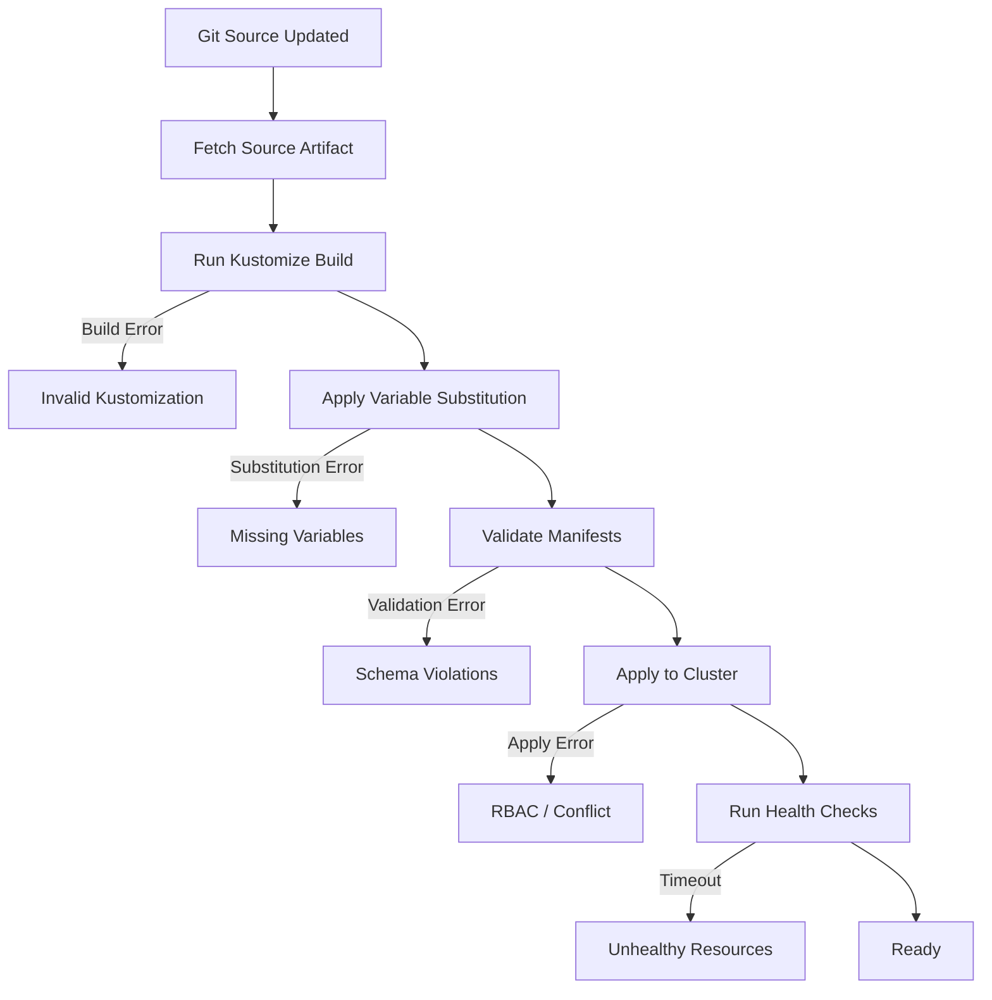

# How to Use flux debug kustomization for Kustomize Debugging

Author: [nawazdhandala](https://github.com/nawazdhandala)

Tags: flux cd, kustomize, debugging, troubleshooting, gitops, kubernetes, kustomization

Description: A practical guide to using the flux debug kustomization command to diagnose and fix Kustomize build and deployment issues in Flux CD.

---

## Introduction

Kustomize is a core component of Flux CD's deployment pipeline. When a Kustomization resource fails, it can be difficult to determine whether the problem lies in the Kustomize build, variable substitution, dependency resolution, or the actual apply step. The `flux debug kustomization` command gives you deep visibility into what Flux is building and applying, making it much easier to identify and fix issues.

This guide covers practical debugging techniques using `flux debug kustomization` with real-world troubleshooting scenarios.

## Prerequisites

Make sure you have the following ready:

- Flux CLI v2.2.0 or later
- A running Kubernetes cluster with Flux CD installed
- One or more Kustomization resources deployed

```bash
# Verify Flux CLI version
flux version --client

# List all Kustomizations
flux get kustomizations --all-namespaces
```

## How Flux Kustomization Processing Works

Understanding the Kustomization processing pipeline helps you pinpoint where failures occur:



## Basic Usage

The `flux debug kustomization` command outputs the manifests that Flux would apply to the cluster:

```bash
# Debug a Kustomization in the flux-system namespace
flux debug kustomization flux-system

# Debug a Kustomization in a specific namespace
flux debug kustomization my-app --namespace=production

# Save the output for inspection
flux debug kustomization my-app --namespace=production > /tmp/debug-output.yaml
```

## Inspecting the Built Manifests

The primary use of the debug command is to see exactly what manifests Flux will apply:

```bash
# View the full built output
flux debug kustomization infrastructure --namespace=flux-system
```

Example output showing what Flux would apply:

```yaml
---
apiVersion: v1
kind: Namespace
metadata:
  name: monitoring
---
apiVersion: source.toolkit.fluxcd.io/v1
kind: HelmRepository
metadata:
  name: prometheus-community
  namespace: monitoring
spec:
  interval: 1h
  url: https://prometheus-community.github.io/helm-charts
---
apiVersion: helm.toolkit.fluxcd.io/v2
kind: HelmRelease
metadata:
  name: kube-prometheus-stack
  namespace: monitoring
spec:
  interval: 1h
  chart:
    spec:
      chart: kube-prometheus-stack
      version: "55.x"
      sourceRef:
        kind: HelmRepository
        name: prometheus-community
```

## Debugging Variable Substitution

Flux Kustomizations support post-build variable substitution. The debug command shows you the result after substitution:

```yaml
# kustomization.yaml with variable substitution
apiVersion: kustomize.toolkit.fluxcd.io/v1
kind: Kustomization
metadata:
  name: my-app
  namespace: flux-system
spec:
  interval: 10m
  path: ./apps/my-app
  prune: true
  sourceRef:
    kind: GitRepository
    name: flux-system
  postBuild:
    substitute:
      CLUSTER_NAME: production-us-east-1
      ENVIRONMENT: production
    substituteFrom:
      - kind: ConfigMap
        name: cluster-settings
      - kind: Secret
        name: cluster-secrets
```

```bash
# Debug to see variables after substitution
flux debug kustomization my-app --namespace=flux-system

# Compare with the raw source to identify substitution issues
# Clone the source repo and build locally
kustomize build ./apps/my-app > /tmp/raw-build.yaml

# Compare raw build with Flux debug output
diff /tmp/raw-build.yaml <(flux debug kustomization my-app -n flux-system)
```

## Common Debugging Scenarios

### Scenario 1: Kustomize Build Failures

When the kustomize build step fails:

```bash
# Check the Kustomization status for error messages
flux get kustomization my-app -n flux-system

# Get the detailed error condition
kubectl get kustomization my-app -n flux-system \
  -o jsonpath='{.status.conditions[?(@.type=="Ready")].message}'

# Try building locally to reproduce the error
git clone <your-flux-repo>
cd <your-flux-repo>
kustomize build ./apps/my-app

# Common fixes: check kustomization.yaml for typos
cat ./apps/my-app/kustomization.yaml
```

Common kustomize build errors and their fixes:

```yaml
# ERROR: resource not found
# Fix: Ensure all referenced files exist in the kustomization.yaml
apiVersion: kustomize.config.k8s.io/v1beta1
kind: Kustomization
resources:
  - deployment.yaml    # Make sure this file exists
  - service.yaml       # Make sure this file exists
  - configmap.yaml     # Make sure this file exists
```

### Scenario 2: Missing Variable Substitution

When post-build variables are not being replaced:

```bash
# Debug to see if variables were substituted
flux debug kustomization my-app -n flux-system | grep '\${'

# If you see ${VARIABLE_NAME} in the output, substitution failed

# Check the ConfigMap for variable values
kubectl get configmap cluster-settings -n flux-system -o yaml

# Check the Secret for variable values
kubectl get secret cluster-secrets -n flux-system \
  -o jsonpath='{.data}' | jq 'to_entries[] | {key: .key, value: (.value | @base64d)}'

# Verify variable names match exactly (case-sensitive)
grep -r '\${' ./apps/my-app/ | sort
```

### Scenario 3: Dependency Resolution Issues

When a Kustomization depends on other Kustomizations:

```yaml
# kustomization.yaml with dependencies
apiVersion: kustomize.toolkit.fluxcd.io/v1
kind: Kustomization
metadata:
  name: apps
  namespace: flux-system
spec:
  interval: 10m
  path: ./apps
  prune: true
  sourceRef:
    kind: GitRepository
    name: flux-system
  dependsOn:
    - name: infrastructure
    - name: cert-manager
```

```bash
# Check the status of all dependencies
flux get kustomization infrastructure -n flux-system
flux get kustomization cert-manager -n flux-system

# Debug each one to see if they are producing valid output
flux debug kustomization infrastructure -n flux-system
flux debug kustomization cert-manager -n flux-system

# Check events for dependency-related messages
flux events --for Kustomization/apps -n flux-system
```

### Scenario 4: Prune Conflicts

When pruning causes issues with shared resources:

```bash
# Debug to see which resources will be managed (and pruned)
flux debug kustomization my-app -n flux-system | \
  grep -E '^kind:|^  name:|^  namespace:' | paste - - -

# Check if resources are managed by multiple Kustomizations
kubectl get deployment my-deployment -n production \
  -o jsonpath='{.metadata.labels}' | jq .

# Look for the Flux ownership labels
kubectl get deployment my-deployment -n production \
  -o jsonpath='{.metadata.labels.kustomize\.toolkit\.fluxcd\.io/name}'
```

### Scenario 5: RBAC and Permission Errors

When the Kustomization applies but some resources are rejected:

```bash
# Debug to see what resources will be applied
flux debug kustomization my-app -n flux-system | \
  yq eval '.kind + "/" + .metadata.name' -

# Check the service account used by kustomize-controller
kubectl get kustomization my-app -n flux-system \
  -o jsonpath='{.spec.serviceAccountName}'

# Verify the service account has the necessary permissions
kubectl auth can-i create deployments \
  --as=system:serviceaccount:flux-system:my-app-sa \
  -n production
```

## Advanced Debugging Techniques

### Comparing Debug Output Over Time

Save debug output before and after changes to identify differences:

```bash
# Before making changes
flux debug kustomization my-app -n flux-system > /tmp/before.yaml

# After making changes and waiting for reconciliation
flux reconcile kustomization my-app -n flux-system
flux debug kustomization my-app -n flux-system > /tmp/after.yaml

# Compare the differences
diff /tmp/before.yaml /tmp/after.yaml
```

### Validating Output Against Cluster State

Compare what Flux wants to apply with what is currently in the cluster:

```bash
# Get the debug output
flux debug kustomization my-app -n flux-system > /tmp/desired.yaml

# Split into individual resources and compare each one
# Using yq to extract a specific resource
yq eval 'select(.kind == "Deployment" and .metadata.name == "my-app")' \
  /tmp/desired.yaml > /tmp/desired-deployment.yaml

# Get the current state from the cluster
kubectl get deployment my-app -n production -o yaml > /tmp/current-deployment.yaml

# Compare desired vs current
diff /tmp/desired-deployment.yaml /tmp/current-deployment.yaml
```

### Using Debug in a Validation Script

Automate Kustomization validation in CI:

```bash
#!/bin/bash
# validate-kustomizations.sh
# Validates all Kustomizations produce valid Kubernetes manifests

set -euo pipefail

# Get all Kustomizations
KUSTOMIZATIONS=$(flux get kustomizations --all-namespaces --no-header \
  | awk '{print $1 "," $2}')

ERRORS=0

for ks in $KUSTOMIZATIONS; do
  NAMESPACE=$(echo "$ks" | cut -d',' -f1)
  NAME=$(echo "$ks" | cut -d',' -f2)

  echo "Validating Kustomization: $NAMESPACE/$NAME"

  # Attempt to debug the kustomization
  if ! flux debug kustomization "$NAME" -n "$NAMESPACE" > /tmp/ks-output.yaml 2>&1; then
    echo "FAIL: Could not debug $NAMESPACE/$NAME"
    cat /tmp/ks-output.yaml
    ERRORS=$((ERRORS + 1))
    continue
  fi

  # Validate with kubectl dry-run
  if ! kubectl apply -f /tmp/ks-output.yaml --dry-run=server 2>&1; then
    echo "FAIL: Dry-run failed for $NAMESPACE/$NAME"
    ERRORS=$((ERRORS + 1))
    continue
  fi

  echo "PASS: $NAMESPACE/$NAME"
done

if [ $ERRORS -gt 0 ]; then
  echo "Validation failed with $ERRORS errors"
  exit 1
fi

echo "All Kustomizations validated successfully"
```

## Combining with Flux Events

The debug command pairs well with Flux events for complete diagnostics:

```bash
# Full diagnostic for a failing Kustomization
echo "=== Status ==="
flux get kustomization my-app -n flux-system

echo "=== Source ==="
flux get source git flux-system -n flux-system

echo "=== Debug Output ==="
flux debug kustomization my-app -n flux-system

echo "=== Events ==="
flux events --for Kustomization/my-app -n flux-system

echo "=== Controller Logs ==="
kubectl logs -n flux-system deployment/kustomize-controller \
  --since=10m --tail=50 | grep my-app
```

## Best Practices

1. **Debug before and after changes** - Always compare debug output before and after modifying Kustomization specs.
2. **Test variable substitution** - Use debug to verify all `${}` variables are correctly replaced.
3. **Validate locally first** - Run `kustomize build` locally before pushing to Git.
4. **Check dependency chain** - Debug dependent Kustomizations to ensure they are ready before debugging the dependent one.
5. **Use dry-run validation** - Pipe debug output to `kubectl apply --dry-run=server` for server-side validation.
6. **Monitor build times** - If debug output takes too long, your kustomize build may be too complex.

## Conclusion

The `flux debug kustomization` command is an indispensable tool for understanding exactly what Flux will apply to your cluster. By revealing the fully built and substituted manifests, it eliminates guesswork and helps you quickly identify configuration issues. Integrate it into your debugging workflow alongside events, controller logs, and local testing for the most effective troubleshooting experience.
