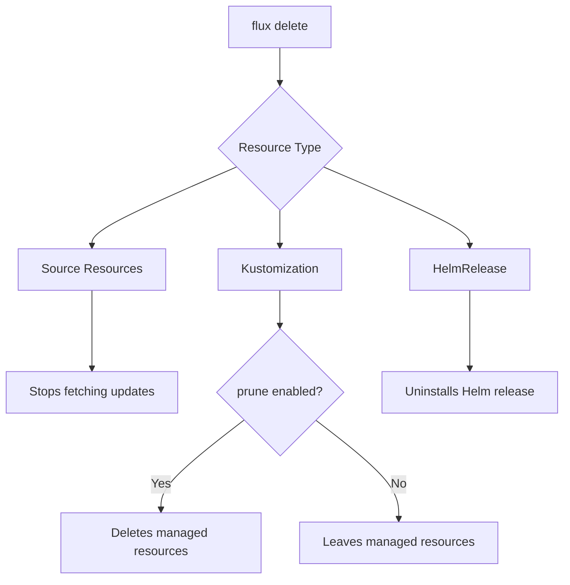
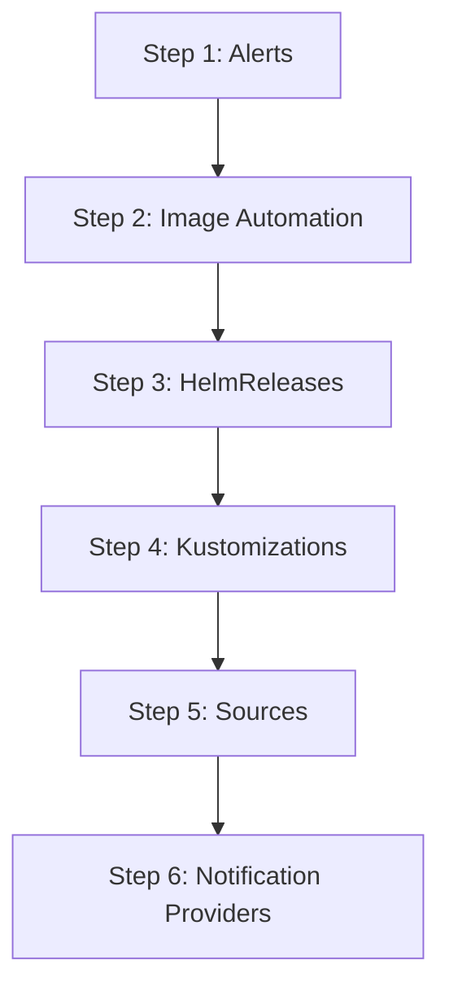

# How to Use flux delete to Remove Flux Resources

Author: [nawazdhandala](https://github.com/nawazdhandala)

Tags: Flux, fluxcd, GitOps, Kubernetes, Delete, Cleanup, CLI, Resource-Management

Description: Learn how to use the flux delete command to safely remove Flux CD resources from your Kubernetes cluster with practical examples and safety considerations.

---

## Introduction

Managing the lifecycle of Flux CD resources includes knowing how to remove them properly. The `flux delete` command provides a safe way to remove Flux resources from your cluster. Unlike raw `kubectl delete`, the Flux CLI understands resource relationships and provides confirmation prompts to prevent accidental deletions.

This guide covers all the ways you can use `flux delete` and the implications of removing different resource types.

## Prerequisites

- Flux CLI installed (v2.2.0 or later)
- A running Kubernetes cluster with Flux installed
- kubectl configured with cluster access
- Understanding of which resources are managed by Flux

## Understanding Resource Deletion Behavior

When you delete a Flux resource, the behavior depends on the resource type and its configuration:



Key points to remember:

- Deleting a **GitRepository** stops Flux from fetching updates but does not remove deployed resources.
- Deleting a **Kustomization** with `prune: true` will also delete all resources it manages.
- Deleting a **HelmRelease** will uninstall the Helm chart from the cluster.

## Basic Syntax

```bash
# General syntax
flux delete <resource-type> <name> [--namespace=<namespace>] [--silent]

# The --silent flag skips the confirmation prompt
```

## Deleting Git Sources

```bash
# Delete a GitRepository source (with confirmation prompt)
flux delete source git my-app

# Delete without confirmation prompt
flux delete source git my-app --silent

# Delete from a specific namespace
flux delete source git my-app --namespace=flux-system
```

When you delete a GitRepository, Flux stops tracking that repository. However, any resources that were already deployed by Kustomizations referencing this source remain in the cluster.

## Deleting Helm Sources

```bash
# Delete a HelmRepository
flux delete source helm bitnami --namespace=flux-system

# Delete a HelmChart
flux delete source chart my-app --namespace=flux-system
```

## Deleting OCI Sources

```bash
# Delete an OCIRepository
flux delete source oci my-oci-app --namespace=flux-system
```

## Deleting Bucket Sources

```bash
# Delete a Bucket source
flux delete source bucket my-bucket --namespace=flux-system
```

## Deleting Kustomizations

Deleting Kustomizations requires extra care because of the prune behavior:

```bash
# Delete a Kustomization
# If prune is enabled, all managed resources will be deleted
flux delete kustomization my-app --namespace=flux-system
```

### Understanding Prune Behavior

When a Kustomization has `prune: true`, deleting it triggers garbage collection. All resources that the Kustomization manages will be removed from the cluster:

```bash
# Check if prune is enabled before deleting
kubectl get kustomization my-app -n flux-system -o jsonpath='{.spec.prune}'
# Output: true

# If prune is true, deleting the Kustomization will also delete:
# - Deployments
# - Services
# - ConfigMaps
# - Any other resources managed by this Kustomization
flux delete kustomization my-app --namespace=flux-system
```

### Safe Deletion Without Pruning

If you want to delete the Kustomization without removing the managed resources, first disable pruning:

```bash
# Step 1: Suspend the Kustomization to prevent reconciliation
flux suspend kustomization my-app --namespace=flux-system

# Step 2: Patch the Kustomization to disable pruning
kubectl patch kustomization my-app -n flux-system \
  --type=merge \
  -p '{"spec":{"prune":false}}'

# Step 3: Now safely delete the Kustomization
# Managed resources will remain in the cluster
flux delete kustomization my-app --namespace=flux-system --silent
```

## Deleting HelmReleases

Deleting a HelmRelease uninstalls the Helm chart from the cluster:

```bash
# Delete a HelmRelease (this will uninstall the chart)
flux delete helmrelease nginx --namespace=default

# Delete silently
flux delete helmrelease nginx --namespace=default --silent
```

### Keeping the Helm Release Installed

If you want to remove Flux management without uninstalling the chart:

```bash
# Step 1: Suspend the HelmRelease
flux suspend helmrelease nginx --namespace=default

# Step 2: Remove the Flux labels from the Helm release
# This prevents Flux from cleaning up the release
kubectl annotate helmrelease nginx -n default \
  kustomize.toolkit.fluxcd.io/prune=disabled --overwrite

# Step 3: Delete the HelmRelease resource
flux delete helmrelease nginx --namespace=default --silent
```

## Deleting Alert and Notification Resources

```bash
# Delete a notification provider
flux delete alert-provider slack --namespace=flux-system

# Delete an alert
flux delete alert my-app-alert --namespace=flux-system
```

## Deleting Image Automation Resources

```bash
# Delete an ImageRepository
flux delete image repository my-app --namespace=flux-system

# Delete an ImagePolicy
flux delete image policy my-app --namespace=flux-system

# Delete an ImageUpdateAutomation
flux delete image update my-app-auto --namespace=flux-system
```

## Bulk Deletion

When you need to clean up multiple resources at once:

```bash
#!/bin/bash
# cleanup-app.sh
# Remove all Flux resources for a specific application

set -euo pipefail

APP_NAME="${1:?Usage: cleanup-app.sh <app-name>}"
NAMESPACE="${2:-flux-system}"

echo "Cleaning up Flux resources for: ${APP_NAME}"
echo "Namespace: ${NAMESPACE}"
echo ""

# Delete in reverse dependency order:
# 1. Alerts first (they depend on providers and sources)
echo "Deleting alerts..."
flux delete alert "${APP_NAME}-alert" \
  --namespace="${NAMESPACE}" --silent 2>/dev/null || true

# 2. Image automation (depends on sources)
echo "Deleting image automation..."
flux delete image update "${APP_NAME}-auto" \
  --namespace="${NAMESPACE}" --silent 2>/dev/null || true
flux delete image policy "${APP_NAME}" \
  --namespace="${NAMESPACE}" --silent 2>/dev/null || true
flux delete image repository "${APP_NAME}" \
  --namespace="${NAMESPACE}" --silent 2>/dev/null || true

# 3. HelmReleases (depends on HelmRepository)
echo "Deleting helm releases..."
flux delete helmrelease "${APP_NAME}" \
  --namespace="${NAMESPACE}" --silent 2>/dev/null || true

# 4. Kustomizations (depends on sources)
echo "Deleting kustomizations..."
flux delete kustomization "${APP_NAME}" \
  --namespace="${NAMESPACE}" --silent 2>/dev/null || true

# 5. Sources last
echo "Deleting sources..."
flux delete source git "${APP_NAME}" \
  --namespace="${NAMESPACE}" --silent 2>/dev/null || true
flux delete source helm "${APP_NAME}" \
  --namespace="${NAMESPACE}" --silent 2>/dev/null || true
flux delete source oci "${APP_NAME}" \
  --namespace="${NAMESPACE}" --silent 2>/dev/null || true

echo ""
echo "Cleanup complete for: ${APP_NAME}"
```

## Deletion Order and Dependencies

When removing resources, follow this order to avoid orphaned references:



```bash
# Correct deletion order for a complete application stack
flux delete alert my-alert --namespace=flux-system --silent
flux delete helmrelease my-app --namespace=default --silent
flux delete kustomization my-app --namespace=flux-system --silent
flux delete source git my-app --namespace=flux-system --silent
flux delete source helm my-charts --namespace=flux-system --silent
flux delete alert-provider slack --namespace=flux-system --silent
```

## Verifying Deletion

After deleting resources, verify they are gone:

```bash
# Check that the resource no longer exists
flux get sources git --namespace=flux-system
flux get kustomizations --namespace=flux-system
flux get helmreleases --all-namespaces

# Verify using kubectl as well
kubectl get gitrepositories -n flux-system
kubectl get kustomizations -n flux-system
kubectl get helmreleases -A
```

## The GitOps Way to Delete

In a pure GitOps workflow, you should delete resources by removing their definitions from Git rather than using `flux delete`:

```bash
# The GitOps approach:
# 1. Remove the resource YAML from your Git repository
git rm clusters/production/my-app-source.yaml
git rm clusters/production/my-app-kustomization.yaml
git commit -m "Remove my-app from production"
git push

# Flux will detect the removal and delete the resources automatically
# (if the parent Kustomization has prune: true)
```

Use `flux delete` primarily for:

- Emergency removals when you cannot wait for Git reconciliation
- Cleaning up resources created manually with `flux create`
- Debugging and testing scenarios

## Recovering from Accidental Deletion

If you accidentally delete a Flux resource:

```bash
# Option 1: Re-apply from your Git repository
# Flux will re-create the resource on next reconciliation
flux reconcile kustomization flux-system --namespace=flux-system

# Option 2: Re-create the resource manually
flux create source git my-app \
  --url=https://github.com/myorg/my-app \
  --branch=main \
  --interval=1m

# Option 3: Restore from a backup (if you have one)
kubectl apply -f flux-backup/sources/git-repositories.yaml
```

## Best Practices

1. **Always backup before deleting**: Run `flux export` before removing resources.
2. **Check prune settings**: Understand whether deleting a Kustomization will cascade to managed resources.
3. **Use --silent carefully**: The confirmation prompt exists for your protection.
4. **Prefer GitOps deletion**: Remove from Git rather than using `flux delete` when possible.
5. **Delete in dependency order**: Remove dependent resources before their dependencies.

## Summary

The `flux delete` command is a powerful tool for removing Flux resources from your cluster. Understanding the cascade behavior, especially with Kustomization pruning and HelmRelease uninstallation, is critical to avoiding unintended data loss. For production environments, always prefer the GitOps approach of removing resource definitions from Git and letting Flux handle the cleanup automatically.
