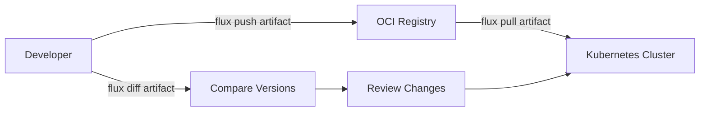

# How to Use flux diff artifact to Compare OCI Artifacts

Author: [nawazdhandala](https://github.com/nawazdhandala)

Tags: flux, fluxcd, gitops, oci, artifacts, diff, kubernetes, devops, cli

Description: Learn how to use the flux diff artifact command to compare OCI artifacts and track changes between different versions of your Kubernetes manifests.

---

## Introduction

When working with Flux CD and OCI (Open Container Initiative) artifacts, understanding what changed between two versions of an artifact is critical for debugging, auditing, and safe deployments. The `flux diff artifact` command provides a straightforward way to compare OCI artifacts stored in container registries.

This guide walks you through practical usage of `flux diff artifact`, covering common scenarios you will encounter in production environments.

## Prerequisites

Before you begin, make sure you have the following:

- Flux CLI installed (v2.2.0 or later)
- Access to an OCI-compatible container registry
- kubectl configured with cluster access
- Basic familiarity with OCI artifacts and Flux CD concepts

## Understanding OCI Artifacts in Flux

Flux CD can store and retrieve Kubernetes manifests as OCI artifacts in container registries. This approach provides versioning, signing, and distribution capabilities that Git repositories alone cannot offer.



## Basic Syntax of flux diff artifact

The basic syntax for comparing OCI artifacts is:

```bash
# General syntax
flux diff artifact oci://<registry>/<repository>:<tag> \
  --path=<local-path>
```

This compares a remote OCI artifact against local files on disk.

## Pushing Your First Artifact

Before you can diff artifacts, you need to push some. Here is how to push a Kubernetes manifest as an OCI artifact:

```bash
# Create a sample deployment manifest
mkdir -p /tmp/flux-demo/manifests

cat > /tmp/flux-demo/manifests/deployment.yaml <<'YAML'
apiVersion: apps/v1
kind: Deployment
metadata:
  name: my-app
  namespace: default
spec:
  replicas: 2
  selector:
    matchLabels:
      app: my-app
  template:
    metadata:
      labels:
        app: my-app
    spec:
      containers:
        - name: my-app
          image: nginx:1.24
          ports:
            - containerPort: 80
          resources:
            requests:
              cpu: 100m
              memory: 128Mi
            limits:
              cpu: 250m
              memory: 256Mi
YAML

# Push the artifact to your registry with a version tag
flux push artifact oci://ghcr.io/myorg/my-app-manifests:v1.0.0 \
  --path=/tmp/flux-demo/manifests \
  --source="$(git config --get remote.origin.url)" \
  --revision="v1.0.0"
```

## Comparing a Remote Artifact with Local Files

The most common use case is comparing what is in the registry with your local changes:

```bash
# Compare the remote artifact against local files
flux diff artifact oci://ghcr.io/myorg/my-app-manifests:v1.0.0 \
  --path=/tmp/flux-demo/manifests
```

If there are no differences, the command exits with code 0 and produces no output. If differences exist, you will see a unified diff output:

```diff
--- a/deployment.yaml
+++ b/deployment.yaml
@@ -7,7 +7,7 @@
 spec:
-  replicas: 2
+  replicas: 3
   selector:
     matchLabels:
       app: my-app
```

## Comparing Two Remote Artifact Versions

To compare two different versions of the same artifact, you can pull one version locally and diff against the other:

```bash
# Pull the older version to a temporary directory
flux pull artifact oci://ghcr.io/myorg/my-app-manifests:v1.0.0 \
  --output /tmp/flux-v1

# Diff the newer version against the pulled older version
flux diff artifact oci://ghcr.io/myorg/my-app-manifests:v2.0.0 \
  --path=/tmp/flux-v1
```

## Using Diff in CI/CD Pipelines

One of the most powerful applications of `flux diff artifact` is integrating it into CI/CD pipelines to gate deployments:

```bash
#!/bin/bash
# ci-diff-check.sh
# This script compares the current build artifacts against the latest deployed version

set -euo pipefail

REGISTRY="ghcr.io/myorg/my-app-manifests"
CURRENT_TAG="v2.0.0"
MANIFEST_PATH="./deploy/manifests"

# Run the diff and capture the exit code
# Exit code 0 = no changes, Exit code 1 = changes detected
if flux diff artifact "oci://${REGISTRY}:${CURRENT_TAG}" \
  --path="${MANIFEST_PATH}" > /tmp/artifact-diff.txt 2>&1; then
  echo "No changes detected in manifests. Skipping deployment."
  exit 0
else
  echo "Changes detected in manifests:"
  cat /tmp/artifact-diff.txt
  echo ""
  echo "Proceeding with artifact push and deployment..."
fi

# Push the updated artifact
flux push artifact "oci://${REGISTRY}:${CURRENT_TAG}" \
  --path="${MANIFEST_PATH}" \
  --source="$(git config --get remote.origin.url)" \
  --revision="${CURRENT_TAG}"

echo "Artifact pushed successfully."
```

## Authenticating with Private Registries

When working with private registries, you need to authenticate before running diff commands:

```bash
# Authenticate with GitHub Container Registry
echo "${GITHUB_TOKEN}" | flux push artifact \
  oci://ghcr.io/myorg/my-app-manifests:v1.0.0 \
  --path=./manifests \
  --source="local" \
  --revision="v1.0.0" \
  --creds="myuser:${GITHUB_TOKEN}"

# Authenticate with Docker Hub
flux diff artifact oci://docker.io/myorg/my-app-manifests:v1.0.0 \
  --path=./manifests \
  --creds="myuser:${DOCKER_TOKEN}"

# Authenticate with AWS ECR (use aws ecr get-login-password)
AWS_TOKEN=$(aws ecr get-login-password --region us-east-1)
flux diff artifact oci://123456789.dkr.ecr.us-east-1.amazonaws.com/my-app:v1.0.0 \
  --path=./manifests \
  --creds="AWS:${AWS_TOKEN}"
```

## Diffing with Multiple File Paths

When your manifests span multiple directories, you can organize them before diffing:

```bash
# Create a consolidated manifest directory for comparison
mkdir -p /tmp/consolidated-manifests

# Copy manifests from multiple sources
cp ./base/*.yaml /tmp/consolidated-manifests/
cp ./overlays/production/*.yaml /tmp/consolidated-manifests/

# Run the diff against the consolidated directory
flux diff artifact oci://ghcr.io/myorg/my-app-manifests:v1.0.0 \
  --path=/tmp/consolidated-manifests
```

## Automating Diff Reports

You can create automated diff reports for pull request reviews:

```bash
#!/bin/bash
# generate-diff-report.sh
# Generates a markdown diff report suitable for PR comments

REGISTRY="ghcr.io/myorg/my-app-manifests"
TAG="latest"
MANIFEST_PATH="./manifests"

echo "## OCI Artifact Diff Report" > /tmp/diff-report.md
echo "" >> /tmp/diff-report.md
echo "Comparing \`oci://${REGISTRY}:${TAG}\` against local manifests." >> /tmp/diff-report.md
echo "" >> /tmp/diff-report.md

# Capture the diff output
DIFF_OUTPUT=$(flux diff artifact "oci://${REGISTRY}:${TAG}" \
  --path="${MANIFEST_PATH}" 2>&1 || true)

if [ -z "${DIFF_OUTPUT}" ]; then
  echo "No changes detected." >> /tmp/diff-report.md
else
  echo '```diff' >> /tmp/diff-report.md
  echo "${DIFF_OUTPUT}" >> /tmp/diff-report.md
  echo '```' >> /tmp/diff-report.md
fi

# Output the report (can be used with gh pr comment)
cat /tmp/diff-report.md
```

## Handling Common Errors

Here are some common errors you may encounter and how to resolve them:

```bash
# Error: artifact not found
# Solution: verify the artifact exists in the registry
flux list artifacts oci://ghcr.io/myorg/my-app-manifests

# Error: authentication required
# Solution: provide credentials
flux diff artifact oci://ghcr.io/myorg/my-app-manifests:v1.0.0 \
  --path=./manifests \
  --creds="user:token"

# Error: path does not exist
# Solution: verify the local path is correct and contains files
ls -la ./manifests/
```

## Best Practices

### Always Diff Before Pushing

Make it a habit to diff before pushing new artifact versions:

```bash
# Step 1: Check what will change
flux diff artifact oci://ghcr.io/myorg/my-app-manifests:latest \
  --path=./manifests

# Step 2: Only push if you are satisfied with the changes
flux push artifact oci://ghcr.io/myorg/my-app-manifests:v2.0.0 \
  --path=./manifests \
  --source="$(git config --get remote.origin.url)" \
  --revision="v2.0.0"
```

### Tag Artifacts with Semantic Versions

Use semantic versioning to make comparisons meaningful:

```bash
# Push with semantic version tags
flux push artifact oci://ghcr.io/myorg/my-app-manifests:v1.0.0 \
  --path=./manifests \
  --source="local" \
  --revision="v1.0.0"

# Also tag as latest for convenience
flux tag artifact oci://ghcr.io/myorg/my-app-manifests:v1.0.0 \
  --tag=latest
```

### Use Exit Codes in Scripts

The diff command returns meaningful exit codes:

```bash
# Exit code 0: no differences found
# Exit code 1: differences found or error occurred

flux diff artifact oci://ghcr.io/myorg/my-app-manifests:v1.0.0 \
  --path=./manifests
EXIT_CODE=$?

case $EXIT_CODE in
  0)
    echo "Artifacts are identical"
    ;;
  1)
    echo "Differences detected"
    ;;
esac
```

## Summary

The `flux diff artifact` command is an essential tool for managing OCI artifacts in a GitOps workflow. It enables you to compare remote artifacts against local files, audit changes before deployments, and integrate change detection into CI/CD pipelines. By incorporating artifact diffing into your workflow, you gain better visibility into what changes are being deployed to your clusters.
