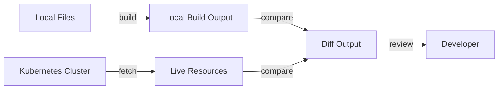

# How to Use flux diff kustomization to Compare Changes

Author: [nawazdhandala](https://github.com/nawazdhandala)

Tags: Flux, fluxcd, GitOps, Kubernetes, CLI, Diff, Kustomization, Comparison, Preview, DevOps

Description: A practical guide to using the flux diff kustomization command to compare local changes against what is currently deployed in your Kubernetes cluster.

---

## Introduction

Before applying changes to a production Kubernetes cluster, you want to know exactly what will change. The `flux diff kustomization` command compares the rendered output of a local Kustomization against the live resources in your cluster, showing a precise diff of what would change if the new configuration were applied.

This guide covers how to use `flux diff kustomization` to safely preview changes, integrate diffs into your workflow, and avoid unexpected modifications to your cluster.

## Prerequisites

Ensure you have:

- A running Kubernetes cluster with Flux CD installed
- `kubectl` configured for your cluster
- The Flux CLI installed locally
- A Git repository with Kustomization manifests

Verify your setup:

```bash
# Check Flux installation
flux check

# List existing kustomizations
flux get kustomizations --all-namespaces
```

## What flux diff kustomization Does

The command performs these steps:

1. Builds the Kustomization from your local files (just like `flux build kustomization`)
2. Fetches the corresponding live resources from the cluster
3. Computes and displays the diff between the two



## Basic Usage

Compare local changes against the cluster:

```bash
# Diff a kustomization named "apps" using local source files
flux diff kustomization apps --path ./clusters/production/apps
```

Sample output:

```diff
--- Deployment/my-app/my-app (live)
+++ Deployment/my-app/my-app (local)
@@ -15,7 +15,7 @@
     spec:
       containers:
       - name: my-app
-        image: myregistry/my-app:v1.2.3
+        image: myregistry/my-app:v1.3.0
         ports:
         - containerPort: 8080
---
--- Service/my-app/my-app-svc (live)
+++ Service/my-app/my-app-svc (local)
@@ -8,3 +8,5 @@
   ports:
   - port: 80
     targetPort: 8080
+  - port: 443
+    targetPort: 8443
```

Lines prefixed with `-` show the current state in the cluster. Lines prefixed with `+` show what will change.

## Understanding the Output

The diff output follows the standard unified diff format:

| Symbol | Meaning |
|--------|---------|
| `---` | Identifies the live (cluster) version |
| `+++` | Identifies the local (proposed) version |
| `-` | Line that will be removed or changed |
| `+` | Line that will be added or changed |
| `@@` | Indicates the position of changes within the file |

If there are no differences, the command produces no output and exits with code 0.

## Using the Path Flag

The `--path` flag specifies the local directory containing your Kustomization files:

```bash
# Diff using an absolute path
flux diff kustomization apps --path /home/user/repos/my-infra/clusters/production/apps

# Diff using a relative path
flux diff kustomization apps --path ./clusters/production/apps
```

## Diffing with Variable Substitutions

If your Kustomization uses Flux post-build variable substitutions, the diff command applies them:

```bash
# Diff with substitutions from the cluster
flux diff kustomization apps --path ./clusters/production/apps
```

The diff will show the final rendered output with all variables replaced, so you can verify substitution values are correct.

## Practical Use Cases

### Use Case 1: Pre-Push Change Review

Before pushing changes to Git, review exactly what will change:

```bash
# Step 1: Make changes to your local files
# Edit deployment.yaml, add a new service, etc.

# Step 2: Run the diff to see what will change
flux diff kustomization apps --path ./clusters/production/apps

# Step 3: Review the diff carefully
# - Are only the expected resources changing?
# - Are there any unintended side effects?
# - Are the new values correct?

# Step 4: If satisfied, commit and push
git add .
git commit -m "Update app configuration"
git push origin main
```

### Use Case 2: Pull Request Review

Include diff output in pull request descriptions:

```bash
# Generate the diff and save to a file
flux diff kustomization apps --path ./clusters/production/apps > /tmp/pr-diff.txt

# Include the diff in your PR description
cat /tmp/pr-diff.txt
```

### Use Case 3: CI/CD Pipeline Change Detection

Integrate diff checks into your CI/CD pipeline:

```yaml
# .github/workflows/diff.yaml
name: Preview Flux Changes

on:
  pull_request:
    branches: [main]

jobs:
  diff:
    runs-on: ubuntu-latest
    steps:
      - uses: actions/checkout@v4

      - name: Setup Flux CLI
        uses: fluxcd/flux2/action@main

      - name: Configure kubectl
        uses: azure/k8s-set-context@v3
        with:
          kubeconfig: ${{ secrets.KUBECONFIG }}

      - name: Diff apps kustomization
        run: |
          echo "## Flux Diff Preview" >> $GITHUB_STEP_SUMMARY
          echo '```diff' >> $GITHUB_STEP_SUMMARY
          flux diff kustomization apps \
            --path ./clusters/production/apps \
            >> $GITHUB_STEP_SUMMARY 2>&1 || true
          echo '```' >> $GITHUB_STEP_SUMMARY

      - name: Diff infrastructure kustomization
        run: |
          echo "## Infrastructure Diff" >> $GITHUB_STEP_SUMMARY
          echo '```diff' >> $GITHUB_STEP_SUMMARY
          flux diff kustomization infrastructure \
            --path ./clusters/production/infrastructure \
            >> $GITHUB_STEP_SUMMARY 2>&1 || true
          echo '```' >> $GITHUB_STEP_SUMMARY
```

### Use Case 4: Comparing Multiple Kustomizations

Diff all your Kustomizations at once:

```bash
#!/bin/bash
# diff-all.sh
# Diff all kustomizations against the cluster

KUSTOMIZATIONS=("apps" "infrastructure" "monitoring")
BASE_PATH="./clusters/production"

for KS in "${KUSTOMIZATIONS[@]}"; do
    echo "=== Diffing Kustomization: $KS ==="
    DIFF_OUTPUT=$(flux diff kustomization "$KS" --path "$BASE_PATH/$KS" 2>&1)

    if [ -z "$DIFF_OUTPUT" ]; then
        echo "No changes detected."
    else
        echo "$DIFF_OUTPUT"
    fi
    echo ""
done
```

### Use Case 5: Verifying Drift Detection

Check if manual changes have been made to the cluster:

```bash
# Diff against the current Git state (without local modifications)
git stash  # Stash any local changes
flux diff kustomization apps --path ./clusters/production/apps

# If the diff shows changes, someone has manually modified cluster resources
# Flux will correct this drift on the next reconciliation

git stash pop  # Restore local changes
```

## Detecting New and Removed Resources

The diff also shows resources that will be added or removed:

```diff
# New resource (will be created)
+++ ConfigMap/my-app/my-new-config (local)
+apiVersion: v1
+kind: ConfigMap
+metadata:
+  name: my-new-config
+  namespace: my-app
+data:
+  key: value

# Removed resource (will be deleted if pruning is enabled)
--- Deployment/my-app/old-worker (live)
-apiVersion: apps/v1
-kind: Deployment
-metadata:
-  name: old-worker
-  namespace: my-app
```

## Handling Large Diffs

When dealing with large diffs:

```bash
# Save to a file and use a pager
flux diff kustomization apps --path ./clusters/production/apps > /tmp/diff.txt
less /tmp/diff.txt

# Filter for specific resources
flux diff kustomization apps --path ./clusters/production/apps | grep -A20 "Deployment"

# Count the number of changed resources
flux diff kustomization apps --path ./clusters/production/apps | grep "^---\|^+++" | wc -l
```

## Interpreting No Diff

When there is no output from the diff command, it means your local files produce identical output to what is currently deployed. This can mean:

1. Your local files are in sync with the cluster
2. The Kustomization has already been reconciled with the latest changes

```bash
# Verify by checking the exit code
flux diff kustomization apps --path ./clusters/production/apps
echo "Exit code: $?"
# Exit code 0 = no differences
# Exit code 1 = differences found
```

## Using Exit Codes in Scripts

The exit code is useful for automation:

```bash
#!/bin/bash
# check-changes.sh
# Check if there are pending changes for a kustomization

KS_NAME=${1:-apps}
KS_PATH=${2:-./clusters/production/apps}

if flux diff kustomization "$KS_NAME" --path "$KS_PATH" > /dev/null 2>&1; then
    echo "No changes pending for $KS_NAME"
    exit 0
else
    echo "Changes detected for $KS_NAME:"
    flux diff kustomization "$KS_NAME" --path "$KS_PATH"
    exit 1
fi
```

## Combining Diff with Build

Use both commands together for a thorough review:

```bash
# Step 1: Build to see the complete rendered output
flux build kustomization apps --path ./clusters/production/apps > /tmp/build.yaml

# Step 2: Diff to see only what changes
flux diff kustomization apps --path ./clusters/production/apps > /tmp/diff.txt

# Step 3: Review the full build for context
cat /tmp/build.yaml

# Step 4: Review the diff for changes
cat /tmp/diff.txt
```

## Common Flags Reference

| Flag | Description |
|------|-------------|
| `--path` | Local path to the Kustomization directory |
| `--namespace` | Namespace of the Kustomization resource |

## Troubleshooting

### Diff Shows Unexpected Changes

If the diff shows changes you did not make:

```bash
# Check if Flux has post-build substitutions that differ
kubectl get kustomization apps -n flux-system -o yaml | grep -A20 "postBuild"

# Verify your local files match the Git repository
git status
git diff

# Check for generated fields (like resource versions) that may cause noise
```

### Diff Cannot Connect to the Cluster

If the command fails to reach the cluster:

```bash
# Verify kubectl connectivity
kubectl cluster-info

# Check your kubeconfig
kubectl config current-context
```

### Diff Fails with Build Errors

If the local build fails:

```bash
# Run the build separately to see the error
flux build kustomization apps --path ./clusters/production/apps

# Run kustomize directly for more details
kustomize build ./clusters/production/apps
```

### Diff Shows All Resources as New

If every resource appears as a new addition:

```bash
# Verify the kustomization name matches the one in the cluster
flux get kustomization apps

# Verify the namespace is correct
flux get kustomization apps --namespace flux-system
```

## Best Practices

1. **Always diff before pushing** - Make it a habit to run `flux diff` before every Git push
2. **Integrate into CI/CD** - Add diff output to pull request comments for team review
3. **Use exit codes for gates** - Use the exit code to gate deployments in pipelines
4. **Review carefully** - Do not just check that changes exist; verify they are the correct changes
5. **Check for drift regularly** - Run diffs against clean checkouts to detect manual cluster changes
6. **Save diff output** - Store diff output as artifacts in your CI system for audit purposes

## Summary

The `flux diff kustomization` command is an essential safety tool in the GitOps workflow. By showing you exactly what will change before changes are applied, it prevents surprises and gives you confidence in your deployments. Whether you use it manually during development or automatically in CI/CD pipelines, incorporating `flux diff` into your workflow is one of the most effective ways to maintain control over your Kubernetes clusters.
