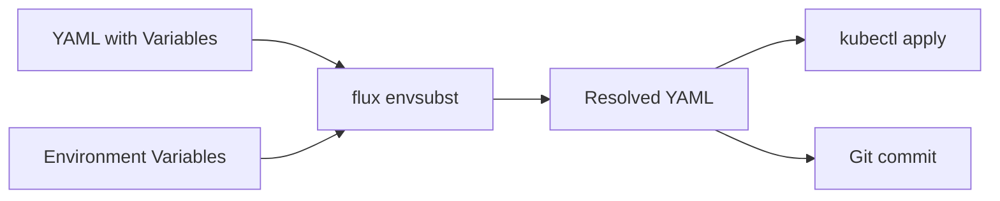

# How to Use flux envsubst for Variable Substitution

Author: [nawazdhandala](https://github.com/nawazdhandala)

Tags: flux, fluxcd, GitOps, Kubernetes, CLI, envsubst, Variables, Templating, Configuration

Description: Learn how to use the flux envsubst command to perform variable substitution in Kubernetes manifests for environment-specific configurations.

---

## Introduction

Managing multiple environments (development, staging, production) with Kubernetes manifests often requires substituting environment-specific values such as image tags, replica counts, and domain names. The `flux envsubst` command provides a way to replace variable placeholders in your manifests with actual values, similar to the Unix `envsubst` utility but with additional features like strict mode and default values.

This guide covers how to use `flux envsubst` for practical variable substitution workflows.

## Prerequisites

- Flux CLI installed (v2.2.0 or later)
- Basic understanding of Kubernetes manifests
- Familiarity with environment variables

## How flux envsubst Works

The `flux envsubst` command reads YAML from stdin, replaces `${VARIABLE}` placeholders with values from environment variables, and outputs the result to stdout.



## Basic Variable Substitution

The simplest usage replaces variables with environment variable values:

```bash
# Set environment variables
export APP_NAME="my-web-app"
export APP_IMAGE="nginx"
export APP_TAG="1.25"
export APP_REPLICAS="3"

# Create a template with variable placeholders
cat <<'YAML' | flux envsubst
apiVersion: apps/v1
kind: Deployment
metadata:
  name: ${APP_NAME}
  namespace: default
spec:
  replicas: ${APP_REPLICAS}
  selector:
    matchLabels:
      app: ${APP_NAME}
  template:
    metadata:
      labels:
        app: ${APP_NAME}
    spec:
      containers:
        - name: ${APP_NAME}
          image: ${APP_IMAGE}:${APP_TAG}
          ports:
            - containerPort: 80
YAML
```

Output:

```yaml
apiVersion: apps/v1
kind: Deployment
metadata:
  name: my-web-app
  namespace: default
spec:
  replicas: 3
  selector:
    matchLabels:
      app: my-web-app
  template:
    metadata:
      labels:
        app: my-web-app
    spec:
      containers:
        - name: my-web-app
          image: nginx:1.25
          ports:
            - containerPort: 80
```

## Using Default Values

You can specify default values that are used when an environment variable is not set:

```bash
# APP_REPLICAS is not set, so the default will be used
unset APP_REPLICAS

export APP_NAME="my-web-app"
export APP_IMAGE="nginx"
export APP_TAG="1.25"

cat <<'YAML' | flux envsubst
apiVersion: apps/v1
kind: Deployment
metadata:
  name: ${APP_NAME}
spec:
  replicas: ${APP_REPLICAS:=2}
  template:
    spec:
      containers:
        - name: ${APP_NAME}
          image: ${APP_IMAGE}:${APP_TAG:=latest}
          resources:
            requests:
              cpu: ${CPU_REQUEST:=100m}
              memory: ${MEMORY_REQUEST:=128Mi}
            limits:
              cpu: ${CPU_LIMIT:=250m}
              memory: ${MEMORY_LIMIT:=256Mi}
YAML
```

The `${VARIABLE:=default}` syntax provides a fallback value when the variable is unset or empty.

## Strict Mode

Strict mode causes `flux envsubst` to fail if any referenced variables are not set:

```bash
# This will fail because MISSING_VAR is not set
export APP_NAME="my-app"

cat <<'YAML' | flux envsubst --strict
apiVersion: apps/v1
kind: Deployment
metadata:
  name: ${APP_NAME}
  namespace: ${MISSING_VAR}
YAML

# Output: error: variable not set: MISSING_VAR
```

Strict mode is essential for CI/CD pipelines where missing variables should cause a build failure:

```bash
#!/bin/bash
# ci-render.sh
# Render manifests with strict variable checking

set -euo pipefail

# These must be set or the pipeline fails
export ENVIRONMENT="${ENVIRONMENT:?ENVIRONMENT must be set}"
export IMAGE_TAG="${IMAGE_TAG:?IMAGE_TAG must be set}"
export DOMAIN="${DOMAIN:?DOMAIN must be set}"

# Render with strict mode
cat ./deploy/templates/*.yaml | flux envsubst --strict > ./deploy/rendered.yaml

echo "Manifests rendered successfully."
```

## File-Based Substitution

Process files rather than stdin:

```bash
# Substitute variables in a file and save the output
export APP_NAME="my-app"
export APP_NAMESPACE="production"

flux envsubst < ./templates/deployment.yaml > ./rendered/deployment.yaml

# Process multiple files
for template in ./templates/*.yaml; do
  filename=$(basename "${template}")
  flux envsubst < "${template}" > "./rendered/${filename}"
done
```

## Environment-Specific Configurations

Use different variable files for each environment:

```bash
# Create environment-specific variable files

# development.env
cat > ./envs/development.env <<'ENV'
export ENVIRONMENT=development
export APP_REPLICAS=1
export APP_IMAGE=myapp
export APP_TAG=dev-latest
export DOMAIN=dev.example.com
export DB_HOST=dev-db.internal
export LOG_LEVEL=debug
ENV

# staging.env
cat > ./envs/staging.env <<'ENV'
export ENVIRONMENT=staging
export APP_REPLICAS=2
export APP_IMAGE=myapp
export APP_TAG=v1.2.0-rc1
export DOMAIN=staging.example.com
export DB_HOST=staging-db.internal
export LOG_LEVEL=info
ENV

# production.env
cat > ./envs/production.env <<'ENV'
export ENVIRONMENT=production
export APP_REPLICAS=5
export APP_IMAGE=myapp
export APP_TAG=v1.2.0
export DOMAIN=app.example.com
export DB_HOST=prod-db.internal
export LOG_LEVEL=warn
ENV
```

Render manifests for a specific environment:

```bash
#!/bin/bash
# render-env.sh
# Render manifests for a specific environment

set -euo pipefail

ENV_NAME="${1:?Usage: render-env.sh <environment>}"
ENV_FILE="./envs/${ENV_NAME}.env"

if [ ! -f "${ENV_FILE}" ]; then
  echo "Environment file not found: ${ENV_FILE}"
  exit 1
fi

# Load environment variables
source "${ENV_FILE}"

# Create output directory
OUTPUT_DIR="./rendered/${ENV_NAME}"
mkdir -p "${OUTPUT_DIR}"

# Render all templates
for template in ./templates/*.yaml; do
  filename=$(basename "${template}")
  flux envsubst --strict < "${template}" > "${OUTPUT_DIR}/${filename}"
  echo "Rendered: ${OUTPUT_DIR}/${filename}"
done

echo "All templates rendered for ${ENV_NAME}."
```

## Using with Flux Kustomization Post-Build

Flux Kustomizations support variable substitution natively using the same syntax. The `flux envsubst` command is useful for testing this locally:

```yaml
# Kustomization with post-build variable substitution
apiVersion: kustomize.toolkit.fluxcd.io/v1
kind: Kustomization
metadata:
  name: my-app
  namespace: flux-system
spec:
  interval: 10m
  path: ./deploy
  prune: true
  sourceRef:
    kind: GitRepository
    name: my-app
  postBuild:
    substitute:
      ENVIRONMENT: production
      APP_REPLICAS: "5"
      DOMAIN: app.example.com
    substituteFrom:
      - kind: ConfigMap
        name: cluster-settings
      - kind: Secret
        name: cluster-secrets
```

Test locally with `flux envsubst`:

```bash
# Simulate the Kustomization post-build substitution locally
export ENVIRONMENT=production
export APP_REPLICAS=5
export DOMAIN=app.example.com

cat ./deploy/*.yaml | flux envsubst --strict
```

## ConfigMap and Secret Variable Sources

When using Flux Kustomization post-build substitution, variables come from ConfigMaps and Secrets:

```yaml
# ConfigMap with substitution variables
apiVersion: v1
kind: ConfigMap
metadata:
  name: cluster-settings
  namespace: flux-system
data:
  CLUSTER_NAME: production-us-east
  CLUSTER_REGION: us-east-1
  INGRESS_CLASS: nginx
  CERT_ISSUER: letsencrypt-prod
```

```yaml
# Secret with sensitive substitution variables
apiVersion: v1
kind: Secret
metadata:
  name: cluster-secrets
  namespace: flux-system
stringData:
  DB_PASSWORD: supersecretpassword
  API_KEY: sk-1234567890
```

Test these locally:

```bash
# Export the same variables as the ConfigMap and Secret
export CLUSTER_NAME=production-us-east
export CLUSTER_REGION=us-east-1
export INGRESS_CLASS=nginx
export CERT_ISSUER=letsencrypt-prod
export DB_PASSWORD=supersecretpassword
export API_KEY=sk-1234567890

# Render the templates
cat ./deploy/ingress.yaml | flux envsubst --strict
```

## Multi-Service Template Example

Here is a practical example with a complete application template:

```bash
# Create the deployment template
cat > ./templates/deployment.yaml <<'YAML'
apiVersion: apps/v1
kind: Deployment
metadata:
  name: ${APP_NAME}
  namespace: ${APP_NAMESPACE}
  labels:
    app: ${APP_NAME}
    environment: ${ENVIRONMENT}
spec:
  replicas: ${APP_REPLICAS:=2}
  selector:
    matchLabels:
      app: ${APP_NAME}
  template:
    metadata:
      labels:
        app: ${APP_NAME}
        environment: ${ENVIRONMENT}
    spec:
      containers:
        - name: ${APP_NAME}
          image: ${APP_IMAGE}:${APP_TAG}
          ports:
            - containerPort: ${APP_PORT:=8080}
          env:
            - name: DATABASE_URL
              value: "postgresql://${DB_HOST}:${DB_PORT:=5432}/${DB_NAME}"
            - name: LOG_LEVEL
              value: "${LOG_LEVEL:=info}"
          resources:
            requests:
              cpu: ${CPU_REQUEST:=100m}
              memory: ${MEMORY_REQUEST:=128Mi}
            limits:
              cpu: ${CPU_LIMIT:=500m}
              memory: ${MEMORY_LIMIT:=512Mi}
YAML

# Create the service template
cat > ./templates/service.yaml <<'YAML'
apiVersion: v1
kind: Service
metadata:
  name: ${APP_NAME}
  namespace: ${APP_NAMESPACE}
spec:
  selector:
    app: ${APP_NAME}
  ports:
    - port: 80
      targetPort: ${APP_PORT:=8080}
  type: ClusterIP
YAML

# Create the ingress template
cat > ./templates/ingress.yaml <<'YAML'
apiVersion: networking.k8s.io/v1
kind: Ingress
metadata:
  name: ${APP_NAME}
  namespace: ${APP_NAMESPACE}
  annotations:
    kubernetes.io/ingress.class: ${INGRESS_CLASS:=nginx}
    cert-manager.io/cluster-issuer: ${CERT_ISSUER:=letsencrypt-prod}
spec:
  tls:
    - hosts:
        - ${DOMAIN}
      secretName: ${APP_NAME}-tls
  rules:
    - host: ${DOMAIN}
      http:
        paths:
          - path: /
            pathType: Prefix
            backend:
              service:
                name: ${APP_NAME}
                port:
                  number: 80
YAML

# Render all templates for production
export APP_NAME=my-api
export APP_NAMESPACE=production
export ENVIRONMENT=production
export APP_IMAGE=ghcr.io/myorg/my-api
export APP_TAG=v2.1.0
export APP_REPLICAS=5
export DOMAIN=api.example.com
export DB_HOST=prod-db.internal
export DB_NAME=myapp_prod

for template in ./templates/*.yaml; do
  echo "---"
  flux envsubst --strict < "${template}"
done
```

## CI/CD Integration

```bash
#!/bin/bash
# ci-deploy.sh
# Render and deploy manifests in a CI/CD pipeline

set -euo pipefail

# Variables are set by CI/CD environment
# IMAGE_TAG comes from the build step
# ENVIRONMENT comes from the pipeline configuration

echo "Rendering manifests for ${ENVIRONMENT}..."

# Load environment-specific variables
source "./envs/${ENVIRONMENT}.env"

# Override with CI/CD-specific values
export APP_TAG="${IMAGE_TAG}"

# Render all templates with strict mode
RENDERED_DIR="./rendered/${ENVIRONMENT}"
mkdir -p "${RENDERED_DIR}"

for template in ./templates/*.yaml; do
  filename=$(basename "${template}")
  flux envsubst --strict < "${template}" > "${RENDERED_DIR}/${filename}"
done

# Validate rendered manifests
echo "Validating rendered manifests..."
for manifest in "${RENDERED_DIR}"/*.yaml; do
  kubectl apply --dry-run=server -f "${manifest}"
done

echo "Manifests rendered and validated successfully."
echo "Files in ${RENDERED_DIR}:"
ls -la "${RENDERED_DIR}"
```

## Debugging Variable Substitution

When variables are not being substituted correctly:

```bash
# Check which variables are referenced in your templates
grep -oP '\$\{[^}]+\}' ./templates/*.yaml | sort -u

# Check which environment variables are set
env | grep -E "^(APP_|DB_|DOMAIN|ENVIRONMENT)" | sort

# Test substitution one file at a time
flux envsubst < ./templates/deployment.yaml

# Use strict mode to find missing variables
flux envsubst --strict < ./templates/deployment.yaml 2>&1 || true
```

## Best Practices

1. **Always use strict mode in CI/CD** to catch missing variables early.
2. **Provide default values** for optional settings using `${VAR:=default}` syntax.
3. **Keep sensitive values in Secrets** rather than environment variable files.
4. **Version your environment files** alongside your templates in Git.
5. **Validate rendered output** with `kubectl apply --dry-run=server` before deploying.
6. **Use Flux Kustomization post-build** for in-cluster substitution rather than pre-rendering when possible.
7. **Document all variables** that your templates expect so team members know what to set.

## Summary

The `flux envsubst` command provides a simple yet powerful mechanism for variable substitution in Kubernetes manifests. It enables environment-specific configurations without duplicating YAML files, supports default values for optional settings, and offers strict mode for catching configuration errors early. Whether used locally for testing or in CI/CD pipelines for rendering, it is an essential tool for managing multi-environment Flux CD deployments.
